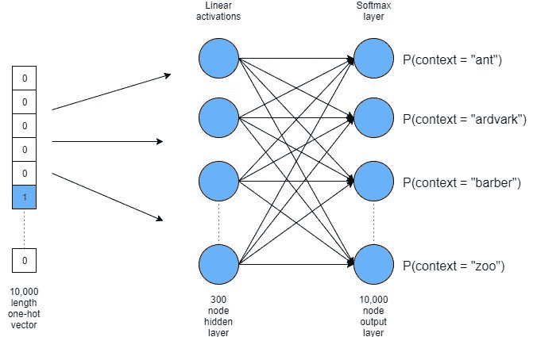
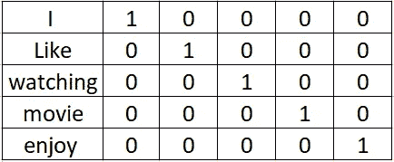
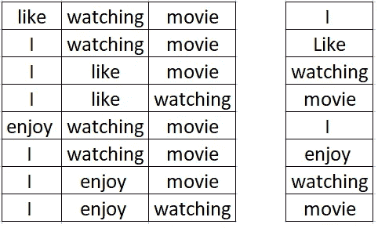
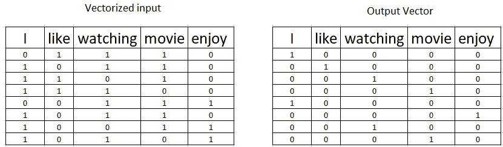
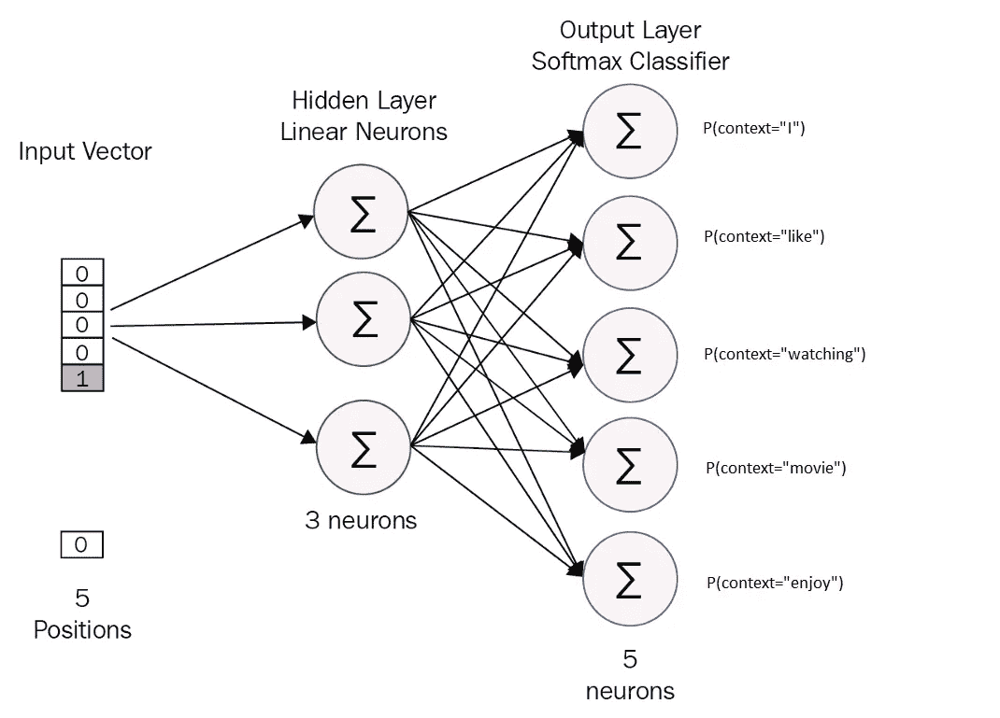

# 从零开始构建 Word2Vec，直观地介绍 Word2Vec

> 原文：<https://pub.towardsai.net/an-intuitive-introduction-of-word2vec-by-building-a-word2vec-from-scratch-a1647e1c266c?source=collection_archive---------1----------------------->

## [机器学习](https://towardsai.net/p/category/machine-learning)

## 了解 Word2Vec 及其优势

# 介绍

在本文中，我将尝试解释 **Word2Vec** 向量表示，这是一种从原始文本中学习单词嵌入的无监督模型，我还将尝试提供经典方法**一键编码**和 **Word2Vec** 之间的比较。

# 独热编码矢量表示

解决文本相关问题的经典方法是**一键编码**单词。这种方法有许多缺点。

*   如果数据集有一万个唯一的单词(**词汇**)，那么**单热编码**向量表示将有一万个维度。
*   在 **one-hot-encoded** 矢量表示中，矢量的大小将是**词汇表**的大小。**词汇表**中的大部分单词不会出现在每个文档中。所以**一个热编码的**矢量表示是一个大部分为空(零)的矢量。
*   它在计算上是低效的。
*   在**一个热编码的**矢量表示中，相似的单词将不具有相似的矢量。

我们来考虑下面两句话。

我喜欢看电影。

我喜欢看电影。

在**一键编码**中，单词的矢量表示如下

一次性编码矢量表示

直觉上我们知道**享受**和**喜欢**是一种相似的词。**电影**和**享受**之间的欧氏距离与**享受**和**喜欢之间的欧氏距离相同。这是一个主要的缺点。******

# Word2vec 矢量表示

**Word2Vec** 是一种帮助我们实现相似单词的相似向量的方法。彼此相关的单词被映射到高维空间中彼此更接近的点。 **Word2Vec** 方法有以下优点。

*   Word2Vec 基于这样一个事实，即共享相似上下文的单词也共享语义。
*   **Word2vec** 模型通过使用其邻居来预测一个单词，通过学习称为嵌入的密集向量。
*   **Word2vec** 计算效率也很高。
*   **Word2vec** 是一个无监督的模型，从原始文本中学习单词嵌入。
*   Word2vec 有两种型号:T2 CBOW 型号和 T4 skip-gram 型号。
*   **Skip-gram:** 当使用输入(目标)单词预测周围单词(也称为上下文单词)时。
*   **CBOW(连续词袋):**利用周围词(上下文词)预测目标词时。

**Word2vec** 是一个三层神经网络，其中第一层为输入层，最后几层为输出层。中间层构建了一个潜在的表示，因此输入单词被转换成输出向量表示。

在 **Word2vec** 单词的向量表示中，我们可以发现单词向量之间有趣的数学关系。

国王——男人=王后——女人

在我们前面两个句子的例子中。

如果我们遵循 **CBOW** 方法，将周围(上下文)单词作为输入，并尝试预测目标单词，那么输出将如下。

输入和输出的向量形式如下所示。

在我们当前示例的神经网络中，在隐藏层中将有三个神经元，并且输出将有五个具有 softmax 函数的神经元，从而它将给出单词的概率。

**伴随 jupyter 本帖的笔记本可以在**[**Github**](https://github.com/nitwmanish/An-Intuitive-Introduction-Of-Word2Vec-By-Building-A-Word2Vec-From-Scratch)**上找到。**

# 结论

经典方法的缺点是，它没有考虑单词在句子中出现的顺序，上下文丢失了。它假设文档中的单词相互独立。这种经典方法中的矢量表示导致数据稀疏。这个缺点可以通过 **Word2vec** 矢量表示来克服。

我希望这篇文章能帮助你理解 Word2vec，以及为什么我们更喜欢 Word2vec 而不是 one-hot-encoding *。它至少提供了一个很好的解释，并在* one-hot-encoding 和 Word2vec 矢量表示之间提供了一个高层次的比较*。*