# 用计算机视觉进行脑肿瘤分类的另类方法

> 原文：<https://pub.towardsai.net/an-offbeat-approach-to-brain-tumor-classification-using-computer-vision-19c9e7b84664?source=collection_archive---------1----------------------->

计算机视觉在医学科学领域发挥着非常关键的作用，这项在医学科学中应用计算机视觉的研究被广泛称为*医学成像*。现在，计算机视觉是通过将机器学习或深度学习方法或两者(混合)部署到生产中来实现的。

在本文中，我将介绍一种这样的机器学习方法，该方法使用深度学习模块，使其成为脑瘤分类的混合模型。

> **脑瘤分类的混合模型开发**

*   *数据集*:Kaggle 中可用的脑部 MRI 图像数据集，用于模型开发( [**下载**](https://www.kaggle.com/navoneel/brain-mri-images-for-brain-tumor-detection/download) )。该数据集包含 253 张大脑的 MRI 图像。示例图像如下所示。

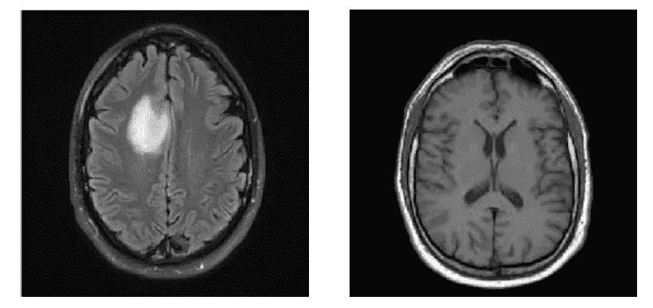

**肿瘤性(左)** & **非肿瘤性(右)**

*   *用于图像特征提取的三层前馈卷积神经网络*:提出的 CNN 架构如下图所示:

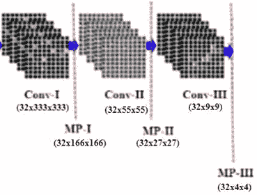

这种 CNN 架构仅向前传递一次(**无反向传播**)用于特征提取。这就是上面讨论的深度学习模块。

*   *支持向量机(SVM)-RBF 核* : SVM 的 RBF 核被实例化并训练用于预测模型开发。ML 模块是使用 Scikit-Learn 开发的。

> **实施 CNN-SVM 混合模式**

CNN 模型是使用 Keras 框架开发的:

```
**# Importing all necessary libraries**
from keras.models import Sequential
from keras.layers import Convolution2D
from keras.layers import MaxPooling2D
from keras.layers import Flatten
from keras.layers import Dense
**# CNN Model Development** classifier = Sequential()
**# CONVOLUTION (1st Layer)**
classifier.add(Convolution2D(32,(3,3),strides = (3,3),input_shape=(1000,1000,3),activation='relu'))
**# Max-Pooling for 1st Convolutional Layer**
classifier.add(MaxPooling2D(pool_size=(2,2)))
**# CONVOLUTION (2nd Layer)**
classifier.add(Convolution2D(32,(3,3),strides = (3,3), activation = 'relu'))
**# Max-Pooling for 2nd Convolutional Layer** 
classifier.add(MaxPooling2D(pool_size=(2,2)))
**# CONVOLUTION (3rd Layer)**
classifier.add(Convolution2D(32,(3,3),strides = (3,3), activation = 'relu'))
**# Max-Pooling for 3rd Convolutional Layer**
classifier.add(MaxPooling2D(pool_size=(2,2)))
**# FLATTENING**
classifier.add(Flatten())
```

深入探究 CNN 模型实例化:

```
classifier.summary()
```

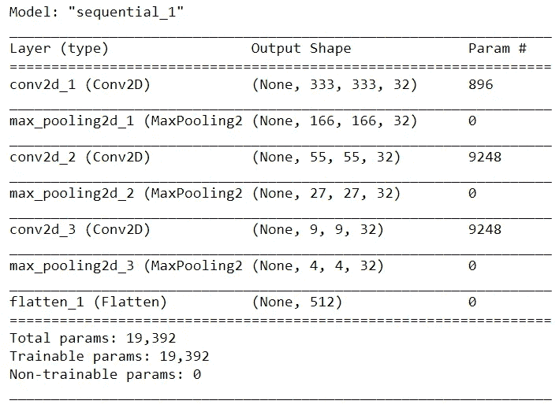

**显示将提取总共 512 个图像特征的模型概要**

用通过整个方法的原始实验获得的预先保存的权重来加载 CNN 模型(还没有讨论剩余的步骤)。权重可在以下链接中的分级数据格式(H5)文件中找到:

[](https://github.com/navoneel1092283/Brain_Tumor_Detection_HybridCNN-SVM_Weights/blob/master/Brain_Tumor_PCA.h5) [## navoneel 1092283/脑肿瘤 _ 检测 _ 杂交 CNN-SVM _ 权重

github.com](https://github.com/navoneel1092283/Brain_Tumor_Detection_HybridCNN-SVM_Weights/blob/master/Brain_Tumor_PCA.h5) 

```
classifier.load_weights("Brain_Tumor_PCA.h5")
```

> **使用实例化的 CNN 模型的图像特征提取**

```
**# Importing the necessary libraries**
import numpy as np
import cv2
import os
**# initializing the feature matrix**
X = np.ones((253, 512))
**# image loading and feature extraction** i = 0
os.chdir('.../MRI_IMAGES/train/yes')
for filename in os.listdir('.../MRI_IMAGES/train/yes'):
    img = cv2.imread(filename)
    img = cv2.resize(img,(1000,1000))
    img = np.divide(img,255)
    img = img.reshape(1,1000,1000,3)
    X[i] = classifier.predict(img)
    i = i + 1
os.chdir('.../MRI_IMAGES/train/no')
for filename in os.listdir('.../MRI_IMAGES/train/no'):
    img = cv2.imread(filename)
    img = cv2.resize(img,(1000,1000))
    img = np.divide(img,255)
    img = img.reshape(1,1000,1000,3)
    X[i] = classifier.predict(img)
    i = i + 1
os.chdir('.../MRI_IMAGES/test/yes')
for filename in os.listdir('.../MRI_IMAGES/test/yes'):
    img = cv2.imread(filename)
    img = cv2.resize(img,(1000,1000))
    img = np.divide(img,255)
    img = img.reshape(1,1000,1000,3)
    X[i] = classifier.predict(img)
    i = i + 1
os.chdir('.../MRI_IMAGES/test/no')
for filename in os.listdir('.../MRI_IMAGES/test/no'):
    img = cv2.imread(filename)
    img = cv2.resize(img,(1000,1000))
    img = np.divide(img,255)
    img = img.reshape(1,1000,1000,3)
    X[i] = classifier.predict(img)
    i = i + 1**# Preparing the Actual Labels**
y = np.concatenate((np.ones(121), np.zeros(79), np.ones(34), np.zeros(19)))
```

> **使用主成分分析的维数减少**

```
**# Importing necessary libraries**
from sklearn.decomposition import PCApca = PCA(n_components = 2)
pca.fit(X.T)
Z = pca.components_.T
```

> **数据集的散点图可视化**

```
**# Importing the necessary libraries**
import matplotlib.pyplot as pltplt.scatter(Z.T[0], Z.T[1], c = y, s = 10, marker = 'x')
plt.title('Scatter Plot Visualization (VIOLET -> Non-Tumorous, YELLOW -> Tumorous)')
plt.xlabel("F1_PCA")
plt.ylabel("F2_PCA")
```

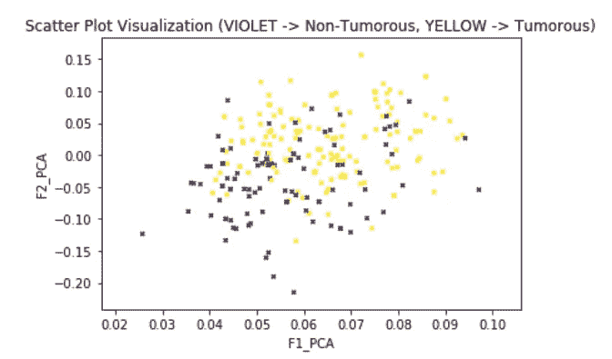

**散点图**

因此，从散点图来看，显然没有线性分离原始特征空间的最大似然算法适用于此。

> **将数据集拆分为训练集和测试集**

```
**# Importing necessary libraries**
from sklearn.model_selection import train_test_splitX_train, X_test, y_train, y_test = train_test_split(Z,y, test_size=0.1, random_state=1234)
```

> **SVM (RBF 内核)预测模型开发和网格搜索调整，用于选择最佳超参数，即 C(支持向量机中的惩罚参数)**

```
**# Importing necessary libraries** from sklearn.svm import SVC
from sklearn.model_selection import GridSearchCV
**# MODEL INSTANTIATION** model = SVC(kernel = 'rbf')
parameters = {'C':[0.1,1,10,100,1000,10000,100000]}
grid_search = GridSearchCV(param_grid = parameters, estimator = model, verbose = 3)
**# MODEL TRAINING AND GRID-SEARCH TUNING** grid_search = grid_search.fit(X_train,y_train)
```

> **获得最佳超参数，即 C，惩罚参数**

```
print(grid_search.best_params_)
```

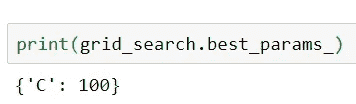

并且，SVM (RBF 内核)的“gamma”参数在 Scikit-Learn 中设置为(1/特征数)作为默认值。所以，*γ= 0.5*

> **车型性能分析**

```
print("Validation Accuracy:",grid_search.score(X_test,y_test))
print("Training Accuracy:  ",grid_search.score(X_train, y_train))
```

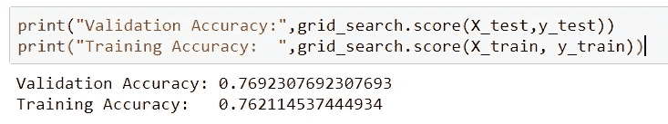

**训练准确率:76.21%，验证准确率:76.92%(完全符合)**

```
**# Importing the necessary library**
from sklearn.metrics import classification_reportprint(classification_report(y_test,grid_search.predict(X_test)))
```

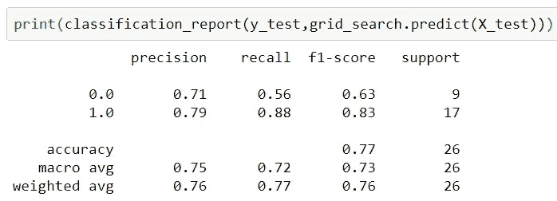

**分类报告**

```
**# Importing the necessary libraries** import matplotlib.pyplot as plt
%matplotlib inline
import itertools
from sklearn.metrics import confusion_matrixdef plot_confusion_matrix(cm, classes,
                          normalize=False,
                          title='Confusion matrix',
                          cmap=plt.cm.Blues):
    if normalize:
        cm = cm.astype('float') / cm.sum(axis=1)[:, np.newaxis]
        print("Normalized confusion matrix")
    else:
        print('Confusion matrix, without normalization')print(cm)plt.imshow(cm, interpolation='nearest', cmap=cmap)
    plt.title(title)
    plt.colorbar()
    tick_marks = np.arange(len(classes))
    plt.xticks(tick_marks, classes, rotation=45)
    plt.yticks(tick_marks, classes)fmt = '.2f' if normalize else 'd'
    thresh = cm.max() / 2.
    for i, j in itertools.product(range(cm.shape[0]), range(cm.shape[1])):
        plt.text(j, i, format(cm[i, j], fmt),
                 horizontalalignment="center",
                 color="white" if cm[i, j] > thresh else "black")plt.tight_layout()
    plt.ylabel('True label')
    plt.xlabel('Predicted label')plt.figure()
plot_confusion_matrix(confusion_matrix(y_test, grid_search.predict(X_test)), classes=[0,1], normalize=True,
                      title='Confusion Matrix')
```

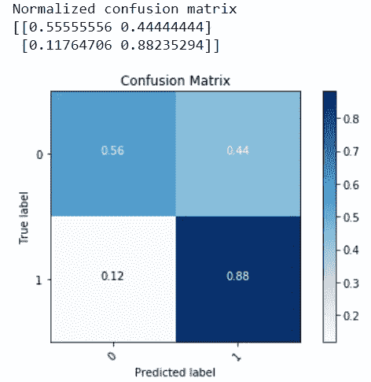

**归一化混淆矩阵**

```
**# Importing the necessary modules**
from sklearn.metrics import roc_curve, aucy_roc = np.array(y_test)
fpr, tpr, thresholds = roc_curve(y_roc, grid_search.decision_function(X_test))
roc_auc = auc(fpr, tpr)
print("Area under the ROC curve : %f" % roc_auc)
```

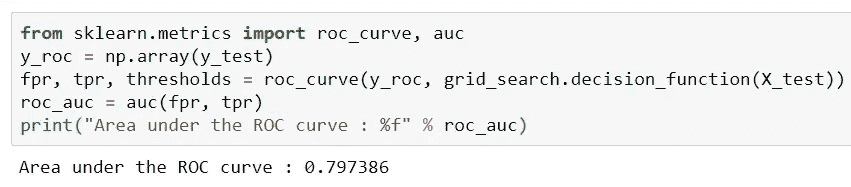

**受试者操作特征曲线下面积(AUROC)**

```
**# Importing the necessary libraries**
import pylab as plpl.clf()
pl.plot(fpr, tpr, label='ROC curve (area = %0.2f)' % roc_auc)
pl.plot([0, 1], [0, 1], 'k--')
pl.xlim([0.0, 1.0])
pl.ylim([0.0, 1.0])
pl.xlabel('False Positive Rate')
pl.ylabel('True Positive Rate')
pl.legend(loc="lower right")
pl.show()
```

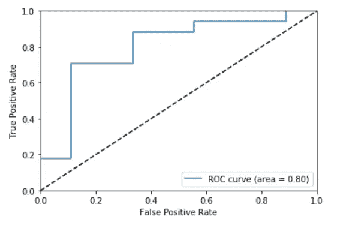

**AUROC 曲线**

> **通过决策边界进行逻辑调整**

逻辑推理对于任何人工智能模型都是非常重要的，无论是基于机器学习还是深度学习，这种方法也不例外。在医学成像涉及的深度学习模型中，逻辑推理是使用 Grad Cam 可视化完成的，后来由医生进行验证。因此，纯深度学习模型占据上风。

这里，该方法基于支持向量机，支持向量机是使用 N 维特征空间几何的基于模式识别的机器学习算法。因此，**决策边界可视化**是整个方法论的最佳逻辑论证方式。

```
x_min, x_max = X_train[:, 0].min(), X_train[:, 0].max()
y_min, y_max = X_train[:, 1].min(), X_train[:, 1].max()
xx, yy = np.meshgrid(np.arange(x_min, x_max, 0.001),
                     np.arange(y_min, y_max, 0.001))h = grid_search.predict(np.c_[xx.ravel(), yy.ravel()])
h = h.reshape(xx.shape)
plt.contourf(xx, yy, h)
plt.scatter(X_train[:, 0], X_train[:, 1], c=y_train, s = 10, marker = 'o', edgecolor = 'k')
plt.title('Scatter Plot Visualization of Training Set (VIOLET -> Non-Tumorous, YELLOW -> Tumorous)')
plt.xlabel('F1_PCA')
plt.ylabel('F2_PCA')
```

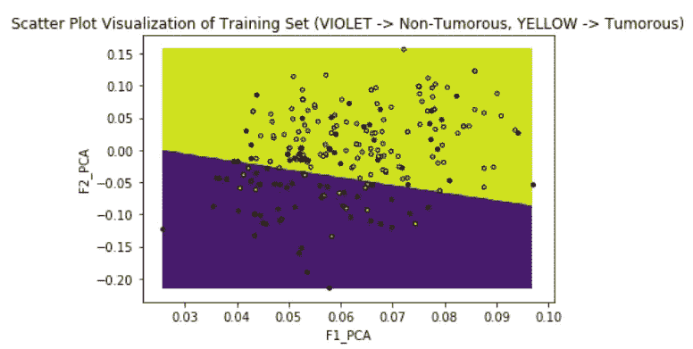

```
x_min, x_max = X_test[:, 0].min(), X_test[:, 0].max()
y_min, y_max = X_test[:, 1].min(), X_test[:, 1].max()
xx, yy = np.meshgrid(np.arange(x_min, x_max, 0.001),
                     np.arange(y_min, y_max, 0.001))h = grid_search.predict(np.c_[xx.ravel(), yy.ravel()])
h = h.reshape(xx.shape)
plt.contourf(xx, yy, h)
plt.scatter(X_test[:, 0], X_test[:, 1], c = y_test, s = 10, marker = 'o', edgecolor = 'k')
plt.title('Scatter Plot Visualization of Test Set (VIOLET -> Non-Tumorous, YELLOW -> Tumorous)')
plt.xlabel('F1_PCA')
plt.ylabel('F2_PCA')
```

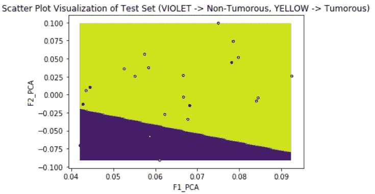

以这种方式，开发了深度学习-机器学习混合模型，产生了 76.9%的测试准确率和 0.8 的 AUROC，以及上面提到的其他性能指标。通过包括所有 512 个提取的特征(通过跳过 PCA 步骤)并且使用从原始实验获得的不同 CNN 权重，可以显著提高性能。此外，在最近的过去，在医学成像领域发表了研究会议论文，部署了类似的深度学习-机器学习混合模型:

1.  查克拉巴蒂，纳沃尼尔，和 Subhrasankar 查特吉。"一种用计算机视觉检测糖尿病视网膜病变的另类技术." *2019 年第十届国际计算、通信和网络技术大会*。IEEE，2019。([https://ieeexplore.ieee.org/document/8944633](https://ieeexplore.ieee.org/document/8944633))
2.  查克拉巴蒂，纳沃尼尔，和 Subhrasankar 查特吉。"一种使用计算机视觉进行青光眼筛查的新方法." *2019 智能系统与发明技术国际会议(ICSSIT)* 。IEEE，2019。([https://ieeexplore.ieee.org/document/8987803](https://ieeexplore.ieee.org/document/8987803))