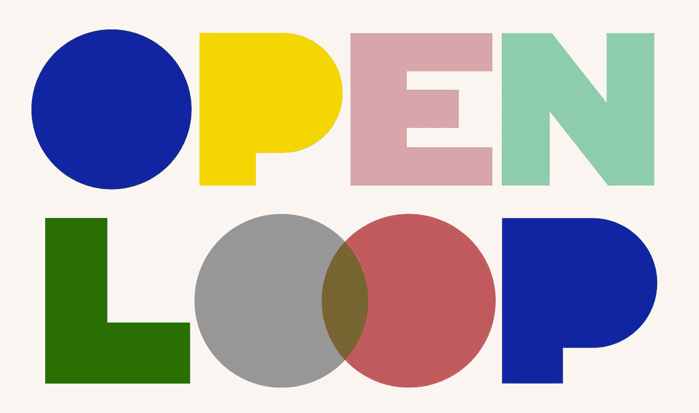
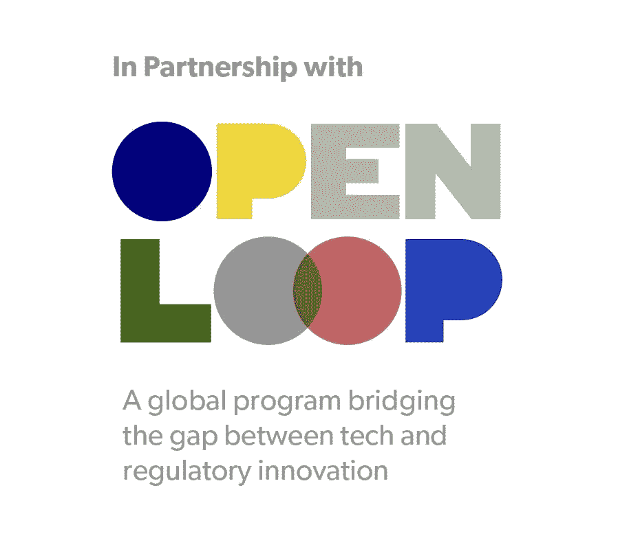

# 开放的循环对创新的人工智能至关重要

> 原文：<https://pub.towardsai.net/an-open-loop-is-critical-for-innovative-ai-286569261bcb?source=collection_archive---------3----------------------->

## [商业科学](https://towardsai.net/p/category/business-science)

## 政策原型如何鼓励负责任的增长



开环标志

今天很自豪地正式和大家分享， **Evo 是** [**一家开环参与公司**](https://openloop.org/lets-unlock/#europe-publication) **。**

那是什么意思？

在 2020 年的最后一个季度，Evo 是脸书召集的欧洲领先人工智能公司团队的一员，该团队致力于开发一个数据驱动的框架，以管理人工智能风险，同时鼓励创新和增长。这个项目让我们能够更审慎地评估我们自己的人工智能应用程序中的风险，然后一起创建和测试人工智能风险评估框架。

如果你一想到人工智能政策就感到眼花缭乱，你并不孤单。对于大多数数据科学家来说，法律治理和风险管理并不是最令人兴奋的话题。但如果我们关心为未来开发创新的人工智能模型和更好的技术，所有数据科学家都需要优先考虑这些分析。**负责任的人工智能需要所有利益相关者积极参与风险问题，尤其是我们这些每天从事人工智能工作的人**。

> 数据科学家需要参与制定政策，在鼓励增长的同时限制人工智能风险。

我的开环经验告诉我，策略原型是实现这一目标的简单而有效的方法。

# 用政策减轻人工智能风险的需要


照片由[伊万 F](https://unsplash.com/@ezanu?utm_source=medium&utm_medium=referral) 在 [Unsplash](https://unsplash.com?utm_source=medium&utm_medium=referral) 拍摄

近年来，技术风险，尤其是人工智能风险，已经成为许多人关注的焦点。关于人工智能的头条新闻警告了[编码偏见](https://news.un.org/en/story/2020/12/1080192)的危险，降低了[决策的透明度](https://www.analyticsinsight.net/can-we-offset-the-black-box-problem-of-neural-network/)，以及其他严重的[社会后果](https://www.theguardian.com/technology/2020/dec/23/google-scientists-research-ai-postive-tone)。国际[公众对人工智能对世界到底有正面还是负面影响的看法存在分歧](https://www.oii.ox.ac.uk/news/releases/global-public-opinion-split-on-benefits-of-ai-finds-new-oxford-study/)——人们越来越怀疑人工智能公司和应用。

可以理解的是，这些担忧导致了对人工智能的使用和发展进行立法的呼声。许多国家的立法者正在介入监管人工智能和其他新兴技术。在[欧盟](https://ec.europa.eu/digital-single-market/en/artificial-intelligence)这里，欧盟委员会和欧盟议会正在为人工智能治理开发一个新的[框架，将于 2021 年春季发布。](https://www.europarl.europa.eu/news/en/press-room/20201016IPR89544/parliament-leads-the-way-on-first-set-of-eu-rules-for-artificial-intelligence)

这些监管努力在科技界引发了很多焦虑。我曾经写过 GDPR 的一些缺点，这些缺点阻碍了企业实现隐私和风险管理的目标。很容易理解为什么一个全面的人工智能法规会导致进一步的犹豫。一部好的法律将有助于提高公众对人工智能的信心，而一个有缺陷的监管框架可能会让我们倒退。

> 人工智能只有在同样创新的政策下才能创新和发展。

事实证明，监管机构对平衡风险与回报的现代政策持开放态度，但他们不可能像我们这些每天在科技领域工作的人一样了解科技。没有我们的投入，政策将不可避免地失败。作为数据科学家，**我们需要更多的参与**。

# 为什么是政策原型？


[斯科特·格雷厄姆](https://unsplash.com/@sctgrhm?utm_source=medium&utm_medium=referral)在 [Unsplash](https://unsplash.com?utm_source=medium&utm_medium=referral) 上拍照

但是，数据科学家如何才能最有效地为监管工作做出贡献呢？我们不是律师或政策制定专家。然而，我们是数据专家。这就是政策原型的由来。

[政策原型](https://openloop.org/lets-experiment/)是一种实验性治理的实证方法。换句话说，人工智能公司在现实生活条件下测试拟议的新政策，并就该框架的影响、优势和局限性提供反馈。可以及早发现混乱或合规困难的领域，以迭代和改进这些规范性框架。通过这种方式，数据科学家可以提供**基于证据的输入，以改善现有的治理框架**并告知法律制定流程。我们可以运行数据来确定如何优化政策以降低风险。

*政策原型的关键吸引力:* ***数据驱动决策*** *。*

我们收集有助于实现最佳结果的经验数据。然后我们**迭代改进模型，直到它达到我们的目标**——就像任何数据科学家都会进行任何其他机器学习任务一样。

# 数据驱动的风险管理方法


[Franki Chamaki](https://unsplash.com/@franki?utm_source=medium&utm_medium=referral) 在 [Unsplash](https://unsplash.com?utm_source=medium&utm_medium=referral) 上拍摄的照片

脸书·艾领导了人工智能的政策原型开发工作，我有机会通过一个名为 Open Loop 的项目参与其中。如果有机会，我鼓励任何人工智能公司参与类似的努力。然而，政策原型的好处不仅限于大规模实验。我们每个人都可以在小范围内利用政策原型成为风险管理的领导者。

作为数据科学家(或者更好的是，[商业科学家](https://towardsdatascience.com/data-science-is-dead-long-live-business-science-a3059fe84e6c))，我们知道由准确的实时数据驱动的**决策会给出更好的结果**。我们需要

*   积极调查我们技术的风险领域
*   制定透明的内部程序和政策来降低风险
*   收集数据以监控您的合规框架是否成功
*   使用这些数据来改进策略，使其更加有效
*   定期迭代改进

这是我从我的政策原型经验中得到的，也是任何数据科学家都可以借鉴的。开环报告深入探讨了我们用来更深入评估风险的一些原则，如果你想了解[更多细节](https://d32j3j47emgb6f.cloudfront.net/wp-content/uploads/2021/01/AI_Impact_Assessment_A_Policy_Prototyping_Experiment.pdf)。

最好的部分是，这种实践可以以超出理论的方式使模型变得更好。就在更正式地实施这种风险缓解的最初几周，我们能够看到影响。虽然由于 Evo 的[包含了人的因素](https://towardsdatascience.com/94-perfect-the-surprising-solution-to-the-200-billion-inventory-problem-b6ba0bc1417a)，我们的人工智能已经具有较低的风险，但策略原型帮助我的团队发现了我们可以包含利益相关者反馈和透明度的新领域。我们将人工可编辑的参数增加了 16%，以便给我们的客户**更直接的控制和对我们生成的解决方案更严格的限制**。基于模拟，这将使我们的算法更加准确。

# 为什么它对所有数据科学家都很重要


照片由[丹尼尔·里卡洛斯](https://unsplash.com/@ricaros?utm_source=medium&utm_medium=referral)在 [Unsplash](https://unsplash.com?utm_source=medium&utm_medium=referral) 上拍摄

***你可能会忍不住忽视人工智能立法*** 或者将所有人工智能法规视为阻止一项被误解的技术的误导性尝试。毕竟，任何数据科学家都被推动通过使用数据来创新和改进现有流程，而过时的规则可能会扼杀这种创新。

然而，忽视公众对理解人工智能的需求会增加公众的负面看法。选择不正式化和持续改进风险缓解政策会阻碍我们的发展。忽视人工智能治理的实际需求只会限制我们的声音——并增加人工智能的风险。

决策者和立法者可以从人工智能的迭代学习过程中学习。数据科学家可以从对有效政策至关重要的价值观、原则和风险缓解框架中学习。是时候让我们所有人都积极参与制定公共政策，在鼓励负责任的增长和创新的同时将风险降至最低。

作为一家人工智能公司的首席执行官，他每天都在优化我们的算法，并获得更准确、更可行的建议，我一直在寻找可能损害我们模型的风险。尽管如此，通过一个清晰定义的框架来确定风险缓解的优先级，我仍然学到了很多东西。外部指导帮助我们获得了一个新的视角，但我们仍然能够根据自己独特的风险因素灵活地实施政策。我致力于人工智能领域的[透明度](https://towardsdatascience.com/expensive-data-science-mistakes-when-your-kpis-lie-ca3df94333dd)和主动风险管理；这是我发现的又一个帮助我们有效做到这一点的工具。

# 创新:人工智能的未来


照片由[迭戈 PH](https://unsplash.com/@jdiegoph?utm_source=medium&utm_medium=referral) 在 [Unsplash](https://unsplash.com?utm_source=medium&utm_medium=referral) 拍摄

每天与人工智能模型打交道的数据科学家最有能力理解产生(或降低)风险的特定问题、优势和劣势。决策者可以提供独立的外部视角，指导我们通过迭代框架考虑新的战略。

> 我们必须一起努力。

**作为数据科学家，我们有责任在*人工智能政策*** *中扮演*积极角色*。*政策原型和主动风险缓解是一个很好的起点。政策创新的开放循环确保人工智能可以在定期更新和转变的政策的支持下负责任地发展。随着我们在数据科学领域开创新的进步，我们也可以开创鼓励持续增长的实用法规。这是一个永无止境的过程，我们是这个循环的关键部分。

创新对于强大的人工智能至关重要，但人工智能治理不必束缚我们的创新。我相信，如果我们这些科技界人士与政府、民间社会和学术界携手合作，我们不同的视角可以迭代出一个更好的政策未来，并最终实现我们都在努力实现的尖端人工智能。



开环成像

***Open Loop*** *是一项全球性计划，旨在将政策制定者和科技公司联系起来，帮助他们围绕人工智能和其他新兴技术制定有效的循证政策。该倡议建立在由监管机构、政府、技术企业、学术界和民间社会代表组成的财团的合作和贡献基础上。通过实验性的治理方法，开环成员共同创建政策原型，并在法律和法规颁布之前测试新的和不同的方法，从而提高技术政策领域规则制定过程的质量。*

PS 我定期写[商业科学](https://towardsai.net/p/category/business-science)。推荐后续阅读:

[](https://towardsdatascience.com/4-critical-skills-for-data-scientists-in-2021-cb28ae2bcd1) [## 2021 年，每个雇主都将要求数据科学家具备的 4 项关键技能

### 想得到工作，你必须磨练意想不到的技能

towardsdatascience.com](https://towardsdatascience.com/4-critical-skills-for-data-scientists-in-2021-cb28ae2bcd1) [](https://towardsdatascience.com/5-ways-business-science-will-transform-the-supply-chain-in-2021-626b8f17efda) [## 商业科学将在 2021 年改变供应链的 5 种方式

### 后 Covid 时代零售业的数据科学趋势

towardsdatascience.com](https://towardsdatascience.com/5-ways-business-science-will-transform-the-supply-chain-in-2021-626b8f17efda) 

```
Monthly Business Science in your inbox, new software, and University-level learning:[**Free access**](https://evouser.com/register)Questions? Please reach out on [Linkedin](https://www.linkedin.com/in/fabrizio-fantini/)
```