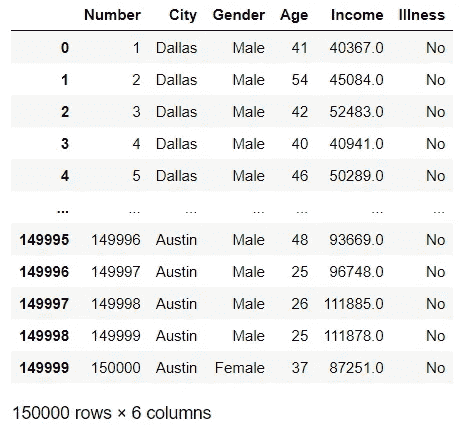
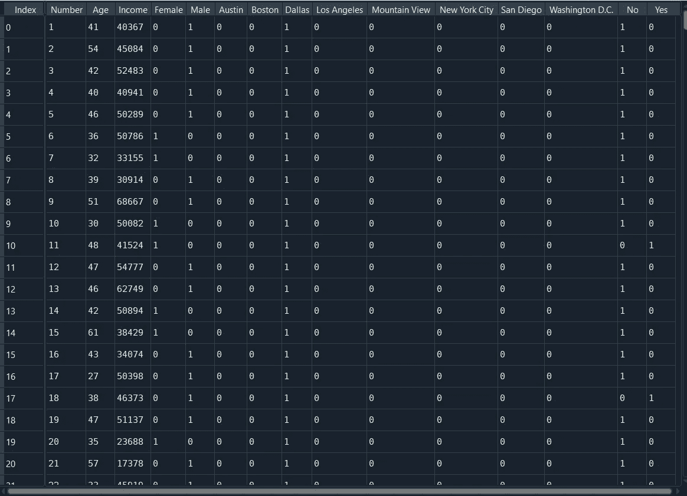
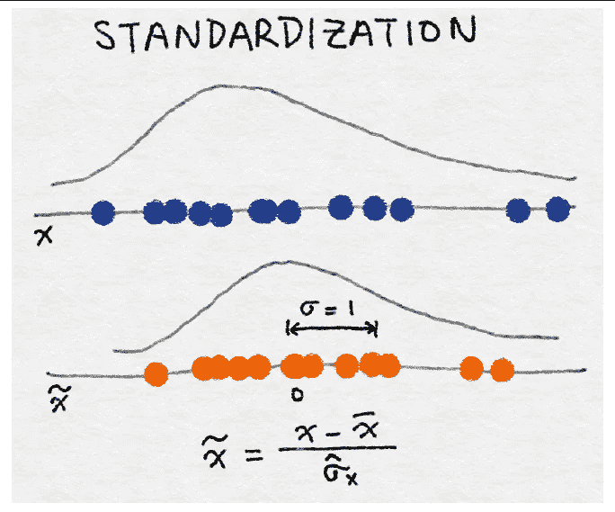
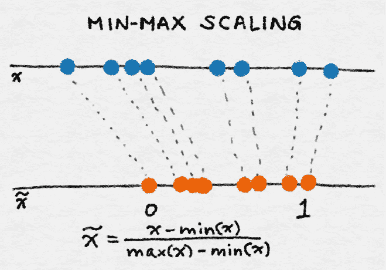
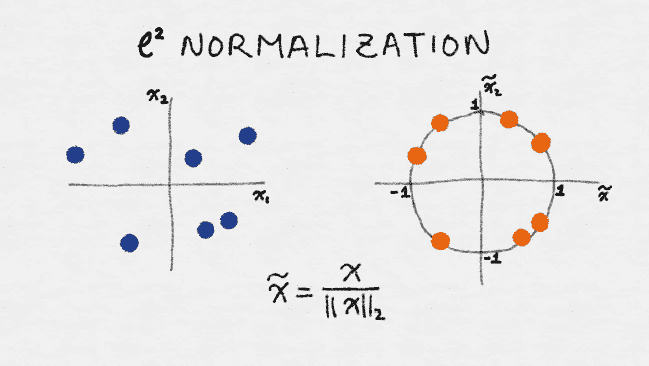

# 数据预处理概述:转换变量-列转换器、OneHotEncoding、标签二进制化、标准化、规范化、鲁棒缩放等等

> 原文：<https://pub.towardsai.net/an-overview-of-data-preprocessing-converting-variables-column-transformers-onehotencoding-9ff521362159?source=collection_archive---------2----------------------->

## [数据分析](https://towardsai.net/p/category/data-analysis)

## 在一个视图中用 python 实现有用的数据预处理方法

数据集应该适用于机器学习中训练的数据和算法做出的预测，以产生更成功的结果。每一列都有不同的特征，如有必要，应该对每一列应用不同的方法。例如，当分类数据转换为数字数据时，可以获得更好的结果。这里要区分的是选择适合模型和项目的数据预处理方法。这篇文章包含了不同的角度来看待数据集，以使算法更容易学习数据集。使用 python 应用程序，所有研究都变得更容易理解。

```
Table of Contents (TOC)
1\. Categorical Variables
1.1\. Column Transformers, OneHotEncoding, Dummy Coding
1.2\. Label Encoder
1.3\. Ordinal Encoder
1.4\. Label Binarizer
2\. Numeric Variables
2.1\. Standardization
2.2\. Normalization
2.3\. L² Regularization
2.4\. Robust Scaler
```


由[盖尔·马塞尔](https://unsplash.com/@gaellemarcel?utm_source=medium&utm_medium=referral)在 [Unsplash](https://unsplash.com?utm_source=medium&utm_medium=referral) 上拍摄的照片

# 1.分类变量

数据集中的列准备好由算法处理，它们可以连续呈现*(连续特征)*，或者它们可以连续呈现而没有变化，例如，当我们考虑鸢尾数据集时，一种花是鸢尾、杂色鸢尾或弗吉尼亚鸢尾。在这些类型中间，它不能有任何值。这样的数据集称为*分类特征*，有必要使这些列适合算法(将分类数据转换为数字数据)。这些方法将在下面解释，并用 python 实现。

## 1.1.列转换器、一个热编码和虚拟编码

分类列和数字列的过程是不同的。使用列转换器，可以同时对数据集中的列执行多种不同的预处理操作。

OneHotEncoding 将每种类型的分类数据转换成一列，并使数据集成为数值。例如，在数据集中，它添加了两个新列，男性和女性，而不是性别列中的男性/女性选项，对于女性数据:男性选项分配 0，女性选项分配 1，反之亦然。

```
import numpy as np
import pandas as pd
import matplotlib.pyplot as pltIN[1]
data=pd.read_csv('toy_dataset.csv')
data
```



图一。OUT[1]，作者图片

```
from sklearn.compose import make_column_transformer
from sklearn.preprocessing import OneHotEncoder
from sklearn.preprocessing import MinMaxScalerIN[2]
ohe=OneHotEncoder(sparse=False)
scaler = MinMaxScaler()
ct=make_column_transformer((ohe,['City','Gender','Illness']),
                      (scaler,  ['Income']),remainder='passthrough')
data_ct=ct.fit_transform(data)
data_ct 
```


图二。OUT[2]，作者图片

```
IN[3]
ohe_True=OneHotEncoder(sparse=True)
ohe_with_sparse=ohe_True.fit_transform(data['Gender'].values.reshape(-1,1)).toarray()
ohe_with_sparse
**OUT[3]
array([[0., 1.],
       [0., 1.],
       [0., 1.],
       ...,
       [0., 1.],
       [0., 1.],
       [1., 0.]])**
```

对 pandas 中的 *pandas.get_dummies* 执行相同的程序。然而，OneHotEncoder 是机器学习研究的首选。因为 OneHotEncoder 来自 transformer 类，并且是用 fit 命令应用的。一旦应用，它可以根据所学的类别转换下一步的数据，配合管道使用也很方便。

```
IN[4]
dum=pd.get_dummies(data,columns=['Gender','City','Illness'],prefix='',prefix_sep='')
```



图 3。OUT[4]，图片由作者提供

现在让我们看看 OneHotEncoder 超参数。

*   稀疏:由于数据集包含大量“0”值，稀疏被定义为 0。但是，当设置了 Sparse=False 并且。toarray()后，数据集就可以读取了。
*   Handle_unknown:当该参数设置为“ignore”并且在转换过程中遇到未知类别时，该特性的结果独热编码列将全为零。

## 1.2.标签编码器

分类数据从 0 开始转换为数字，并以算术方式递增。例如，包含红色、白色、蓝色数据的列；变化 0 对应红色，1 对应白色，3 对应蓝色。

```
IN[5]
from sklearn.preprocessing import LabelEncoder
le=LabelEncoder()
encoded_data_city=le.fit_transform(data['City'])
print("Cities",np.unique(encoded_data_city))
encoded_data_gender=le.fit_transform(data['Gender'])
print("Gender",np.unique(encoded_data_gender))
**OUT[5]
Cities [0 1 2 3 4 5 6 7]
Gender [0 1]**
```

## 1.3.顺序编码器

序号编码器的作用与标签编码器相同。序数编码器之间的区别用于特征，尽管标号编码器用于标号(目标),因此序数编码器用(样本数，特征数)拟合数据，而标号编码器用(样本数)

```
IN[6]
from sklearn.preprocessing import OrdinalEncoder
oe=OrdinalEncoder(categories=[dictionary])
encoded_data_city=oe.fit_transform(data[['City']])
print("Cities", np.unique(encoded_data_city))
**OUT[6]
Cities [0\. 1\. 2\. 3\. 4\. 5\. 6\. 7.]**
```

## 1.4.标签二值化器

标签二进制化器具有与 OneHotEncoding 相同的功能。区别在于 OHE 用于多列数据，而 LabelBinarizer 仅用于单列。它用于 LabelEncoder 中的单个列。

```
IN[7]
from sklearn import preprocessing
lb = preprocessing.LabelBinarizer()
label_city=lb.fit_transform(data['City'])
label_city
**OUT[7]
array([[0, 0, 1, ..., 0, 0, 0],
       [0, 0, 1, ..., 0, 0, 0],
       [0, 0, 1, ..., 0, 0, 0],
       ...,
       [1, 0, 0, ..., 0, 0, 0],
       [1, 0, 0, ..., 0, 0, 0],
       [1, 0, 0, ..., 0, 0, 0]])**
```

# 2.数字变量

重新调整数值变量对于算法给出更准确的结果非常重要。多亏了 Rescale，所有的数字数据都按照一定的规则在一定的范围内进行排序。现在我们来看看这些方法。

## 2.1.标准化

该列的平均值被赋值为 0，所有其他数值被方差 1 包围。



图 4。[标准化，来源](https://www.oreilly.com/library/view/feature-engineering-for/9781491953235/)

```
IN[8]
from sklearn.preprocessing import StandardScaler
scaler = StandardScaler()
data_standardscaler=scaler.fit_transform(data[['Income']])
data_standardscaler
**OUT[8]
array([[-2.03629388],
       [-1.84753398],
       [-1.55144865],
       ...,
       [ 0.82563756],
       [ 0.82535744],
       [-0.16013972]])**
```

## 2.2.正常化

列中的数字数据分布在 0 和 1 之间，最小数据为 0，最大数据为 1。



图 5。正常化，[来源](https://www.oreilly.com/library/view/feature-engineering-for/9781491953235/)

```
IN[9]
from sklearn.preprocessing import MinMaxScaler
scaler = MinMaxScaler()
data_minmaxscaler=scaler.fit_transform(data[['Income']])
data_minmaxscaler
**OUT[9}
array([[0.23070001],
       [0.25722818],
       [0.29883978],
       ...,
       [0.6329136 ],
       [0.63287423],
       [0.49437324]])**
```

## 2.3.l 正规化

L2 归一化也称为欧几里德范数。所有数据都放在-1 和 1 之间。



图 6。L2 正常化，[来源](https://www.oreilly.com/library/view/feature-engineering-for/9781491953235/)

## 2.4.鲁棒定标器

计算中间值和分位数区间(IQR)。

new_x(i) = [x(i) —中值]/IQR

```
IN[10]
from sklearn.preprocessing import RobustScaler
scaler = RobustScaler()
data_robust=scaler.fit_transform(data[['Income']])
data_robust**OUT[10]
array([[-2.2530733 ],
       [-2.05363353],
       [-1.74079594],
       ...,
       [ 0.77078379],
       [ 0.77048782],
       [-0.27076793]])**
```

## 回到指引点击[这里](https://ibrahimkovan.medium.com/machine-learning-guideline-959da5c6f73d)。

[](https://ibrahimkovan.medium.com/machine-learning-guideline-959da5c6f73d) [## 机器学习指南

### 本文旨在准备一个机器学习数据库，以便在一个视图中显示所有的机器学习标题。这个…

ibrahimkovan.medium.com](https://ibrahimkovan.medium.com/machine-learning-guideline-959da5c6f73d)