# SQL 查询子句和函数概述

> 原文：<https://pub.towardsai.net/an-overview-of-the-major-sql-query-clauses-and-most-commonly-used-functions-60720e2a20d7?source=collection_archive---------0----------------------->


Ignacio Amenábar 在 [Unsplash](https://unsplash.com?utm_source=medium&utm_medium=referral) 上拍摄的照片

## 可以用作备忘单

SQL 可能是数据科学、分析或工程领域中使用最广泛的工具。在大多数职位发布中，SQL 是常见的要求之一。也有很多教程和文章。我决定收集 SQL select 查询、子句和常见的内置函数。有经验的 SQL 用户可能已经记住了所有这些命令。但是对于正在找工作的新毕业生来说，帮助他们进行面试或者最近的 SQL 用户仍然需要查看备忘单，这应该是有帮助的。

> 在本文中，我将尝试解释最基本的内容，从最基本的开始，然后转向一些更复杂的查询。

在这个演示中，我使用了来自 Kaggle 和 Microsoft SQL Management Studio 的 Heart.csv 数据集。

请随意从这里下载数据集:

[](https://www.kaggle.com/datasets/johnsmith88/heart-disease-dataset) [## 心脏病数据集

### 公共卫生数据集

www.kaggle.com](https://www.kaggle.com/datasets/johnsmith88/heart-disease-dataset) 

## 选择查询

最基本的查询是使用*从表中取出所有内容:

```
select * from Heart;
```

它给了你整张红心表。

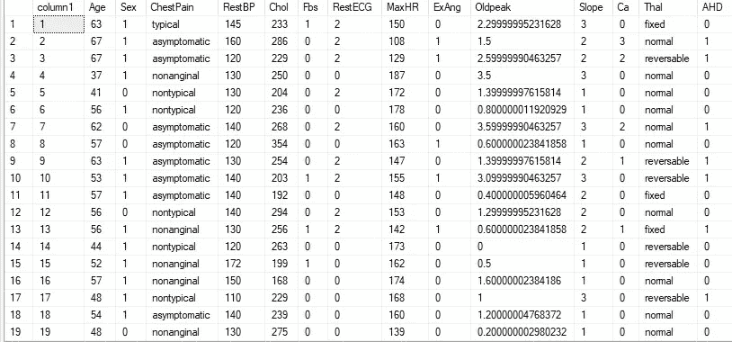

这是输出的一部分。它显示所有的列。它总共有 303 行。

在大多数教程中，你会发现用大写字母书写子句和 SQL 表达式。但是 SQL 命令不区分大小写。所以这是你的选择。你可以使用大写、小写或适当的大小写。

选择我选择的几个列:

```
select Age, Sex, Chol, AHD from Heart;
```

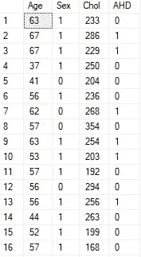

可以在选择查询中转换列值。这里，我在 Chol 列前添加了一个负号(虽然这没有意义，但我这样做只是为了表明这是可能的),并将 Oldpeak 列四舍五入到 1 位小数:

```
select Age, Sex, -Chol, round(Oldpeak, 1), AHD from Heart;
```

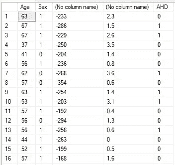

它在 Chol 列中的每个值前添加了一个负号，并将 Oldpeak 列中的值四舍五入到小数点后 1 位。如果您注意到，两个转换后的列没有名称。您可以添加称为列别名的名称。

这里我使用列别名来命名这两个转换后的列:

```
select Age, Sex, -Chol as negativeChol, round(Oldpeak, 1) as roundedOldpeak, AHD from Heart;
```


两个转换后的列现在有了名称。

> Where 子句

“Where”子句使用该条件。例如，AHD 列有两个唯一值:0 和 1。如果您只想获得 AHD 值为 1 的数据，那么“where”子句可以做到这一点。或者，如果我们需要 Chol 大于或小于某个值的数据，我们可以使用“where”子句来完成。这里有几个例子:

```
select Age, Chol, AHD from Heart where AHD = 0;
```

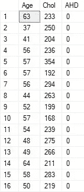

```
select Age, Chol, AHD from Heart where Chol > 250;
```

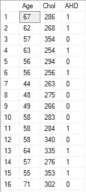

```
select Age, Chol, AHD, RestBP, MaxHR from Heart where RestBP > MaxHR;
```

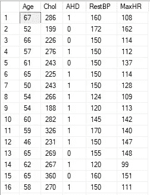

我想介绍这个有趣的符号<>，它检查不匹配。如果在一个条件中使用<>，意味着它将返回不匹配的值。这里有一个例子:

```
select Age, Chol, AHD from Heart where AHD <> 0;
```

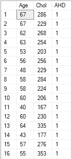

它返回 AHD 不等于 0 的行。

> 带有 where 子句的数学运算

这个例子将展示一个简单的带有“where”子句的数学运算。我们将返回 RestBP 和 MaxHR 之和大于 300 的行。但是我还必须使用 cast(RestBP as int)和 cast(MaxHR as int ),因为它们的数据类型是 tinyint。所以我不得不把它们转换成 int。否则，它将通过我的 SQL 引擎中的一个错误。在这种情况下，不同的 SQL 引擎可能表现不同。

```
select Age, Chol, AHD, RestBP, MaxHR, cast(RestBP as int) + cast(MaxHR as int) as Sum_BPHR from Heart where cast(RestBP as int) + cast(MaxHR as int)> 300;
```

或者这个表达式也可以:

```
select Age, Chol, AHD, RestBP, MaxHR, 1.0*RestBP + 1.0*MaxHR as Sum_BPHR from Heart where 1.0*RestBP + 1.0*MaxHR> 300;
```

输出:

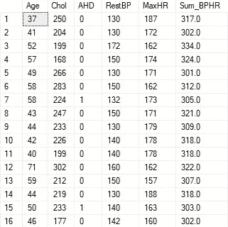

> 在 where 子句中使用“between”

如果 Chol 的值介于 200 和 300 之间，并且 AHD 不为 0，则此表达式将返回 select 语句中的指定列:

```
select Age, Chol, AHD from Heart where Chol between 200 and 300 and AHD <>0;
```

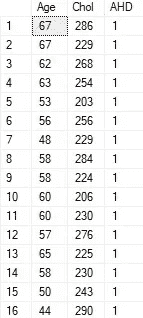

同样，我们可以使用“not between”返回不在指定范围内的行:

```
select Age, Chol, AHD from Heart where Chol not between 200 and 300 and AHD <>0;
```

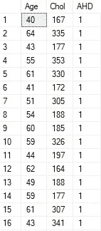

> 过滤空值

Where 子句对于筛选空值很有用。让我们从 RestBP 列中过滤出空值:

```
select Age, Chol, AHD from Heart where RestBP is not NULL;
```

我没有在这里显示输出，因为这个数据集没有任何空值。

> 带有 where 子句的 IN 运算符

“In”运算符可以从值列表中进行检查。例如，假设我们需要具有特定年龄的行:

```
select Age, Chol, AHD, ChestPain from Heart where Age in (45, 23, 50, 52, 65, 60);
```

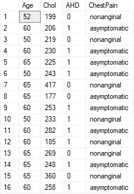

> 带有 where 子句的 Or 运算符

在本例中，我们将返回胸痛为“典型”或“非典型”的行。

```
select Age, Chol, AHD, ChestPain from Heart where ChestPain = 'typical' or ChestPain = 'nontypical';
```

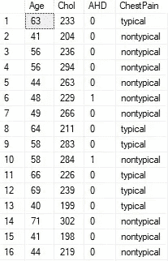

使用“in”操作符也可以达到同样的效果:

```
select Age, Chol, AHD, ChestPain from Heart where ChestPain in ('typical', 'nontypical');
```

> 或者，和运算符在一起

返回年龄小于 50 且胸痛为“典型”或“非典型”的行:

```
select Age, Chol, AHD, ChestPain from Heartwhere Age < 50 and(ChestPain = 'typical' or ChestPain = 'nontypical');
```

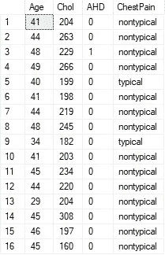

> 不，和运营商在一起

在此示例中，我们将返回胸痛不等于“典型”且 AHD 等于 1 的行:

```
select Age, Chol, AHD, ChestPainfrom Heart where not ChestPain = 'typical'and AHD = 1;
```

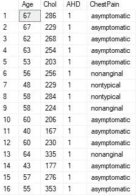

> 通配符

这对字符串数据很有用。下面的表达式检索 ChestPain 值中有“typ”的所有行。“typical”之前或之后是否有其他部分并不重要。

```
select Age, Chol, AHD, ChestPainfrom Heart where ChestPain like '%typ%';
```

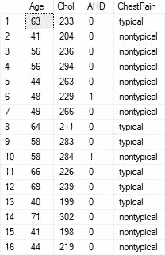

如果我们使用“ChestPain like“% typical”，它将返回 chest pain 值为“typical”或+ typical 的行。

```
select Age, Chol, AHD, ChestPainfrom Heart where ChestPain like '%typical';
```

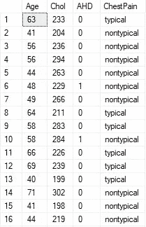

如你所见，我们得到了“典型”或“非典型”的胸痛值

当 ChestPain 值为 non + something 时，下面的表达式将返回，因为“non”的末尾有“%”:

```
select Age, Chol, AHD, ChestPainfrom Heart where ChestPain like 'non%';
```

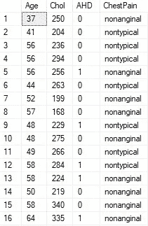

我们得到了 ChestPain 值开头为“non”的所有行。

> Order By 子句

下面是一个简单的 order by 子句用例示例。

```
select Age, Chol, AHD, ChestPain from Heartorder by Chol;
```

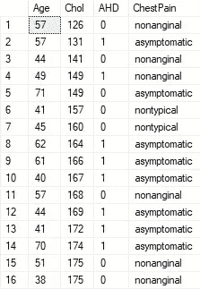

当 order by Chol 被指定时，我们得到了 Chol 以降序排列的输出。

order by 子句中也可以使用多个变量:

```
select Age, Chol, AHD, ChestPain from Heartorder by Age, Chol;
```

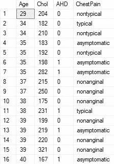

默认情况下，order by 子句按升序排列。但是您可以指定您想要升序还是降序。即使对两个变量使用 order，一个变量可以是升序，另一个变量可以是降序:

```
select Age, Chol, AHD, ChestPain from Heartorder by Age DESC,Chol ASC;
```

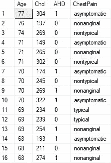

> 数学运算

在这里，我使用年龄列计算可能的最大小时数:

```
select Age, Chol, MaxHR, ChestPain,210 - (0.5*Age) as calculated_MaxHRfrom Heart;
```

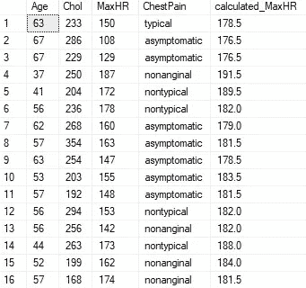

我们还可以找出 MaxHR 和 calculated_MaxHR 之间的差异，并创建不同的列:

```
select Age, Chol, MaxHR, ChestPain,210 - (0.5*Age) as calculated_MaxHR,MaxHR - 210 - (0.5*Age) as Diff_in_MaxHRfrom Heart;
```

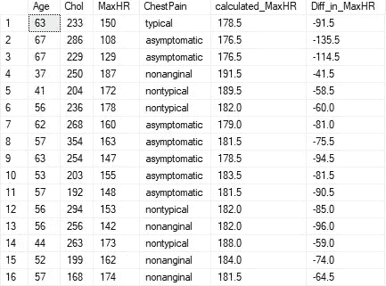

> 聚合函数

聚合函数非常受欢迎。这些是 SQL 中的聚合函数:

*   平均
*   总和
*   最大
*   部
*   数数
*   定义变量
*   标准差（standarddeviation）

下面是使用“avg”来计算数据集中人口的平均年龄:

```
select avg(Age) as avg_age from Heart;
```

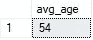

接下来，我将使用 count 函数找出数据集中的样本数:

```
select count(Chol) as total_sample from Heart;
```

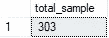

我们可以使用 count 函数中的任何其他列来获得这里的样本数。请记住，我们可以使用 count(Chol)获得样本数，因为 Chol 列没有任何空值。如果在 Chol 列中有空值，我们将无法在这里获得总样本数。因为 count 函数只给出非空值的数量。

寻找最大年龄和最小年龄:

```
select max(Age) as max_age,min(Age) as min_agefrom Heart;
```


计算年龄数据的分布:

```
select max(Age) - min(Age)as Age_spreadfrom Heart;
```

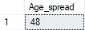

> 独特的功能

我们可以使用 distinct 函数来查找表中所有不同的行。该表达式将返回所有不同的行，并排除任何重复的行(如果有的话):

```
select distinct * from Heart;
```

“年龄”列中有多少个不同的年龄值:

```
select count(distinct(Age)) as distinct_age from Heart;
```


我们可以得到一个明显的年龄，胸痛的组合如下:

```
select distinct Age, ChestPain from Heart;
```

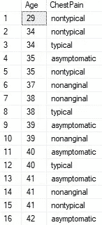

这里我只想得到两列的不同组合。您可以添加更多列并进行检查。

> 具有聚合函数的 Group by 子句

这里我们得到了每种类型胸痛的样本数:

```
select ChestPain, count(*) as numberOfSamplefrom Heart group by ChestPain;
```

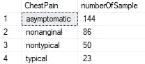

这里再举一个例子。计算每种胸痛的平均年龄:

```
select ChestPain, avg(Age) as Avg_Agefrom Heart group by ChestPain;
```

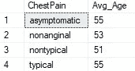

平均年龄非常接近。

您也可以使用多个变量进行分组。在下一个例子中，我按胸痛和 AHD 分组，得到每个分组的平均年龄:

```
select ChestPain, AHD, avg(Age) as Avg_Agefrom Heart group by ChestPain, AHD;
```

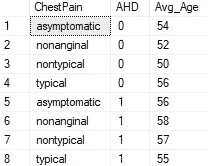

看输出。它首先显示每种类型胸痛的平均年龄和 0 的 AHD 值，然后我们得到每种类型胸痛的平均年龄和 1 的 AHD 值。

> Having 子句

Having 子句用于从组中筛选数据。让我们看一个例子:

```
select ChestPain,count(*) from Heartgroup by ChestPainhaving count(*) > 50;
```

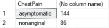

这里我们得到每种类型胸痛的样本数，然后使用样本数必须大于 50 的条件。

Having 子句不一定要在组上。它也可以在其他一些列上。如果胸痛类型的 MaxHR + RestBP 之和大于 10000，则我们在此选择胸痛类型

```
select ChestPain from Heartgroup by ChestPain Having sum(1.0*MaxHR + 1.0*RestBP) > 10000;
```

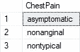

以下示例显示了如何对几列使用聚合函数，然后使用 having 子句来使用条件。

```
select ChestPain, SUM(1.0*MaxHR + 1.0*RestBP) as sum_HRBP,Min(Age) as min_Age,count(*) as total_sample from Heart group by ChestPainhaving SUM(1.0*MaxHR + 1.0*RestBP) > 10000;
```

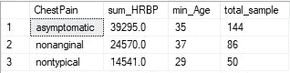

> Where 和 having 子句在一起

Having 子句几乎相当于组中的 where 子句。我们可以同时使用 where 和 having 子句。在这种情况下，首先 where 子句从总数据集中筛选出数据，然后 group by 子句根据指定对数据进行分组，最后 having 子句根据 having 子句中提供的条件从组中筛选出数据。

```
select ChestPain, count(*) as Num_peoplefrom Heart where Age >= 40group by ChestPainhaving count(*) > 50;
```

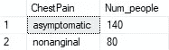

Having 子句可以使用多个条件:

```
select ChestPain, avg(RestBP) as avg_BPfrom Heart where Age >= 40group by ChestPainhaving avg(RestBP) > 120 and count(*) > 30;
```

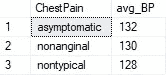

> Order by 和 group by 一起

正如我们之前看到的，胸痛是一个分类变量。在这里，我们计算每种类型胸痛的平均胆固醇，并按照平均胆固醇升序排列:

```
select ChestPain, avg(Chol) as avg_Chol from Heartwhere Chol is not nullgroup by ChestPainorder by avg_Chol;
```

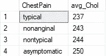

> 串联函数

我们可以使用 concat 函数连接两个列值:

```
select ChestPain, Thal,CONCAT(ChestPain, ' ', Thal) as ChestPainThalfrom Heart;
```

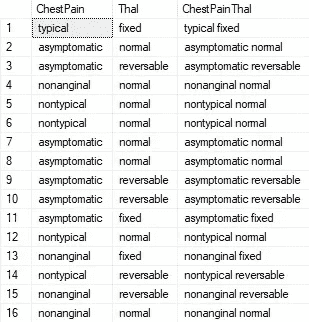

看看上图中的 ChestPainThal 柱。

> 整理

trim 函数修剪字符串开头或结尾的任何空格。

```
SELECT TRIM('  Test string    ') as trimmed;
```

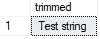

在上面的例子中，我们简单地使用了 trim 函数，默认情况下，它从开头和结尾修剪了多余的空格。但是，如果您想从开头或结尾修剪某些特定的字符，您可以在 trim 函数中指定这些字符。

在这里，我指定我要修剪“%”和“.”从字符串。它将删除“%”或“.”如果出现在开头或结尾。

```
SELECT TRIM('.%' from  '%%Test... string...') as trimmed;
```

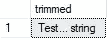

> 子串函数

如果列值是字符串，substring 函数可用于返回部分字符串。

```
select ChestPain, substring(ChestPain, 2, 4) as short_cpfrom Heart where Age > 40;
```


在上面的 substring 函数中，我们传递了 ChestPain、2 和 4。这意味着我们要求函数从 ChestPain 列获取子串，2 表示子串应该从字符串的第二个元素开始，4 表示我们希望子串的长度为 4。

将 Thal 列转换为大写:

```
select upper(Thal) from Heart;
```

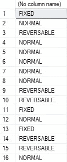

> Case-When 语法

使用 case-when 几乎类似于 if-else 语句。

这里有一个例子，我们从 Chol 列中生成一个分类列。我们设置了不同的范围，将胆固醇定义为最佳、临界高、高和非常高。这个新的分类列被命名为 Chol_Category，它在“结尾”中提到。

```
select Age, Sex, ChestPain, Chol,casewhen Chol >= 100 and Chol <= 129 then 'Optimal'when Chol >=130 and Chol <= 159 then 'Borderline High'when Chol >= 160 and Chol <= 189 then 'High'when Chol > 189 then 'Very High'End Chol_Categoryfrom Heart;
```

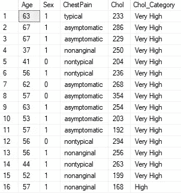

> 限制条款

我们并不总是需要查询的全部结果。有时候某一份就够了。在这种情况下，我们可以使用 limit 子句将输出限制在特定的行数。这种语法适用于大多数 SQL 引擎。

```
select Age, Chol, ChestPain from Heartlimit 10;
```

但是我在本教程中使用了 Microsoft SQL management studio。此语法在 Microsoft SQL management studio 中不起作用。我不得不用这个来代替:

```
select top 10 Age, Chol, ChestPain from Heart;
```

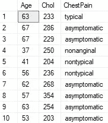

它给出了前 10 行或您在这里提到的数字。

> 页码

如果您有一个大数据集，查询也可以返回一个长表。您可以在单独页面中组织长表，每个页面只包含指定数量的行。

```
select Age, Chol, ChestPain from Heartorder by Chol offset 15 rowsfetch next 15 rows only;
```

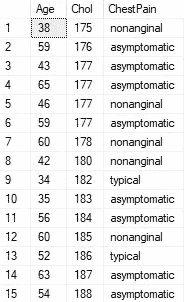

这就是我今天想学习的所有函数和子句。

我没有在这里讨论连接，因为这篇文章太长了。那是另一篇文章。

## 结论

在本文中，我想使用 Microsoft SQL Management Studio 演示 SQL 的所有主要子句和常用函数的示例。如果你能记住所有这些子句和函数，那么编写 SQL 查询对你来说就很容易了。我会在未来制作更多关于 SQL 的更高级主题的教程。

请随时关注我的 [Twitter](https://twitter.com/rashida048) 和[脸书页面](https://www.facebook.com/Regenerative-149425692134498)，并查看我的 [YouTube 频道](https://www.youtube.com/channel/UCzJgOvsJJPCXWytXWuVSeXw)。

## 更多阅读

[](https://towardsdatascience.com/20-very-commonly-used-functions-of-pyspark-rdd-90b8271c25b2) [## PySpark RDD 的 20 个非常常用的功能

### 每个功能都用清晰的例子演示

towardsdatascience.com](https://towardsdatascience.com/20-very-commonly-used-functions-of-pyspark-rdd-90b8271c25b2) [](https://towardsdatascience.com/details-of-violinplot-and-relplot-in-seaborn-30c63de23a15) [## Seaborn 的 Violinplot 和 Relplot 的细节

### 充分发挥潜力在 Seaborn 使用小提琴和 Relplots

towardsdatascience.com](https://towardsdatascience.com/details-of-violinplot-and-relplot-in-seaborn-30c63de23a15) [](https://towardsdatascience.com/simple-explanation-on-how-decision-tree-algorithm-makes-decisions-34f56be344e9) [## 浅谈决策树算法如何决策

### 决策树算法背后的直觉

towardsdatascience.com](https://towardsdatascience.com/simple-explanation-on-how-decision-tree-algorithm-makes-decisions-34f56be344e9) [](/data-analysis-91a38207c92b) [## 数据分析

### Python 中数据科学家/分析师日常工作中的常见数据清理任务

pub.towardsai.net](/data-analysis-91a38207c92b) [](https://towardsdatascience.com/30-very-useful-pandas-functions-for-everyday-data-analysis-tasks-f1eae16409af) [## 30 个非常有用的熊猫函数，用于日常数据分析任务

### 熊猫小型张

towardsdatascience.com](https://towardsdatascience.com/30-very-useful-pandas-functions-for-everyday-data-analysis-tasks-f1eae16409af) [](https://towardsdatascience.com/exploratory-data-analysis-with-some-cool-visualizations-in-pythons-matplotlib-and-seaborn-library-99dde20d98bf) [## 利用 Python 的 Matplotlib 和 Seaborn 中的高级可视化进行探索性数据分析…

### 探索国际足联数据集

towardsdatascience.com](https://towardsdatascience.com/exploratory-data-analysis-with-some-cool-visualizations-in-pythons-matplotlib-and-seaborn-library-99dde20d98bf)