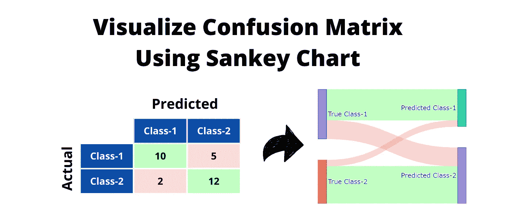
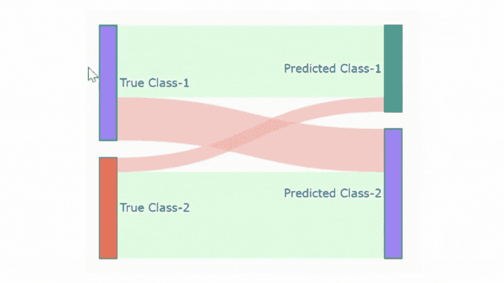
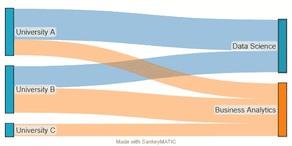
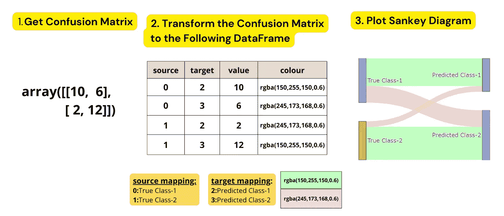

# 直观混淆矩阵的独特方法——桑基图

> 原文：<https://pub.towardsai.net/an-unique-way-of-visualising-confusion-matrix-sankey-chart-de8e4d09b9b?source=collection_archive---------0----------------------->

## 去桑基减少混乱！

作者图片

机器学习中的混淆矩阵方便地总结了模型的性能。然而，当与非技术风险承担者交流时，混淆矩阵可能看起来不直观🤔。那么解决办法是什么呢——创建一个桑基图。

表示二元混淆矩阵的桑基图(图片由作者提供

上图展示了典型二元混淆矩阵的桑基图。在图表中，

*   左边的矩形框显示真实的类，而右边的对应框显示预测的类。
*   绿色表示正确的分类，红色表示错误的分类。

## 故事大纲

1.  简而言之，桑基图是什么？
2.  [如何从混淆矩阵中创建桑基图？](#7f52)
3.  [奖金🎁](#94da)

## **简而言之，桑基图是什么？**

桑基图用于显示从源头到汇点的流动或连接。我们用一个简单的例子来了解它的应用。

假设我们有一个注册的数据集👨‍🎓👩‍🎓三所大学的数据科学或商业分析课程🏫。在这里，大学可以被视为来源，课程可以被视为汇集。登记的数量表示从源到接收器的**连接**。其中一些联系可能比其他联系更重要，例如，从大学 A 到数据科学的联系比其到业务分析的联系更重要。

根据[https://sankeymatic.com/build/](https://sankeymatic.com/build/)创建的桑基图

混淆矩阵的桑基图有以下组成部分:

*   **来源**:真实类
*   **目标(接收器)**:预测类
*   **连接/流量**:实例数

## 如何从混淆矩阵创建桑基图？

我们将按照下图所示的 3 个步骤来创建桑基图。

从混淆矩阵绘制桑基图的三步方法(图片由作者提供)

## **第一步:获取混淆矩阵**

在这一步，我们将生成一个混淆矩阵。这可以从 [sci-kit 学习混淆 _ 矩阵](https://scikit-learn.org/stable/modules/generated/sklearn.metrics.confusion_matrix.html)功能中输出。为了简单起见，我们将使用下面的混淆矩阵。

## **步骤 2:将混淆矩阵转换为数据帧**

我们将把这一步分成几个小步骤。

**2.1-从混淆矩阵中创建一个数据框架**

**2.2 —重组数据帧**

**2.3 —添加新列“颜色”**

现在我们将添加一个新的“颜色”列来突出预测的真实性。这里的`rgba(211,255,216,0.6)`表示`green`颜色，它将突出显示**正确的预测**。而**不正确的预测**将以红色突出显示，即`rgba(245,173,168,0.6)`。

**2.4 —将源列和目标列映射到数字索引**

让我们添加一个新的文本列，当我们将鼠标悬停在图表上时显示。

**2.5 —添加新列“工具提示”**

现在我们准备绘制图表。

## 步骤 3:创建桑基图表

绘图函数`go.Sankey`有两个主要参数——节点&链接。节点是类别，即真实类别 1、预测类别 2 等。而链接是真实类和预测类之间的连接/流。

## 奖金

感谢您完成所有步骤😀我知道这是一个繁琐的过程，所以为什么不创建一个函数呢？我已经创建了一个方便的函数来绘制任何混淆矩阵(二元和多类)的 Sankey 图。

> 请随意在 GitHub 上查看[这款笔记本，了解关于该功能的更多信息！](https://github.com/hrishi-ds/Medium/tree/main/Visualize-Confusion-Matrix-Using-Sankey-Diagram)

**走之前！**

我希望你喜欢这个故事，并发现它很有用。如果你想知道更多类似的故事，请关注我，并请我喝杯咖啡😊。

*我的其他故事你可能会喜欢……*

 [## 如何在 Pandas 中使用条件格式改进您的分析报告

### Pandas 中使用 Styler API 的类似 Excel 的条件格式

pub.towardsai.net](/improve-your-analytical-report-with-conditional-formatting-in-pandas-76039fd3ccb5)  [## 在您的下一个分析中尝试这些熊猫显示配置

### 在这些有用的熊猫展示定制后，满怀信心地分享您的分析笔记本

pub.towardsai.net](/try-these-pandas-display-configurations-in-your-next-analysis-72589648d9a0)