# 仔猪体重分析

> 原文：<https://pub.towardsai.net/analysis-of-bw-in-piglets-using-mixed-models-splines-in-r-a7c0952b15fc?source=collection_archive---------1----------------------->

## [数据分析](https://towardsai.net/p/category/data-analysis)

## 在 R 中使用混合模型和样条

在这个混合模型示例中，我将使用一个更高级的数据集，其中包含不同水平的小猪体重增长。数据集并不那么容易分析，我确信我最后展示的模型可以大大改进。幸运的是，得到最好的模型并不是这篇文章的真正目的。

除了在 R 中显示一个带样条的混合模型之外，我想要实现的是突出一些额外的功能，比如:

1.  混合模型输出的绘图和制表
2.  因素的成对比较
3.  固定效应和随机效应的概要和自举置信区间
4.  探索你的混合模型的一个闪亮的方法。

我相信代码、图片和添加的注释会指明方向。

这里有很多图书馆。我没有全部使用它们，但许多不是白白进口的。

简单的数据导入和争论。

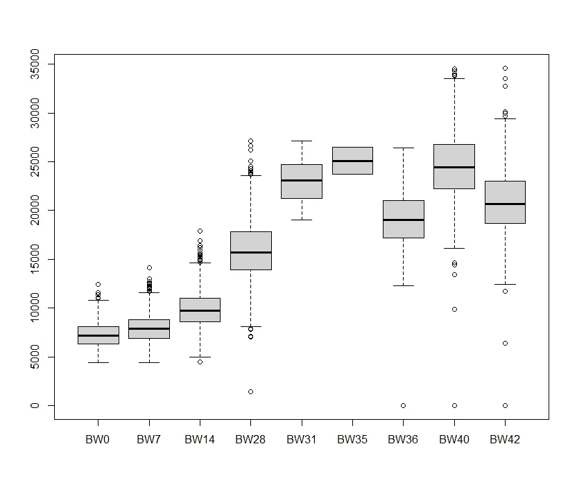

显示仔猪水平测量值的图。从这个图中不能直接清楚的是，中间的观察值是稀疏的。真正知道这一点的唯一方法是知道小猪的“正常”生长曲线。因此，第 31 天和第 35 天的高 BW 分数是异常的，可能是选择偏差的假象。

通过混合模型分析增长数据总是要求数据为长格式—每个 ID 多行，其中每行包含一个随时间变化的因素的单个观察值。在这里，那个因素是 *BW* 。

尽管混合模型非常擅长处理不平衡的数据，但如果我们坚持使用时间点 0、7、14、28 和 42，这可能是最好的。当然，这是个人的选择，你可以做出不同的选择。这些选择需要由科学驱动，而不是由统计数据驱动。

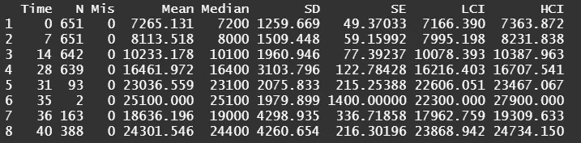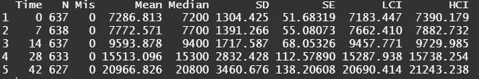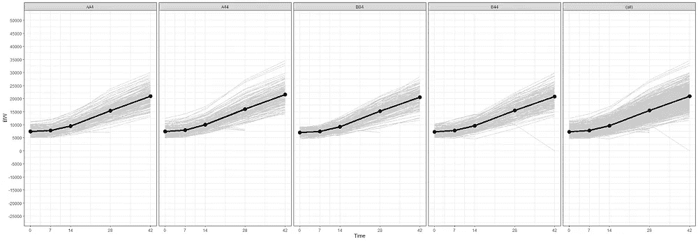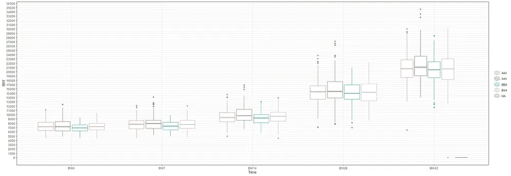

每个处理的基本总体图，以寻找处理内和处理间的变化。内部肯定有变化，但我对两者之间的任何变化都不太乐观。

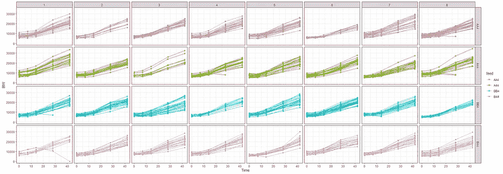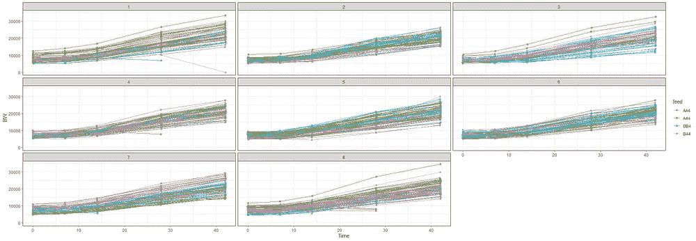

跨围栏、部门和治疗的生长曲线。这些图是开始探索嵌套数据集的好方法。您希望看到单元格内和单元格之间的变化，以便将这些级别作为随机效果级别包括在内。你能在“解释的变化”框中放置的变化越多越好。

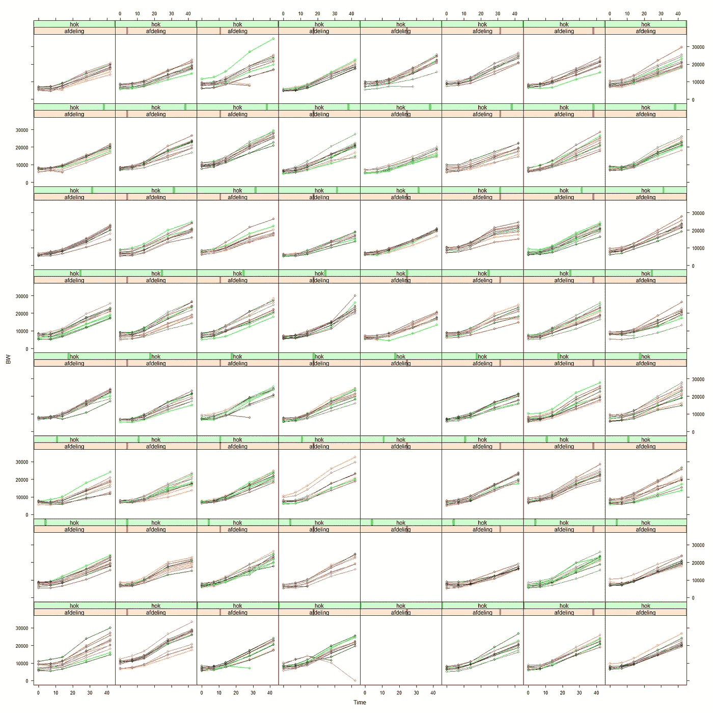

这是部门在钢笔级别的曲线。处理决定颜色。再说一次，我们真的在寻找一个方差。

任何纵向数据集的最大预测因素将是时间。现在，时间本身实际上是最没意思的因素，因为时间本身不能做任何事情。这只是一个我们希望解开却看不到的潜在机制的进展。因此，在模型中，我们将它标记为时间。

为了对“时间”建模，我们需要看看我们是否能以线性方式最好地做到这一点，或者也许多项式变换是必要的。

代码要求三个线性回归模型-线性，二次，三次。

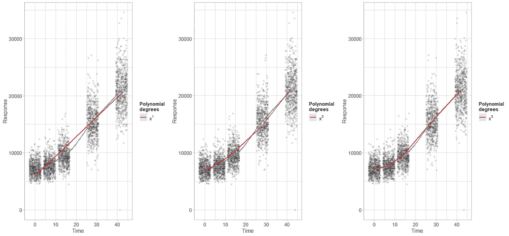

线性模型肯定是不够的，但我还不确定三次(x)模型是否比二次(x)模型表现得更好。

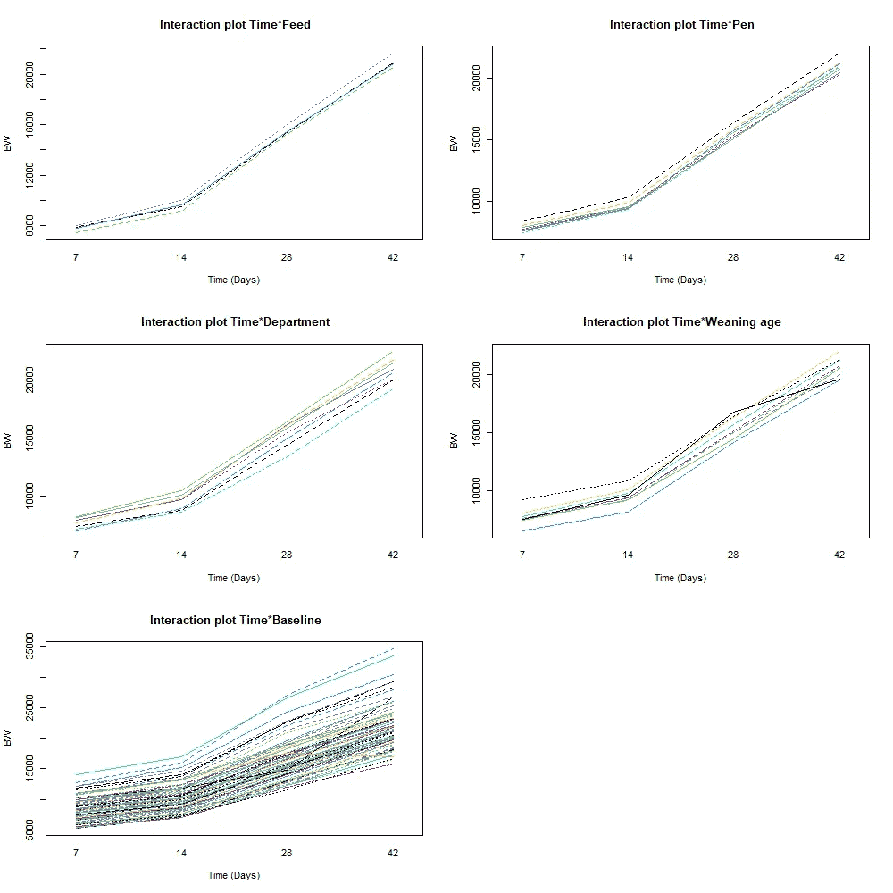

没有太多的互动。

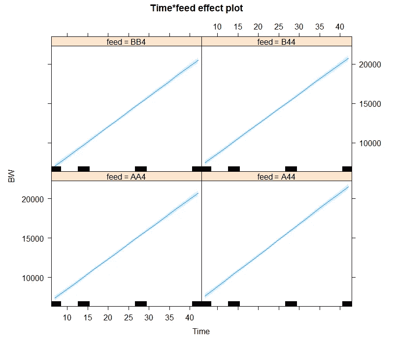

实际上，似乎没有进行任何互动。

现在，是时候使用混合模型对数据进行建模了。如[介绍示例](https://medium.com/@marc.jacobs012/introduction-to-mixed-models-in-r-9c017fd83a63)所示，我们可以通过使用大平均值开始建模，然后使用额外的固定和随机效果。

下面的代码执行越来越复杂的模型，并相互比较它们的模型拟合度。

从结果来看，三节点样条模型似乎是最好的模型。之前的多项式曲线确实暗示了一条曲线，但我不确定是两个还是三个拐点。好像统计选了三个，但是一个要时刻小心。这些模型容易过度拟合。

```
> data.frame(Model=myaicc[,1],round(myaicc[, 2:7],4))  
  Model K     AICc Delta_AICc AICcWt Cum.Wt       eratio
4   TP3 7 44777.30     0.0000      1      1 1.000000e+00
3   TP2 6 44852.52    75.2234      0      1 2.160530e+16
2    TL 5 44902.44   125.1398      0      1 1.491971e+27
1     I 3 51091.40  6314.0990      0      1          Inf
```

我没有向你们展示，但不断出现的东西，是关于预测因子缩放的警告。回归模型非常容易受到异质尺度的影响，限制了它们找到最优解的能力。因此，最好是居中(从观察值中减去平均值)并缩放(通常通过标准偏差)。这就是通常所说的[正常化](https://en.wikipedia.org/wiki/Normalization_(statistics))。

数据被缩放和居中→归一化。

好的，让我们用标准化的数据再次建模。下面你看到一个线性和样条模型，包含相同的固定效果和相同的随机效果。*(1 | af deling/hok/bignummer)*指的是随机截取模型，其中随机效果在小猪级 *(bignummer)* 、钢笔级 *(hok)* 、部门级 *(afdeling)* 进行建模。因此，我们要求模型创建三个不同的随机截距。这是重活！

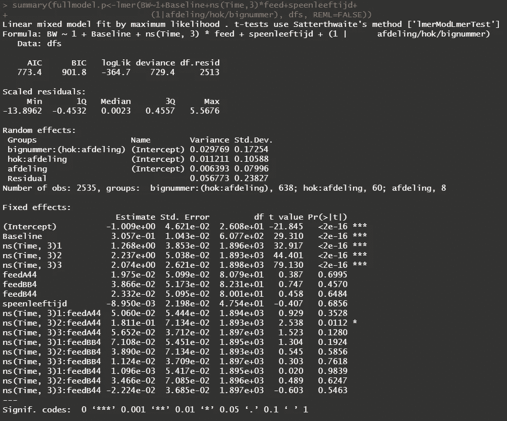

这三个级别中的每一个都有实际的差异，尽管部门级别的差异很大。注意比参数标准误差更小的参数估计值。这通常是一个艰难解决方案的迹象。

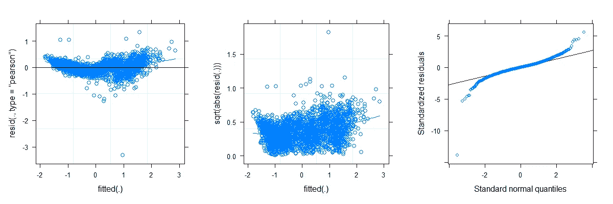

不能说残差看起来很棒。他们似乎做了一个曲线。你想看到的是误差的同质性(随机云)和正态性(顺着黑线)。

我们来对比一下车型。

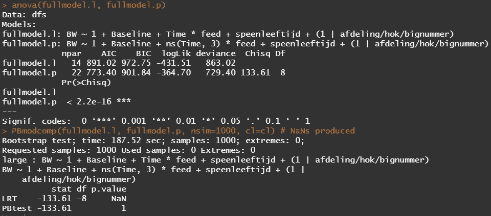

方差分析和 LRT 都认为样条模型是最好的。

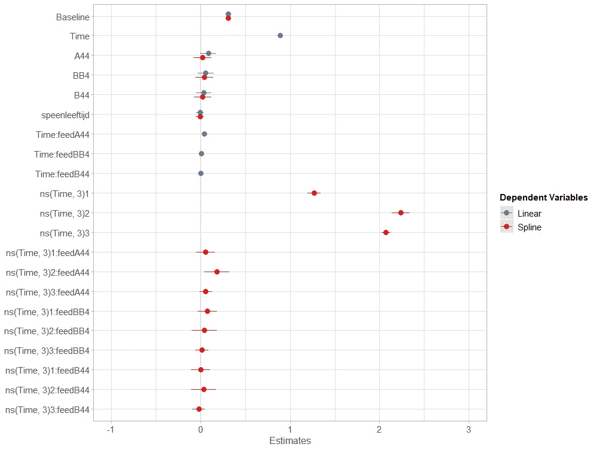

两个模型之间的估计并没有因为它们共享的参数而真正不同。然而，样条模型有更多的参数，这可能解释了它更好的拟合。记住，参数越大，责任越大。

让我们画出我们实际制造的东西。

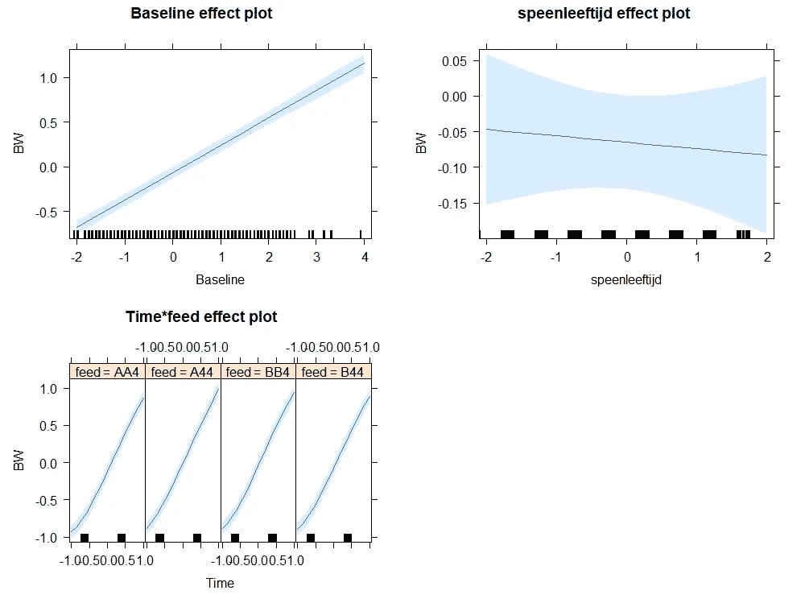

基线对 BW 有明显的影响，但是哺乳年龄(speenleeftijd)对时间*治疗没有显示出影响。

尽管我们的模型远非完美，但我仍然想向你展示如何创建这些华丽且高度[可定制的表格](https://strengejacke.github.io/sjPlot/articles/tab_model_estimates.html)。

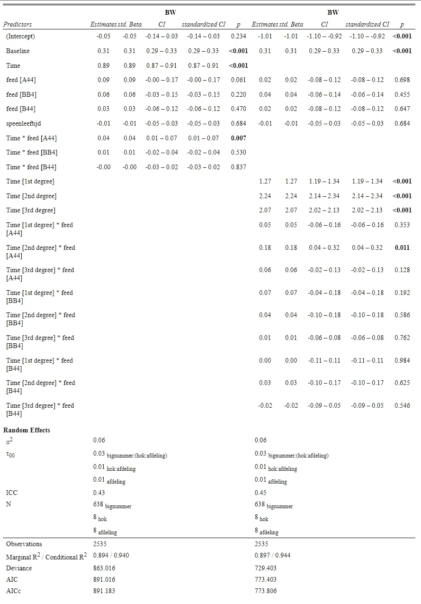

样条模型(右模型)在 AICc 上有明显的下降。相差 120 左右，毫无疑问胜过线性模型。考虑到动物的生长轨迹，这并不奇怪。然而，在时间旁边添加额外参数的好处可能会受到质疑。

引导样条模型并查看其固定和随机效果值的代码。

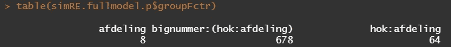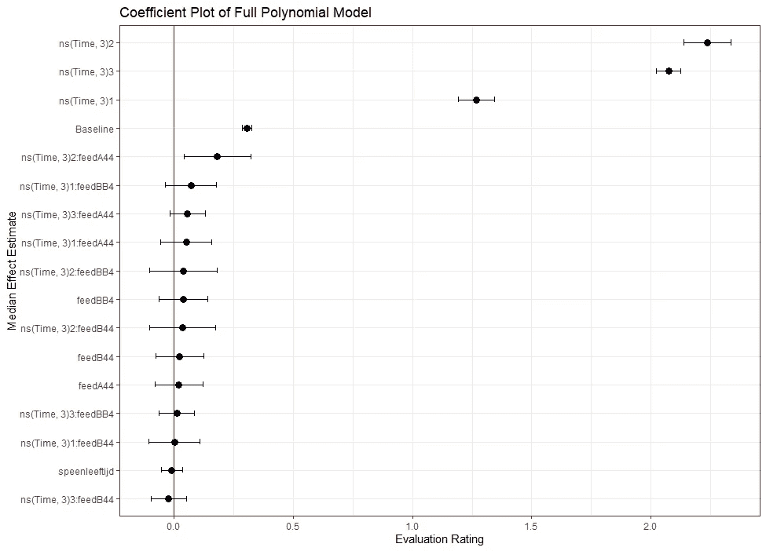

很多参数甚至不应该包含在这个模型中！

下图显示了随着我们向嵌套数据集的更高级别移动，复杂性逐渐降低。在左上角，你可以看到 678 只小猪的随机效果。那里有相当多的变化！当你观察钢笔级别时，这种差异仍然存在，但是在部门级别时，这种差异大部分消失了，但不是完全消失。

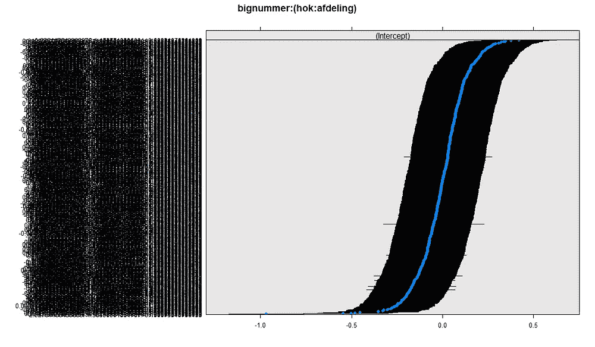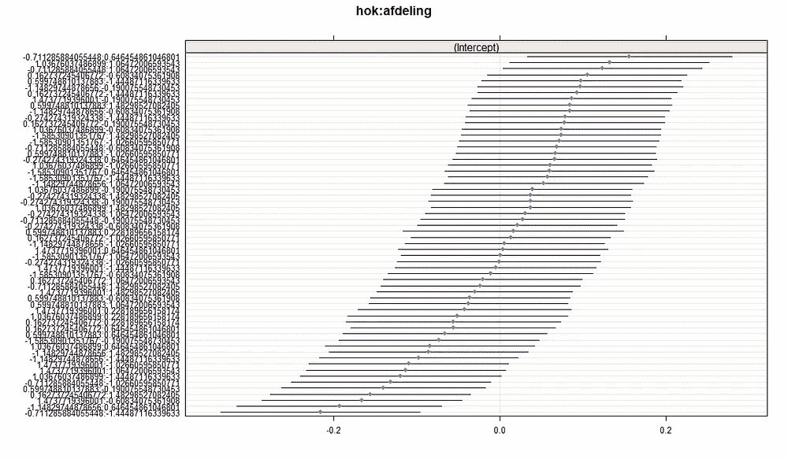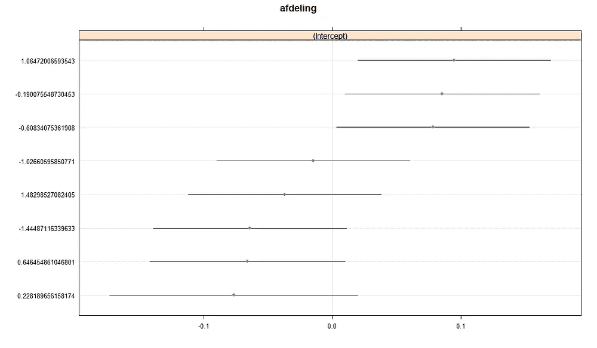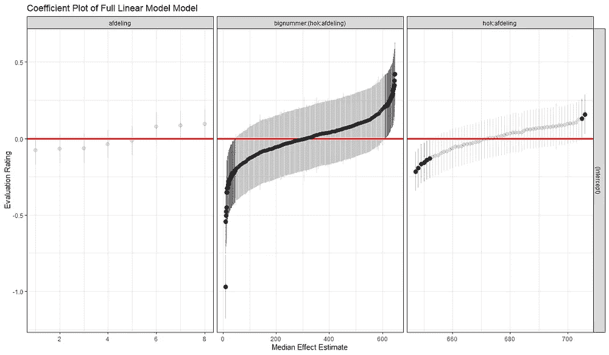

这是看模型预测能力的代码。因为我们包括了随机截距，而不是随机斜率，你应该只期待随机截距！

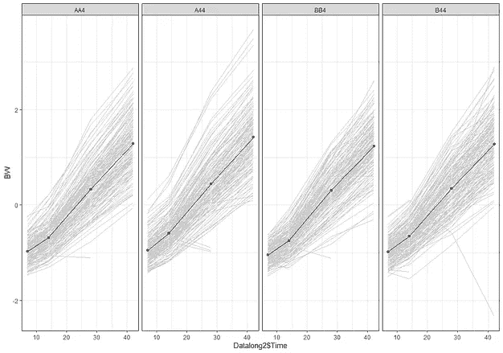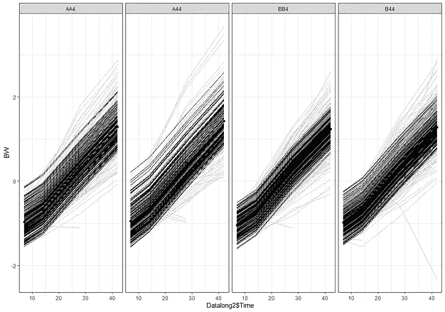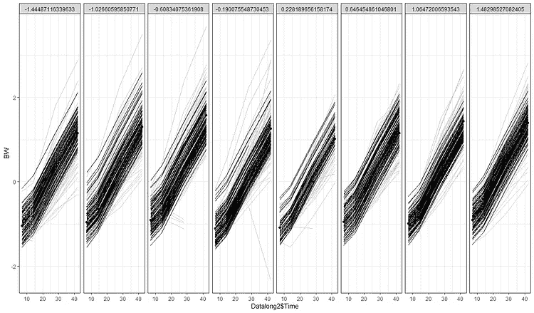

现在，我们将得到更多的重载，使用概要分析和引导为我们提供置信区间。即使是并行处理，这也会很耗时。

你在下面寻找的是奇怪的值和很大的范围。较大的范围表明模型太不稳定，在对数据(或本例中最有可能是残差)进行重采样时会提供不同的结果。请记住，数据是归一化的，所以不要被负值吓到。

```
> fullmodel.p.profile
                           2.5 %      97.5 %
.sig01                0.15789798  0.18806449
.sig02                0.08045540  0.13829972
.sig03                0.03433251  0.16420614
.sigma                0.23087468  0.24606877
(Intercept)          -1.10607167 -0.91646721
Baseline              0.28509093  0.32624303
ns(Time, 3)1          1.19281521  1.34393775
ns(Time, 3)2          2.13788842  2.33545366
ns(Time, 3)3          2.02265831  2.12545518
feedA44              -0.08153903  0.12081676
feedBB4              -0.06433766  0.14123498
feedB44              -0.07802993  0.12428090
speenleeftijd        -0.05629743  0.03623871
ns(Time, 3)1:feedA44 -0.05616030  0.15734512
ns(Time, 3)2:feedA44  0.04118821  0.32098636
ns(Time, 3)3:feedA44 -0.01626940  0.12931287
ns(Time, 3)1:feedBB4 -0.03581485  0.17795854
ns(Time, 3)2:feedBB4 -0.10099513  0.17879623
ns(Time, 3)3:feedBB4 -0.06148481  0.08396338
ns(Time, 3)1:feedB44 -0.10512360  0.10730989
ns(Time, 3)2:feedB44 -0.10426754  0.17359444
ns(Time, 3)3:feedB44 -0.09451097  0.05002694
```

尽管这个模型仍然不太好，而且我们已经知道某些因素不应该被包括在内，但是让我们更深入地了解线性预测器和估计平均值，或者通常所说的 [LSMEANS](https://rcompanion.org/handbook/G_06.html) 。

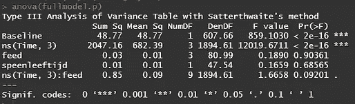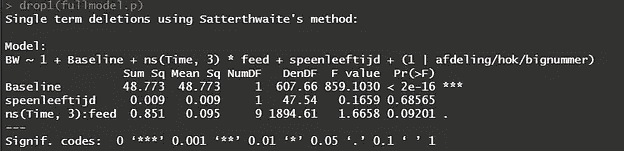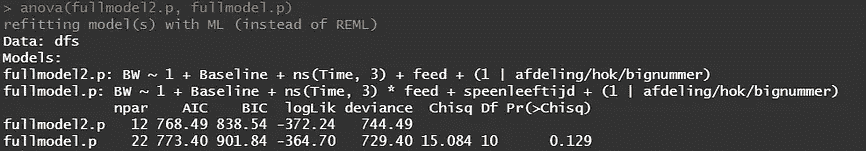

一些因素应该被删除，简化的模型被认为是更节俭的。

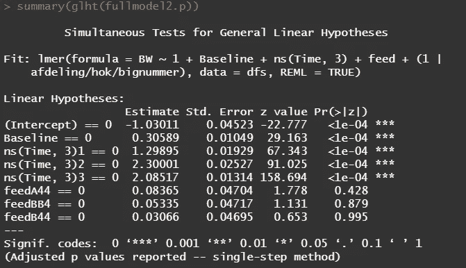

尤其是时间不同于零。不要喂太多。

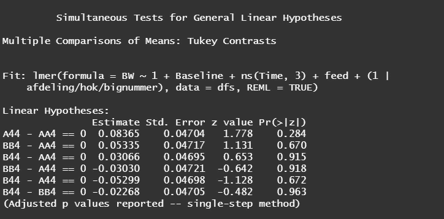

ls 进给方式没有不同。

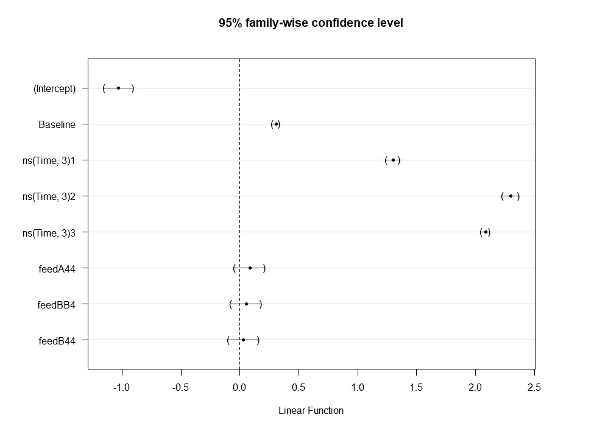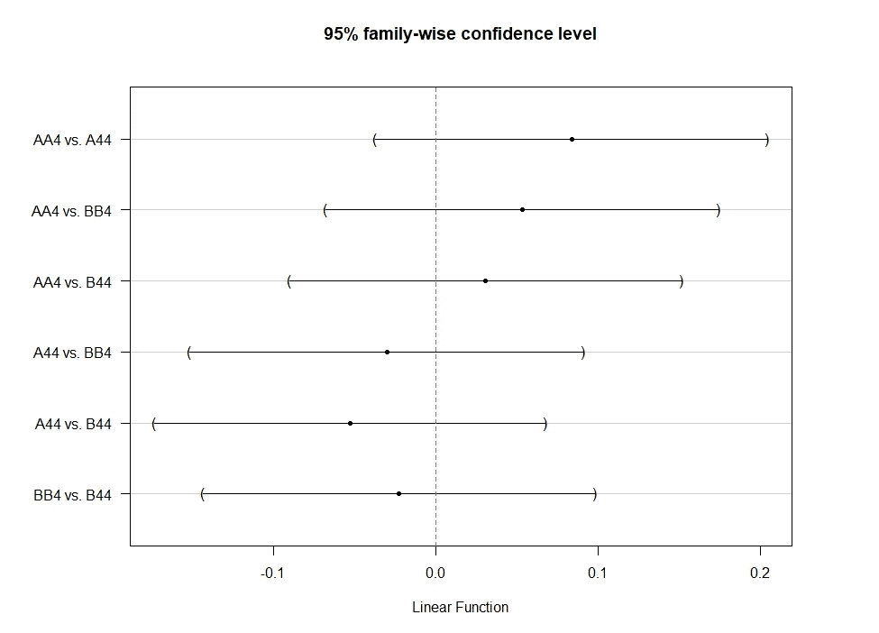

上面输出的图形描述。

这最后一点有点多余。如果你想探索你的混合模型，测试你的知识，你可以把你的模型变成一个闪亮的工具。幸运的是，所有的编码工作都已经完成了，所以您只需要制作模型。然而，问题是，Shiny 应用程序不能识别样条线。总的来说，当与我不理解的刚性包结合时，样条会给你带来一些问题。它们远远超过任何多项式模型。

因此，要在一个闪亮的工具中实际转换您的模型，您需要硬编码多项式模型，但包括断点。从技术上讲，我们现在有了一个[分段回归模型](https://en.wikipedia.org/wiki/Segmented_regression)，它实际上是样条的基础。

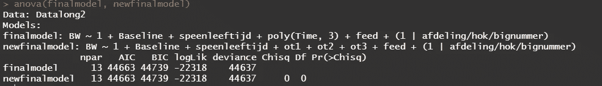

这证明分段模型的性能类似于多项式模型。

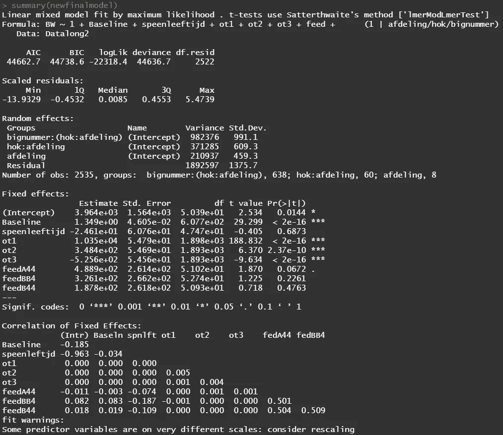

我对原始数据进行建模，以使这个闪亮的工具易于理解。然而，举例来说，查看方差值应该会让您返回到缩放变量。

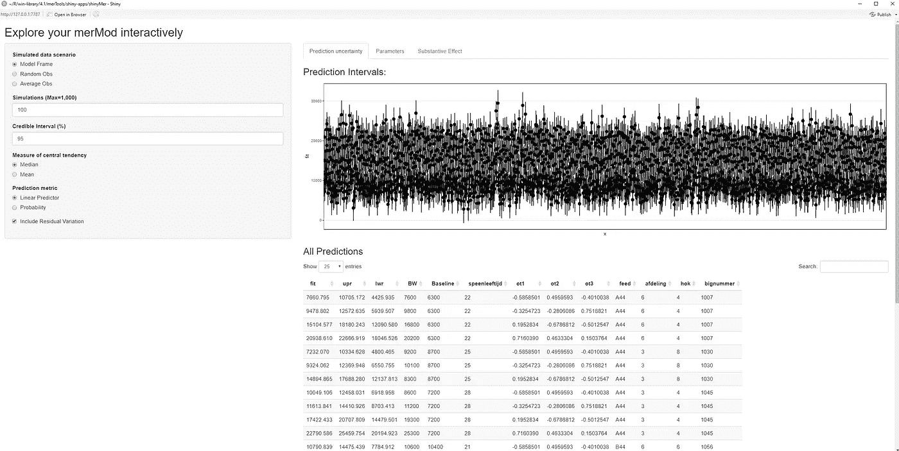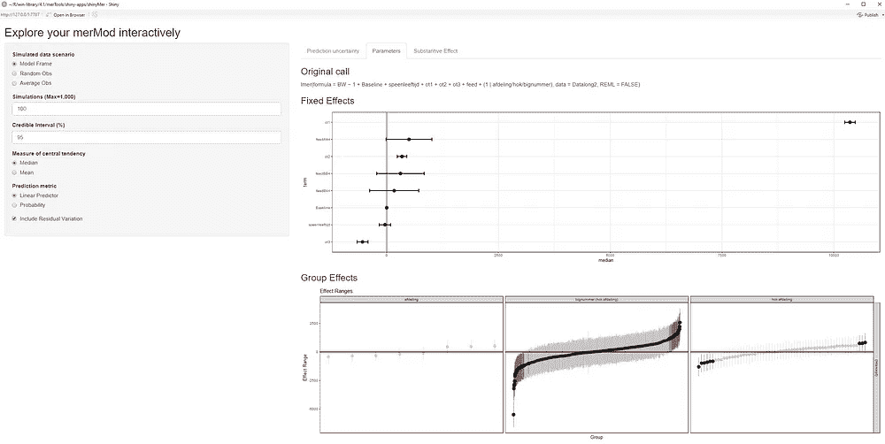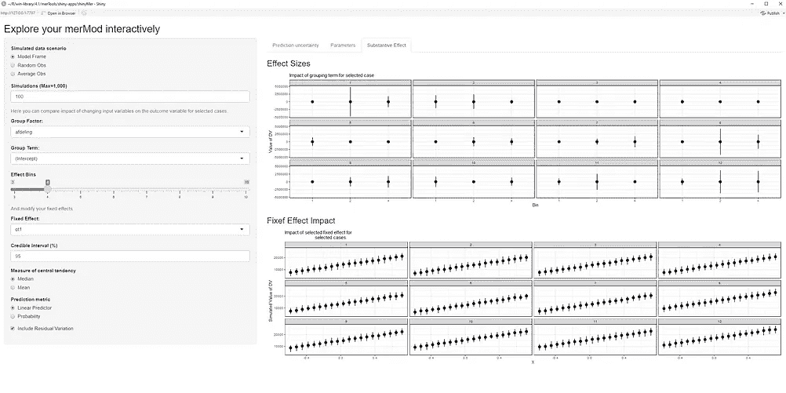

闪亮的工具看起来很棒，可以用来探险。

本帖到此结束。我希望你喜欢它，并继续关注我们更多的职位！