# 国家公园项目中的生物多样性分析

> 原文：<https://pub.towardsai.net/analysis-on-the-biodiversity-in-national-parks-projects-53d1859746ba?source=collection_archive---------1----------------------->

## [数据分析](https://towardsai.net/p/category/data-analysis)


由[塔妮娅·马雷·肖菲](https://unsplash.com/@okta?utm_source=unsplash&utm_medium=referral&utm_content=creditCopyText)在 [Unsplash](https://unsplash.com/s/photos/biodiversity?utm_source=unsplash&utm_medium=referral&utm_content=creditCopyText) 上拍摄的照片

在这篇博客中，我们将对数据集“国家公园项目中的生物多样性”进行分析，该数据集可在 [Kaggle](https://www.kaggle.com/mathisjander/biodiversity-in-national-parks-project) 中获得。我们将使用可视化和统计来进行分析。记住这是一个简单的分析。我们不会应用任何最大似然算法。

你可以在 Kaggle 查看我的[笔记本](https://www.kaggle.com/karthikbhandary2/biodiversity-analysis/notebook?scriptVersionId=65858891)。如果你喜欢，别忘了投票支持它。话虽如此。让我们开始分析数据集。

# 介绍

该项目的目标是分析来自国家公园管理局的生物多样性数据，特别是在不同国家公园地点观察到的各种物种。

该项目将对数据进行范围界定、分析、准备和绘图，并试图解释分析结果。

以下是本项目试图回答的几个问题:

*   物种保护状态的分布情况如何？
*   某些种类的物种更有可能濒临灭绝吗？
*   物种及其保护状态之间的差异是否显著？
*   哪种动物最常见，它们在公园中的分布情况如何？

# 项目目标

在这个项目中，视角将通过国家公园服务的生物多样性分析师。国家公园管理局希望确保濒危物种的生存，以维持公园内的生物多样性水平。因此，作为分析员的主要目标是了解物种的特征及其保护状况，以及这些物种及其与国家公园的关系。提出的一些问题:

*   物种保护状态的分布情况如何？
*   某些种类的物种更有可能濒临灭绝吗？
*   物种及其保护状态之间的差异是否显著？
*   哪种动物最常见，它们在公园中的分布情况如何？

# 数据

这个项目有两个随包提供的数据集。第一个`csv`文件包含每个物种的信息，另一个包含公园位置的物种观察。这些数据将用于分析项目的目标。

# 分析

在本节中，将采用描述性统计和数据可视化技术来更好地理解数据。统计推断也将用于检验观察值是否具有统计显著性。将要计算的一些关键指标包括:

1.  分布
2.  计数
3.  物种间的关系
4.  物种保护状况
5.  对公园中物种的观察。

# 估价

最后，重新审视目标并检查分析的输出是否与第一组要回答的问题相对应(在目标部分)是一个好主意。这一部分还将思考在这个过程中学到了什么，以及是否有任何问题无法回答。这也可能包括局限性，或者是否可以使用不同的方法进行任何分析。

# 导入必要的模块

```
import pandas as pd
import numpy as np
import matplotlib.pyplot as plt
import seaborn as sns
%matplotlib inline
```

# 加载数据

在接下来的步骤中，`Observations.csv`和`Species_info.csv`被读入为`DataFrames`，分别称为`observations`和`species`。使用`.head()`查看新创建的`DataFrames`以检查其内容。

```
species = pd.read_csv("../input/biodiversity-in-national-parks-project/species_info.csv")
species.head()
```

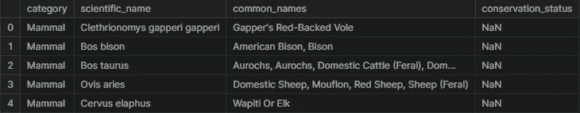

作者图片

它加载以下结果

```
observations = pd.read_csv("../input/biodiversity-in-national-parks-project/observations.csv")
observations.head()
```

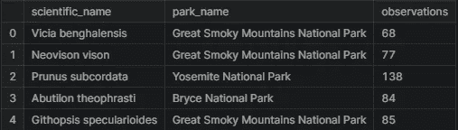

作者图片

我们得到以下结果

# 数据特征

接下来，将检查数据集的尺寸，因为`species`有 5824 行和 4 列，而`observations`有 23296 行和 3 列。

```
print(f"Species Shape: **{**species.shape**}**")
print(f"Observations Shape: **{**observations.shape**}**")#Result
Species Shape: (5824, 4)
Observations Shape: (23296, 3)
```

是时候更深入地研究一下`species`数据了。第一件事是找出数据中不同物种的数量。

```
print(f"No of unique species: **{**species.scientific_name.nunique()**}**")#Result
No of unique species: 5541print(f"No of unique categories: **{**species.category.nunique()**}**")
print(f"Categories: **{**species.category.unique()**}**")#Result
No of unique categories: 7
Categories: ['Mammal' 'Bird' 'Reptile' 'Amphibian' 'Fish' 'Vascular Plant'
 'Nonvascular Plant']species.groupby("category").size() #Result
category
Amphibian              80
Bird                  521
Fish                  127
Mammal                214
Nonvascular Plant     333
Reptile                79
Vascular Plant       4470
dtype: int64
```

从上述观察结果来看，维管植物是数据中最多的物种，有 4470 种，爬行动物最少，有 79 种。

```
print(f"No of unique status: **{**species.conservation_status.nunique()**}**")
print(f"Conservation Status: **{**species.conservation_status.unique()**}**")#Result
No of unique status: 4
Conservation Status: [nan 'Species of Concern' 'Endangered' 'Threatened' 'In Recovery']
```

接下来，对 conservation_status 中的类别细分中的观察数量进行计数。有 5633 个 nan 值，这意味着它们是没有问题的物种。另一方面，有 161 种受关注的物种，16 种濒临灭绝，10 种受到威胁，4 种正在恢复。

```
print(f"na Values: **{**species.conservation_status.isna().sum()**}**")
print(species.groupby('conservation_status').size())#Result
na Values: 5633
conservation_status
Endangered             16
In Recovery             4
Species of Concern    161
Threatened             10
dtype: int64
```

# 观察

下一节讨论观察数据。第一项任务是检查数据集中的公园数量，而这里只有 4 个国家公园。

```
print(f"No. of Parks: **{**observations.park_name.nunique()**}**")
print(f"Parks: **{**observations.park_name.unique()**}**")#Result
No. of Parks: 4
Parks: ['Great Smoky Mountains National Park' 'Yosemite National Park'
 'Bryce National Park' 'Yellowstone National Park']
```

这是公园里记录的观察总数，在过去的 7 天里有 3，314，739 次观察…这是很多的观察！

```
print(f"observations: **{**observations.observations.sum()**}**")#Result
observations: 3314739
```

# 分析

第一项任务将是清理和探索`species`中的`conservation_status`列。

列`conservation_status`有几个可能的值:

*   `Species of Concern`:拒绝或似乎需要保护
*   `Threatened`:易受危害
*   `Endangered`:严重濒临灭绝
*   `In Recovery`:以前叫`Endangered`，但目前在其分布区的全部或大部分区域都没有灭绝的危险

在探索中，检测到了很多`nan`值。这些值需要转换成`No Intervention`。

```
species.conservation_status.fillna("No Intervention", inplace=True)
species.groupby("conservation_status").size()
```

#结果

```
conservation_status
Endangered              16
In Recovery              4
No Intervention       5633
Species of Concern     161
Threatened              10
dtype: int64
```

接下来是检查嵌套在`conservation_status`列中的不同类别，不需要干预的类别除外。下面有表格和图表可供探索。

处于`Endangered`状态的动物中，7 只为哺乳动物，4 只为鸟类。在`In Recovery`状态中，有 3 只鸟和 1 只哺乳动物，这可能意味着鸟比哺乳动物反弹得更多。

```
conservationCategory = species[species.conservation_status != 'No Intervention']\
.groupby(["conservation_status", "category"])["scientific_name"]\
.count()\
.unstack()
conservationCategory
```

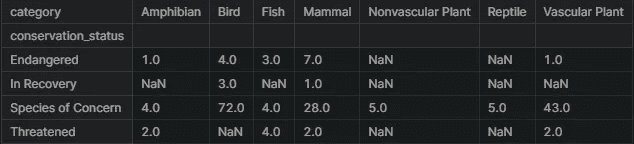

作者图片

```
ax = conservationCategory.plot(kind="bar", figsize=(8,6), stacked=True)
ax.set_xlabel("Conservation Status")
ax.set_ylabel("Number of Species");
```

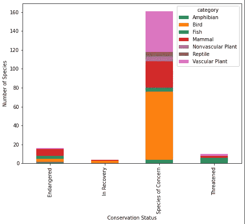

作者图片

# 在保护中

下一个问题是，某些种类的物种是否更有可能濒临灭绝？这可以通过创建一个名为`is_protected`的新列来回答，并包含任何具有除`No Intervention`以外的值的物种。

```
species['is_protected'] = species.conservation_status != 'No Intervention'category_counts = species.groupby(['category', 'is_protected'])\
                        .scientific_name.nunique()\
                        .reset_index()\
                        .pivot(columns='is_protected',
                                      index='category',
                                      values='scientific_name')\
                        .reset_index()
category_counts.columns = ['category', 'not_protected', 'protected']

category_counts
```

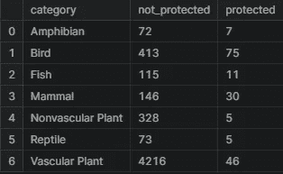

作者图片

```
category_counts['percent_protected'] = category_counts.protected / \
                                      (category_counts.protected + category_counts.not_protected) * 100

category_counts
```

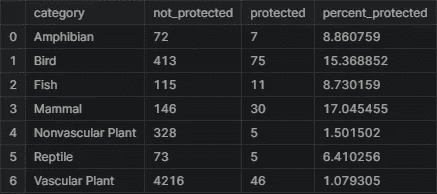

作者图片

# 统计显著性

本节将运行一些卡方检验，以查看不同物种在保护状态率方面是否存在统计上的显著差异。要进行卡方检验，需要创建一个列联表。列联表应该是这样的:

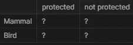

作者图片

第一个测试将被称为`contingency1`，需要填入哺乳动物和鸟类的正确数字。

卡方检验的结果返回许多值，第二个值 0.69 是 p 值。检验统计显著性的标准 p 值为 0.05。对于从该测试中检索的值，0.69 的值远大于 0.05。在哺乳动物和鸟类的情况下，它们之间似乎没有任何显著的关系，即变量是独立的。

```
from scipy.stats import chi2_contingency

contingency1 = [[30, 146],
              [75, 413]]
chi2_contingency(contingency1)
```

#结果

```
(0.1617014831654557,
 0.6875948096661336,
 1,
 array([[ 27.8313253, 148.1686747],
        [ 77.1686747, 410.8313253]]))
```

下一对将测试`Reptile`和`Mammal`的区别。

格式如下所示:

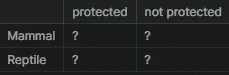

作者图片

这次 p 值为 0.039，低于 0.05 的标准阈值，可以认为爬行动物和哺乳动物之间的差异具有统计学意义。与爬行动物相比，哺乳动物被证明具有统计上显著更高的所需保护率。

```
contingency2 = [[30, 146],
               [5, 73]]
chi2_contingency(contingency2)
```

#结果

```
(4.289183096203645,
 0.03835559022969898,
 1,
 array([[ 24.2519685, 151.7480315],
        [ 10.7480315,  67.2519685]]))
```

# 公园里的物种

下一组分析将来自环保主义者的数据，因为他们在过去的 7 天里记录了在几个国家公园看到的不同物种。

第一步是查看通用名`species`，以了解数据集中最常见的动物。这些数据需要被分割成单独的名字。

```
from itertools import chain
import string

def remove_punctuations(text):
    for punctuation **in** string.punctuation:
        text = text.replace(punctuation, '')
    return text

common_Names = species[species.category == "Mammal"]\
    .common_names\
    .apply(remove_punctuations)\
    .str.split().tolist()

common_Names[:6]
```

#结果

```
[['Gappers', 'RedBacked', 'Vole'],
 ['American', 'Bison', 'Bison'],
 ['Aurochs',
  'Aurochs',
  'Domestic',
  'Cattle',
  'Feral',
  'Domesticated',
  'Cattle'],
 ['Domestic', 'Sheep', 'Mouflon', 'Red', 'Sheep', 'Sheep', 'Feral'],
 ['Wapiti', 'Or', 'Elk'],
 ['WhiteTailed', 'Deer']]
```

下一步是清理每一行中的重复单词，因为它们在每个物种中不应被计数超过一次。

```
cleanRows = []

for item **in** common_Names:
    item = list(dict.fromkeys(item))
    cleanRows.append(item)

cleanRows[:6]
```

#结果

```
[['Gappers', 'RedBacked', 'Vole'],
 ['American', 'Bison'],
 ['Aurochs', 'Domestic', 'Cattle', 'Feral', 'Domesticated'],
 ['Domestic', 'Sheep', 'Mouflon', 'Red', 'Feral'],
 ['Wapiti', 'Or', 'Elk'],
 ['WhiteTailed', 'Deer']]res = list(chain.from_iterable(i if isinstance(i, list) else [i] for i **in** cleanRows))
res[:6]
```

#结果

```
['Gappers', 'RedBacked', 'Vole', 'American', 'Bison', 'Aurochs']
```

现在数据已经准备好，可以计算每个单词出现的次数了。根据这一分析，似乎蝙蝠出现了 23 次，而鼩鼱出现了 18 次。

```
words_counted = []

for i **in** res:
    x = res.count(i)
    words_counted.append((i,x))

pd.DataFrame(set(words_counted), columns =['Word', 'Count']).sort_values("Count", ascending = False).head(10)
```

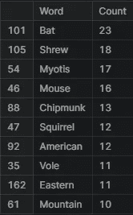

作者图片

在数据中，不同类型的蝙蝠有几个不同的学名。下一个任务是找出哪一行物种指的是蝙蝠。将创建一个由布尔值组成的新列来检查 is_bat 是否为 True。

```
species['is_bat'] = species.common_names.str.contains(r"\bBat\b", regex = True)

species.head(10)
```

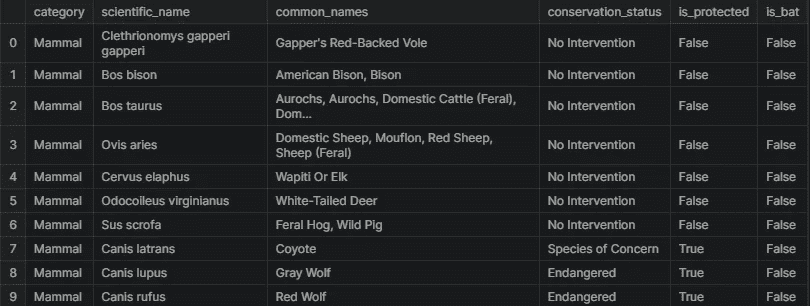

作者图片

下面是 is_bat 为 true 的数据子集，返回匹配的行。蝙蝠的种类似乎很多，受保护的和不受保护的种类混杂在一起。

```
species[species.is_bat]
```

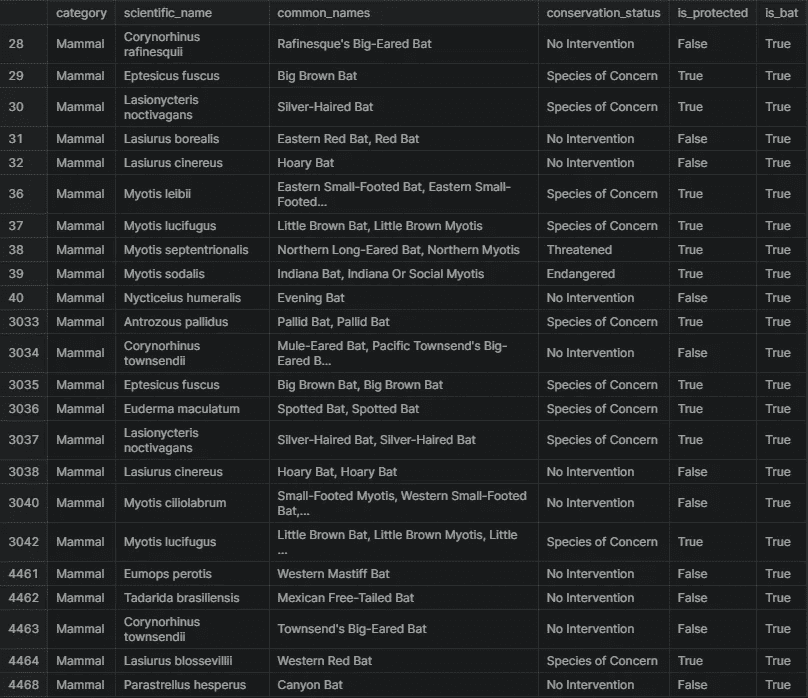

作者图片

接下来，蝙蝠物种的结果将与观察结果合并，以创建一个包含四个国家公园蝙蝠观察结果的数据框架。

```
bat_observations = observations.merge(species[species.is_bat])
bat_observations
```

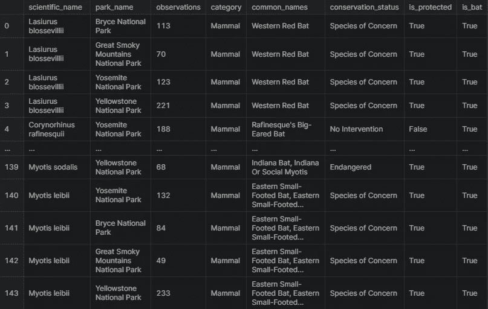

作者图片

让我们看看在每个国家公园总共观察了多少只蝙蝠(包括所有物种)。

过去 7 天在每个公园观察到的蝙蝠总数如下表所示。黄石国家公园似乎最大，有 8362 次观察，大烟山国家公园最小，有 2411 次。

```
bat_observations.groupby('park_name').observations.sum().reset_index()
```

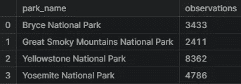

作者图片

现在让我们来看一下每个公园受保护的蝙蝠和不受保护的蝙蝠的对比。似乎除了大烟山国家公园之外，每个公园都有更多受保护蝙蝠的踪迹。这对蝙蝠来说是一个好兆头。

```
obs_by_park = bat_observations.groupby(['park_name', 'is_protected']).observations.sum().reset_index()
obs_by_park
```

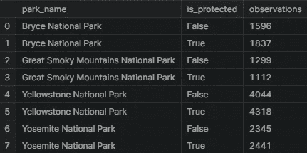

作者图片

下面是最后一次数据处理的输出图。从这张图表中，我们可以看到黄石国家公园和布莱斯国家公园似乎在蝙蝠数量方面做得很好，因为与未受保护的物种相比，受保护的蝙蝠出现的次数更多。大烟山国家公园可能需要加强他们在保护方面的努力，因为他们已经看到了更多不受保护的物种。

```
plt.figure(figsize=(16, 4))
sns.barplot(x=obs_by_park.park_name, y= obs_by_park.observations, hue=obs_by_park.is_protected)
plt.xlabel('National Parks')
plt.ylabel('Number of Observations')
plt.title('Observations of Bats per Week')
plt.show()
```

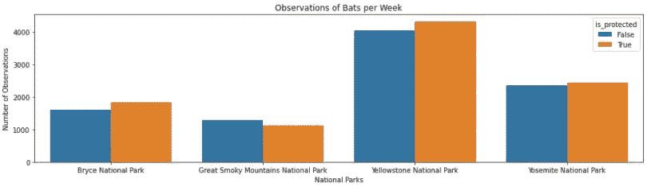

作者图片

# 结论

该项目能够对构成该数据集的四个国家公园中的各种物种进行一些数据可视化和推断。

这个项目也能够回答最初提出的一些问题:

1.  物种保护状态的分布情况如何？

*   绝大多数物种不在保护范围内。(5 633 对 191)

2.某些种类的物种更有可能濒临灭绝吗？

*   哺乳动物和鸟类受到保护的比例最高。

3.物种及其保护状态之间的差异是否显著？

*   虽然哺乳动物和鸟类在保护百分比上没有显著差异，但哺乳动物和爬行动物在统计上表现出显著差异。

3.哪种动物最常见，它们在公园中的分布情况如何？

*   研究发现蝙蝠出现的次数最多，而且它们最有可能在黄石国家公园被发现。

我真的希望你觉得这个分析很有帮助和有趣。如果你喜欢我的工作，那么别忘了在 [Medium](https://karthikbhandary2.medium.com/) 和 [YouTube](https://www.youtube.com/channel/UCKplT0-YqAQdCq6Xajcq5Tw) 上关注我，获取更多关于生产力、自我提升、编码和技术的内容。另外，在 [Kaggle](https://www.kaggle.com/karthikbhandary2/code) 上查看我的作品，在 [LinkedIn](https://www.linkedin.com/in/karthik-bhandary-511778214/) 上关注我。

看看我最近的作品:

[](https://levelup.gitconnected.com/basic-sql-for-datascience-part-1-16b5127203c) [## 数据科学基础 SQL 第 1 部分

### 处理数据库时很有帮助

levelup.gitconnected.com](https://levelup.gitconnected.com/basic-sql-for-datascience-part-1-16b5127203c) [](https://levelup.gitconnected.com/joins-with-pandas-dataframes-bd077a6ec20d) [## 与熊猫数据框架连接

### 连接是数据科学家应该知道的关键概念之一。当一个数据科学家在工作时，它通常会…

levelup.gitconnected.com](https://levelup.gitconnected.com/joins-with-pandas-dataframes-bd077a6ec20d)