# 分析 CitiBike 数据:EDA

> 原文：<https://pub.towardsai.net/analyzing-citibike-data-eda-e657409f007a?source=collection_archive---------1----------------------->

## [数据科学](https://towardsai.net/p/category/data-science)

## 充分利用 Matplotlib 和 Seaborn


由[安东尼·福明](https://unsplash.com/@aginsbrook?utm_source=medium&utm_medium=referral)在 [Unsplash](https://unsplash.com?utm_source=medium&utm_medium=referral) 上拍摄的照片

CitiBike 是纽约市著名的自行车租赁公司，也是美国最大的自行车租赁公司。CitiBike 于 2013 年 5 月推出，现已成为交通网络的重要组成部分。它们让通勤变得有趣、高效、实惠——更不用说健康和环保了。

我从 [Kaggle](https://www.kaggle.com/sujan97/citibike-system-data) 得到了 2013 年 6 月的城市自行车骑行者数据。我将带您浏览完整的探索性数据分析，回答一些问题，如:

1.  骑自行车的人去哪里？
2.  他们什么时候骑马？
3.  他们走了多远？
4.  哪个站最受欢迎？
5.  一周中的哪几天最受欢迎？
6.  还有更多

> **关键学习:**
> 
> 我使用了许多参数来调整 Matplotlib 和 Seaborn 的绘图功能。这将是一个很好的阅读实践中学习他们。
> 
> **注:**
> 
> 这篇文章最好在更大的屏幕上看，比如平板电脑或台式机。在任何时候，如果你发现理解任何东西有困难，我会在本文末尾删除我的 Kaggle 笔记本的链接，你可以在评论区删除你的 quaries。

## 我们开始吧

导入必要的库和读取数据。

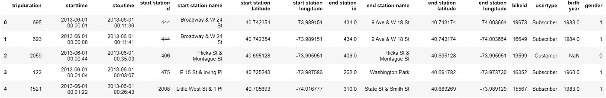

让我们获得更多的数据信息。

```
df.info()
```

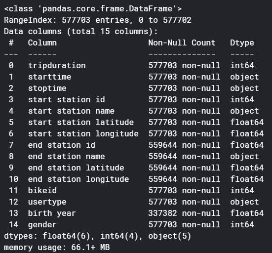

```
#sum of missing values in each column
df.isna().sum()
```

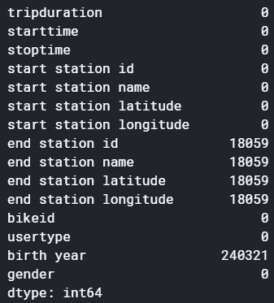

我们要处理 577703 行和 15 列。还有，相当多的缺失值。让我们先处理缺失值。

## 处理缺失值

让我们先看看缺失值的百分比，这将有助于我们决定是否删除它们。

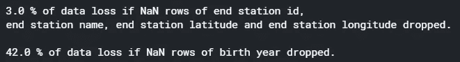

我们不能丢弃缺少的有价值的“出生年份”行。因此，删除“出生年份”整列，并删除“终点桩号 id”、“终点桩号名称”、“终点桩号纬度”和“终点桩号经度”缺少值的行。幸运的是，这四行中所有缺少的值(终点桩号 id、终点桩号名称、终点桩号纬度和终点桩号经度)都在完全相同的行上，因此从所有四行中删除 NaN 行仍然只会导致 3%的数据丢失。

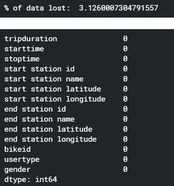

## 让我们来看看我们的数据涉及哪些性别

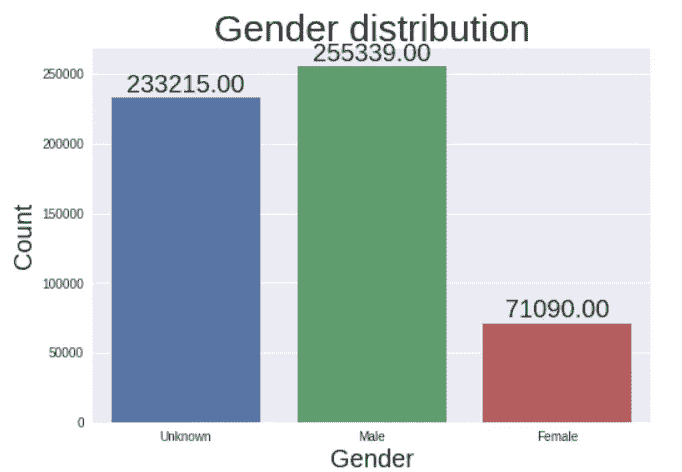

在纽约市，我们可以看到男性骑车者比女性多，但由于大量的未知性别，我们无法得出任何具体的结论。填写未知的性别值是可能的，但考虑到骑手没有选择透露他们的性别，我们不会这样做。

## 订户与客户

订户是购买年票的用户，顾客是一次性购买 24 小时或 3 天通行证的用户。来看看车友们选择最多的是什么？

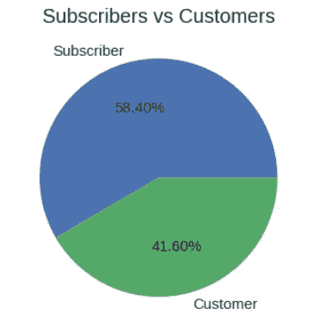

我们可以看到，年订阅用户的数量多于 1-3 天的客户。但差别并不大，该公司必须专注于通过一些优惠或销售将客户转化为订户。

## 骑自行车通常要用几个小时

我们有一个名为“timeduration”的专栏，讨论每次旅行的持续时间，以秒为单位。首先，我们将把它转换成分钟，然后创建箱，把行程分成 0-30 分钟、30-60 分钟、60-120 分钟、120 分钟和以上的乘车时间。然后，让我们画一张图来看看骑自行车的人通常骑多长时间。

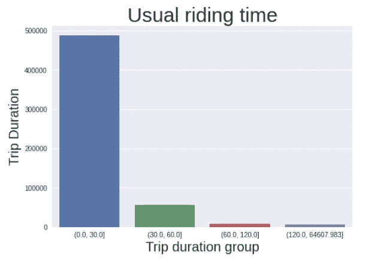

有大量骑行者每次骑行不到半小时，大多数不到 1 小时。

## 相同的开始和结束位置与不同的开始和结束位置

我们在数据中看到，有些行程在同一地点开始和结束。让我们看看有多少。

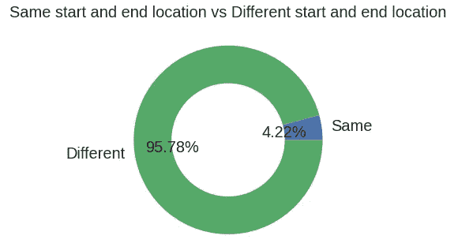

## 本月最佳骑行模式

这部分是我花了很多时间和精力的地方。下图说了很多。从技术上来说，有很多编码。在看代码之前，我将概述一下我们在这里做什么。基本上，我们正在绘制一个时间序列图，以查看每天骑行次数的趋势和每天使用自行车的总时长的趋势。让我们先看看代码，然后我会为你分解它。

通过阅读评论，你可能已经理解了基本的想法，但是让我一步一步地解释这个过程:

1.  日期时间在字符串中，我们将把它转换成 DateTime 对象。
2.  按一个月中的日期对数据进行分组，并计算每天发生的次数以绘制乘车记录。
3.  我们只有一行七月份的信息。这是一个离群值，放弃它。
4.  重复第 2 步和第 3 步，但这次唯一的不同是我们对数据求和，而不是计数，以获得每天旅行的总持续时间。
5.  使用双轴方法将两个数据绘制在一个图表上。

我已经在 matplotlib 上使用了许多调整方法，请务必仔细阅读它们。如果有任何疑问，请在 Kaggle 笔记本上发表评论，该笔记本的链接将在本文末尾删除。

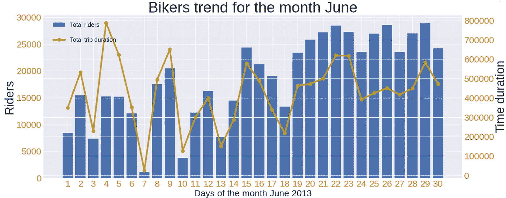

临近月底，骑车人的数量大幅增加。这个月的第一个星期天，有微不足道的乘客。接近月末时，骑车人骑车的时间会减少。

## 十大起点站

这非常简单，我们使用 value_counts()和 slice 获取每个起点桩号的出现次数，从中获取前 10 个值，然后绘制相同的图。

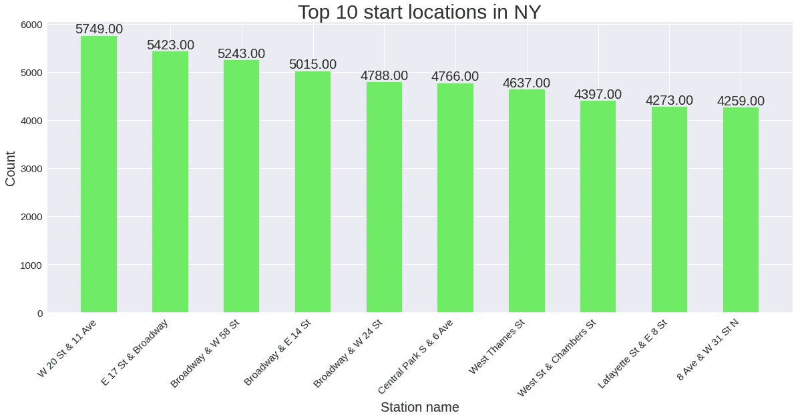

## 前 10 个终端站

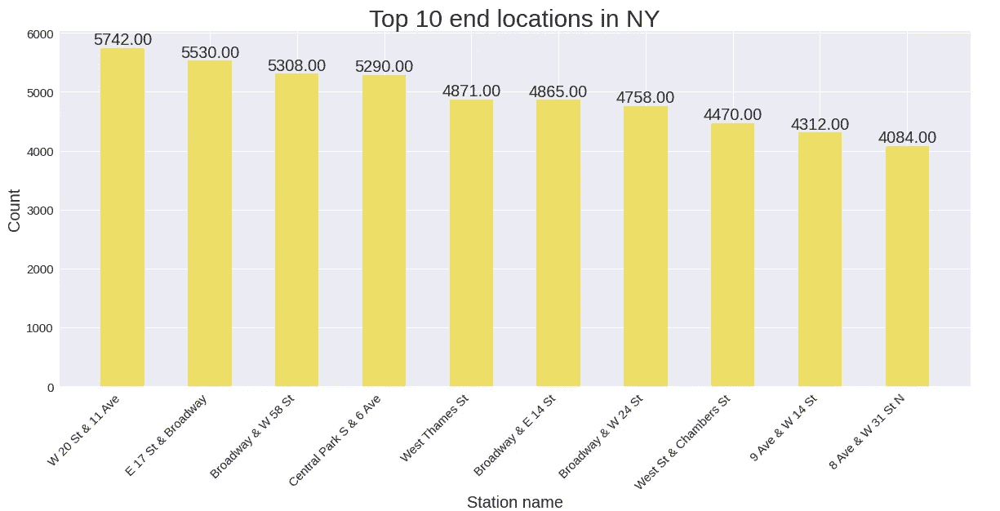

我算出来的卡格尔笔记本。欢迎在评论区提出问题。

[](https://www.kaggle.com/sujan97/analyzing-citibike-system-eda) [## 分析 CitiBike 系统:EDA

### 使用 Kaggle 笔记本探索和运行机器学习代码|使用来自 CitiBike 系统数据的数据

www.kaggle.com](https://www.kaggle.com/sujan97/analyzing-citibike-system-eda) 

使用散景学习数据可视化

[](https://medium.com/analytics-vidhya/beginners-guide-to-data-visualization-with-bokeh-818cbd5eeebb) [## 散景数据可视化初学者指南

### 从头开始用 Python 构建基于 web 的可视化

medium.com](https://medium.com/analytics-vidhya/beginners-guide-to-data-visualization-with-bokeh-818cbd5eeebb)