# 分析新冠肺炎疫苗接种进展

> 原文：<https://pub.towardsai.net/analyzing-covid-19-vaccination-progress-using-python-and-plotly-37b44b9839bf?source=collection_archive---------1----------------------->

## [数据分析](https://towardsai.net/p/category/data-analysis)，[编程](https://towardsai.net/p/category/programming)

## 让我们试着去发现世界是如何对抗新冠肺炎的。


自从我们开始与新冠肺炎作战以来，已经整整一年了。这些肉眼不可见的快速传播的微生物已经袭击了整个世界，并在许多方面改变了我们的生活方式。

关于世界范围内使用的疫苗，各种平台上都有大量的数据。在本文中，我们将使用[新冠肺炎世界疫苗接种进展](https://www.kaggle.com/gpreda/covid-world-vaccination-progress)以及[新冠肺炎全球数据集](https://www.kaggle.com/josephassaker/covid19-global-dataset)，其中包含每日新增 COVID 病例的统计数据。使用上面提到的两个数据集，让我们试着了解一下世界是如何对抗疫情病毒的，以及目前使用的疫苗的功效。

在本文中，我使用了**熊猫**和 **Plotly** 来生成可视化效果。请务必阅读我以前的文章，以便对我们在日常工作中如何使用 Plotly 有一个基本的了解。在本文中，我将使用效用函数来生成图，以便*减少样板代码*和*保持可读性。*

> 我们将使用**数据面板**和 Plotly 来嵌入本文中的图。所有的图都是交互式的，当鼠标停留在上面时会显示各种统计数据。

# 介绍

我们有 3 个数据集将用于生成图和见解。
1。全球每日疫苗接种数据
2。新冠肺炎病例汇总资料
3。新冠肺炎每日病例数据。

首先，让我们看一下疫苗接种和汇总数据集，并了解其属性。

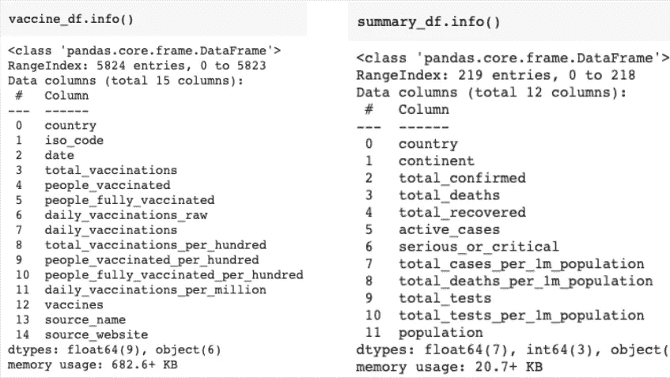

在 *vaccine_df* 中，有几栏似乎令人费解。为了更好地理解，下面给出了我们的分析中使用的列的摘要(有关更多详细信息，请访问上面提供的数据集链接)。

**接种总数-** 该国提供的接种绝对数量(包括剂量)。
**接种人数 _ 接种人数-** 接种人数。(一个给定的人可能会接受一次以上的疫苗接种(剂量)取决于免疫方案)
**人 _ 完全 _ 已接种-** 接受完整免疫方案(所有剂量)的人数。
**【每日接种量】-** 特定日期的绝对接种量(包括剂量)。

汇总数据集的属性不言自明。

由于 **vaccine_df** 每天在*的基础上更新*，并且为了更好地可视化，需要所有日期的*聚合*(每个国家一个单一值)，因此编写了一个帮助器函数来实现我们的目标。

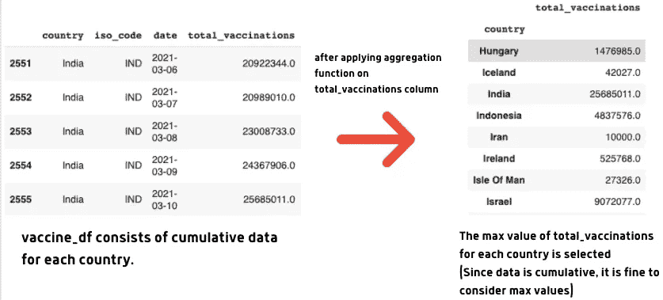

# 数据清理

在执行可视化之前清理数据是很重要的，因为这有助于提高绘图的**准确性**，并且还会导致数据的**一致性**。

首先，比较是否有国家存在于**疫苗 _df** (聚合疫苗接种数据集)中，但在**汇总 _df** (每日新冠肺炎病例汇总数据集)中遗漏。

```
print([x for x in vaccine_df.country.unique() if x not in summary_df.country.unique()])**Output:** ['Antigua and Barbuda', "Cote d'Ivoire", 'Czechia', 'England', 'Falkland Islands', 'Guernsey', 'Hong Kong', 'Isle of Man', 'Jersey', 'Macao', 'Northern Cyprus', 'Northern Ireland', 'Saint Helena', 'Scotland', 'Trinidad and Tobago', 'Turks and Caicos Islands', 'United Kingdom', 'United States', 'Vietnam', 'Wales']
```

令人惊讶的是，汇总数据集中没有美国和英国这样的国家，但是经过观察，发现汇总数据集中包含缩写“US”和“UK ”,而不是全名。同样，很少有名字拼写不同。下面的代码片段消除了数据集中的不一致。

最好将**疫苗接种** (vaccine_df)和**每日病例** (summary_df)数据集合并。在合并之前，必须创建每个列的聚合，以获得聚合数据(如上所述，在疫苗数据集中，每个国家在每个日期都有数据。)

下图描述了汇总数据集中的各种信息，汇总数据是由 **vaccine_df** 和 **summary_df 组合而成。**

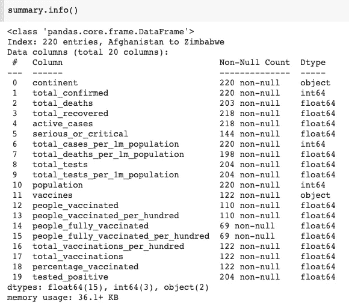

# 数据可视化

为重复性任务编写助手函数是一个很好的实践。在这项分析中，将创建多个条形图，以深入了解世界各地的疫苗接种情况。下图显示了一个用于绘图标题的帮助函数和另一个基于列名生成条形图的帮助函数。

让我们现在开始想象。为了更好地理解，我们将只计算前 20 个国家的汇总统计数据。

## 接种疫苗人数最多的 20 个国家。

```
title = fill_title_and_subtitle("Total Vaccinated", "Poeple who received the first dose of vaccine")create_bar_chart(summary.reset_index(), 'country', "total_vaccinations", title, "viridis", n=20 )
```

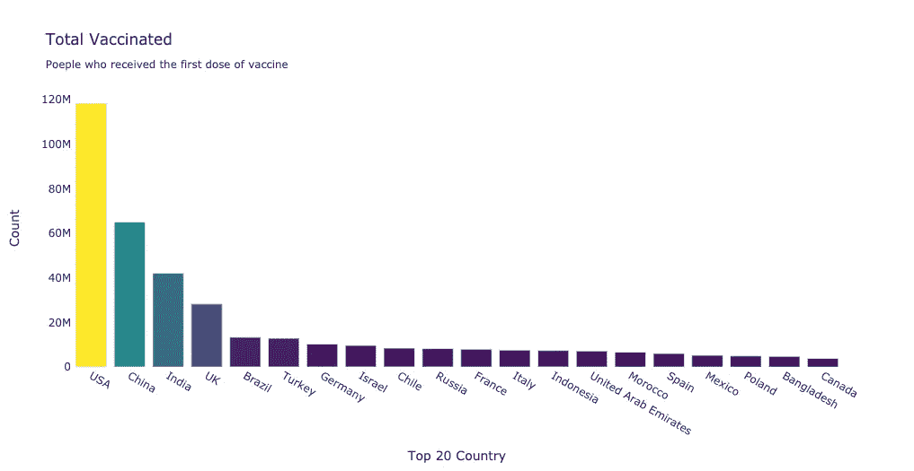

值得注意的是，在接种疫苗的人数方面，美国和中国名列前茅。(请注意，以上数字代表接种首剂疫苗的人数)

初步看来，1.2 亿似乎是一个巨大的数字，但它只占目前美国人口的 40%。最好看看接种疫苗的总人口的百分比，以了解哪些国家做得最好。

```
title = fill_title_and_subtitle("Percentage Vaccinated", "Countries with Highest Percentages of total population who received the first dose of vaccine")create_bar_chart(summary.reset_index(), 'country', "percentage_vaccinated", title, "Blugrn", n=20 )
```

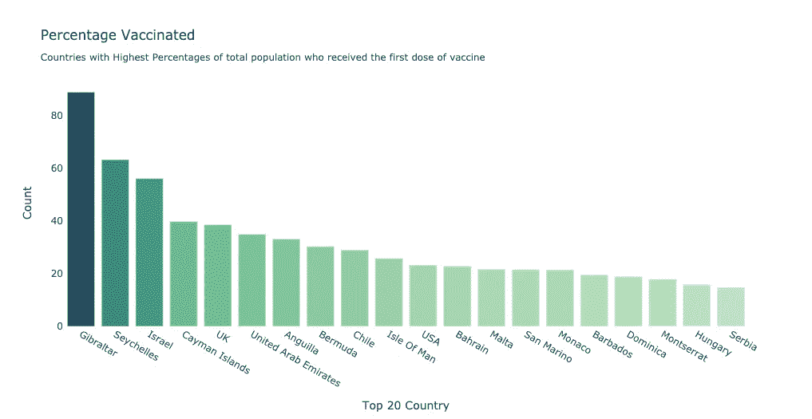

可以注意到，印度和中国在接种疫苗总数中排在前 3 位，但在接种疫苗的百分比中却没有出现。

## 流行的疫苗组合

```
vaccine_combinations = summary.dropna(subset=['vaccines'])vaccine_combinations = summary.groupby('vaccines')['total_vaccinations'].sum()vaccine_combinations = pd.DataFrame(data).reset_index()title = fill_title_and_subtitle("Vaccines In Use", "Popular Vaccine Combinations that are used around the globe")create_bar_chart(data, 'vaccines',"total_vaccinations", title, "RdBu",n=5 )
```

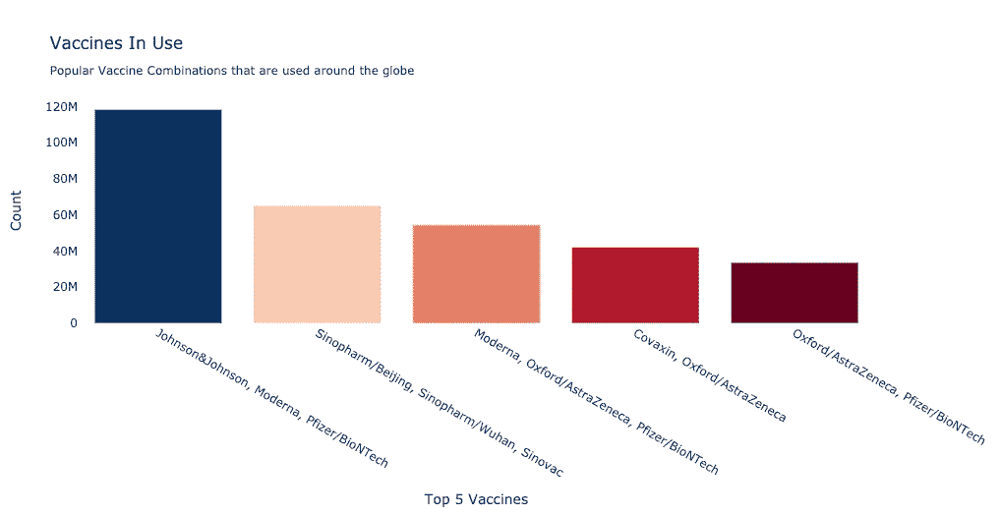

人们可能会在上面的代码片段中提出一个问题。为什么现在删除丢失的值？它应该在数据清理步骤中完成，对吗？

由于一些原因，我采用了上述方法。首先，我们不会以同样的方式处理所有缺失的值。我们将对不同的栏目采取不同的策略。因此，为了更好地理解，我决定在绘制特定的列之前，先填充缺失的值。

在上面的场景中，我们不能使用任何已知的策略来填充缺失的疫苗组合，因为疫苗列由离散值组成。

现在让我们来看看世界上危重病例数和死亡率最高的前 20 个国家。

```
data = summary.dropna(subset=['serious_or_critical'])data = data.reset_index()title = fill_title_and_subtitle("Serious or Critical Cases", "Number of people who are currently critically ill due to Covid-19")create_bar_chart(data, 'country',"serious_or_critical", title, "turbid", n=20)
```

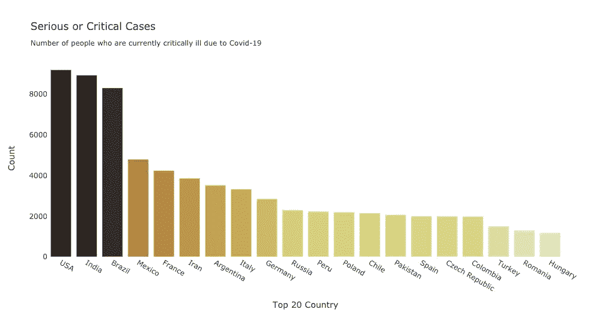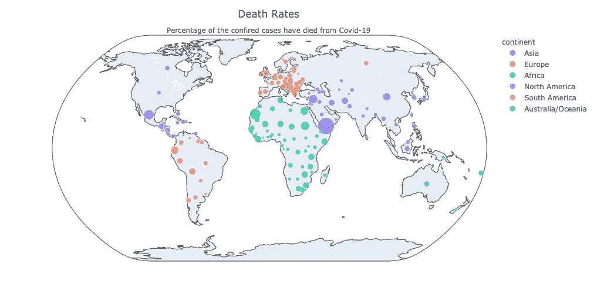

即将到来的情节将是关于理解疫苗的进展。因此，我们还将使用每日新冠肺炎案例数据集(由每日数据组成，不同于之前使用的仅包含新冠肺炎案例汇总数据的数据。)

每日新冠肺炎病例数据几乎没有缺失值。缺少的值用前一天的值填充。(因为数据是每天记录和添加的，所以可以用前一天的数据来填充某一天的缺失数据。)为了更好的可视化，这些值也被缩放。

## 十大国家疫苗接种进展

我们将绘制一个描绘每日疫苗接种过程的线图。

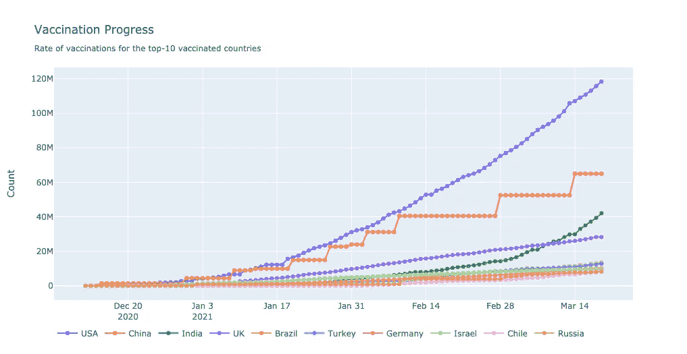

中国的情节看起来令人费解。(连续两天或两天以上的接种率相同。这是因为中国只上传了几次数据，其他日期都是空的。因为我们用前一天的数据填充了缺失值，所以我们观察到中国的线是平的。)

## 累积统计

我们需要以这样一种方式过滤数据，即它将包含每日新增病例和每日累计接种病例。下面的代码片段将实现上述目标。

## 疫苗接种与病例

下图将使用堆积条形图描述每日病例数和每日接种总数。

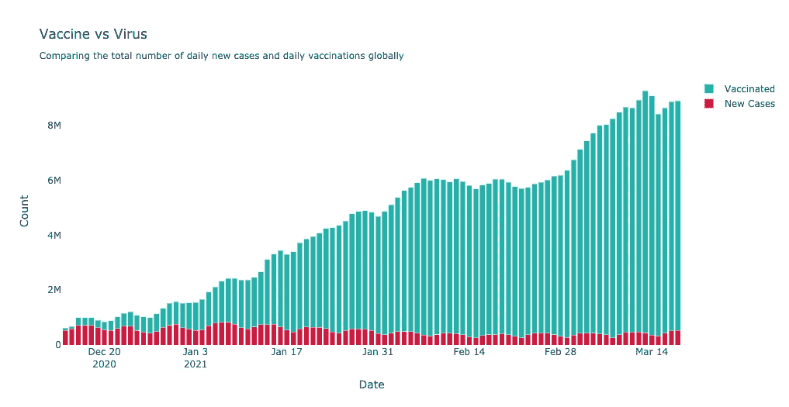

我们可以看到，接种疫苗的数量逐渐增加，而每日病例数似乎在减少。时间是一个很好的信号。

## 最后一个情节

让我们试着理解疫苗接种率是如何变化的。确诊病例和死亡病例。

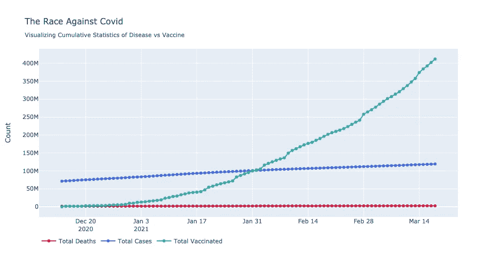

与总病例和死亡相比，接种疫苗的数量似乎呈指数增长。这些确实是好迹象！

# 结论

我希望你喜欢我对新冠肺炎疫苗接种的分析，并了解我们如何清理数据，填充缺失值，以及使用辅助函数和 Plotly 绘图进行可视化。注意安全！

如果您想联系，**在** [**LinkedIn**](https://www.linkedin.com/in/saiteja-kura-49803b13b/) **上联系我。**