# SAS 中有序数据的分析——泊松分布和负二项分布

> 原文：<https://pub.towardsai.net/analyzing-ordinal-data-in-sas-poisson-and-negative-binomial-distribution-5f46b039aaeb?source=collection_archive---------4----------------------->

这篇文章是关于在 SAS 中使用 **PROC GLIMMIX** 的[介绍文章的延伸。我已经展示了如何使用](https://medium.com/@marc.jacobs012/generalized-linear-mixed-models-in-sas-distributions-link-functions-scales-overdisperion-and-4b1c767bb89a)[多项式分布](https://medium.com/@marc.jacobs012/analyzing-ordinal-data-in-sas-fe9d9d35a449)和[二元、二项式和贝塔分布](https://medium.com/@marc.jacobs012/analyzing-ordinal-data-in-sas-using-the-binary-binomial-and-beta-distribution-8efe5fe5af66)来分析有序数据。在这篇文章中，我将使用之前在[中发布的泊松分布](https://medium.com/@marc.jacobs012/analysis-of-repeated-count-data-in-r-the-poisson-quasi-poisson-negative-binomial-e62aff528309)。这篇文章将通过分析同一个数据集来扩展那些文章，这个数据集是在不同时间对猪进行的腹泻评分。在这里，腹泻是主观测量使用顺序评分系统。

所以，这篇文章将会很短，应该更多地被看作是早期 **PROC GLIMMIX** 文章的延伸。下面你会看到一个覆盖了拟合分布的计数数据图。两个最著名和最常用的分布是泊松分布和负二项式分布，后者更灵活。这是因为负二项式模型是两种分布的混合——泊松分布和伽玛分布。

正如你在下图中看到的，负二项式可以更好地拟合数据，但会高估零的数量。当处理计数时，这些零可能会很麻烦，这导致了零膨胀模型的应用，我在这里不讨论。

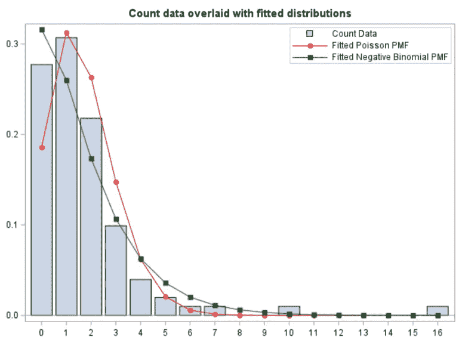

用泊松和负二项分布覆盖的计数数据

根据定义，计数数据是通常遵循泊松分布的比率。在这个例子中，我们计算了整个时间段的腹泻量。这意味着，对于一个序数尺度，我们需要把它一分为二。否则，我们没有建模速率所必需的“事件”。

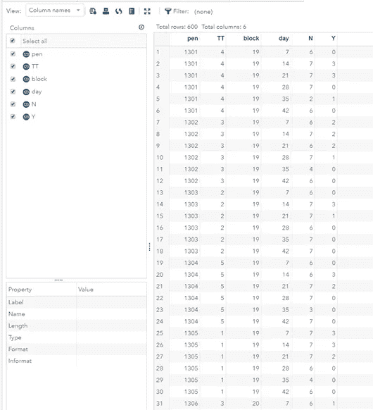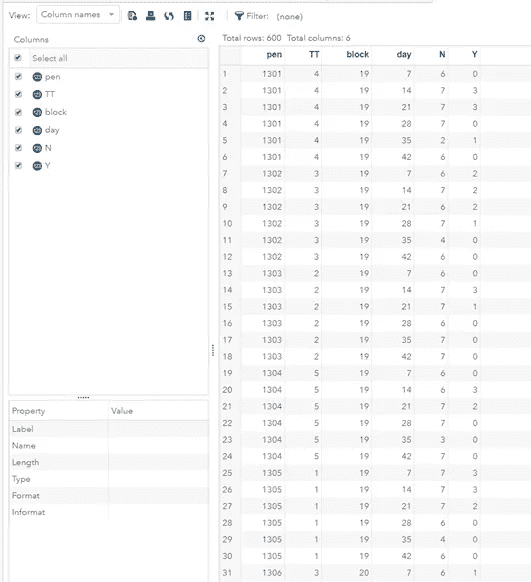

从二项式数据到泊松数据。它保持不变！

使用二项式分布，您需要指定一个命名者(Y)和一个分母(N)。使用泊松分布，您需要指定一个命名者(Y)和一个偏移变量(N)。偏移需要在对数标度上。这个偏移量非常重要，它给出了速率需要的另一个度量，即速率。

这可以通过下表看出。选择不包括粪便(因为没有腹泻或没有遗漏)会对比率产生影响，因为偏移量会发生变化。这是正常的，因为分母也会改变。

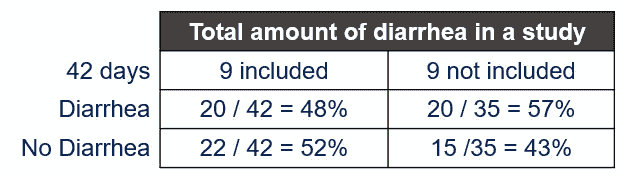

包括或不包括缺失的分数对事件的数量有很大的影响。

在介绍文章中，我已经提到过过度分散的危险，这在使用泊松分布时很常见。这是因为泊松分布是单参数分布，均值等于方差。

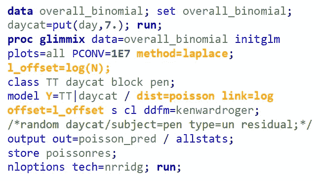

为了检测过度分散，我们需要使用最大似然的 n 次近似来运行模型。这里，我用拉普拉斯。您可以看到，我还包括一个偏移变量，它需要包含在模型比例中。这意味着在包含数据之前，我需要将数据转换为日志。

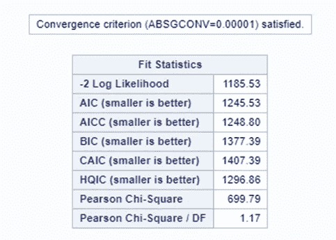

皮尔逊 Chi / DF <1.5

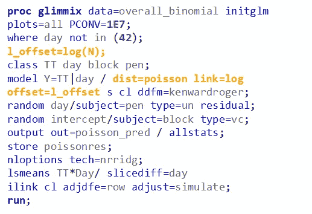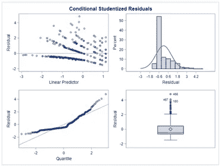

Analysis using a Poisson Distribution. The residuals are off, but once again, they are not expected to be normal. The overdispersion metric is much more important, as is the assessment of the estimates and the standard errors.

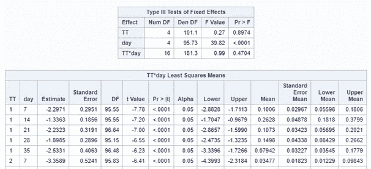

The Test of Fixed Effects shows a day effect. The mean, which are proportions here, are not impressive. You are testing very much at the boundary of a proportion.

Now, lets see how a negative binomial looks at the data. Since the Poisson analysis already showed an absence of overdispersion, I know for sure that the Negative Binomial will detect the same. Hence, we can go straight to the analysis itself.

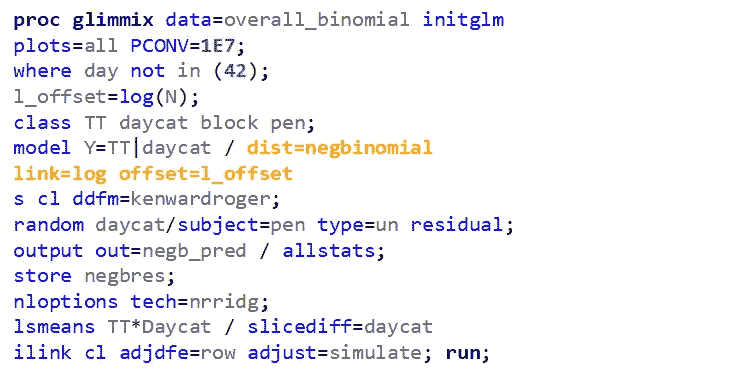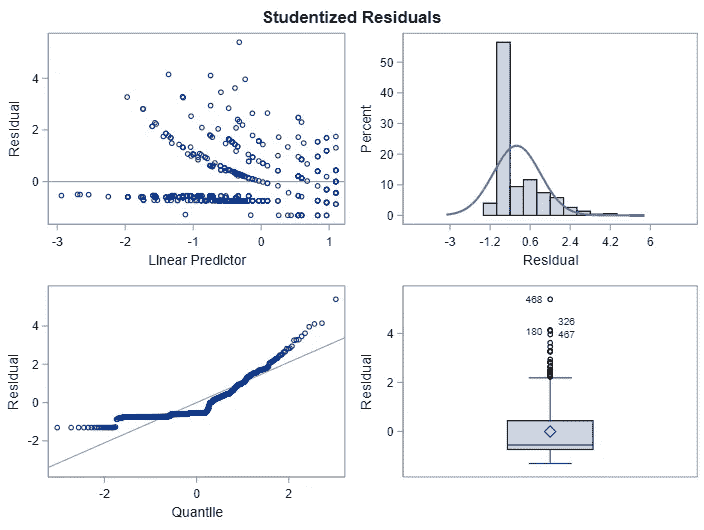

Analysis using a Negative Binomial Distribution. Although we must not expect Normality and homogeneity, the residuals do show quite some boundaries. So, we are using a model testing at boundary of the distribution.

Lets use a different dataset in which we know the data is more placed apart.

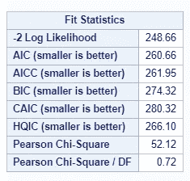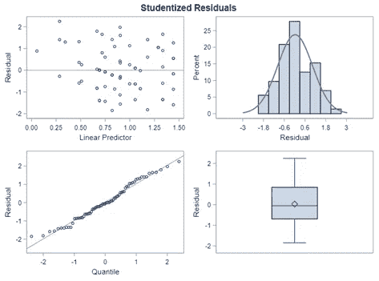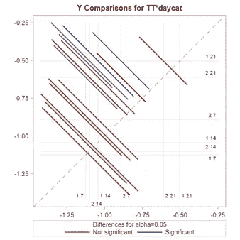

Here, we actually have underdispersion. Combined with the Residuals, I am pretty sure the data looks a lot like a Normal Distribution.

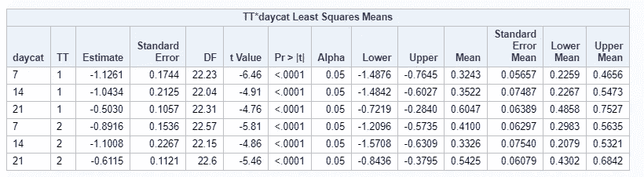

And the values. As you can see, the proportions are much higher which also explains why the residuals look so very nice. Data that shows proportions closer to 0.5 will look a lot like a Normal Distribution.

In summary, the Poisson distribution models count data. To analyze diarrhea using the Poisson distribution, you can use the dataset in the format used for the Binomial Distribution. Since the Poisson models a **比率**，你需要包括一个偏移变量，它是等式中的分母。使用泊松分布，你总是需要小心**过度分散。**泊松分布的一个很好的替代品是**负二项分布**