# 使用二元、二项式和贝塔分布分析 SAS 中的顺序数据。

> 原文：<https://pub.towardsai.net/analyzing-ordinal-data-in-sas-using-the-binary-binomial-and-beta-distribution-8efe5fe5af66?source=collection_archive---------4----------------------->

T 他的 will 帖子将建立在之前的帖子上——[一篇关于**PROC glim mix**T5 的介绍性帖子和一篇展示](https://medium.com/@marc.jacobs012/generalized-linear-mixed-models-in-sas-distributions-link-functions-scales-overdisperion-and-4b1c767bb89a)[如何使用序数和多项式分布分析序数数据](https://medium.com/@marc.jacobs012/analyzing-ordinal-data-in-sas-fe9d9d35a449)的帖子。这篇文章将通过分析同一个数据集来扩展那些文章，这个数据集是在不同时间对猪进行的腹泻评分。在这里，腹泻是主观测量使用顺序评分系统。

所以，让我们来看看二项式分布和它的连续对应物，贝塔分布。二元和二项式分布都处理离散比例，并将它们转换成概率/比例。下面你可以看到一个使用**累积概率分布的顺序模型的例子。**

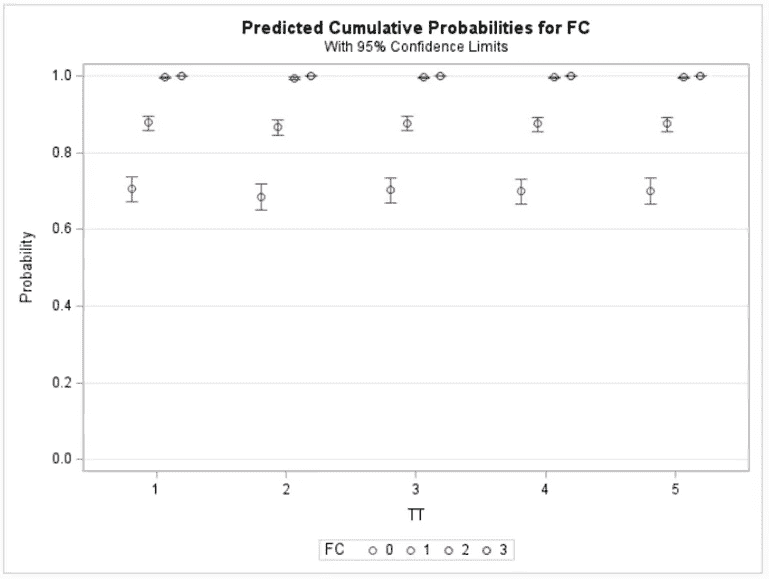

显示累积概率的概率图。

然而，有时不可能以有序的方式评估治疗的效果。在这里，分数 2 和 3 在总量表中所占的比例不到 15%。因此，将它们结合起来并比较分数可能是明智的——例如，将四个组聚合成两个组(0 & 1 对 2 & 3)。如果你这样做，你还需要具体说明什么是腹泻，因为你可以做 0 &1 对 2 & 3。或者，你可以做 0 对 1 & 2 & 3。统计数字不会帮助你做出这个决定，它必须来自内容知识。

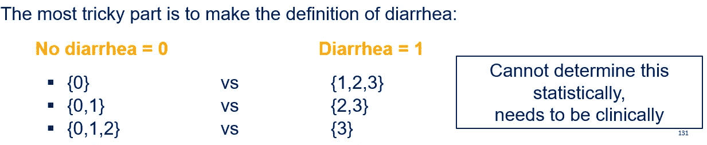

现在，如果你想分析一个二进制除法，你需要确定你是想把它作为一个**比例**还是作为一个**比率**来分析:

1.  比例=相同两个指标的比率→腹泻/粪便总量
2.  比率=两个不同指标的比率→腹泻/测得的总天数

就数据管理而言，需要使数据适合于通过二元或二项式分布进行分析。由于二元/二项式可以处理时间成分(不同于序数或多项分布)，我们希望创建一个可以适应这种分析的数据集。下面你可以看到最终的数据集，其中有每支笔的治疗、阻断、天数和临床评分。不再包括频率度量。

我需要数据 Feaces_2 来使用二元分布，并对每次治疗的实际分数建模。

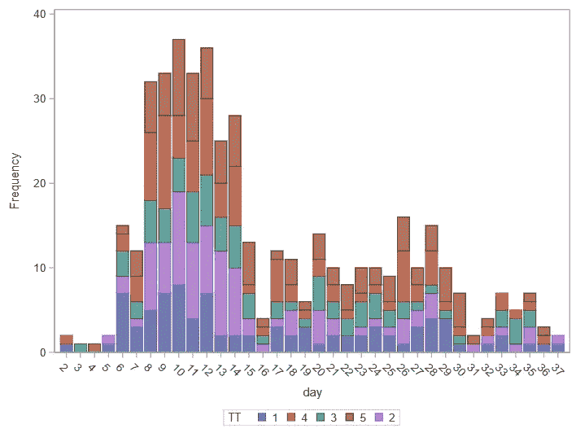

以及腹泻在时间上的分布。请记住，现在我们有一个二分法，这是更容易看数据。但是以知识为代价。

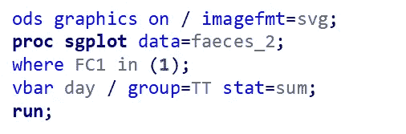

生成上述图的代码。

现在，让我们继续实际建模。正如我所说的，我将使用二进制发行版和 logit 链接。这与我在序数/多项式模型中使用的链接相同。这也意味着将使用优势比进行比较。

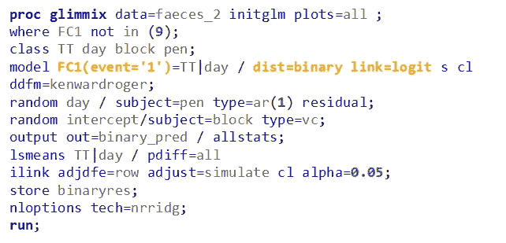

GLIMMIX 码——二进制分布。请注意，我必须指定一个事件分数。这里，腹泻的存在。

二进制发行版的代码没有运行这并不奇怪，因为它经常不运行。这是因为模型需要评估数据中的差异—通过在行之间查找。如果没有足够的方差，或者没有足够的数据，模型就不会收敛。不管怎样。

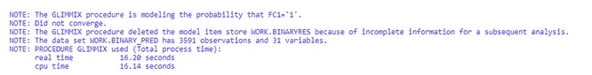

常见问题:不能与过多的笔数/天数相融合。比值 0 / 1 太大时不收敛(即 0 = 534；1=45).

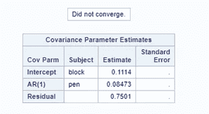

当某些东西不收敛时，你什么也得不到，这通常表现在估计方差的能力上。没有方差估计，你什么都没有。

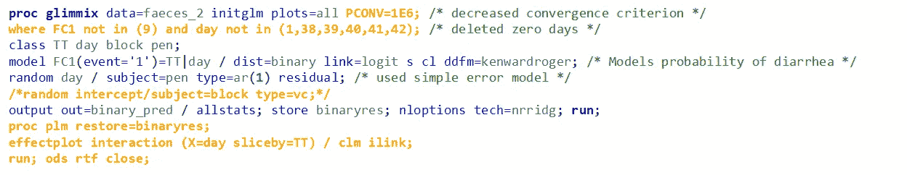

让我们通过简化模型、删除观察值和降低接受阈值来再试一次。

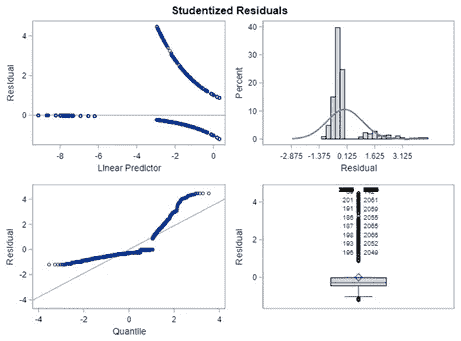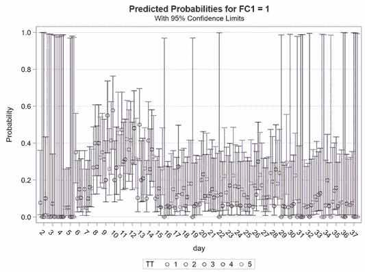

然后它运行，但不是你想要的结果。

因此，让我们在不同的数据集上尝试二进制分布。大多数时候，如果数据不具备所需的粒度，从模型的角度来看，您就无能为力了。

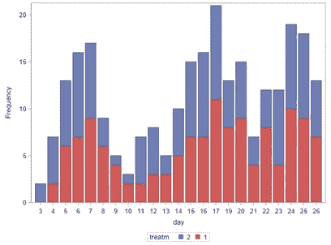

这应该是一个更有收获的数据集。

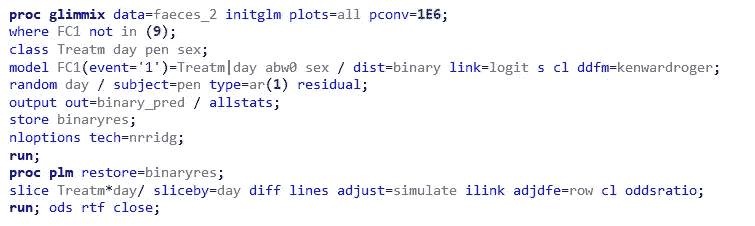

让我们再运行一次。如您所见，我在误差部分加入了一个协方差模型，使用一阶自回归来处理相关误差。

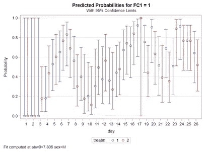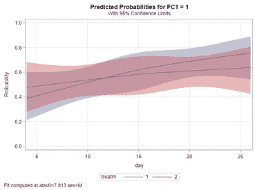

如果残差看起来很奇怪，那么放松，他们不会。使用二进制分布，您不能期望同质或正态误差。你应该期待的是误差遵循二进制分布，这意味着他们有一个分裂，较少出现在尾部，然后他们是分布的中间。

现在，让我们冒险从二元分布到二项分布。它们非常相似，除了在二项中 N=1，而在二项式中 N = N——你进行多个独立的试验来评估概率。二元分布通常被称为伯努利分布。

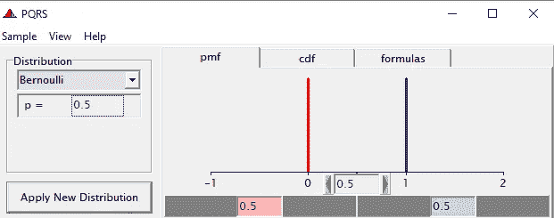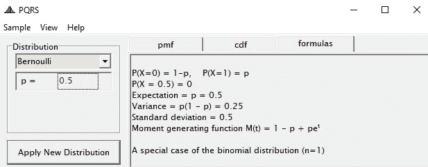

伯努利试验使用 p=0.5。因为这是一个单一的试验，p=0.5，结果 0 或 1 是同样可能的。

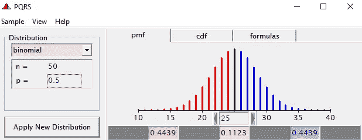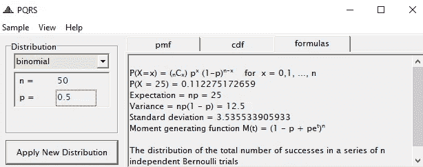

使用与伯努利例子中相同的 p 的二项式分布。这一次，我们进行了 50 次独立试验。我们得到一个很好的分布，看起来像正态分布。

为了从使用二进制(或伯努利分布)到使用二项式分布，我们需要改变数据集以适应 Y/N 必要性——给定游戏数量的获胜数量。当然，Y/N 本身已经是一个比例，因此是一个概率分布。

下面您可以看到从用于二元分布的数据集到用于二项式分布的数据集的转换。我仍在尝试跨时间建模，但这一次我必须在周级别聚合数据。这样会让模型更稳定。

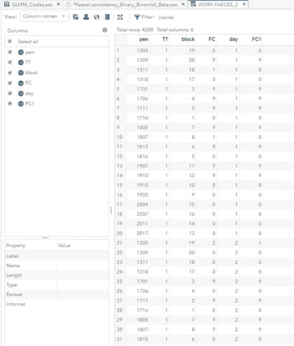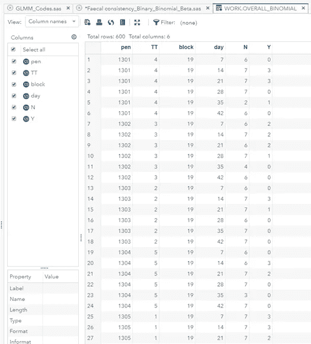

从二元到二项式建模。

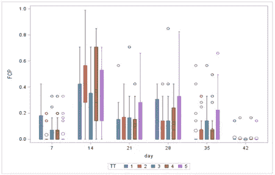

以及显示要建模的数据集的图。因为我们处理的是比例，所以存在边界(0 和 1 ),这些边界会使这类数据的建模变得非常具有挑战性。

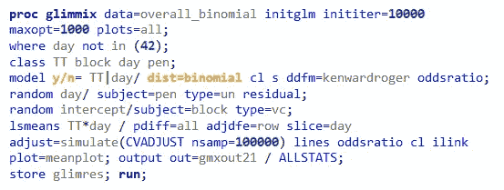

**PROC GLIMMIX** 代码。在 orange 中，我需要改变的是结果和分布的规格。我还为模型的误差部分包含了一个随机块和一个非结构化的协方差矩阵。因此，我会全力以赴。

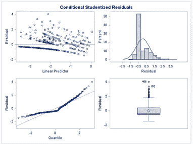

残差看起来并不方便——记住，这不是正态分布。正态分布误差的假设不再适用。同质性也是一样，因为我们现在有了自然边界。因此，最好是看看

**总之，在这个数据集中没有足够的变化来得到一个合适的模型，我检测到了很多边界值。此外，用次优饲料攻击动物，这意味着攻击不够强，不足以获得有价值的腹泻结果。换句话说，数据集不包含我需要的粒度级别。**

因此，让我们使用相同类型的建模在不同的数据集上进行尝试。下面你可以看到结果。还是那句话，不要太关注残差。即使他们现在看起来很‘正常’，你也不应该期望他们是。我们没有使用正态分布来模拟数据。

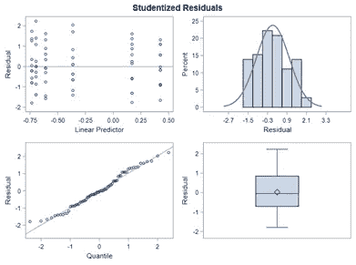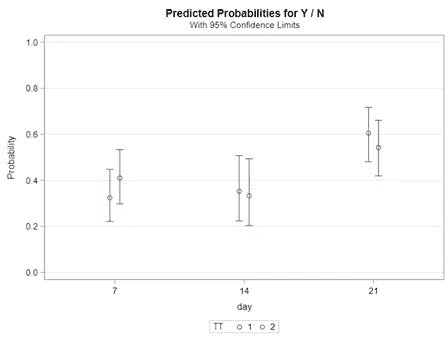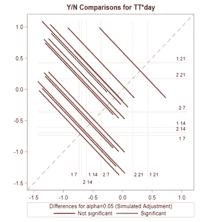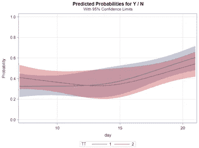

看起来好多了——模型有很多变化。左边和右边的图(不是中间的)显示了使用日作为虚拟变量或实际上将日建模为时间变量之间的差异。我总是发现正确的情节能提供更多的信息，尽管有些人可能会认为这不是审判的目的。这个我可以同意，但是这样的话审判只能用来讨论三个时间点。

现在，如果我不每周对旧数据集建模，而只是对其整体建模——42 周内腹泻的比例——会是什么样子？为此，我需要转换数据，直到得到右边的数据。

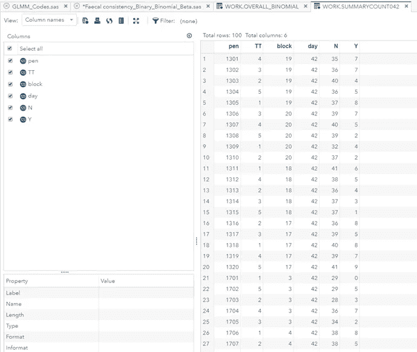

从星期到整体二进制建模。

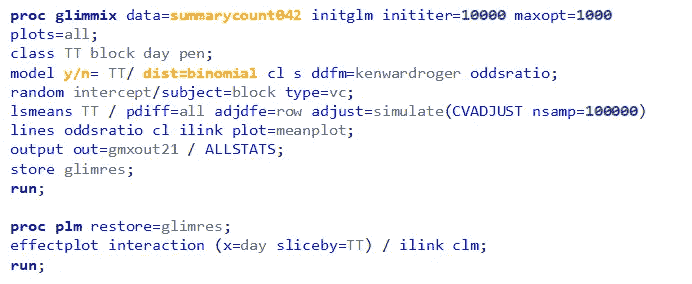

获取结果的代码。

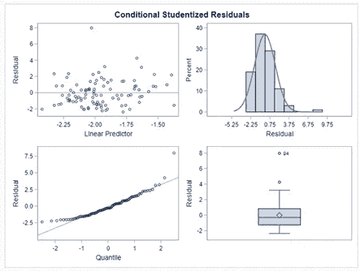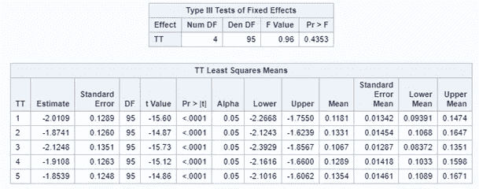

结果呢。 **TT 最小二乘均值**表中的均值是估计的概率。

因此，通过二元/二项式分布分析腹泻得分保证了指定哪些得分构成腹泻，哪些不构成腹泻的决定，它必须是二元的。二进制数据是最原始的是/否数据，最难分析。二项式数据是分子/分母形式的数据，通常给你一个更稳定的模型。以二元/二项式方式分析数据保证了数据集的转换。

让我们看看使用它的连续对应物——贝塔分布，我们能走多远。

使用贝塔分布来模拟腹泻意味着你正在进入连续比例的世界。下面，你可以看到一个贝塔分布的例子和它的两个参数——阿尔法和贝塔。你可以立即看到，阿尔法和贝塔可以分别插入，但他们仍然纠缠在一起。当你看均值和方差的公式时，这就变得很清楚了。

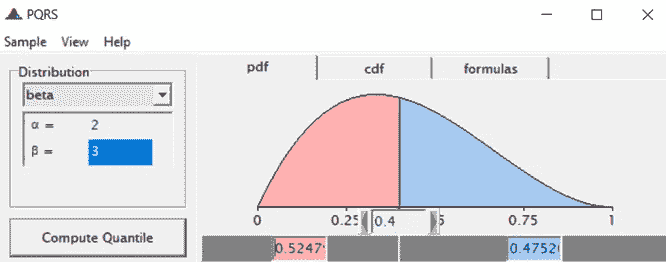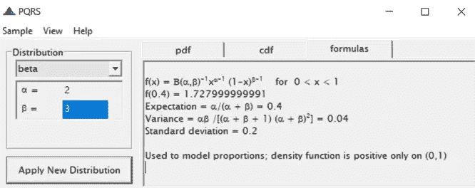

贝塔分布。

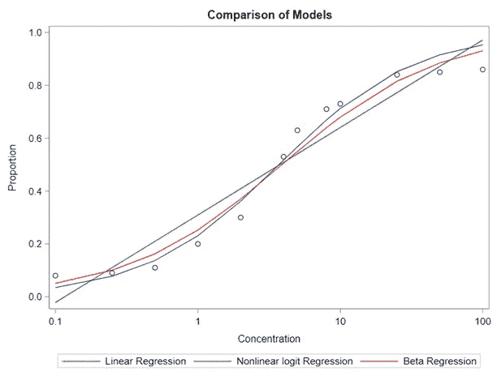

以及显示线性回归、Logit 回归和 Beta 回归的介绍性比较图。Beta 的好处在于它可以以连续的方式模拟比例。也就是说，你几乎可以把它当作正态分布，但是对于比例来说。

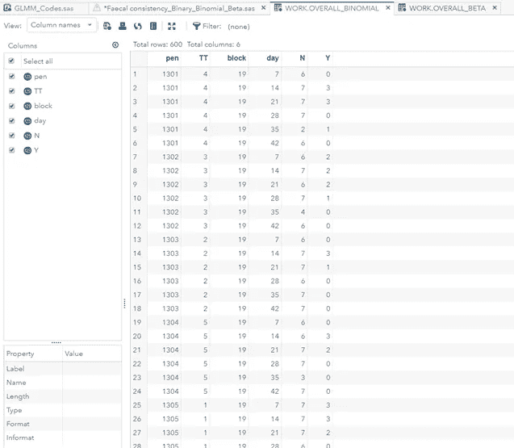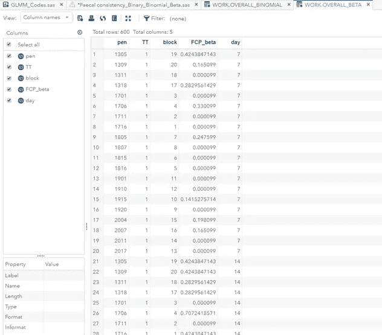

数据—从二项式到贝塔。这意味着我们必须在数据框架中实际包含这一比例。这是通过将 Y 除以 n 来实现的，需要注意的是，在 Beta 中，不允许值为 0 和 1。因此，如果你得到一个 0 或 1，你必须加上或减去一个很小的数字。比如 0.00001。这样，你就欺骗了算法，而实际上没有改变任何东西。

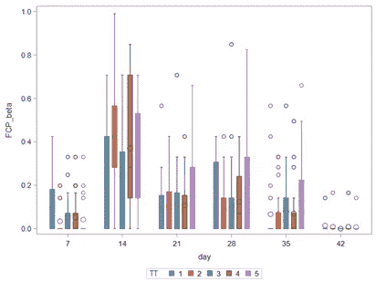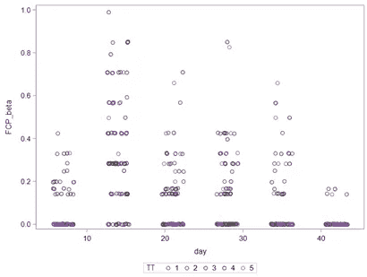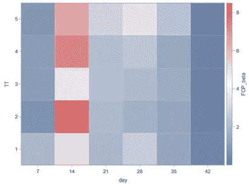

绘制不同天数和不同处理的比例。

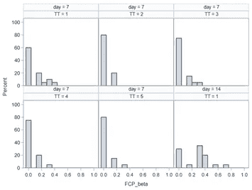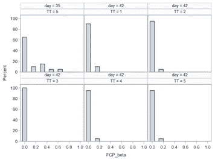

同上，但使用不同的图。这些图对预测收敛成功有很大帮助。并且，如果它不收敛，在某种程度上指示瓶颈可能在哪里。

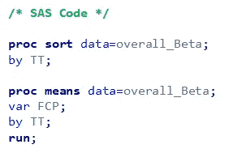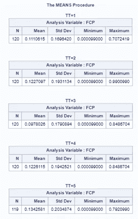

为了从数据中获得一些感觉，你可以询问原始平均值。平均值代表腹泻评分为 2 和 3 的笔的百分比

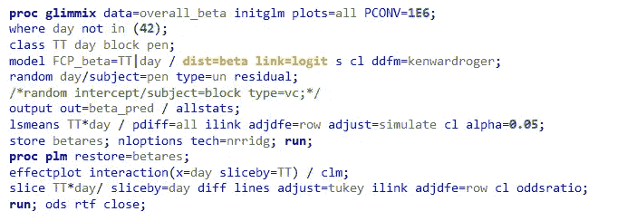

模拟数据的实际代码。

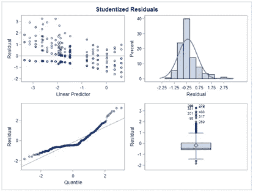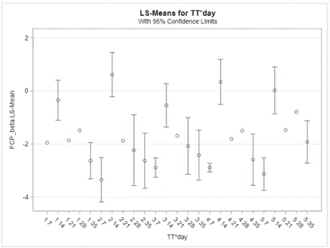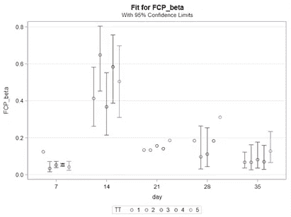

残差看起来不太好。因为我们是用贝塔系数建模，我希望残差更像正态分布。当然，适当残差的缺失很少反映在 LSMEANS 中。

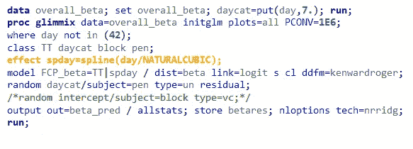

使用自然三次样条代替虚拟变量对时间建模。

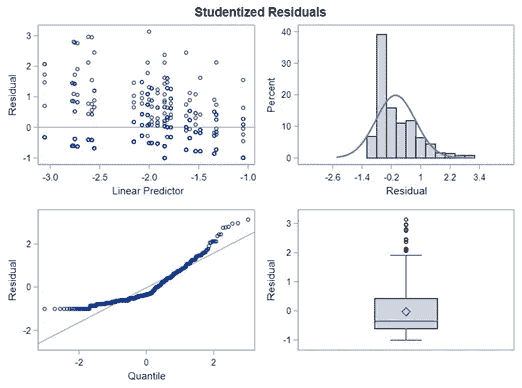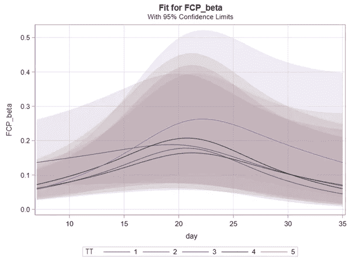

残差看起来更好，一个非常好的模型图在右边。请注意非常大的置信区间。

让我们再次使用不同的数据集，看看我们这次是否在使用测试版时更成功。

数据图表。

残差看起来很好，来自虚拟变量和样条的估计也很好。然而，大量的变化表明，治疗之间确实没有差异。噪音太大，甚至无法模拟斜坡。

总之，贝塔分布模拟比例，就像二元和二项式分布。与二元/二项式分布相比，贝塔分布在连续谱上模拟比例。要使用 beta 分布，数据集中需要有比例，并且任何比例都不能是 0 或 1。与其他分布相比，beta 分布最容易建模，也最容易理解。

希望你喜欢它！