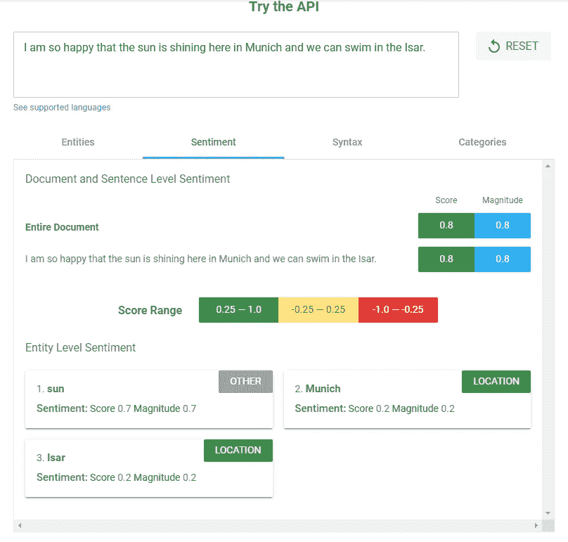
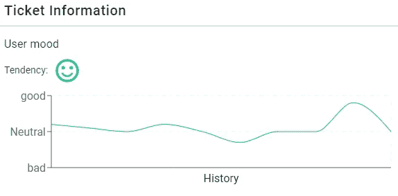
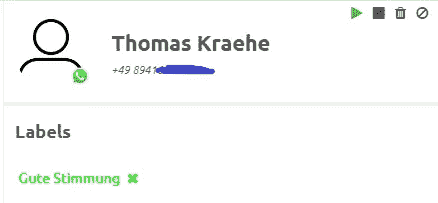
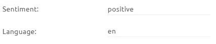
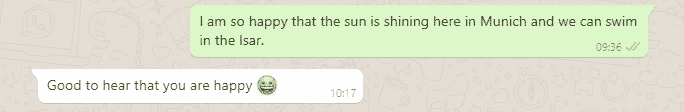

# 用谷歌云的自然语言 API 分析聊天信息的情绪

> 原文：<https://pub.towardsai.net/analyzing-the-mood-of-chat-messages-with-google-cloud-nlps-api-a8f5d6c6de76?source=collection_archive---------1----------------------->

## 使用谷歌云的机器学习作为服务| [面向 AI](https://towardsai.net)

在类似谷歌云的自然语言 API 这样的 NLP 服务的帮助下，分析一段文字的情绪是可能的。谷歌称这项功能为“情感分析”。让我们来探索这是如何工作的，以及如何将它用于您的聊天机器人或 CRM。

在开始开发之前，让我们快速浏览一下[试用工具](https://cloud.google.com/natural-language/)。您可以在文本字段中输入随机消息，然后单击“分析”。在我的例子中，我输入了信息*“我很高兴慕尼黑这里阳光明媚，我们可以在伊萨尔河游泳。”*。

如您所见，该服务检测到了消息中的各种内容，例如，像慕尼黑广场这样的实体。但是我们对情感分析感兴趣，所以请选择“情感”选项卡。



情感分析的结果显示我提供的文本的得分为 0.8，幅度为 0.8。正如你在配色方案中看到的，介于 0.25 和 1.0 之间的分数代表积极情绪，介于-0.25 和 0.25 之间的分数代表中性情绪，介于-0.25 和-1.0 之间的分数代表消极情绪。量级告诉你检测到的情绪有多强烈。该值可以从 0.0 到无穷大。

令人印象深刻，不是吗？那么，我们如何利用这个特性呢？在我的例子中，我正在分析来自 WhatsApp 用户的聊天信息。例如，如果你正在通过 WhatsApp Business API 提供客户服务，并想知道客户的心情如何，这就很有用。在这里，您可以看到我们如何在 [MessengerPeople](https://www.messengerpeople.com) 使用它:



所以，如果你现在很激动，我将向你展示如何实现这个特性。

# 先决条件

当然，你需要一个谷歌云账户来使用这个 API。如果你已经有了，你可以直接跳到 GCP NLP 文档的[快速入门](https://cloud.google.com/natural-language/docs/quickstart)部分。NLP API 的基础在这里解释[。](https://cloud.google.com/natural-language/docs/basics)

现在您必须创建一个 GCP 控制台项目，并为您的[服务帐户](https://console.cloud.google.com/iam-admin/serviceaccounts)添加一个密钥。然后，您必须将该键作为 JSON 文件存储在您的系统中，并将该键的路径作为环境变量添加到您的系统中，如下所示:

```
export GOOGLE_APPLICATION_CREDENTIALS="/home/user/Downloads/service-account-file.json"
```

现在，您基本上已经准备好调用 NLP API 了。喜欢的话可以先试试[命令行版本](https://cloud.google.com/natural-language/docs/quickstart#quickstart-analyze-entities-cli)。然而，在我的例子中，我将向您展示如何使用 [PHP 客户端库](https://cloud.google.com/natural-language/docs/quickstart-client-libraries#client-libraries-install-php)。

# 真实世界的用例

好了，开始编码吧！请注意，我只给你举几个简单的例子。这不是生产就绪的代码！

首先，在项目中安装 PHP 客户端库:

```
composer require google/cloud
```

然后加载库:

```
use Google\Cloud\Language\LanguageClient;
```

现在，我可以在自己的函数中使用客户端的方法:

```
public function sendToGoogleCloud($text)
{
    // Your Google Cloud Platform project ID
    $projectId = 'xxxxxxxxx';
    $keyfilepath = "/var/www/xxxxxxxx.json";

    // Instantiates a client
    $language = new LanguageClient([
        'projectId' => $projectId,
        'keyFilePath' => $keyfilepath
    ]);

    // Detects the sentiment of the text
    $annotation = $language->analyzeSentiment($text);
    $sentiment = $annotation->sentiment();
    $language = $annotation->language();

    $returnarray = [];
    array_push($returnarray, $sentiment);
    array_push($returnarray, $language);

    return $returnarray;

}
```

在我的测试中，我遇到了环境变量的[问题，这就是为什么我使用另一种方法来提供密钥作为参数。情绪分析的响应如下所示:](https://stackoverflow.com/questions/52776236/where-do-i-put-my-api-key-in-google-cloud-php-language-client)

```
{
"documentSentiment": {
    "magnitude": 0.8,
    "score": 0.8
  },
  "language": "en",
  "sentences": [
    {
        "sentiment": {
        "magnitude": 0.8,
        "score": 0.8
      },
      "text": {
        "beginOffset": 0,
        "content": "I am so happy that the sun is shining here in Munich and we can swim in the Isar."
      }
    }
  ]
}
```

正如你所看到的，NLP API 给你一个分数，一个量级，以及检测到的文本语言。这就是为什么我们也可以利用语言。

那么我们能用这些信息做什么呢？嗯，根据检测到的情绪，我们可以在系统中设置标签，根据情绪(和语言)做出相应的反应，或者在用户的个人资料中设置一些属性。

```
if ($sentiment_score > 0.25) {
    $sentiment = 'positive';
    $addlabel = [3345];
    $removelabel = [3344, 3346];
} elseif (($sentiment_score >= -0.25) && ($sentiment_score <= 0.25)) {
    $sentiment = 'neutral';
    $addlabel = [3346];
    $removelabel = [3344, 3345];
} elseif ($sentiment_score < -0.25) {
    $sentiment = 'negative';
    $addlabel = [3344];
    $removelabel = [3345, 3346];
} else {
    $sentiment = 'neutral';
    $addlabel = [3346];
    $removelabel = [3344, 3345];
}

$customfields = [
    'customfields' => [
        'sentiment_score' => $sentiment_score,
        'sentiment_magnitude' => $sentiment_magnitude,
        'sentiment' => $sentiment,
        'language' => $sentiment_language
    ],
    'addlabel' => $addlabel,
    'removelabel' => $removelabel
];
```

结果看起来像这样:



我设置了标签“Gute Stimmung ”,这是德语中“好心情”的意思，我将用户属性“情绪”设置为“积极”,将“语言”设置为“en”。

当然，我们也可以根据心情发送对聊天消息的响应。所以，我们就为这个加个调用吧。

```
if ($sentiment_score > 0.25) {
    $responseText = "Good to hear that you are happy 😀";
    $this->sendChatResponse($msg['usernumber'], $responseText);
}
```



我希望您对 NLP API 可能带来的巨大成就有了一个很好的印象。最后但并非最不重要的一点是:当然也有其他供应商提供类似的产品，如微软 Azure、IBM Watson 或 AWS。到目前为止，我还不知道哪个服务返回的结果最好。

探索愉快！