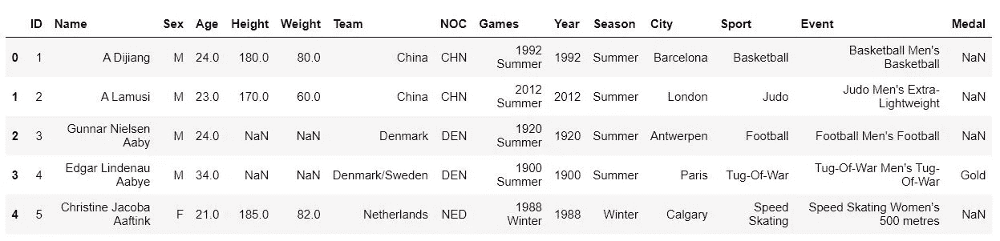
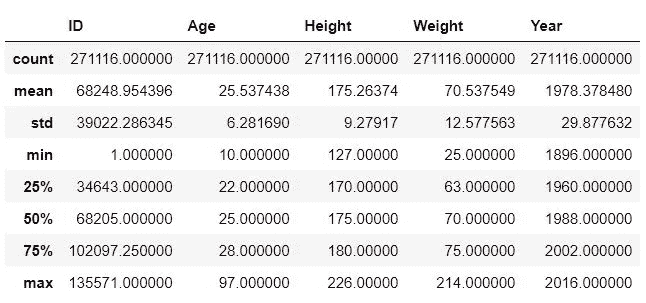
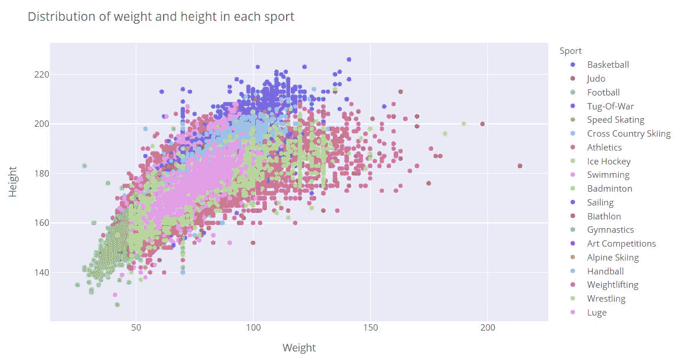
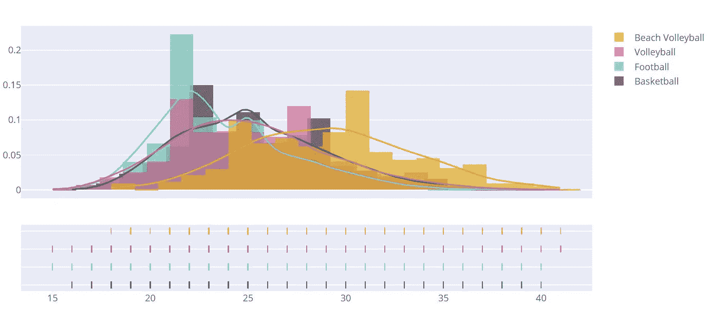
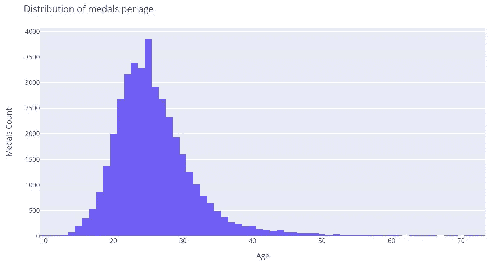
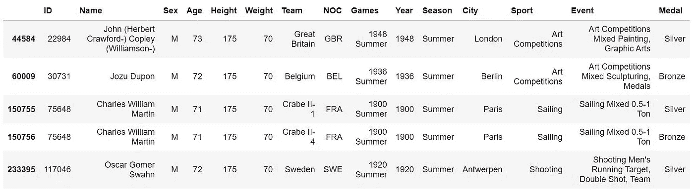
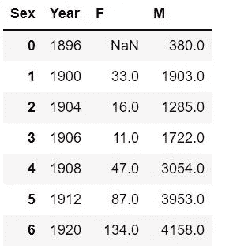
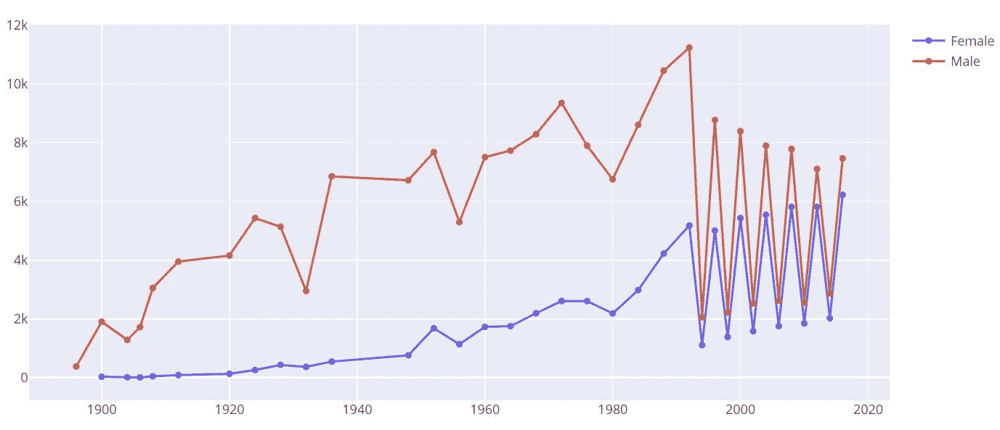
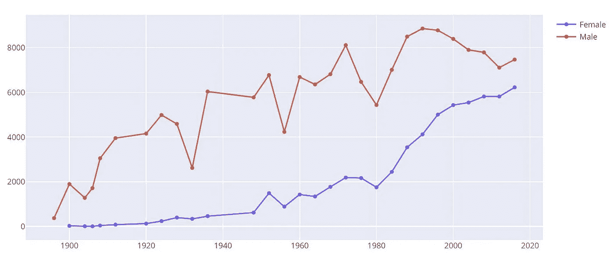

# 奥运会分析

> 原文：<https://pub.towardsai.net/analyzing-the-olympic-games-13b6e96cb3fe?source=collection_archive---------3----------------------->

## [数据分析](https://towardsai.net/p/category/data-analysis)

## 妇女的参与正在增加


照片由[龙之介·菊野](https://unsplash.com/@ryunosuke_kikuno?utm_source=medium&utm_medium=referral)在 [Unsplash](https://unsplash.com?utm_source=medium&utm_medium=referral) 上拍摄

我总是喜欢观看奥运会，观看每项运动中最优秀的人相互竞争对我来说是鼓舞人心的，让我想知道如果我从事排球(我目前最喜欢的运动)而不是软件工程，我的生活会是什么样子。

因为事实并非如此，我坚持软件工程，我们今天在这里用一个包含 120 年比赛的数据集来问一些关于奥运会的问题。

请注意，我将使用 python，主要是以下包——pandas、NumPy、plotly。所以如果你想弄乱我将要分享的代码，确保你已经安装了这些包。

你可以从 [Kaggle](https://www.kaggle.com/heesoo37/120-years-of-olympic-history-athletes-and-results) 下载我将使用的数据集。

# 数据探索

在我们开始对我们的数据提出问题之前，我们必须了解我们拥有什么样的数据。

```
import pandas as pd
import numpy as np
import plotly.express as px
import plotly.graph_objects as go
import plotly.figure_factory as ffolympic_df = pd.read_csv('athlete_events.csv')
```

为了更好地理解数据帧，我总是在数据帧上使用的前两个命令是`head`和`describe`。

```
olympic_df.head()
```



```
olympic_df.describe()
```



仅从这一点，我们就可以了解到，奥运会参赛选手平均年龄在 25 岁左右，平均身高 175cm，体重 70kg。

我们还可以看到一些有趣的事实，比如最小的奥运参与者是 10 岁，最大的是 97 岁

当我在做这个的时候，我感兴趣的是查看每项运动的最小、最大、平均统计数据，而不是所有这些数据的组合，以获得更详细的数据。

```
sports_df_grouped = olympic_df.groupby("Sport")
sports_df_agg = sports_df_grouped[["Age", "Height",
"Weight"]].agg([np.max, np.min, np.mean]).reset_index()
```


看看这张表，我们可以看到航空并不是一项非常受欢迎的运动——只有一名来自瑞士的参与者(我实际上是通过谷歌来核实的)。

让我感到惊讶的是弓箭手的最大重量与拔河参与者的最大重量相比，但我们可以看到平均来说这确实有意义。

# 问问题

在简单介绍完数据之后，让我们试着想出一些有趣的问题来回答。

## 身高、体重和年龄在不同的运动中是如何分布的？

要回答这个问题，我们可以尝试几种方法。

第一个是绘制所有运动的散点图

```
fig = px.scatter(olympic_df, x="Weight", y="Height", color="Sport")
fig.update_layout(title="Distribution of weight and height in each sport")
fig.show()
```



在上面的代码中，我们可以将`size="Age"`添加到分散函数参数中，以便查看年龄是如何分布的，但是我认为这个图中的信息太多了。

在第二种方法中，我们可以挑选一项或几项运动，并调查它们的体重、身高或年龄分布。

我决定考虑 4 项运动，看看他们的年龄分布，但你可以随意调整。

在接下来的图中，我们需要将我选择的这 4 项运动过滤到 4 个不同的数据框中

```
basketball_df = olympic_df[olympic_df["Sport"] == "Basketball"]
football_df = olympic_df[olympic_df["Sport"] == "Football"]
volleyball_df = olympic_df[olympic_df["Sport"] == "Volleyball"]
beach_volleyball_df = olympic_df[olympic_df["Sport"] == "Beach Volleyball"]
```

现在，因为我们想显示年龄的分布，让我们得到每项运动的年龄列表

```
basketball_age = list(basketball_df["Age"])
football_age = list(football_df["Age"])
volleyball_age = list(volleyball_df["Age"])
beach_volleyball_age = list(beach_volleyball_df["Age"])
```

最后，让我们绘制分布图

```
hist_age_data = [basketball_age, football_age, volleyball_age, beach_volleyball_age]labels = ['Basketball', 'Football', 'Volleyball', 'Beach Volleyball']colors = ['#393E46', '#2BCDC1', '#F66095', 'orange']fig = ff.create_distplot(hist_age_data, labels, colors=colors, bin_size=1.2)fig.show()
```



## 70 岁拿奖牌的可能性有多大？

为了回答这个问题，我们将首先筛选获得任何奖牌的参与者。

```
medals = olympic_df.dropna(subset=["Medal"])
```

然后我们可以创建一个简单的直方图

```
fig = px.histogram(medals, x="Age")
fig.update_layout(title="Distribution of medals per age", yaxis_title="Medals Count")
fig.show()
```



看着柱状图，我很惊讶有几个 70 岁的人真的赢得了奖牌，我很好奇想知道是什么运动，假设你也是，这是我发现的

```
medals_above_70 = medals[medals["Age"] > 70]
```



让我们试着更具体一些，画出每种奖牌的分布图。
正如我们之前所做的，我们将获得铜牌、银牌和金牌得主的年龄，并绘制分布图。

```
bronze_medals = list(medals[medals["Medal"] == 'Bronze']["Age"])
silver_medals = list(medals[medals["Medal"] == 'Silver']["Age"])
gold_medals = list(medals[medals["Medal"] == 'Gold']["Age"])fig = ff.create_distplot([bronze_medals, silver_medals, gold_medals],
                         ['Bronze', 'Silver', 'Gold'],
                         colors=['#CD7F32', '#C0C0C0', '#FFD700'],
                         bin_size=5)
fig.show()
```


正如我们所见，不管奖牌多少，大多数奖牌获得者都在 25 岁左右。

## 这些年来，男女参与率如何变化？

要回答这个问题，首先让我们创建一个数据框架，其中每一行都包含年份、女性参与者的数量和男性参与者的数量。

```
accumulate_M_F_df = olympic_df.groupby(['Sex', 'Year']).size().reset_index().pivot(columns='Sex', index='Year', values=0).reset_index()
```



现在让我们绘制这些数据

```
years = list(accumulate_M_F_df["Year"])
female_participation = list(accumulate_M_F_df["F"])
male_participation = list(accumulate_M_F_df["M"])fig = make_subplots()
fig.add_trace(go.Scatter(x=years, y=female_participation, mode="lines+markers", name='Female'))
fig.add_trace(go.Scatter(x=years, y=male_participation, mode="lines+markers", name="Male"))fig.show()
```



激增的原因是参加冬奥会的运动员越来越少。
为了看清楚趋势，我们可以过滤掉冬奥会。

我们首先必须创建一个只包含夏季奥运会的数据框架

```
summer_olympic_df = olympic_df[olympic_df['Season'] == 'Summer']
```

然后重新定义`accumulate_M_F_df`

```
accumulate_M_F_df = summer_olympic_df.groupby(['Sex', 'Year']).size().reset_index().pivot(columns='Sex', index='Year', values=0).reset_index()
```

然后重复相同的代码行来绘制图表



虽然还有很多问题要回答，但我想现在问这些问题会让你走自己的路。

如果你喜欢这种格式，请告诉我。我很乐意一起探索更多的数据集。

在你点击离开之前，我想让你看看我的[博客](https://codingkaiser.blog/)——在那里你可以找到更多关于这个话题和其他话题的信息。