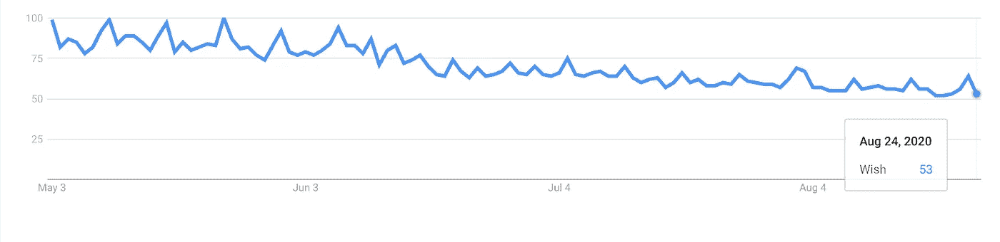
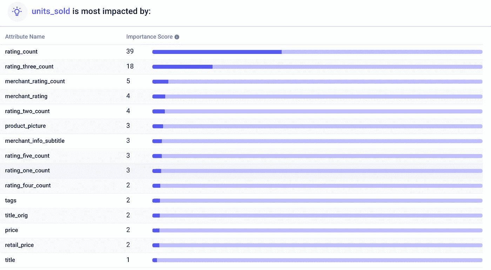

# 分析 Wish 电子商务数据[动手操作]

> 原文：<https://pub.towardsai.net/analyzing-wish-e-commerce-data-hands-on-f61c8d332abf?source=collection_archive---------4----------------------->

## [数据分析](https://towardsai.net/p/category/data-analysis)

## 循序渐进的指南。🚶

[马克·柯尼希](https://unsplash.com/@markkoenig?utm_source=medium&utm_medium=referral)在 [Unsplash](https://unsplash.com?utm_source=medium&utm_medium=referral) 上的照片

我有很多从事电子商务的朋友——一些人看到销售额大幅下降，而另一些人看到的是前所未有的流量。

我想在数据中找到见解，以帮助任何拥有电子商务商店的人，所以我分析了超过 1500 件 Wish 产品的 Kaggle 数据集。

# 数据

在封锁期间，许多电子商务商店的流量激增，但在“新常态”下，这种飙升不会持续很久。自 5 月以来，谷歌搜索电子商务公司 Wish 的次数大幅下降。

我将数据——包括产品列表、评分和销售业绩——上传到 Apteo，以便确定是什么推动了销售。

# 总评分推动销售

我们可以看到，到目前为止，销售的最大驱动力(一个名为`units_sold`的专栏)是产品的评级数量。据 LinkedIn 报道，在线评论可以将销售额提高 4 倍。值得注意的是，总评分数*远比好评分数*或差评分数*重要。*

如果你没有评级，访问者就没有任何依据，也不会信任房源。此外，如果没有评论，任何电子商务商店都不会显著展示或推荐你的产品。

三星级的数量是销售中第二重要的属性。这很可能是因为三星级评价可能会在一个方向或另一个方向上把线索推到边缘。

用户可能会忽略 1 星和 5 星评论，因为这些评论通常是由竞争对手或产品所有者伪造的，或者分别由非常消极或积极偏见的人留下的。

# 信任

所有的关键属性都有一个共同点:信任。推动销售的一切，从产品评级到商家评级，都围绕着获得潜在客户的信任。

产品图片、价格、产品标题和标签——虽然都有一定作用——远没有那么重要。获奖产品只是获得大量好评(不仅仅是 5 星)。

电商店铺意识到这一点，围绕好评形成良性循环。具有良好评价的产品在其推荐引擎中得到提升，从而获得更多用户，这些用户在收到推荐后更有可能留下积极的评价。

另一方面，一个没有好评的产品必须努力工作——通过创建一个很好的列表——才能引起注意。

这个系统全面激励伟大的产品。

# 噱头不管用

其他销售策略，如`urgency_text`、`uses_ad_boosts`和`badges_count`，对销售几乎没有影响。你不能靠“广告”来获得成功，像“限时”这样的销售噱头只能让你到此为止。

基本上没办法骗过系统。即使是虚假的正面评价也可以通过[复杂的人工智能技术](https://hackernoon.com/how-ai-helps-in-distinguishing-fake-reviews-from-genuine-ones-37292f7767e)检测出来，或者只是一个有着细心眼睛的消费者。

# 预测销售额

一个典型的电子商务零售商有数百到数千个产品 SKU。管理库存、掌握趋势和预测需求很快就会变得势不可挡。

因此，能够预测任何产品的销售——或者对所有产品进行批量预测——可以节省大量精力。

通过选择`units_sold`作为我们的 KPI，Apteo 会在后台自动创建一个机器学习模型，以便我们可以插入一个产品来生成销售预测。

# 摘要

信任是销售的最大驱动力，数据也支持这一点。正因为如此，任何“欺骗”系统的努力都只会适得其反。电子商务商店建立推荐系统，以延续值得信赖的产品，并迫使没有好评的零售商努力获得关注。