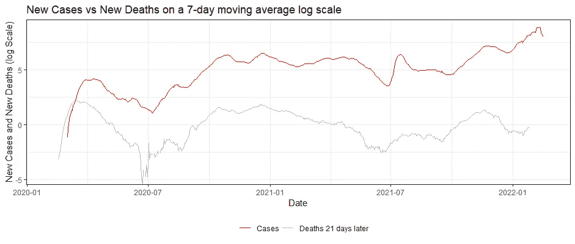
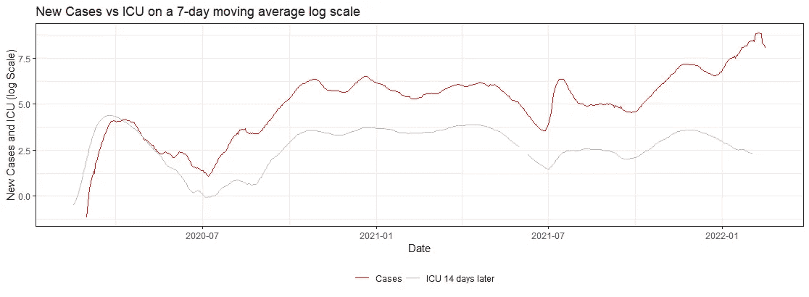
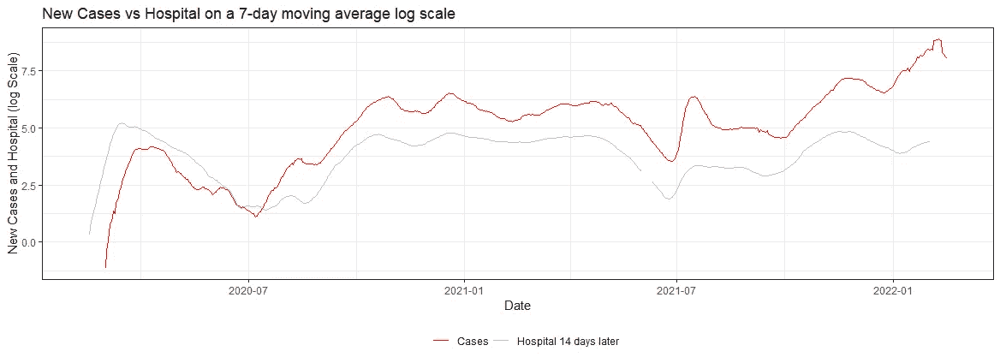
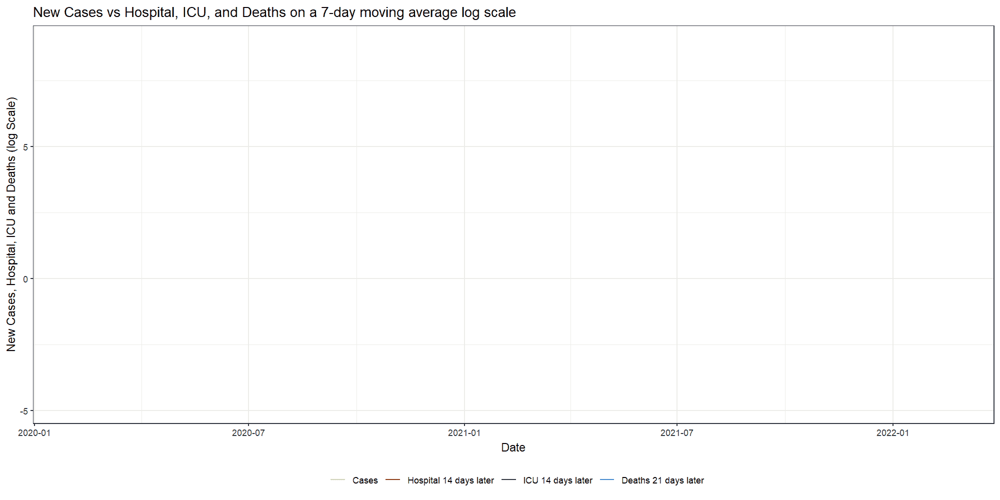
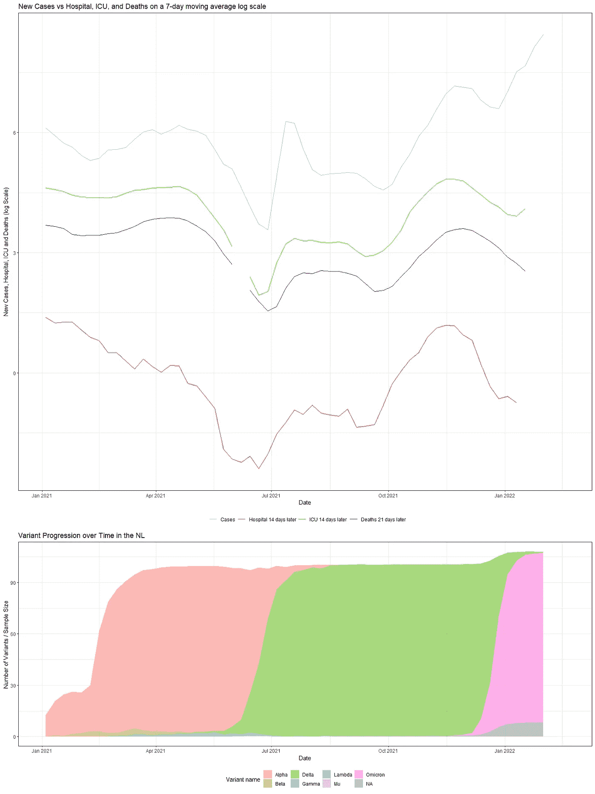

# 随着时间的推移，动画新冠肺炎的进展和变化

> 原文：<https://pub.towardsai.net/animating-covid-19-progress-and-variants-over-time-2250b9ef1a87?source=collection_archive---------2----------------------->

## [数据可视化](https://towardsai.net/p/category/data-visualization)

## 使用 R 和 GGanimate

我喜欢 GGPlot 的 GGanimate 功能，它允许你为你正在制作的任何情节添加第四维度。因此，这不是我归因于使用 r 构建 gif 的第一个[帖子](https://medium.com/mlearning-ai/building-animated-graphs-in-r-dcacf0be3255)。但是，当一些事情很有趣时，你倾向于重复它。所以我们长话短说吧。

```
rm(list = ls())
library(tidyverse)
library(readr)
library(ggthemes)
library(lubridate)
library(zoo)
library(gganimate)
library(cowplot)
```

我从 OWID 下载了 Covid 数据，还从荷兰国家公共卫生和环境研究所下载了一些数据。我之前在 [LinkedIN](https://www.linkedin.com/pulse/omikron-tijd-om-oude-modellen-te-herzien-dr-marc-jacobs) 上发布过这个特别的技术文章。

```
getwd()
data_folder <- file.path("C:/Covid/")
url <- "[https://covid.ourworldindata.org/data/owid-covid-data.csv](https://covid.ourworldindata.org/data/owid-covid-data.csv)"
name <- "owid-covid-data.csv"
download.file(url = url, destfile = paste0(data_folder,name))
setwd(data_folder)
Covidowid_covid_data <- read_csv(paste0(data_folder,name))data_folder <- file.path("C:/Covid/")
url <- "[https://data.rivm.nl/covid-19/COVID-19_varianten.csv](https://data.rivm.nl/covid-19/COVID-19_varianten.csv)"
name <- "COVID-19_varianten.csv"
download.file(url = url, destfile = paste0(data_folder,name))
setwd(data_folder)
variants  <- read_delim(paste0(data_folder,name),
                        delim = ";", escape_double = FALSE, trim_ws = TRUE)
```

然后，我转换数据来模仿《纽约时报》的文章，该文章指出 Omikron 可能有一些潜在的威胁。所以我所做的是通过使用移动平均数，对数值和滞后来联系感染，住院和死亡。

```
df<-Covidowid_covid_data
countries <- c(unique(df_owid$iso_code))
dfNLD <- df%>%
  dplyr::filter(iso_code == "NLD")%>%
  dplyr::select(date,iso_code,date,new_cases_per_million, new_deaths_per_million)%>%
  dplyr::mutate(cases_07da       = zoo::rollmean(new_cases_per_million, k = 7, fill = NA),
                deaths_07da      = zoo::rollmean(new_deaths_per_million, k = 7, fill = NA),
                deathdate_21plus = date - 21)
head(dfNLD)
ggplot(dfNLD)+
  geom_line(aes(x=date, y=log(cases_07da), colour="New Cases"))+
  geom_line(aes(x=deathdate_21plus, y=log(deaths_07da), colour="New Deaths"))+
  scale_colour_manual(name="",
                      values=c('red', 'grey'), 
                      labels = c("Cases", "Deaths 21 days later"))+
  theme_bw()+
  theme(legend.position="bottom")+
  labs(x="Date", 
        y="New Cases and New Deaths (log Scale)", 
        title="New Cases vs New Deaths on a 7-day moving average log scale")
```



```
dfNLD <- df%>%
  dplyr::filter(iso_code == "NLD")%>%
  dplyr::select(date,iso_code,date,new_cases_per_million, icu_patients_per_million)%>%
  dplyr::mutate(cases_07da       = zoo::rollmean(new_cases_per_million, k = 7, fill = NA),
                ICU_07da      = zoo::rollmean(icu_patients_per_million, k = 7, fill = NA),
                ICUdate_14plus = date - 14)
ggplot(dfNLD)+
  geom_line(aes(x=date, y=log(cases_07da), colour="New Cases"))+
  geom_line(aes(x=ICUdate_14plus , y=log(ICU_07da), colour="New ICU"))+
  scale_colour_manual(name="",
                      values=c('red', 'grey'), 
                      labels = c("Cases", "ICU 14 days later"))+
  theme_bw()+
  theme(legend.position="bottom")+
  labs(x="Date", 
       y="New Cases and ICU (log Scale)", 
       title="New Cases vs ICU on a 7-day moving average log scale")
```



```
dfNLD <- df%>%
  dplyr::filter(iso_code == "NLD")%>%
  dplyr::select(date,iso_code,date,new_cases_per_million, hosp_patients_per_million)%>%
  dplyr::mutate(cases_07da       = zoo::rollmean(new_cases_per_million, k = 7, fill = NA),
                hosp_07da      = zoo::rollmean(hosp_patients_per_million, k = 7, fill = NA),
                HOSPdate_14plus = date - 14)
ggplot(dfNLD)+
  geom_line(aes(x=date, y=log(cases_07da), colour="New Cases"))+
  geom_line(aes(x=HOSPdate_14plus , y=log(hosp_07da), colour="New Hospital"))+
  scale_colour_manual(name="",
                      values=c('red', 'grey'), 
                      labels = c("Cases", "Hospital 14 days later"))+
  theme_bw()+
  theme(legend.position="bottom")+
  labs(x="Date", 
       y="New Cases and Hospital (log Scale)", 
       title="New Cases vs Hospital on a 7-day moving average log scale")
```



```
dfNLD <- df%>%
  dplyr::filter(iso_code == "NLD")%>%
  dplyr::select(date,iso_code,date,new_cases_per_million, hosp_patients_per_million,icu_patients_per_million,new_deaths_per_million)%>%
  dplyr::mutate(cases_07da       = zoo::rollmean(new_cases_per_million, k = 7, fill = NA),
                hosp_07da        = zoo::rollmean(hosp_patients_per_million, k = 7, fill = NA),
                HOSPdate_14plus  = date - 14,
                deaths_07da      = zoo::rollmean(new_deaths_per_million, k = 7, fill = NA),
                deathdate_21plus = date - 21,
                ICU_07da         = zoo::rollmean(icu_patients_per_million, k = 7, fill = NA),
                ICUdate_14plus   = date - 14)
ggplot(dfNLD)+
  geom_line(aes(x=date, y=log(cases_07da), colour="New Cases"))+
  geom_line(aes(x=HOSPdate_14plus , y=log(hosp_07da), colour="New Hosp"))+
  geom_line(aes(x=ICUdate_14plus , y=log(ICU_07da), colour="New ICU"))+
  geom_line(aes(x=deathdate_21plus, y=log(deaths_07da), colour="New Deaths"))+
  scale_colour_manual(name="",
                      values=c('grey', 'red','green','blue'), 
                      labels = c("Cases", "Hospital 14 days later", "ICU 14 days later","Deaths 21 days later"))+
  theme_bw()+
  theme(legend.position="bottom")+
  labs(x="Date", 
       y="New Cases, Hospital, ICU and Deaths (log Scale)", 
       title="New Cases vs Hospital, ICU, and Deaths on a 7-day moving average log scale")
```


```
knitr::opts_chunk$set(fig.width=unit(25,"cm"), fig.height=unit(11,"cm"))
dfNLD<-df%>%
  dplyr::filter(iso_code == "NLD")%>%
  dplyr::select(date,iso_code,date,new_cases_per_million, hosp_patients_per_million,icu_patients_per_million,new_deaths_per_million)%>%
  dplyr::mutate(cases_07da       = zoo::rollmean(new_cases_per_million, k = 7, fill = NA),
                hosp_07da        = zoo::rollmean(hosp_patients_per_million, k = 7, fill = NA),
                HOSPdate_14plus  = date - 14,
                deaths_07da      = zoo::rollmean(new_deaths_per_million, k = 7, fill = NA),
                deathdate_21plus = date - 21,
                ICU_07da         = zoo::rollmean(icu_patients_per_million, k = 7, fill = NA),
                ICUdate_14plus   = date - 14)
my.animation<-ggplot(dfNLD)+
  geom_line(aes(x=date, y=log(cases_07da), colour="New Cases"))+
  geom_line(aes(x=HOSPdate_14plus , y=log(hosp_07da), colour="New Hosp"))+
  geom_line(aes(x=ICUdate_14plus , y=log(ICU_07da), colour="New ICU"))+
  geom_line(aes(x=deathdate_21plus, y=log(deaths_07da), colour="New Deaths"))+
  scale_colour_manual(name="",
                      values=c('grey', 'red','green','blue'), 
                      labels = c("Cases", "Hospital 14 days later", "ICU 14 days later","Deaths 21 days later"))+
  theme_bw()+
  theme(legend.position="bottom")+
  labs(x="Date", 
       y="New Cases, Hospital, ICU and Deaths (log Scale)", 
       title="New Cases vs Hospital, ICU, and Deaths on a 7-day moving average log scale")+
  transition_reveal(date)
animate(my.animation, width=2000, height=1000, 
        res=150,
        end_pause = 60,
        nframes=300);anim_save("Covid.gif")
```



正如您所看到的，只需要 GGplot 代码中的一行简单的代码就可以将前面的图形制作成动画。但这给了它一个完全不同的维度。

现在，我想添加到图中的是变体的演变。幸运的是，我们也有数据，所以让我们加载它，绘制它，并连接它。我也没有将这些数据做成动画，虽然我可以这样做。我将把这项工作留给你去做。

```
variants_sum<-variants%>%
  group_by(Date_of_statistics_week_start,Variant_name)%>%
  summarize(ss=sum(Sample_size),
            vc=sum(Variant_cases), 
            perc=(vc/ss)*100)
variants_sum$date<-variants_sum$Date_of_statistics_week_start
combined<-merge(dfNLD,variants_sum, by=c("date"))g1<-ggplot(combined)+
  geom_line(aes(x=date, y=log(cases_07da), colour="New Cases"))+
  geom_line(aes(x=HOSPdate_14plus , y=log(hosp_07da), colour="New Hosp"))+
  geom_line(aes(x=ICUdate_14plus , y=log(ICU_07da), colour="New ICU"))+
  geom_line(aes(x=deathdate_21plus, y=log(deaths_07da), colour="New Deaths"))+
  scale_colour_manual(name="",
                      values=c('grey', 'red','green','blue'), 
                      labels = c("Cases", "Hospital 14 days later", "ICU 14 days later","Deaths 21 days later"))+
  theme_bw()+
  theme(legend.position="bottom")+
  labs(x="Date", 
       y="New Cases, Hospital, ICU and Deaths (log Scale)", 
       title="New Cases vs Hospital, ICU, and Deaths on a 7-day moving average log scale")+
  scale_x_date(limits = as.Date(c("2021-01-03", "2022-02-18")))
g2<-ggplot(combined, 
         aes(x=date,
                     fill=Variant_name))+
         geom_area(aes(y=perc), alpha=0.5)+
  theme_bw()+
  labs(x="Date", 
       y="Number of Variants / Sample Size ", 
       fill="Variant name",
       title="Variant Progression over Time in the NL ")+
  theme(legend.position = "bottom")+
  scale_x_date(limits = as.Date(c("2021-01-03", "2022-02-18")))
grid.arrange(g1,g2, ncol=1)       
plot_grid(g1, g2, 
          align = "v", 
          nrow = 2, 
          rel_heights = c(2/3, 1/3))
```



所以，我们有它。现在，专栏的传播可能会更好，但我也将让您来决定。尽情享受吧！