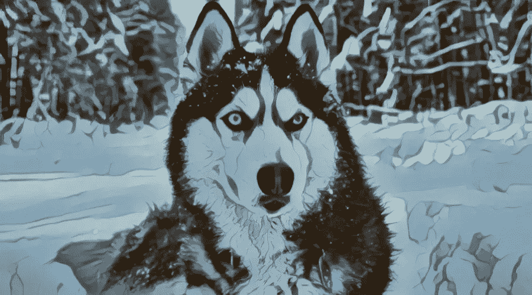
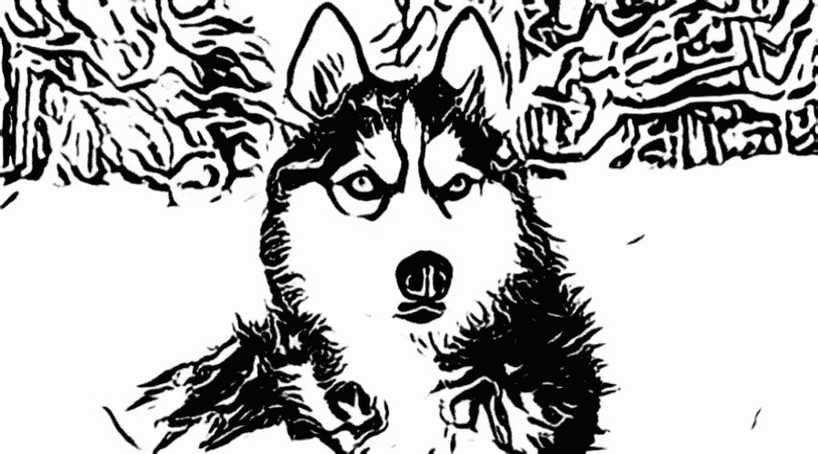
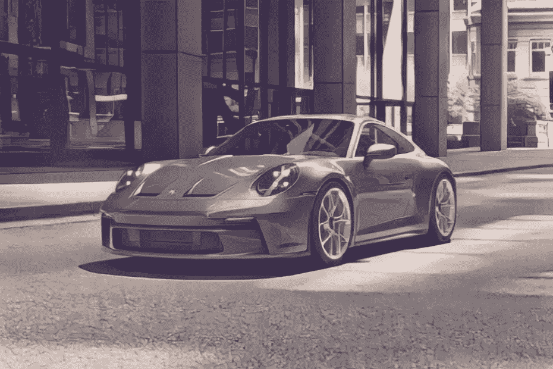
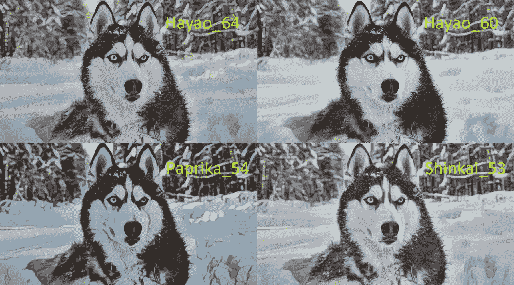

# Python 的动画效果

> 原文：<https://pub.towardsai.net/animegan-effect-with-python-78225a2d75fe?source=collection_archive---------3----------------------->

## 我将向您展示如何在您的媒体上轻松应用 AnimeGAN 效果，以获得漂亮的动画图片、视频或实时相机流

**您见过的最先进的数据科学路线图！附带数以千计的免费学习资源和 ChatGPT 集成！**[**https://aigents.co/learn/roadmaps/intro**](https://87v9.short.gy/K93jZA)

在之前的教程中，我们已经介绍了如何移除背景，就像 Zoom、MS Teams、Google Meet 或 Skype 一样。此外，我们还学习了如何识别人脸，以及如何对那张脸进行面部识别。然后我们继续用纯粹的 OpenCV 实现了一个“铅笔”草图效果，但是当我们谈到一个真实的人的铅笔草图时，它并不完美。因此，我来到了我们将在我们的媒体上测试 [AnimeGAN](https://github.com/TachibanaYoshino/AnimeGANv2) 效果，以获得美丽的动画图片、视频或实时相机流，如果你有 GPU 来实时处理它的话。

在本教程结束时，我们将能够从我们的图像中获得以下动画效果:

作者图片

或者这种素描效果:

作者图片

像以前一样，我将为这个任务创建一个单独的对象，我将命名为`animegan.py.`。它将与我的其他人脸检测、人脸识别、背景移除等具有相同的结构。，对象。当我们调用我们的对象时，我们给出一个返回处理过的帧的帧。以下是完整的 AnimeGan 对象代码:

在本教程中，我不打算深入这项技术，它是如何制作的，如何训练模型，等等。我的重点是向你展示使用它是多么简单。我已经将模型从 TensorFlow 转换为`.ONNX`类型。它们保存在我的模型文件夹中，分别是`Shinkai_53.onnx`、`AnimeGANv3_PortraitSketch_25.onnx`和其他。原始权重可以从原始的 [AnimeGANv2 GitHub 库](https://github.com/TachibanaYoshino/AnimeGANv2)下载。

该对象用于根据官方要求处理图像的所有预处理和后处理。

好吧，但是如何使用它，你可能会问，对不对？让我们创建`main.py`脚本，用"`Shinkai_53.onnx`"模型对我们的图像进行推理:

这只有几行代码，将生成下面的动画图像:

作者图片

我不知道你怎么样，但我看不出有什么显著的不同，但肯定的是，这是不同的。

在官方的 AnimeGANv2 实现中，找到从哪里下载权重是相当困难的。因此，为了简单起见，我添加了代码描述的链接。我把它们都放在我的模型的文件夹里，我们将用我的一张哈士奇照片来测试它们；我们将选择最好的一个。以下是用于该目的的代码:

如果您试图向此 AnimeGan 模型提供高分辨率图像，可能会超出您的内存资源。如果是这样，你必须在 AnimeGan 对象中设置一个`downsize_ratio`参数。但除此之外，结果相当令人兴奋。以下是每种型号的四种不同输出:您可以选择最适合您的方式:

作者图片

处理这些结果花了一些时间，而且非常耗费资源。但是尝试一下还是值得的。此外，在我的 [YouTube](https://youtu.be/UN-zTa0LNrc) 视频教程中，你可能会看到我在一个实时视频流上测试了它，因为我有 GPU，可以在上面运行。看看吧！

下面是几行代码，它将处理您的网络摄像头流并为您显示结果:

如果你看完了我的 [YouTube](https://youtu.be/UN-zTa0LNrc) 视频，你应该会看到用上面的代码，我从我的相机流中得到了相当惊人的动画效果。我对这些结果感到兴奋。

# 结论:

尽管很难找到这种动漫效果的真实用途，但尝试一下真的很有趣。我认为最好的目的是为社交网络创建动画图像或视频，为自己或他人创造一些乐趣。但是我们了解到，它很容易实现到图像，视频，或网络摄像头流！玩得开心！

感谢阅读！一如既往，本教程给出的所有代码都可以在我的 [GitHub](https://github.com/pythonlessons/background_removal) 页面上找到，并且免费使用！

*原载于*[*https://pylessons.com/animegan-effect*](https://pylessons.com/animegan-effect)