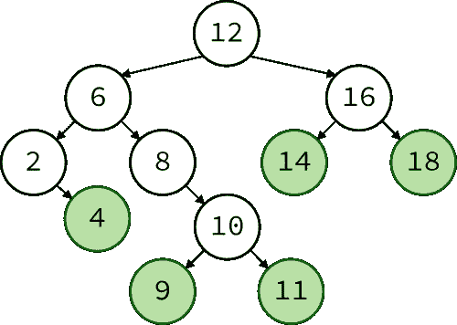
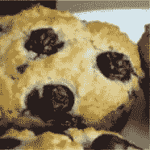
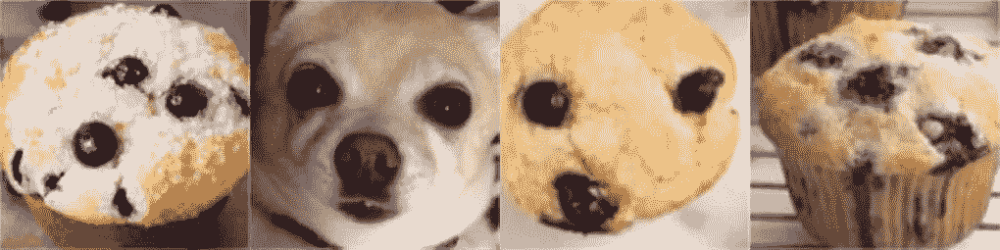
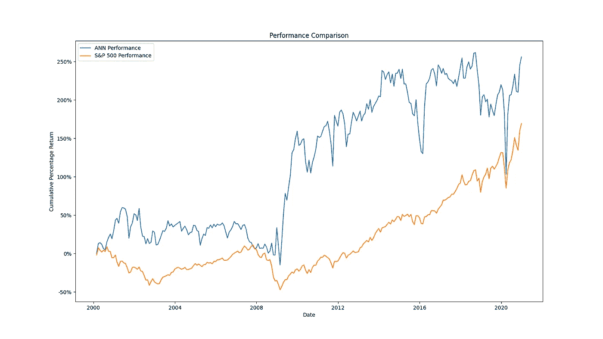

# 用于股票选择的人工神经网络推荐系统

> 原文：<https://pub.towardsai.net/ann-recommendation-system-for-stock-selection-c9751a3a0520?source=collection_archive---------0----------------------->


瓦力能为你挑选下一棵树吗？—[Jason Leung](https://unsplash.com/@ninjason?utm_source=medium&utm_medium=referral)在 [Unsplash](https://unsplash.com?utm_source=medium&utm_medium=referral) 上的照片

## [机器学习](https://towardsai.net/p/category/machine-learning)，[创新](https://towardsai.net/p/category/innovation)

## 重新利用 Spotify 背后的算法来选择投资组合

虽然 Medium 中的大多数博客都致力于生成进场和出场信号，以在单一工具的市场上获利，但这篇博客从一个不同的假设开始:我们不知道应该选择哪只股票，也不知道何时是进场或出场的最佳时机。我们能不能不把所有鸡蛋放在一个篮子里，而是使用机器学习来选择和重新平衡股票投资组合，以跑赢标准普尔 500？

> 通过定期投资指数基金，一无所知的投资者实际上可以超越大多数专业投资者——沃伦·巴菲特

我们这次选择的武器是推荐系统。这类算法可以说是一些最常见的机器学习算法。如果像网飞、亚马逊、苹果、谷歌、优步和 Spotify 这样的科技巨头一直在使用以前的用户体验作为代理，向我们推荐新的内容和产品供我们消费，我们是否有可能改变它的用途，并将其应用于金融工具？在这篇博客中，我们将探讨如何使用推荐系统，特别是 Spotify 的近似近邻(ANN)实现，在标准普尔 500 选民中进行选择和重新平衡。跟随我们的旅程，看看它是否成功！

> 免责声明:这只是一个应用推荐系统选择和重新平衡股票投资组合的演示，不应复制或盲目跟随。

## 目录:

1.  [**推荐系统**](#bbf6) **:** 什么是推荐系统？
2.  [**ANN —近似最近邻**](#2c18) **:** 最近邻算法是什么？为什么安比 KNN 好？
3.  [**需求&数据采集**](#fcad) **:** 设置环境和下载数据的代码演练
4.  [**特征工程**](#a26f) **:** 从我们的数据集中提取 alpha 的代码演练
5.  [**ANN 作为协同过滤推荐系统**](#9fbb) **:** 实现推荐系统的代码演练
6.  [**评测&成交思路**](#8815) **:** 我们的推荐系统表现如何？其他奖金改进想法
7.  [**结论**](#f611) **:** 链接到完整源代码&相关博客
8.  [**参考文献**](#8f74)

> 注意:我们将一节一节地讨论代码。如果你觉得很难理解或者把它们粘在一起，不要担心，完整的脚本会在博客的末尾提供。

## 1.推荐系统

推荐系统试图根据项目与其他项目的相关性，即相似性和相关性，对项目进行排序。更相关的项目将比不太相关的项目具有更高的分数。实现该系统通常有两种方法:基于内容的过滤和协同过滤。

> 注意:也可以两者结合。但是为了简单起见，我们不会在这个博客中涉及它。

**协同过滤系统:**这是一个以用户感知&体验为中心的系统设计。排名将完全取决于其他用户的喜好。

**假设:**历史数据是我们做推荐所需要的全部；现有用户群在统计上与新用户相似；趋势不重要；历史数据数量大，质量高，足以进行任何推断

**举例:**比方说很多用户喜欢咖啡、茶、奶茶，还有咖啡配奶茶。同时，我也喜欢咖啡、茶和奶茶。当我问协同过滤系统下一步应该尝试什么时，它会建议我喝咖啡加奶茶而不是可乐。

> 注意:咖啡加奶茶在我的家乡香港是一种非常受欢迎的饮料。在东南亚其他地方也很常见。食谱很简单——3 份咖啡和 7 份港式奶茶——瞧！

**基于内容的系统:**直觉很简单——内容越相似，排名越高。在我们为用户推荐内容的情况下，我们会推断，如果其他动作电影爱好者也喜欢《复仇者联盟》，那么动作电影爱好者也应该喜欢它。这与协同过滤的不同之处在于，我们在推荐过程中包含了用户产品的潜在标签。

**假设:**元标签对某样东西是否应该被推荐有预测能力。

**例如:**例如，虽然阿萨辛的《信条》和《美国队长》都被归类为动作片，但用户对游戏的偏好(用户的元标签)可能会影响他们喜欢阿萨辛的《信条》的可能性。

> 注意:如果动作片是你喜欢的类型，你很可能两者都喜欢！

## **2。ANN —近似最近邻**

最近邻算法是计算机科学和机器学习领域中最通用的算法之一。已经证明适用于[文本分类](https://www.sciencedirect.com/science/article/pii/S1877705814003750)、[文本分类](https://www.sciencedirect.com/science/article/pii/S1877050920301757)、[图像识别](https://ieeexplore.ieee.org/abstract/document/5384892)、[预测维护](http://xml.jips-k.org/full-text/view?doi=10.3745/JIPS.04.0183)等等。神经网络的主要目标是识别数据集中彼此最接近的候选对象。无需深入研究太多代码，通常有两个不同的实现方向:

*   **穷举搜索:**在检查完数据集中的每个数据点之前，我们永远不会知道哪个数据点是最接近的。这具有线性的空间和时间复杂度(计算机科学的说法是，算法占用的时间和内存与数据集大小成比例)。因此，随着数据集大小的增加和特征维数/数量的增加(维数灾难)，穷举搜索算法通常会受到很大影响。一个众所周知的例子是 k 近邻(KNN)。
*   **网格搜索:**网格搜索通过逼近问题并将其细分为更小的块来减轻维数灾难，每个块将具有更小的空间和时间复杂度，因此将能够**更快地完成，同时占用更少的计算资源。** **这种近似方法的一个例子是近似最近邻法(ANN)。**

> 安听起来比 KNN 好，但它是如何工作的呢？

简单来说，ANN 有三个主要步骤:( [TLDR 门户](#d858))

1.  **向量变换:**对高维数据集应用降维。**一个过于简单的例子是 PCA** ，其中多个维度被折叠成相互正交的主成分，同时最大化方差以分离数据点。
2.  **矢量编码:**又一个花哨的名词！可以把它想象成索引整个数据集。对于任何没有 SQL 背景的人来说，随着数据集变大，排序、搜索和遍历表变得越来越困难。索引数据集将显著降低搜索数据集的复杂性。一个过于简单的例子是二分搜索法树,我们所有的数据点都被很好的分类和组织起来，随时可以被搜索。
3.  **非穷尽式搜索:**二叉查找树很好，但它也意味着我们需要从根源开始。以下图为例，为了确定数字 4 的最近邻，我们从根 12 开始，到 6，再到 2，其中我们意识到 4 是唯一的叶子，所以我们后退一步到 6，然后遍历到 8，其中它的所有叶子都可以被视为近似最近邻。**一个过于简单的例子是反转二分搜索法树**，其中我们将 4 映射到 8，从而将寻找 4 的最近邻居的问题简化为在 8 的叶子中，而不是在所有其他节点中。**在这个简单的例子中，这个技巧将遍历树的次数减少了一半。**



二叉查找树——来源:[维基百科](https://commons.wikimedia.org/wiki/File:Binary_Search_Tree_with_Leaves.svg)

**TL；让我们用一个直观的例子来说明:如果我想搜索类似这样的松饼图片该怎么办:**



yum-Source:[top bots](https://www.topbots.com/downloads/code/vision/chihuahua_vs_muffin/)

虽然 KNN 会尝试找出哪张照片看起来最接近，但安很乐意为我们提供以下四张照片中的任何一张:



你能认出吉娃娃吗？来源:[热门机器人](https://www.topbots.com/downloads/code/vision/chihuahua_vs_muffin/)

## 3.需求和数据采集

解释完我们要应用的概念后，让我们最终处理我们的问题陈述:

> 我们应该买哪只股票？

首先，我们从建立虚拟环境(或者更好的 docker 容器)的经验法则开始。除了常用的熊猫、熊猫等，我们还会用到以下的:

*   **Alpha Vantage:** 免费增值数据提供商。放心。一个[免费授权](https://www.alphavantage.co/support/#api-key)就足够好了。GitHub 链接[这里](https://github.com/RomelTorres/alpha_vantage)。
*   **雅虎财经:**我们需要用它来获得我们的基准——标准普尔&500 指数。GitHub 链接[此处](https://github.com/ranaroussi/yfinance)。
*   **烦:** Spotify 用 Python 绑定的 ANN 的 C++实现让我们既能享受 Python 语言的灵活性，又能享受 C++的光速计算。GitHub 链接[此处](https://github.com/spotify/annoy)。

```
conda create -n myenvconda activate myenv && conda install -y python=3.8.5pip install alpha_vantage annoy pandas numpy yfinance
```

> 注意:在一个隔离的环境中开始一个新项目总是一个好主意，无论是虚拟环境、conda 环境还是 docker 容器。它有助于保持代码和环境的整洁、可复制性和可移植性。

我们还需要下载所有标准普尔 500 的历史成分，以避免生存偏差，因为我们永远不知道某个成分是否会破产、被除名或在未来登上月球。幸运的是，法雷尔很友好地整理了一份历史成分的清单。向法雷尔致敬！

有了 Alpha Vantage 的密钥和所有历史成分，是时候开始下载数据了！处理金融股票数据时要记住的一件事是价格调整。例如，特斯拉在 8 月 31 日经历了五对一的分拆。所以拆分前的一股应该是拆分后的五倍左右。这就是为什么我们需要根据拆分和分红事件来调整价格。

幸运的是，Alpha Vantage 的每日调整端点，我们将根据[证券价格研究中心的公式](http://www.crsp.org/products/documentation/crsp-calculations)调整收盘价格。然后，我们可以使用从未调整的开盘价到未调整的收盘价的百分比变化来估计调整后的开盘价、最高价和最低价:如果当天价格的百分比变化为+10%，那么无论调整与否，收盘价都应该是开盘价的 110%。

从 Alpha Vantage 下载数据时，我们还需要注意两件事:

*   股票代号可以不同。从我的经验来看，在 Alpha Vantage 中，有些情况下`constituents.csv`中的`.`会被`—`取代或者完全消失
*   我们对 Alpha Vantage 的免费许可有一个每天 500 个查询和每分钟 5 个请求的硬性限制。我已经设置了一个分钟限制的计时器，但是要做好准备，可能需要两天才能下载完数据

一旦你运行了这个脚本，你的`NVDA.csv`应该有类似于下面的第一行和最后 5 行，这取决于你何时查询 Alpha Vantage:

NVDA.csv 的前 5 行

NVDA.csv 的最后 5 行

为了评估我们的推荐系统的性能，我们还需要下载调整后的标准普尔 500 指数。

## **4。特征工程**

> 注意:由于这篇博客文章演示了如何将它变成你的武器库的一部分，所以我们不会深究特性工程。请随意探索、设计和优化您自己的功能！

让我们用一个简单的假设，价格行为和波动性是一只股票在下个月是否表现良好的最具指示性的预测指标。在此基础上，我们将使用对数回报的平均值和标准差、正天数的百分比、上半月和下半月之间的比较等特征。

为了给我们的案例增加一点真实性，我们将在代码中加入一些滑移。本质上，滑点是指执行价格与我们指定的目标价格不同。这基本上是不可避免的，除非我们进入 HFT 的领域——高频交易。

一旦我们运行了脚本，我们应该将所有的 tickers 存储在字典的内存中。现在该炸鱼了！

## **5。人工神经网络协同过滤推荐系统**

我们将人工神经网络纳入工作流程的方式如下:

1.  从 1996 年 1 月底开始，100 万美元
2.  将所有幸存成分的月特征添加到人工神经网络的历史数据集中
3.  如果我们还不在 2000 年，请回到步骤 2，以便我们可以建立我们的协同过滤历史数据集
4.  重建人工神经网络
5.  对于每个幸存的成分，从 ANN 中取出 200 个最近的邻居
6.  根据最近邻居的平均对数回报，考虑滑点，按比例为每个成分打开/重新分配头寸
7.  进展到下个月
8.  回到第 2 步，重复，印钱！

我在使用`annoy`时的一些经验可能对你有所帮助:

*   应谨慎使用欧几里得距离，尤其是当您包括不同比例的要素时，例如，量和价之间的比例差异通常在数量级上。
*   不幸的是，一旦构建了 ANN，我们就不能再改变树了，这意味着我们不能在不重建它的情况下向 ANN 添加新的项目。因此，在下面的代码片段中，我们将需要存储历史项目的索引和值，以便我们可以在以后引用和重建。
*   人工神经网络构建的树越多，计算近似最近邻所需的计算资源就越多。
*   `get_nn_by_item`方法的`search_k`参数表示将被搜索以确定近似最近邻居的节点的数量。确保我们不要把它设置得太大，否则我们会以彻底的搜索而告终，这就违背了使用人工神经网络的目的。

## **6。评估&关闭思路**

为了评估我们的推荐系统的性能，让我们将其与标准普尔 500 进行比较。同样，记得调整 S&P，以便我们考虑所有的股票分割。



人工神经网络性能与调整后的 S&P 性能——图片由作者提供

看起来我们的推荐系统持续优于标准普尔 500 指数。但是推荐系统的波动性也比基准高了很多，这对我们的内心来说并不是一件好事。这可能是弱预测和/或过度拟合的结果。由于这不是一篇演讲文章，而是更多地展示如何应用推荐系统，我们将省略它。也就是说，这里有一些想法可能会激励你更深入地探索:

*   体积的统计测量
*   使标准普尔 500 的股票回报正常化，以便系统可以推荐表现优异的股票
*   包括市场波动测量，如 VIX 或 IVI
*   包括报价机的基本原理
*   包括其他替代数据，如新闻、twitter 或 reddit
*   资产配置不一定需要基于平均最近邻回报

## 7.结论

在这篇博客中，我们讨论了推荐系统的关键概念，人工神经网络的工作原理，以及如何将人工神经网络用作一个协同过滤推荐系统。我们进一步展示了人工神经网络 Spotify 背后的主要驱动力——如何被重新用作股票选择系统。

在我们这个天真的例子中，我们假设回报率、波动性和前一个月的表现相似的股票会推断下个月盈利的可能性更高，尽管波动性非常大，但股票的表现一直优于标准普尔 500 指数。

话虽如此，请记住这篇博客只是展示我们如何利用人工神经网络作为选股工具，因此一直专注于底层概念和简单的代码结构(此处[提供](https://gist.github.com/wululoo/48385cc4a87241feb77d6aa6c1eb1689))供我们所有人尝试。

如果你想了解如何进一步优化遗传算法的交易策略，同时避免过度适应遗传算法，这里有我的另外两个博客，我们集中在策略优化。

[](https://medium.com/towards-artificial-intelligence/genetic-algorithm-for-trading-strategy-optimization-in-python-614eb660990d) [## Python 中交易策略优化的遗传算法

### 遗传算法如何帮助缩小问题空间并收敛到更好的解决方案？

medium.com](https://medium.com/towards-artificial-intelligence/genetic-algorithm-for-trading-strategy-optimization-in-python-614eb660990d) [](https://medium.com/towards-artificial-intelligence/genetic-algorithm-stop-overfitting-trading-strategies-5df671d5cde1) [## 遗传算法——停止过度适应交易策略

### 变异系数如何让遗传算法更稳健？

medium.com](https://medium.com/towards-artificial-intelligence/genetic-algorithm-stop-overfitting-trading-strategies-5df671d5cde1) 

这是这个博客的内容。希望你觉得博客或代码有用！如果我错过了什么，或者如果你有任何问题，请随时回复或 pm。如果你对其他 Python 技巧感兴趣，我为你整理了一份简短博客列表:

*   [Python 技巧:扁平化列表](https://towardsdatascience.com/python-tricks-flattening-lists-75aeb1102337)
*   [Python 技巧:如何检查与熊猫合并的表格](https://towardsdatascience.com/python-tricks-how-to-check-table-merging-with-pandas-cae6b9b1d540)
*   [Python 技巧:简化 If 语句&布尔求值](https://towardsdatascience.com/python-tricks-simplifying-if-statements-boolean-evaluation-4e10cc7c1e71)
*   [Python 技巧:对照单个值检查多个变量](https://towardsdatascience.com/python-tricks-check-multiple-variables-against-single-value-18a4d98d79f4)

如果你想了解更多关于 Python、数据科学或机器学习的知识，你可能想看看这些帖子:

*   [神经网络初始化的 3 个常见问题](/3-common-problems-with-neural-network-initialisation-5e6cacfcd8e6)
*   [谷歌的 RFA:近似变形金刚中的 Softmax 注意机制](https://towardsdatascience.com/google-deepminds-rfa-approximating-softmax-attention-mechanism-in-transformers-d685345bbc18)
*   [TensorFlow:使用 GPU 将 NumPy 加速 10000 倍以上](/tensorflow-accelerate-numpy-with-gpus-964e9087fdab)
*   [改进数据科学工作流程的 7 种简单方法](https://towardsdatascience.com/7-easy-ways-for-improving-your-data-science-workflow-b2da81ea3b2)
*   [熊猫数据帧上的高效条件逻辑](https://towardsdatascience.com/efficient-implementation-of-conditional-logic-on-pandas-dataframes-4afa61eb7fce)
*   [常见 Python 数据结构的内存效率](https://towardsdatascience.com/memory-efficiency-of-common-python-data-structures-88f0f720421)
*   [用 Python 并行](https://towardsdatascience.com/parallelism-with-python-part-1-196f0458ca14)
*   [为数据科学设置必要的 Jupyter 扩展](https://towardsdatascience.com/cookiecutter-plugin-for-jupyter-easily-organise-your-data-science-environment-a56f83140f72)
*   [Python 中高效的根搜索算法](https://towardsdatascience.com/mastering-root-searching-algorithms-in-python-7120c335a2a8)

[](https://www.linkedin.com/in/louis-chan-b55b9287) [## Louis Chan-FTI Consulting | LinkedIn 数据科学总监

### 雄心勃勃的，好奇的和有创造力的个人，对分支知识和知识之间的相互联系有强烈的信念

www.linkedin.com](https://www.linkedin.com/in/louis-chan-b55b9287) [](https://www.buymeacoffee.com/louischan)