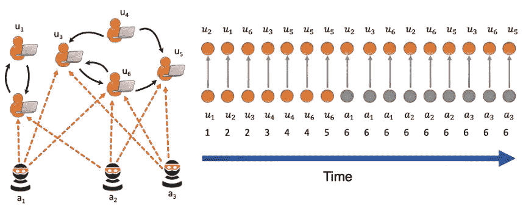
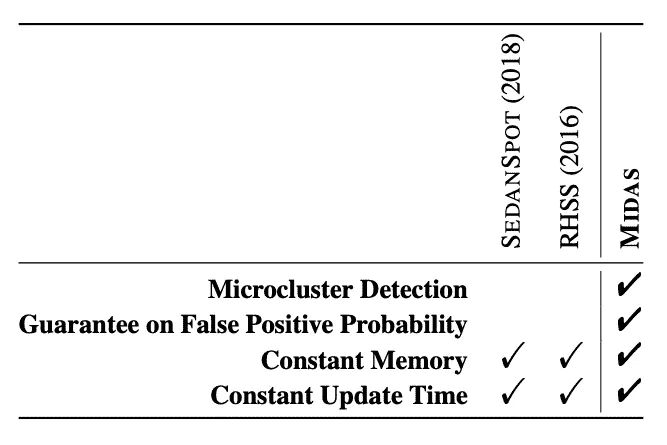
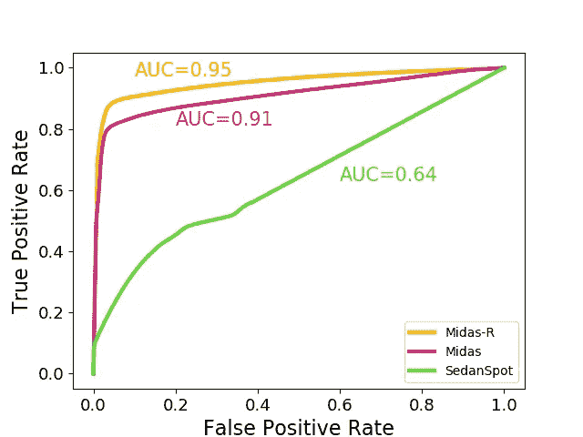
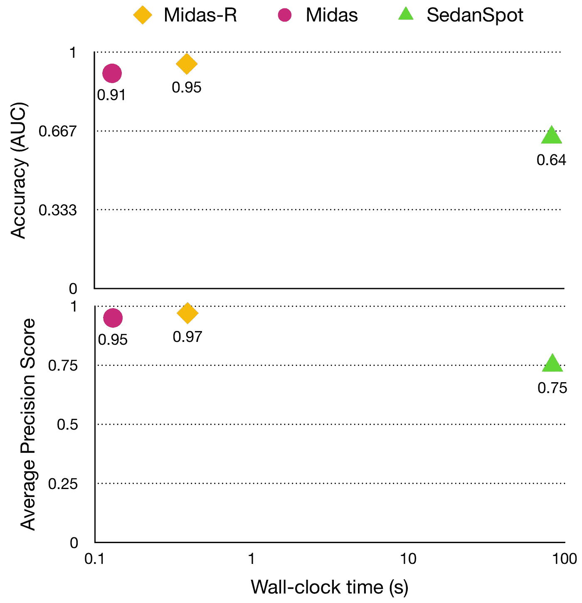
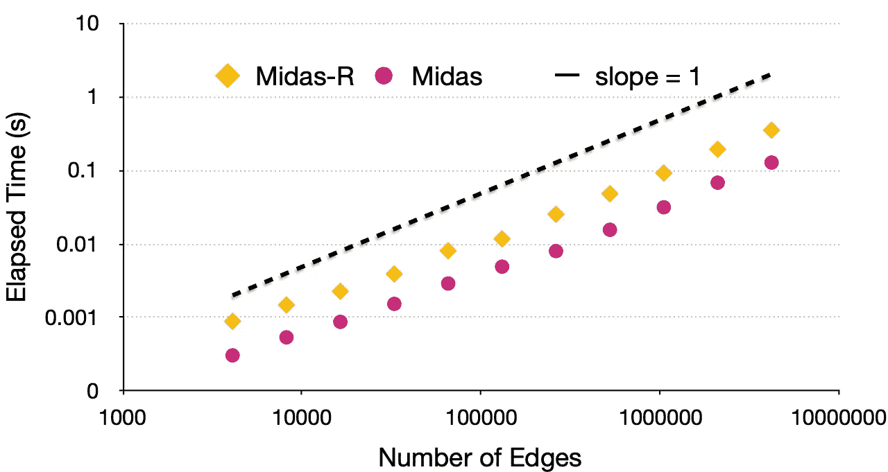
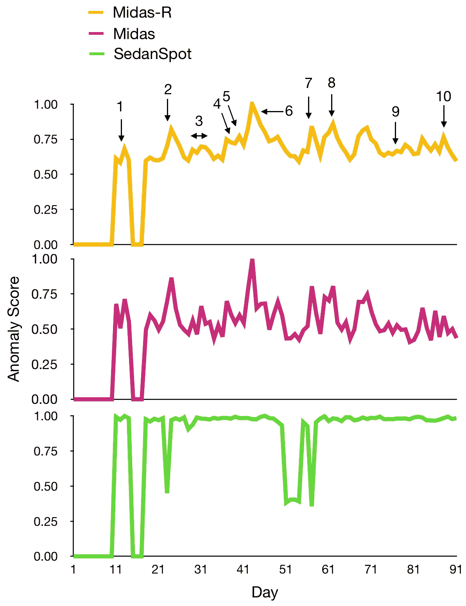

# MIDAS 异常检测

> 原文：<https://pub.towardsai.net/anomaly-detection-with-midas-2735a2e6dce8?source=collection_archive---------0----------------------->

## 怎样才能更准确更快速的检测出异常？

图中的异常检测是在系统中发现奇怪行为的一个严重问题，如入侵检测、虚假评级和金融欺诈。为了尽快将恶意活动的影响降至最低，我们需要实时检测异常，以识别传入的边缘并确定它是否异常。现有方法以在线方式处理边缘流，并且可能遗漏大量可疑活动；与此相反，MIDAS 使用恒定的时间和内存来检测边缘流中的微星团异常，提供了假阳性概率的理论界限。

“迈达斯”是由西达尔特·巴蒂亚、布莱恩·胡伊、姬敏·尹、基荣·申和克里斯特斯·法鲁索斯制作的一个项目。

MIDAS 的主要贡献有:
1。**流式微团簇检测**，检测微团簇异常的新型流式方法；
2。**理论保证**，关于迈达斯的误报概率；
3。**有效性**，MIDAS 的实验结果表明，MIDAS 的准确率比基线方法高 42%-48%，数据处理速度快 162-644 倍。

如果我们将 MIDAS 与之前检测边缘流中异常的方法进行比较，我们会发现 MIDAS 包括更多功能，如**微簇检测**和**假阳性概率保证，**保留了其他方法的其他元素。

相关边缘流异常检测方法的比较—来源: [MIDAS 库](https://github.com/bhatiasiddharth/MIDAS)

# 算法

提出了两种方法:MIDAS 和 MIDAS-R。

1.  **流式假设测试方法**，是 MIDAS 的工作，其中我们可以在基于假设测试的框架中使用流式数据结构获得假阳性概率的保证；
2.  **检测和保证**，我们决定一个点是否异常的判定程序，获得假阳性概率的保证；
3.  **合并关系**，这里 MIDAS-R 开始发挥作用，合并边之间的时间和空间关系。

如果你想了解更多的算法，请访问 [MIDAS 知识库](https://github.com/bhatiasiddharth/MIDAS)。

# 准确(性)

DARPA 数据集的 ROC 资料来源: [MIDAS 知识库](https://github.com/bhatiasiddharth/MIDAS)

在上图中，绘制了 MIDAS、MIDAS-R 和 SedanSpot(一种一致的异常检测方法)的 ROC 曲线，我们可以看到，与基线相比，MIDAS 的准确性提高了 42%，运行速度也显著加快(644 倍)。

MIDAS 和 MIDAS-R 的平均精度分数与运行时间的关系—来源: [MIDAS 库](https://github.com/bhatiasiddharth/MIDAS)

在上图中，绘制了平均精度分数与运行时间的关系，我们看到 MIDAS 的精度比基线高 27%。相比之下，MIDAS-R 的精确度高出 29%，达到了最高的平均精确度分数。我们可以说，MIDAS 和 MIDAS-R 都优于边缘流中的其他异常检测方法。

# 可量测性

与边数相比，MIDAS 和 MIDAS-R 的可扩展性——来源: [MIDAS 知识库](https://github.com/bhatiasiddharth/MIDAS)

上图显示了 MIDAS 和 MIDAS-R 的可扩展性。正如我们所看到的，随着边数的增加，与每个边的处理时间相比，它证实了它们的可扩展性。MIDAS 和 MIDAS-R 都允许实时异常检测，在 0.5s 内处理 4M 边。

# 真实世界的有效性

MIDAS 检测到的异常情况与 TwitterSecurity 中的重大安全相关事件之间的对应关系——资料来源: [MIDAS 储存库](https://github.com/bhatiasiddharth/MIDAS)

我们最后一次比较 MIDAS、MIDAS-R 和 SedanSpot，在一个真实的例子中测量它们的异常分数:TwitterSecurity 数据集。上图绘制了 2014 年 5 月至 9 月异常分数与日的关系。正如我们所看到的，我们有不同的异常峰值，与 MIDAS 的 TwitterSecurity 时间轴中的重大事件相吻合。相比之下，SedanSpot 只是输出许多高异常性分数，从而导致低 AUC。

# 其他使用案例

让我们考虑一下 MIDAS 在制造业中的一个应用，在制造业中有许多工作机器相互连接成一个图；如果这些机器有奇怪的行为，可能会导致电力消耗和原材料浪费方面的成本超支。像 MIDAS 这样的异常检测算法能够实时检测这些奇怪的行为，减少和防止损失。MIDAS 还有更多应用，例如，作为 Twitter 和脸书等社交网络的虚假账户检测器，那里有人或机器人创建虚假身份。MIDAS 也可以帮助检测假新闻，决定一篇文章是真的还是只是一个点击诱饵。

# 结论和参考文献

MIDAS 和 MIDAS-R 使边缘流中的异常检测更快、更准确，同时保持高扩展性和真实世界的有效性。

如果你想了解更多关于 MIDAS 的知识，请查看 MIDAS 库，在那里你可以找到例子和入门指南。如果您有任何问题，请随时联系[西达尔特·巴蒂亚](https://www.comp.nus.edu.sg/~sbhatia/)。

西达尔特·巴蒂亚，布莱恩·胡伊，姬敏·尹，吉荣·申和克里斯特斯·法鲁索斯。" MIDAS:基于微团簇的边缘流异常检测器."2020 年 AAAI 人工智能大会(AAAI)。【https://arxiv.org/abs/1911.04464 

农齐奥·洛加洛