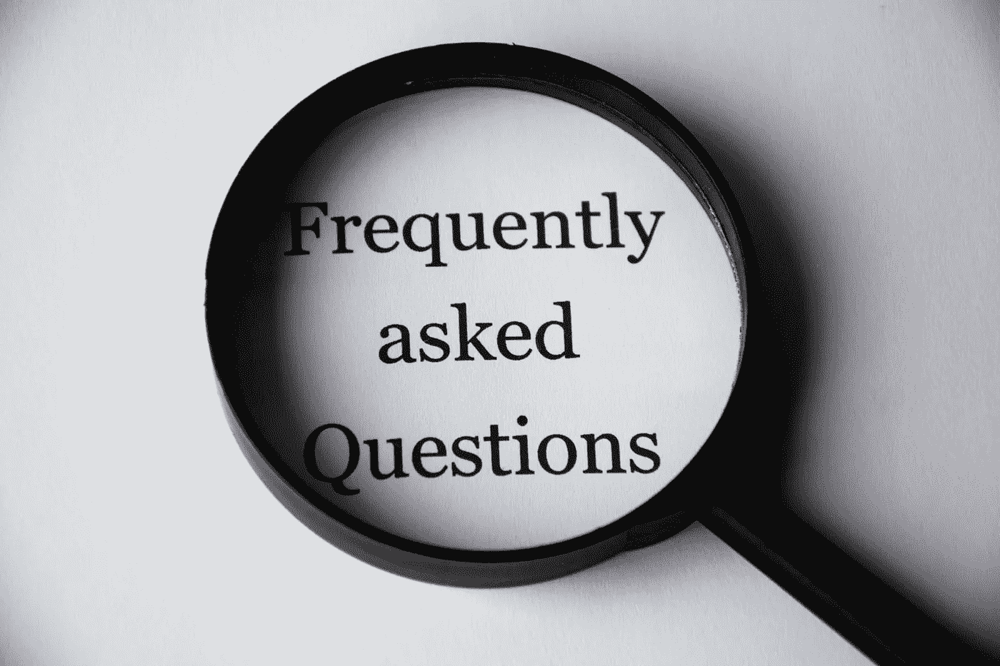
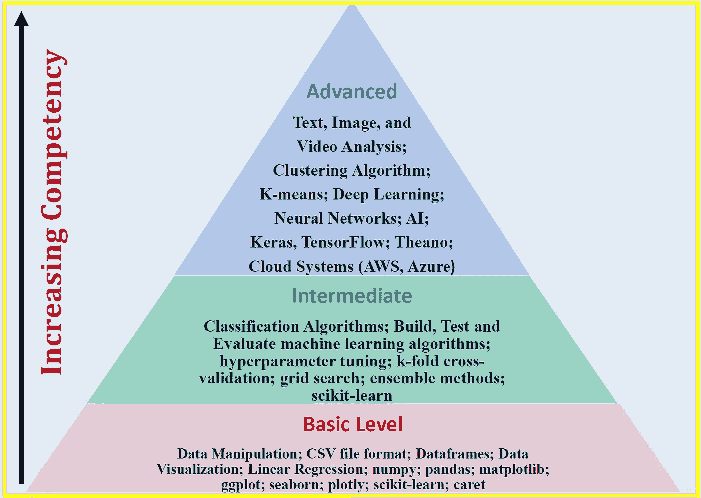

# 对数据科学有志者问题的回答

> 原文：<https://pub.towardsai.net/answers-to-questions-from-data-science-aspirants-f2950be3cd18?source=collection_archive---------0----------------------->

图像来源:[像素](https://www.pexels.com/search/question/)

## [数据科学](https://towardsai.net/p/category/data-science)

## 学什么，怎么学，从哪里开始..！！

作为一名数据科学教育工作者，许多对数据科学感兴趣的人联系我，寻求如何进入数据科学领域的指导。在本文中，我将回答数据科学爱好者和爱好者的常见问题。

## 1.什么是数据科学？

数据科学是一个如此广阔的领域，包括几个细分领域，如数据准备和探索；数据表示和转换；数据可视化和显示；预测分析；机器学习、深度学习、人工智能等。数据科学能力有三个等级，分别是:**一级**(基础级)；**二级**(中级)；以及 l**level 3**(高级水平)。能力从 1 级增加到 3 级，如下图**图 1** 所示。

**图 1** 。数据科学能力的三个层次。Benjamin O. Tayo 的图片

## 2.数据科学家是做什么的？

数据科学家处理数据，得出有意义、有见地的结论，推动机构或组织的决策。他们的工作职责包括数据收集、数据转换、数据可视化和分析、构建预测模型、根据数据结果提供行动建议。数据科学家在医疗保健、政府、工业、能源、学术、技术、娱乐等不同领域工作。一些聘请数据科学家的顶级公司有亚马逊、谷歌、微软、脸书、LinkedIn、Twitter、网飞、IBM 等。

## 3.数据科学家的就业前景如何？

数据科学家的就业前景非常乐观。IBM 预测，到 2020 年，对数据科学家的需求将飙升 28%。最近使用 LinkedIn 求职工具进行的一项研究显示，2020 年大多数顶级技术工作都需要数据科学、商业分析、机器学习和云计算方面的技能(见下面的图 2)。

**图二**。使用 LinkedIn 的工作搜索工具按技能划分的全球工作数量。图像由本杰明·欧·塔约拍摄。

## 4.数据科学家挣多少钱？

作为一名数据科学家，你的收入取决于你工作的组织或公司、你的教育背景、经验年限以及你的具体工作角色。数据科学家的收入从 5 万美元到 25 万美元不等，平均工资约为 12 万美元。这篇 [**文章**](https://towardsdatascience.com/how-much-do-data-scientists-make-cbd7ec2b458) 更多讨论的是数据科学家的薪水。

## 5.我如何为数据科学的职业生涯做准备？

大多数数据科学或业务分析计划需要以下内容:

A)高水平的定量能力

b)解决问题的心态

c)编程能力

d)有效沟通的能力

e)团队工作能力

因此，为了准备数据科学的职业生涯，你可以从攻读定量学科的学士学位开始，如**科学**、**技术**、**工程**、**数学**、**商业**或**经济学**。

## 6.应该重点学习哪些编程语言？

如果你有兴趣学习数据科学的基础知识，你需要从某个地方开始。不要被数据科学家招聘广告中提到的[荒谬的编程语言清单所淹没。虽然学习尽可能多的数据科学工具很重要，但建议从一两种编程语言开始。一旦你在数据科学方面打下了坚实的基础，你就可以挑战自己，学习不同的编程语言或不同的平台和生产力工具，以增强你的技能。根据这篇](https://towardsdatascience.com/ridiculous-requirements-from-data-scientist-job-ads-d84fa716af73)[文章](https://towardsdatascience.com/python-and-r-unequivocal-champions-of-data-science-31ab4d1fa45e)，Python 和 R 仍然是数据科学中使用最多的两种编程语言。我建议从 Python 开始，因为越来越多的学术培训项目和行业将它作为数据科学的默认语言。

## 7.成为一名数据科学家需要多久？

如果你在**物理学**、**数学**、**工程学**、**计算机科学**、**经济学**，或者**统计学**等分析学科有扎实的功底，基本上可以自学数据科学的基础知识。你可以从像 **edX** 、 **Coursera** 或 **DataCamp** 这样的平台上免费学习在线课程开始。**1 级**能力可在 6 至 12 个月内达到。第二级能力可以在 7 到 18 个月内达到。**第 3 级**能力可以在 18 到 48 个月内达到。这完全取决于投入的努力量。

## 8.有哪些学习数据科学的资源？

如果你的环境允许，你可以攻读数据科学或商业分析的硕士学位。如果你负担不起硕士学位课程，你可能会追求自学路线来学习数据科学。一般来说，如果你在物理、数学、经济、工程或计算机科学等分析学科方面有坚实的背景，并且你有兴趣探索数据科学领域，最好的方法是从大规模开放在线课程(MOOCs)开始。在建立了坚实的基础后，您可能会寻求其他方法来增加您的知识和专业技能，例如从教科书中学习、参与项目以及与其他数据科学有志者建立联系。

下面是推荐的 MOOCs 和教科书，可以帮助你掌握数据科学的基础知识。

**推荐慕课:**

[数据科学专业证书(HarvardX，通过 edX)](https://www.edx.org/professional-certificate/harvardx-data-science)

[分析:基本工具和方法(Georgia TechX，通过 edX)](https://www.edx.org/micromasters/analytics-essential-tools-methods)

[Python 专业的应用数据科学(密歇根大学，通过 Coursera)](https://www.coursera.org/specializations/data-science-python)

**推荐书籍:**

从教科书中学习提供了比你从在线课程中获得的更精炼和更深入的知识。这本书对数据科学和机器学习提供了很好的介绍，代码包括:**“Python 机器学习”，作者 Sebastian Raschka** 。作者以一种非常容易理解的方式解释了机器学习的基本概念。此外，代码也包括在内，因此您实际上可以使用提供的代码来练习和构建您自己的模型。我个人认为这本书在我作为数据科学家的旅程中非常有用。我会向任何数据科学爱好者推荐这本书。你所需要的是基本的线性代数和编程技能，以便能够理解这本书。也有很多其他优秀的数据科学教科书，如韦斯·麦金尼的《 [Python for Data Analysis](https://sushilapalwe.files.wordpress.com/2018/04/python-for-data-analytics-book.pdf) 》、库恩·约翰逊的《[应用预测建模](https://vuquangnguyen2016.files.wordpress.com/2018/03/applied-predictive-modeling-max-kuhn-kjell-johnson_1518.pdf)》、伊恩·h·威滕的《[数据挖掘:实用机器学习工具和技术](https://www.wi.hs-wismar.de/~cleve/vorl/projects/dm/ss13/HierarClustern/Literatur/WittenFrank-DM-3rd.pdf)》、艾贝·弗兰克&马克·a·霍尔的《数据挖掘:实用机器学习工具和技术》等等。

## 总结和结论

总之，我们已经讨论了数据科学有志者提出的 8 个重要的常见问题。根据个人背景的不同，通往数据科学的旅程可能会有所不同，但本文提供的答案可以为考虑数据科学领域的个人提供一些指导。

## 其他数据科学/机器学习资源

[数据科学最低要求:开始从事数据科学工作需要知道的 10 项基本技能](https://towardsdatascience.com/data-science-minimum-10-essential-skills-you-need-to-know-to-start-doing-data-science-e5a5a9be5991)

[数据科学课程](https://medium.com/towards-artificial-intelligence/data-science-curriculum-bf3bb6805576)

[机器学习的基本数学技能](https://medium.com/towards-artificial-intelligence/4-math-skills-for-machine-learning-12bfbc959c92)

[进入数据科学的 5 个最佳学位](https://towardsdatascience.com/5-best-degrees-for-getting-into-data-science-c3eb067883b1)

[数据科学的理论基础——我应该关心还是仅仅关注实践技能？](https://towardsdatascience.com/theoretical-foundations-of-data-science-should-i-care-or-simply-focus-on-hands-on-skills-c53fb0caba66)

[机器学习项目规划](https://towardsdatascience.com/machine-learning-project-planning-71bdb3a44349)

[如何组织你的数据科学项目](https://towardsdatascience.com/how-to-organize-your-data-science-project-dd6599cf000a)

[大型数据科学项目的生产力工具](https://medium.com/towards-artificial-intelligence/productivity-tools-for-large-scale-data-science-projects-64810dfbb971)

[数据科学作品集比简历更有价值](https://towardsdatascience.com/a-data-science-portfolio-is-more-valuable-than-a-resume-2d031d6ce518)

***如有疑问，请发邮件给我***:benjaminobi@gmail.com