# 蚁群优化:综述

> 原文：<https://pub.towardsai.net/ant-colony-optimization-an-overview-4bf7cb909b80?source=collection_archive---------1----------------------->

## 基于种群的元启发式自然优化算法

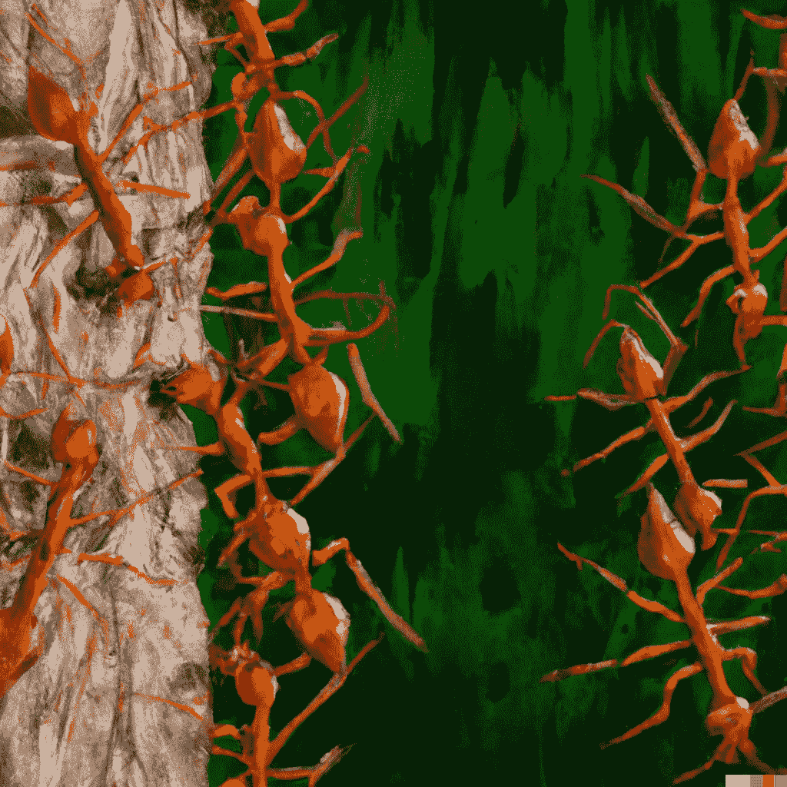

图片由作者提供，由 Dalle 创建。2

> "大象害怕的是蚂蚁，不是狮子。"
> ― **马特肖娜·德里瓦约**

一组受自然过程启发的独特的问题解决技术和方法被称为**“自然启发算法”**在**计算机科学**和**运筹学**中使用的蚁群优化算法( **ACO** ，是一种解决计算问题的概率方法，这些问题可以简化为通过图形寻找合适的路径。

在这篇博客中，我们将讨论以下主题:

*   **现实生活中的蚂蚁**
*   **觅食行为**
*   **蚁群优化算法背后的灵感**
*   **现实生活中蚂蚁和食物到底发生了什么**
*   **蚁群优化的步骤**

## **现实生活中的蚂蚁**

除了关系密切的黄蜂和蜜蜂，蚂蚁是膜翅目蚁科的群居成员。蚂蚁估计有**22000 种**，超过**13800 种**已被分类。一只蚂蚁会经历一个完整的蜕变，这意味着蚂蚁在其生命周期中有四个阶段——卵、**幼虫、蛹和成虫**。寿命: [**黑园蚁**](https://www.google.com/search?sxsrf=ALiCzsazLnmwrdQ8aF1X0neTOrMxKAggmw:1667460019105&q=Black+garden+ant&stick=H4sIAAAAAAAAAOPgE2LXz9U3iM82UuIEMYwNjSuztHSyk630kzLzc_LTK_Xzi9IT8zKLc-OTcxKLizPTMpMTSzLz86xyMtNSiwsS8xaxCjjlJCZnK6QnFqWk5ikk5pXsYGXcxc7EwQgAbvLGhl8AAAA&sa=X&ved=2ahUKEwim_vXQvJH7AhWGTmwGHWIZAOkQmxMoAXoECGsQAw):1-2 年， [**老王蚁**](https://www.google.com/search?sxsrf=ALiCzsazLnmwrdQ8aF1X0neTOrMxKAggmw:1667460019105&q=Pharaoh+ant&stick=H4sIAAAAAAAAAOPgE2LXz9U3iM82UuIEMczyzNIKtHSyk630kzLzc_LTK_Xzi9IT8zKLc-OTcxKLizPTMpMTSzLz86xyMtNSiwsS8xaxcgdkJBYl5mcoJOaV7GBl3MXOxMEIAN6wV1FaAAAA&sa=X&ved=2ahUKEwim_vXQvJH7AhWGTmwGHWIZAOkQmxMoAnoECGsQBA):4-12 个月。蚂蚁通常分为三种:**生殖雌性，生殖雄性，非生殖雌性**。这翻译成女王，男性，和工人。

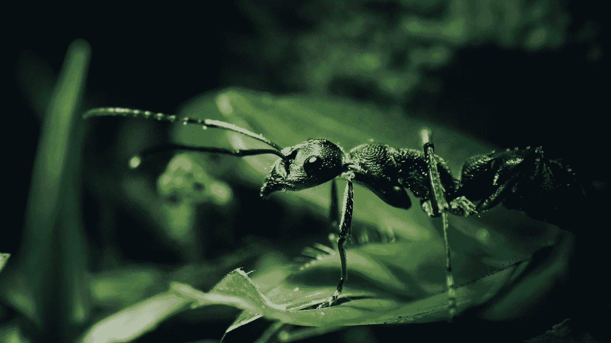

[黄谷悦](https://unsplash.com/@jimmywongc91?utm_source=medium&utm_medium=referral)在 [Unsplash](https://unsplash.com?utm_source=medium&utm_medium=referral) 上拍照

更一般地说，蚁群和昆虫社会是分布式系统，尽管它们的个体成员简单，但它们显示出高度组织化的社会系统。蚁群的组织方式使得它们能够完成复杂的任务。在某些情况下，这远远超过了一只蚂蚁的能力。人类和其他主要感官是听觉或视觉的高等物种发生了什么。踪迹信息素对某些蚂蚁物种的社会行为特别重要。蚁群算法的根源是这种集体的路径铺设和跟踪活动，其中一只蚂蚁受到其他蚂蚁留下的化学路径的影响。

**蚂蚁没有耳朵**。他们能感觉到振动。它们用天线和信息素交流。

涉及**离散优化**的问题特别适合 ACO。例如，路由或路径被编码为路由问题的解决方案。当蚂蚁选择不同的路径时，它们走过的路径会被信息素沉积物标记，这些沉积物最终会消失。路径上(或解决方案中)存在的信息素的量与其适应性或质量相关。在交汇点，信息素浓度较高的路径将被优先选择或更频繁地选择。

**觅食行为**

蚁群算法的灵感来自于蚂蚁在蚁群和食物源之间寻找合适路径的锻造行为。如果你想在最短的时间内找到食物，那么你必须找到一条离食物源最近的路径。最短的路径会在更短的时间内给你食物。

**蚁群优化算法背后的灵感**

蚂蚁如何找到食物来源和巢穴之间的最短路径？

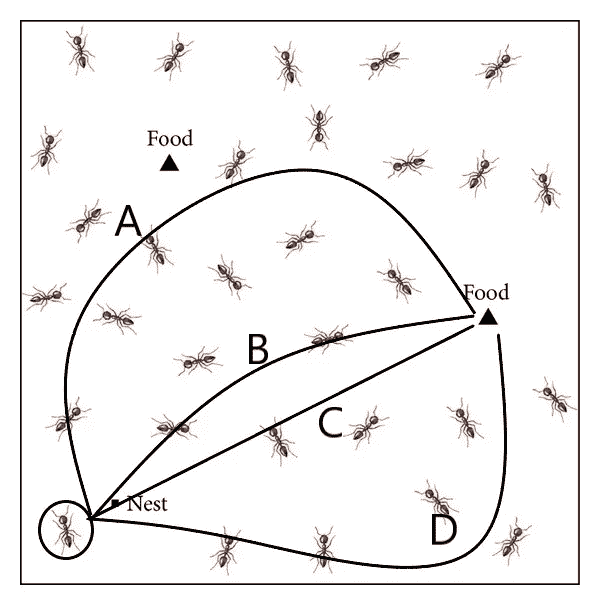

蚂蚁和通向食物来源的不同随机路线[图片由作者提供]

看上图。我圈了一只蚂蚁，那将是我们寻找食物的代理人。现在蚂蚁可以有许多方法来寻找食物。从所有路径中，我随机选择了 4 条路径，分别命名为 A、B、C、d。如图所示，C 是最短的路径，A 是最长的路径。当蚂蚁在任何道路上寻找食物时，它会释放一种叫做 [**信息素**](https://www.sciencedirect.com/topics/agricultural-and-biological-sciences/trail-pheromone#:~:text=In%20ants%2C%20trail%20pheromones%20are,from%20the%20abdominal%20sternal%20glands.) 的化学物质。据此，在从所有路线走的同时，蚂蚁会释放信息素。

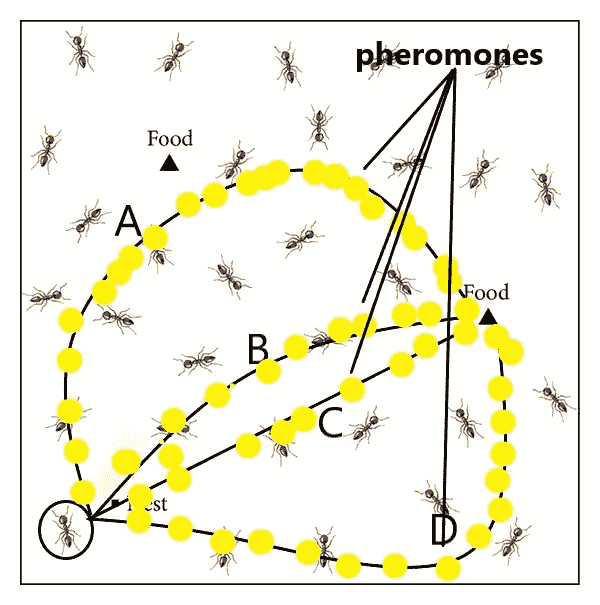

蚂蚁路上的信息素水平[图片由作者提供]

当蚂蚁到达食物时，每条路线上都沉积了一定量的信息素，如上图所示。找到食物或觅食者的动物会在返回蚁群的途中用信息素标记路径。较短的路线将有更多的信息素水平。其他蚂蚁会沿着含有更多信息素的路线前进，这些信息素是代表到达食物的最短路线的信号。基于**蚂蚁密度** & **蚂蚁数量，在蚂蚁从一个位置到另一个位置的每次移动中更新信息素。**

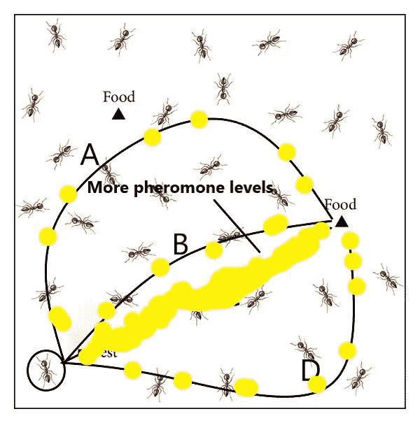

信息素的蒸发和沉积[图片由作者提供]

信息素有一些**的蒸发率。**这意味着储存的信息素会在一段时间后消失。正如你在上面的图中看到的，大多数蚂蚁跟随领头蚂蚁的信息素的路线有最多的信息素沉积，而其他较长的路线由于蒸发而有很少的信息素。

当食物来源完成时，返回的蚂蚁不会在途中标记新的标记。

## 蚂蚁和食物在现实生活中到底发生了什么？

> 所有的蚂蚁都在它们的窝里。地上没有信息素的痕迹。
> 
> 觅食开始，50%的蚂蚁会选择最短的路径，50%的蚂蚁会选择更长的路径。
> 
> ***蚂蚁使用最短的路径，更早到达食物源。***
> 
> ***信息素标记在较短的路径上有较强的信息素信号。该路径被其他蚂蚁选择的概率增加。***

## *蚁群优化的步骤:*

## 1.初始化 ACO 参数

我们可以初始化许多初始参数，如种群大小、最大迭代次数、初始信息素值、信息素指数权重、信息素蒸发率等。

## 2.溶液结构

以正确的方式，问题陈述的公式化和迭代计算。

## 3.每个代理/蚂蚁在起始节点的位置

它也被称为转移概率。

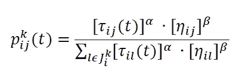

转移概率[[图像源](https://stackoverflow.com/questions/41796882/aco-pheromone-update)

这里，第 k 只蚂蚁将以这个概率从 *i* 移动到 *j* 。

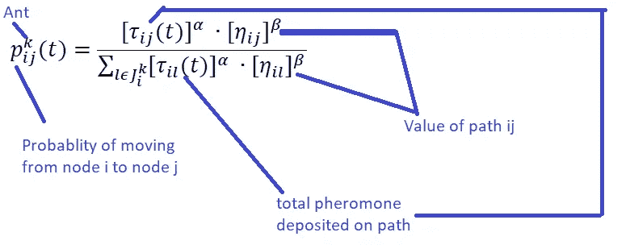

## 4.每个蚂蚁将通过应用转移规则来选择下一个节点。

## 5.重复直到 ant 构建出最佳解决方案

## 6.计算适合度值

## 7.更新最佳解决方案

*If ant4(解)<最佳解:*

*考虑 ant4(解决方案)=最佳解决方案*

## 8.应用外部信息素更新

信息素试验水平的提高=最佳解决方案

信息素水平下降=最差解决方案

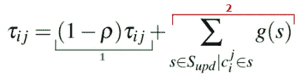

信息素更新方程[ [图片来源](https://towardsdatascience.com/swarm-intelligence-inside-the-ant-colony-9ffbce22a736)

信息素沉积和蒸发计算也很重要。

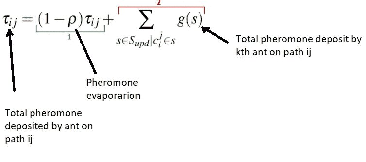

## 9.最佳解决方案

循环到最大迭代次数以得出最佳解决方案。这又是一个超参数。

[**蚁群优化**](https://web2.qatar.cmu.edu/~gdicaro/15382/additional/aco-book.pdf) 作者 ***马可·多里戈******Thomas stu tzle 在书中给出了一个有趣的实验。***

第一个实验中的桥有两个长度相同的分支。蚂蚁最初被允许在巢穴和食物供应之间自由走动，并测量了蚂蚁喜欢两个分支中的一个而不是另一个的比例。久而久之，蚂蚁被注意到了。结果是，尽管最初的选择是随机的，但最终，每只蚂蚁都选择使用同一个分支。以下解释解释了这一结果。当试验开始时，两个分支上没有信息素。蚂蚁以相同的概率选择任何分支，因为它们没有偏好。然而，由于随机变化，更多的蚂蚁会选择一个分支而不是另一个。由于蚂蚁在移动时会沉积信息素，所以上面有更多蚂蚁的树枝会有更多的信息素。

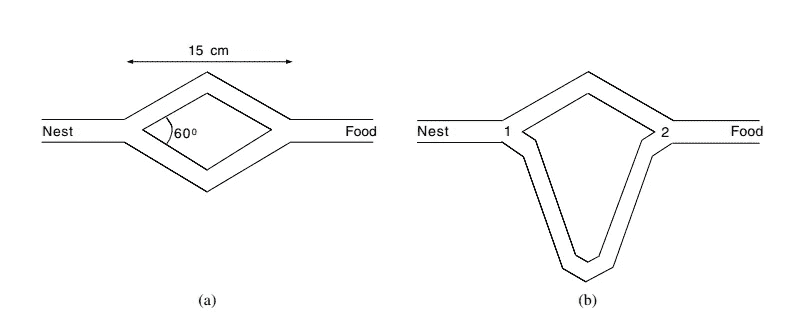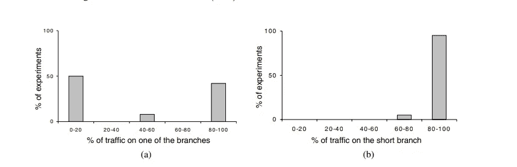

蚂蚁如何选择路线[ [图片来源](https://web2.qatar.cmu.edu/~gdicaro/15382/additional/aco-book.pdf)

更多的信息素会鼓励更多的蚂蚁再次选择那个分支，如此循环，直到蚂蚁最终聚集在两个分支中的一个上。

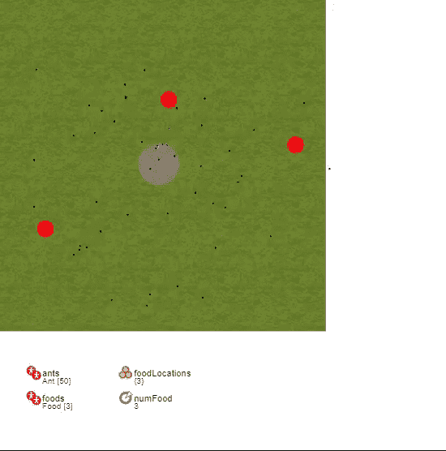

模拟 ACO【演员表: [**此处**](https://cloud.anylogic.com/model/a3451bf1-55da-4884-ad65-cb13e724c19e?mode=SETTINGS)

你可以在这里得到这个模拟**。**

**[**any logic cloud**](https://cloud.anylogic.com/models)有很多基于现实生活场景的不同而有趣的模拟你可以在这里查看**。****

# ****最后的话:****

****通过结合群体行为，蚁群算法和粒子群优化算法都是数据聚类方法。然而，ACO 更相关。解决源和目的地被清楚地识别和预设的问题。此外，PSO 是一种多目标、动态优化和约束管理的聚类技术。ACO 更适合需要精确解决方案的问题。蚁群优化算法已被应用于许多组合优化问题，从二次分配到折叠蛋白质或路径车辆，并且许多衍生方法已被应用于实变量中的动态问题、随机问题、多目标和并行实现。****

****这只是对 ACO 的一个理论概述，但是我计划进行一个案例研究来实现 ACO。我已经写了一篇关于自然启发的算法的博客，关于遗传算法优化****。**你可以看到。******

# ****如果你觉得这篇文章很有见地****

****如果你觉得这篇文章很有见地，请关注我的 [**Linkedin**](https://www.linkedin.com/in/chinmay-bhalerao-6b5284137/) 和 [**medium**](https://medium.com/@BH_Chinmay) 。你也可以 [**订阅**](https://medium.com/@BH_Chinmay) 在我发表文章的时候得到通知。让我们创建一个社区！感谢您的支持！****

# ****如果你想支持我:****

****作为你的关注和鼓掌是最重要的事情，但你也可以通过买咖啡来支持我。****咖啡。********

**** [## 10 个让你兴奋不已的人工智能网站！

### 有趣的基于人工智能的网站及其工作方式

pub.towardsai.net](/10-ai-websites-that-will-excite-you-to-the-core-3b08a3b9868b)  [## 遗传算法优化

### 进化和自然启发优化算法的详细解释

pub.towardsai.net](/genetic-algorithm-optimization-8299856949d3)  [## 数据的特征选择技术

### 启发式和进化特征选择技术

medium.com](https://medium.com/mlearning-ai/feature-selection-techniques-for-data-57f0eacd8fa8)  [## 同步定位和绘图系统

### 超越 DROID-SLAM 系统简介

medium.com](https://medium.com/geekculture/simultaneous-localization-and-mapping-slam-systems-44d4369fcb46) 

结束，

钦迈·巴勒劳****