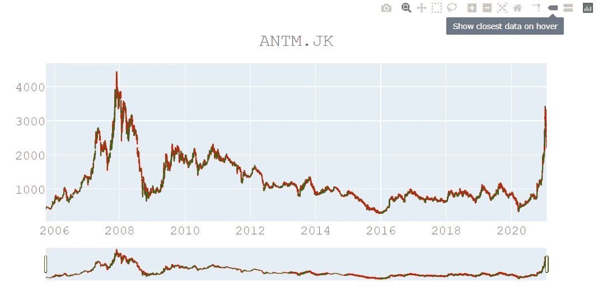
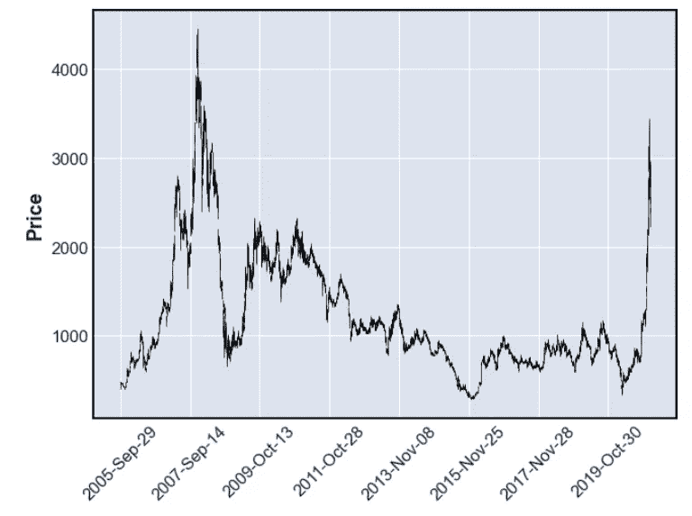
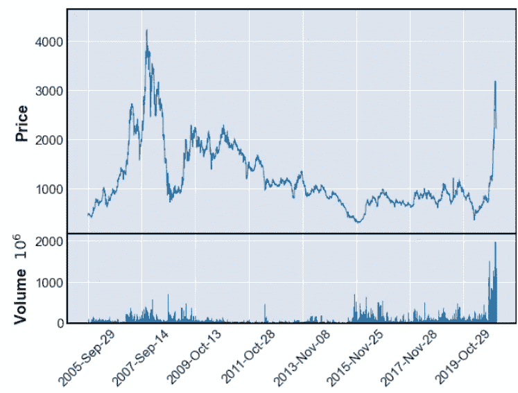
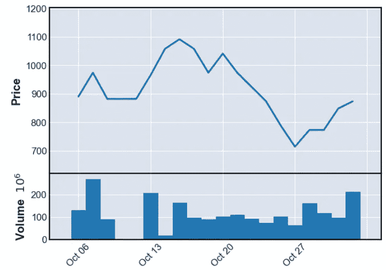
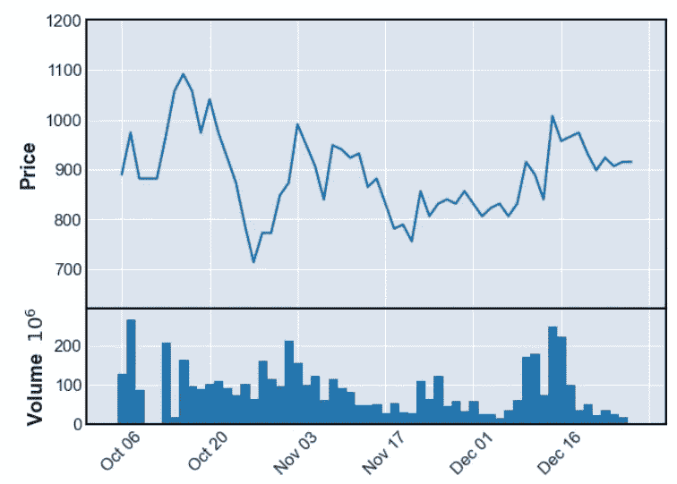
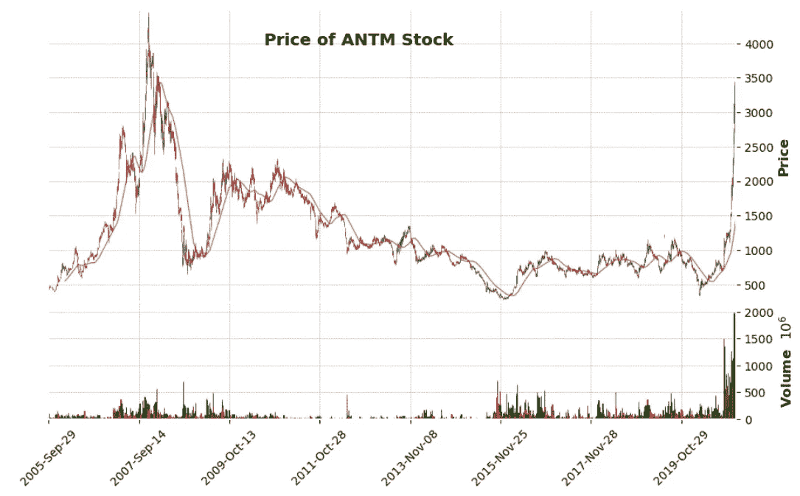

# 用 Plotly 和 Mplfinance 实现 ANTM 股票可视化

> 原文：<https://pub.towardsai.net/antm-stocks-visualization-with-plotly-and-mplfinance-5044dfe73146?source=collection_archive---------4----------------------->

## [数据可视化](https://towardsai.net/p/category/data-visualization)

## 如何用 python 搭建烛台？


[M. B. M.](https://unsplash.com/@m_b_m?utm_source=unsplash&utm_medium=referral&utm_content=creditCopyText) 在 [Unsplash](https://unsplash.com/s/photos/stocks?utm_source=unsplash&utm_medium=referral&utm_content=creditCopyText) 上的照片

ANTM.JK 是目前印度尼西亚最受欢迎的股票之一。我很好奇根据历史数据，它的表现如何。所以，我试着把 ANTM.JK 的历史数据可视化，如果你想练习，请按照这些大纲:

[**1。先决条件**](#5d1a)

[**2。加载数据集和库**和](#e327)

[**3。用 plottly**可视化](#77c7)

[**4。使用 Mplfinance 进行可视化**](#e6dd)

[**5。**结论](#cb34)

这是我们将要涉及的细节。

# 1.先决条件

我们只专注于建立一个烛台阴谋。在可视化数据之前，python 中至少应包含以下包:

**a.** [**Pandas 包**](https://pandas.pydata.org/) **:** pandas 是分析数据、聚合或操作数据的最强大的 python 包。大多数使用这个包的数据从业者。

**b. Plotly 包**:这个包在 python 中构建交互式可视化。更多关于 plotly 的内容，请点击[这个](https://pypi.org/project/plotly/)链接。

**c. Mplfinance 软件包**:这是一个可以轻松分析数据，尤其是财务数据的软件包。查看更多关于 [mplfinance](https://pypi.org/project/mplfinance/) 。

要在 Jupyter 笔记本中安装这些包，您可以编写如下代码:

```
!pip install pandas
!pip install plotly
!pip install mplfinance
```

**d .下载数据集**:哦，对。别忘了下载关于 ANTM.JK 的数据集，你可以在[雅虎财经](https://finance.yahoo.com/quote/ANTM.JK/history?period1=1127952000&period2=1611619200&interval=1d&filter=history&frequency=1d&includeAdjustedClose=true)或者[投资](https://www.investing.com/equities/aneka-tambang-historical-data)下载数据集。请在最大化中设置一个日期。我们可以看到 2012 年到 2021 年 1 月的数据集。我们希望看到表演从 2012 年移到 2021 年。

在我们准备好所有先决条件后，让我们构建可视化财务数据！

# 2.加载数据集和库

要加载数据集，您可以编写如下所示的代码:

在数据帧之前

上面的代码显示我们正在导入 pandas、os、mplfinance 和 plotly。然后，读取“antm_history.csv”的数据集，其中包含按日期排序的值。

# 3.用 Plotly 可视化

> **a .检查缺失值**

为了可视化数据，我们必须有一个干净的数据集。因此，当我们有一些丢失的值时，我们必须检查数据的清洁和清理。

检查缺失值

上面的代码显示我们在 2019–06–19 有一个缺失值。因此，我们可以删除它，使数据集变得干净。

> **b .用日期**设置索引

在我们开始绘制烛台之前，我们必须用下面的代码将日期设置为数据集的索引:

设定指数的日期

> **c .用 plotly 绘制烛台**

好了，我们准备好绘制烛台了。遵循下面的代码来开发一个交互式的蜡烛图。



烛台阴谋与阴谋

为了理解情节:

*   那一天，绿色意味着涨价。
*   平均红色在那天降低了价格。
*   要选择你想要的年份，你必须滑动底部图表(小图表)上的两根滑杆。
*   在 2008 年，我们发现有一些缺失的数据。因为蜡烛图，所以有一个截止。您可以修复它，在某个特定日期用平均值或中值处理它，该日期有一个缺失值。

从这种形象化中，我们知道了 ANTM 表演是如何进行的。从 2005 年到 2021 年。那么，在你看来表演工作怎么样？

# 4.使用 Mplfinance 实现可视化

> **a .简单的价格绘制**

要绘制一个简单的价格图，只需编写如下代码:

```
mpl.plot(df1)
#mpl is mplfinance
```



简单情节

> **b .价格和成交量绘制**

你可以开发一个可视化的价格和交易量。像这样:

```
mpf.plot(df1, type = 'line', volume = True)
```



价格和交易量的曲线图

> **c .绘图指定年月**

我们可以绘制指定的年和月，这里我们绘制 2008-10:

```
mpf.plot(df1['2008-Oct'],type='line',volume = True)
```



2008 年 10 月 ANTM 视觉化

> **d .绘制月份范围**

我们想绘制 2008 年 10 月至 12 月的地图。

```
mpf.plot(df1['2008-Oct':'2008-Dec'],type='line',volume = True)
```



2008 年 10 月-11 月 ANTM 视觉化

> e.移动平均线绘图

我们想要用 20 x 21 的图形比率和 90 天的移动平均值来制作一个图。

```
mpf.plot(df1,figratio=(20,12),
         type = 'candle', title = 'Price of ANTM Stock',
         mav=(90), volume = True, tight_layout=True, style='charles')
```



# 5.结论

可视化很容易，对吧？在这里，我们可以看到折线图、直方图和折线图。我们想象:

*   ANTM 价格的开盘价、最低价、最高价和最低价。
*   交易量
*   移动平均数
*   用 mplfinance 是如此简单和低代码，但不是交互式的
*   与 mplfinance 相比，plotly 需要更多的代码编写，但需要交互。

那么，你选择了哪一个？

快乐学习！

# 我的另一个作品:

1.  [**刮印尼股票排行榜**](https://medium.com/towards-artificial-intelligence/scraping-the-list-of-indonesian-stocks-4bdb32ffe88)
2.  [**机器学习用低码**](https://medium.com/towards-artificial-intelligence/machine-learning-with-low-code-75d152172e4b)
3.  [**如何轻松安装 Apache Kafka Windows？**](https://medium.com/analytics-vidhya/how-to-installing-apache-kafka-on-windows-easily-305ba14502b0)
4.  **D** [**正确检测和处理异常值**](https://medium.com/analytics-vidhya/detect-and-handling-outliers-53723d8ec17a)
5.  [**Shell 脚本**](https://medium.com/analytics-vidhya/basic-tutorial-shell-scripting-on-unix-65a5051e2e8f)**Unix 上**
6.  [**常见秘籍写作中等**](https://ronnyfahrudin.medium.com/common-cheat-sheets-medium-that-you-have-to-know-451c843aaef9)

来源:

[1][https://github . com/ronnyfahrudin/Machine-Learning-for-Trading-Specialization/blob/main/Visualization % 20 stocks/ANTM % 20 Visualization . ipynb](https://github.com/ronnyfahrudin/Machine-Learning-for-Trading-Specialization/blob/main/Visualization%20stocks/ANTM%20visualization.ipynb)