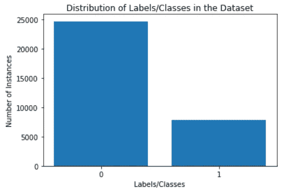
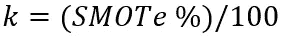
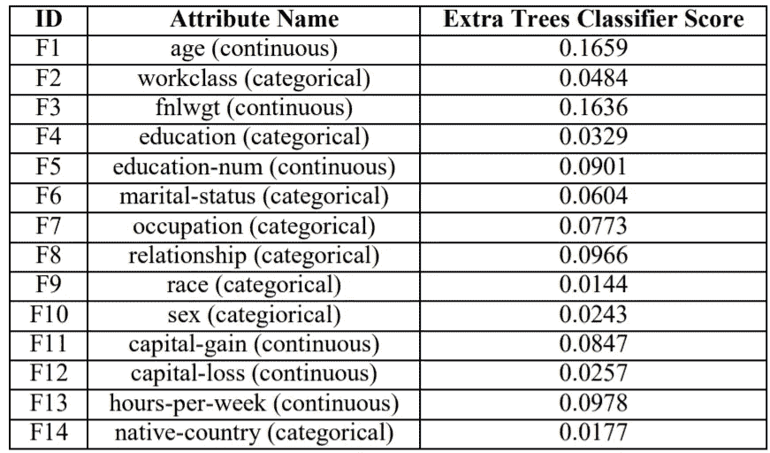
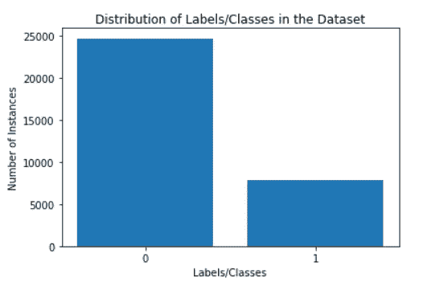
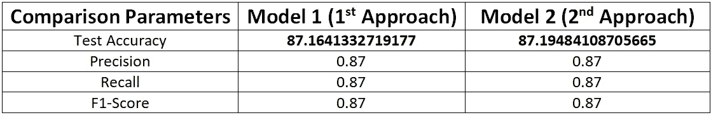

# 综合少数过采样技术在不平衡数据集上的应用

> 原文：<https://pub.towardsai.net/application-of-synthetic-minority-over-sampling-technique-smote-for-imbalanced-data-sets-509ab55cfdaf?source=collection_archive---------1----------------------->

## [数据挖掘](https://towardsai.net/p/category/data-mining)


在数据科学中，不平衡的数据集并不奇怪。如果用于分类问题的数据集，如情感分析、医学成像或其他与离散预测分析(例如航班延误预测)相关的问题，对于不同的类别具有不同数量的实例(样本或数据点)，则这些数据集被称为不平衡的。这意味着由于属于每个类的实例数量之间的巨大差异，数据集中的类之间存在不平衡。相对于具有相对大量样本的类(称为**多数**)，具有相对较少实例的类被称为**少数**。不平衡数据集的示例如下:



这里有两个带标签的类别: **0** 和 **1** 带**总不平衡**

用这种不平衡的数据集训练机器学习模型，通常会导致模型对多数类产生一定的偏见。

为了解决类不平衡的问题，Chawla 等人[3]在 2002 年引入了合成少数过采样技术(SMOTe)。

> **SMOTe 的简要说明**

1.  SMOTe 是一种基于最近邻的技术，通过特征空间中数据点之间的欧几里德距离来判断。
2.  存在过采样的百分比，其指示要创建的合成样本的数量，并且该过采样的百分比参数总是 100 的倍数。如果过采样的百分比是 100，那么对于每个实例，将创建一个新的样本。因此，少数类实例的数量将会翻倍。类似地，如果过采样的百分比是 200，那么少数类样本的总数将增加两倍。

在 SMOTe，

*   对于每个少数实例，找到 k 个最近邻居，使得它们也属于同一类，



*   找到所考虑实例的特征向量和 k 个最近邻居的特征向量之间的差异。因此，获得了 k 个差向量。
*   k 个差向量中的每一个都乘以 0 和 1 之间的随机数(不包括 0 和 1)。
*   现在，差向量在乘以随机数之后，在每次迭代时被添加到所考虑的实例(原始少数实例)的特征向量。

下面是用 Python 从头开始实现 SMOTe 的过程

```
import numpy as npdef **nearest_neighbour**(X, x, K):
    euclidean = np.ones(X.shape[0]-1)
    k = 0
    for j in range(0,X.shape[0]):
        if np.array_equal(X[j], x) == False:
            euclidean[k] = sqrt(sum((X[j]-x)**2))
            k = k + 1
    indices=list(sorted(range(len(euclidean)), key=lambda j: euclidean[j]))
    difference = []
    for j in range(0, K):
        difference.append((abs(x-X[indices[j]])))
    weight = random.random()
    while(weight == 0):
        weight = random.random()
    additive = np.multiply(difference,weight)
    return additivedef **SMOTE**(X, K):
    K = int(K/100)
    new = [None]*(K*X.shape[0]*X.shape[1])
    new = np.array(new).reshape(K*X.shape[0],X.shape[1])
    k = 0
    for i in range(0,X.shape[0]):
        additive = nearest_neighbour(X, X[i], K)
        for j in range(0, K):
            new[k] = X[i] + additive[j]
            k = k + 1
    return new
```

# SMOTe 在实践中的应用

让我们考虑来自 UCI 的包含 48842 个实例和 14 个属性/特征的 [**成人人口普查收入预测数据集**](https://www.kaggle.com/uciml/adult-census-income) 。

> **用 Python 实现数据预处理:**

1.  **标签编码**用于表 1(下面给出)中提到的分类(非数字)特征和标签*收入。*
2.  **特征选择**基于额外树分类器在整个数据集上给出的特征重要性分数来完成(如表 1 所示)。由于*种族和本国*给出了最低的特征重要性分数，这两个特征在模型开发中被排除。
3.  **一键编码**用于具有两个以上类别的分类特征。在一位热编码中，分类特征分成子特征，每个子特征对应于其类别之一(主要分类特征),假设二进制值为 0/1。在这里，分类特征、*工作类别*、*教育程度*、*婚姻状况*、*职业、*和*关系*被一键编码。由于*性别*是一个只有两个子类别的特征(*男性*和*女性*)，因此不再进行一键编码以避免维数灾难。



**表 1**

在特性选择后用 Python 实现一键编码…

```
import numpy as np
import pandas as pd
from sklearn.preprocessing import OneHotEncoder# **Label Encoding and Feature Selection is over ....**# **1\. Loading the modified dataset after Label Encoding**
df = pd.read_csv('adult.csv') 
# Loading of Selected Features into X
X = df.iloc[:,[0,1,2,3,4,5,6,7,9,10,11,12]].values# Loading of the Label into y
y = df.iloc[:,14].values# **2\. One Hot Encoding ....**
onehotencoder = OneHotEncoder(categorical_features = [1,3,5,6,7])
X = onehotencoder.fit_transform(X).toarray()
```

现在，这个问题中的类标签是**二进制**。这意味着类别标签假定有 2 个值，即有 2 个类别。所以，这是一个二元分类问题。

> **班级分布可视化**

```
# **Getting the no. of instances with Label 0**
n_class_0 = df[df['income']==0].shape[0]# **Getting the no. of instances with label 1**
n_class_1 = df[df['income']==1].shape[0]# **Bar Visualization of Class Distribution** import matplotlib.pyplot as plt # required libraryx = ['0', '1']
y = np.array([n_class_0, n_class_1])
plt.bar(x, y)
plt.xlabel('Labels/Classes')
plt.ylabel('Number of Instances')
plt.title('Distribution of Labels/Classes in the Dataset')
```



**成人数据集中的类别分布**

因此，在给定的数据集中，在类标签为“1”的少数类和类标签为“0”的多数类之间存在严重的不平衡。

现在，有两种可能的方法:

1.  将数据集混洗并分成训练集和验证集，并对训练数据集应用 SMOTe。(**第一次接近**)
2.  将 SMOTe 作为一个整体应用于给定的数据集，然后将数据集混洗分割成训练集和验证集。(**第二种方法**)

在 Stack Overflow 等许多网络资源和许多个人博客中，第二种方法被称为**错误的过采样方法**。特别是，我看过尼克·贝克尔的个人博客【1】，他提到第二种方法是错误的，理由如下:

"*SMOTe 在整个数据集上的应用创建了相似的实例，因为该算法基于 k-最近邻理论。由于这个原因，在给定数据集上应用 SMOTe 后进行分割，会导致信息从验证集泄漏到训练集，从而导致分类器或机器学习模型高估其准确性和其他性能指标*

他还通过考虑数据集，借助实际生活中的例子证明了这一点。他使用了不平衡学习工具箱[2]来应用 SMOTe。说实话，我自己从来没有真正弄清楚工具箱的文档。因此，我更喜欢像上面演示的那样从头开始实现 SMOTe 算法。在这篇文章中，我将证明第二种方法是**没有错**！！！

让我们遵循第一种方法，因为它已被广泛接受。

为了证明第二种方法没有错，我将把整个数据集分成**训练验证**和**测试**组。测试集将作为未知的实例集保持独立。同样的实现如下—

```
from sklearn.model_selection import train_test_split 
X_train, X_test, y_train, y_test = train_test_split(X, y,
                                   test_size=0.2, random_state=1234)
# **X_train and y_train is the Train-Validation Set**
# **X_test and y_test is the Test Set separated out**
```

1.  现在，在**训练验证**组中，第一和第二种方法将根据具体情况应用。
2.  然后，将对两个模型(按照第一种方法和第二种方法开发)的相同独立的未知实例集(**测试集**)进行性能分析

> **遵循分割后使用 SMOTe 的第一种方法**

= >将**训练验证**集合拆分为**训练**和**验证**集合。同样的实现如下—

```
X_train, X_v, y_train, y_v = train_test_split(X_train, y_train,
                             test_size=0.2, random_state=2341)
# **X_train and y_train is the Training Set** # **X_v and y_v is the Validation Set**
```

= >仅对训练集应用 SMOTe

```
# **1\. Getting the number of Minority Class Instances in Training Set**
import numpy as np # required library
unique, counts = np.unique(y_train, return_counts=True)
minority_shape = dict(zip(unique, counts))[1]# **2.** **Storing the minority class instances separately**
x1 = np.ones((minority_shape, X_train.shape[1]))
k=0
for i in range(0,X_train.shape[0]):
    if y_train[i] == 1.0:
        x1[k] = X_train[i]
        k = k + 1# 3\. **Applying 100% SMOTe** sampled_instances = SMOTE(x1, 100)# **Keeping the artificial instances and original instances together**
X_f = np.concatenate((X_train,sampled_instances), axis = 0)
y_sampled_instances = np.ones(minority_shape)
y_f = np.concatenate((y_train,y_sampled_instances), axis=0)
# **X_f and y_f are the Training Set Features and Labels respectively** 
```

> **使用梯度推进分类器的模型训练**

梯度提升分类器用于训练机器学习模型。网格搜索用于梯度推进分类器，以获得最佳的超参数集，即估计器的数量和 max_depth。

```
from sklearn.ensemble import GradientBoostingClassifier
from sklearn.model_selection import GridSearchCVparameters = {'n_estimators':[100,150,200,250,300,350,400,450,500],
              'max_depth':[3,4,5]}
clf= GradientBoostingClassifier()
grid_search = GridSearchCV(param_grid = parameters, estimator = clf,
                           verbose = 3)grid_search_1 = grid_search.fit(X_f,y_f)
```

> **遵循分割前使用 SMOTe 的第二种方法**

= >对整个**训练验证**集合应用 SMOTe:

```
# **1\. Getting the number of Minority Class Instances in Training Set**
unique, counts = np.unique(y_train, return_counts=True)
minority_shape = dict(zip(unique, counts))[1]# **2.** **Storing the minority class instances separately**
x1 = np.ones((minority_shape, X_train.shape[1]))
k=0
for i in range(0,X_train.shape[0]):
    if y_train[i] == 1.0:
        x1[k] = X_train[i]
        k = k + 1# 3\. **Applying 100% SMOTe** sampled_instances = SMOTE(x1, 100)# **Keeping the artificial instances and original instances together**
X_f = np.concatenate((X_train,sampled_instances), axis = 0)
y_sampled_instances = np.ones(minority_shape)
y_f = np.concatenate((y_train,y_sampled_instances), axis=0)
# **X_f and y_f are the Train-Validation Set Features and Labels respectively**
```

= >将**训练验证**组拆分为**训练**和**验证**组。同样的实现如下—

```
X_train, X_v, y_train, y_v = train_test_split(X_f, y_f,
                             test_size=0.2, random_state=9876)# **X_train and y_train is the Training Set** # **X_v and y_v is the Validation Set**
```

> **使用梯度推进分类器的模型训练**

类似地，网格搜索应用于梯度推进分类器

```
from sklearn.ensemble import GradientBoostingClassifier
from sklearn.model_selection import GridSearchCVparameters = {'n_estimators':[100,150,200,250,300,350,400,450,500],
              'max_depth':[3,4,5]}
clf= GradientBoostingClassifier()
grid_search = GridSearchCV(param_grid = parameters, estimator = clf,
                           verbose = 3)grid_search_2 = grid_search.fit(X_train,y_train)
```

> **性能分析和比较**

用于比较和分析的性能指标有:

1.  测试装置上的精度**(测试精度)**
2.  测试装置上的精度
3.  **召回测试装置上的**
4.  ****f1-测试集上的**得分******

****除了这些比较度量，还计算训练准确度(训练集)和验证准确度(验证集)。****

```
**# **MODEL 1 PERFORMANCE ANALYSIS** model1 = GradientBoostingClassifier(n_estimators = 250, max_depth = 5).fit(X_f, y_f) **# best hyperparameters obtained from grid_search_1**# **1\. Training Accuracy for Model 1 (following Approach 1)**
print(grid_search_1.score(X_f, y_f))# **2\. Validation Accuracy on Validation Set for Model 1** 
print(grid_search_1.score(X_v, y_v))# **3\. Test Accuracy on Test Set for Model 1**
print(grid_search_1.score(X_test, y_test))# **4\. Precision, Recall and F1-Score on the Test Set for Model 1**
from sklearn.metrics import classification_report
predictions=grid_search_1.predict(X_test)
print(classification_report(y_test,predictions))# **MODEL 2 PERFORMANCE ANALYSIS** model2 = GradientBoostingClassifier(n_estimators = 300, max_depth = 4).fit(X_train, y_train) **# best hyperparameters obtained from grid_search_2**# **5\. Training Accuracy for Model 2(following Approach 2)**
print(grid_search_2.score(X_train, y_train))# **6\. Validation Accuracy on Validation Set for Model 2**
print(grid_search_2.score(X_v, y_v))# **3\. Test Accuracy on Test Set for Model 2**
print(grid_search_2.score(X_test, y_test))# **4\. Precision, Recall and F1-Score on the Test Set for Model 2**
from sklearn.metrics import classification_report
predictions=grid_search_2.predict(X_test)
print(classification_report(y_test,predictions))**
```

****模型 1 和模型 2 的训练集和验证集精度为:****

1.  ****训练准确率(模型 1):91.6586585866686****
2.  ****训练准确率(模型 2):92.533327%****
3.  ****验证的准确性(模型 1):86.32%。56860.88868888661****
4.  ****验证的准确性(模型 2):89.5864645868686****

****因此，从这里显然**第二种方法**显示了更高的验证精度，但是没有在完全未知的相同测试集上进行测试，无法得出任何结论。表 2 显示了两个模型在测试集上的性能对比图。****

********

****表 2****

****因此，很明显，已经证明无论差异有多小**方法 2 显然比方法 1** 更成功，因此，不能说 Nick Becker [1]的上述理由是错误的，因为****

*****“虽然 SMOTe 创建了类似的实例，但另一方面，该属性不仅对于类别不平衡减少和数据增加是必需的，而且对于找到适合于模型训练的最佳训练集也是必需的。如果训练集不通用，如何增强模型性能？就从验证到训练集的信息流失而言，即使它发生，它也有助于使训练集变得更好，并有助于稳健的机器学习模型开发，因为已经证明，对于完全未知的实例，* ***方法 2*** *比* ***方法 1*******

> *****参考*****

*****[1][https://beckernick.github.io/oversampling-modeling/](https://beckernick.github.io/oversampling-modeling/)*****

*****[https://imbalanced-learn.readthedocs.io/en/stable/](https://imbalanced-learn.readthedocs.io/en/stable/)*****

*****[3] Chawla，Nitesh V .等人，“SMOTE:合成少数过采样技术”人工智能研究杂志 2002 年第 16 期:321–357 页。*****