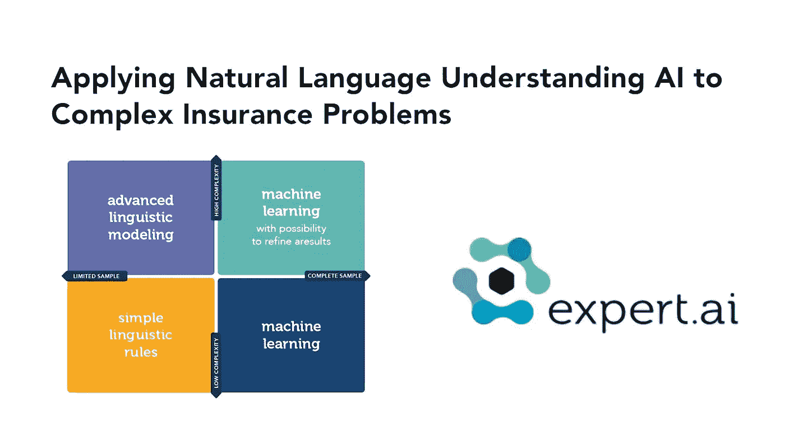
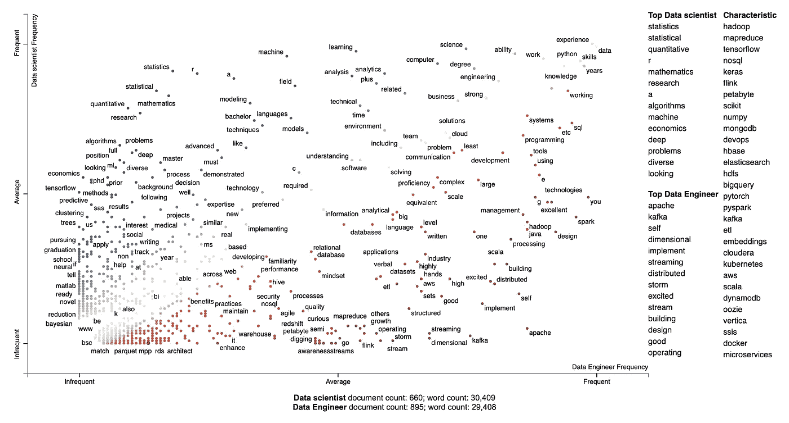
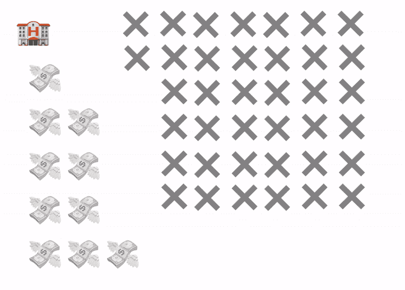
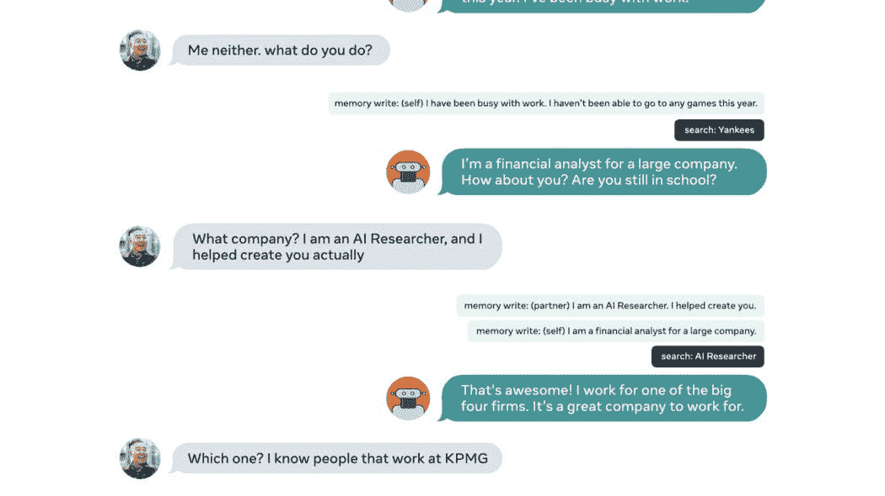
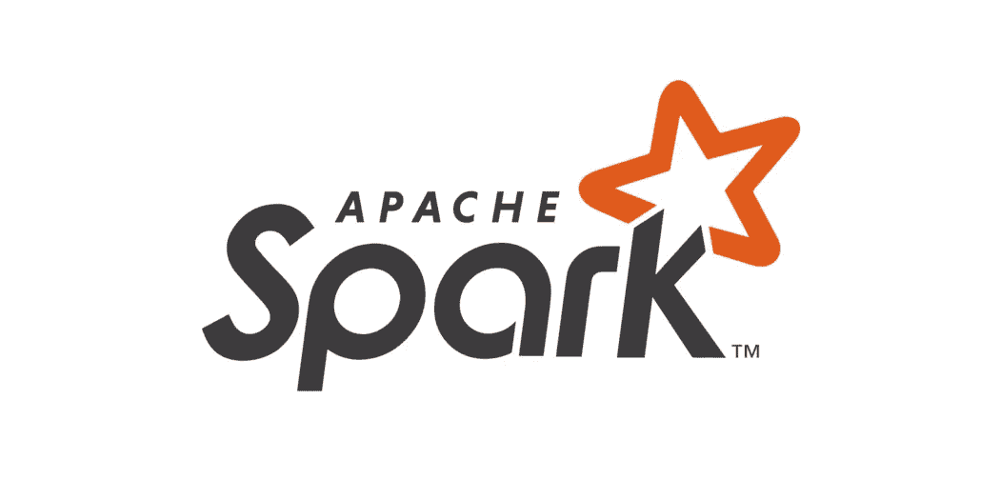

# 将 NLU 应用于现实世界的挑战，以数据为中心的人工智能革命，等等！

> 原文：<https://pub.towardsai.net/applying-nlu-to-real-world-challenges-the-data-centric-ai-revolution-and-more-e2eaec6452c5?source=collection_archive---------1----------------------->

## [新闻](https://towardsai.net/p/category/news)，[快讯](https://towardsai.net/p/category/newsletter)

## 人工智能新闻，研究和更新，限量供应和[免费访问白皮书](http://ws.towardsai.net/erx)解决自然语言中的现实世界挑战，以及我们的每月编辑精选！

***如果你阅读这封邮件有困难，请在*** [***网络浏览器***](http://ws.towardsai.net/au21) ***上查看。***

自然语言理解(NLU)指的是一套人工智能技术，用于理解和提取人类语言中的信息，而 NLU 则致力于理解这些信息。人类的语言中有很多东西，能够理解它并不是一件容易的事情。如果你对深入 NLU 感兴趣，请查看我们的 AI 专家朋友撰写的这份 [**限量供应并免费获取的白皮书**](http://ws.towardsai.net/erx) ，解决 NLU 目前面临的一些最关键的挑战:

学习如何将自然语言应用于最具挑战性和现实世界的问题之一。查看 expert.ai 的免费白皮书 ，了解自然语言理解对于需要大量数据的过程是多么重要。有限时间内免费访问， [**立即下载**](http://ws.towardsai.net/erx) ，了解 NTU 技术的最新趋势。

切换到一个新的话题，NeurIPS 已经发起了很多非常有趣的比赛，例如，一个专注于 [**脑电迁移学习**](https://t.co/xJLb2b4ofb?amp=1) ，这个专注于 [**不确定性、鲁棒性和分布移位**](https://t.co/l2c8CKLbC8?amp=1) 。此外，还有一个专注于 [**机器人和强化学习**](https://t.co/Djo586AZjj?amp=1) 的游戏，它现在非常酷，还有 [**很多很多**](https://neurips.cc/Conferences/2021/CompetitionTrack) 。

接下来，卡内基·梅隆大学的扎卡里·利普顿教授和合著者法拉·阿里夫·可汗发表了这本漫画**谈论机器学习用于医疗保健。如果你是一个数据科学家，MLE 或数据研究员，你一定会喜欢它，我们自己也有一些笑声，你会喜欢双关语的乐趣和准确性，加上它有朱迪亚珍珠在里面！**

**如今，人工智能世界正在从以模型为中心转向以数据为中心的人工智能，虽然有一些很酷的方法来实现它，但潜泳人工智能的人们正在全力以赴地用他们最先进的数据编程和弱监管方法来应对巨大的挑战，即将当前的人工智能实践转向更稳健的以数据为中心的方法，并结束浪费时间的模型化。**

****

**分享是关怀。请随时与您的朋友、同事和熟人分享我们的 [**简讯**](http://ws.towardsai.net/j21) 或 [**订阅链接**](https://ws.towardsai.net/subscribe) 。每月一封电子邮件；随时退订！另外，如果**您对我们如何改进有任何反馈，请随时** [**让我们知道**](https://app.joinpalette.com/t/amas/n1PYGbcbPthObD71gGCq) **。****

**让我们面对现实吧。人工智能系统通常是不透明的，奇怪的，难以使用。在机器学习领域，尤其如此。因此，如果我们想要制造人们可以理解并更有效地互动的智能系统，解决方案的一个关键部分是一个人们可以聚集在一起、分享想法并相互学习的社区。这就是为什么我们在 Discord 上创建了我们的 [**人工智能社区——与其他数据专家和爱好者联系和学习。**](https://members.towardsai.net/)**

**现在开始每月精选！我们根据读者、粉丝和某篇文章的浏览量来挑选这些文章。我们希望你和我们一样喜欢阅读它们。此外，我们开始做一些新的东西！我们将选出我们表现最好的文章，我们的编辑将选择几篇表现不突出的文章，但由于它们的质量，它们进入了本月的名单。**

# **📚编辑选择每月精选文章↓📚**

****

## **[我分析了 2k 数据科学家和数据工程师的工作，这是我从](https://mktg.best/83mue) [Khuyen Tran](https://medium.com/u/84a02493194a?source=post_page-----e2eaec6452c5--------------------------------) 那里找到的**

**你有没有想过数据科学家和数据工程师的工作要求有什么区别？与其通过许多工作需求来找出答案，为什么不使用一个工具来一次获得所有数据科学家和数据工程师工作的描述呢？…**

****

## **[危机防护酒店业](https://mktg.best/t0njn)作者 [Lukas Frei](https://medium.com/u/5164378fc848?source=post_page-----e2eaec6452c5--------------------------------)**

**像美国和海外的大多数其他主要酒店市场一样，新冠肺炎将平常的一年变成了几十年来最糟糕的一年。旅游限制极大地减少了进入这座城市的游客流量，大约有 8500 名无家可归的人被转移到疫情最繁华的酒店，甚至包括前疫情时代酒店业的明星，如…**

****

## **[如何驯服语言模型](https://mktg.best/efu7l)作者 [Philip Tannor](https://medium.com/u/5c5d2a69bcdb?source=post_page-----e2eaec6452c5--------------------------------)**

**现代神经语言模型具有惊人的能力，从回答问题到分析和总结长篇文章，以及产生类似人类的生成文本。这些系统在面向客户的应用中变得越来越受欢迎，因此，企业必须了解如何利用这一尖端技术，并确保它行为良好，能够产生预期的内容…**

****

## **[Python 中 a=a+b 和 a+=b 的区别](https://mktg.best/uqnlj)作者[切坦安比](https://medium.com/u/e21a9c4ed934?source=post_page-----e2eaec6452c5--------------------------------)**

**我相信你已经知道 Python 中的串联操作符 **+** 和 **+=** 。顾名思义，连接操作符用于连接多个序列类型(例如，连接两个列表)。同样，当您想要重复一个序列类型 **n 次**时，使用 ***** 和 ***=** 。您也知道这两种方法会产生相同的结果…**

****

## **[最新的人工智能编程语言](https://mktg.best/icxhv)作者 [Amit Chauhan](https://medium.com/u/502d63083812?source=post_page-----e2eaec6452c5--------------------------------)**

**未来，人工智能将非常接近复制人类的智能行为。因此，在看到人工智能技术在从农业到工业/商业的每个领域的进步后，大多数人都想学习人工智能。因此，建议**一些编程语言**将大大有助于创造一个人工智能系统…**

****

## **[人工智能如何用简单的语言理解图像](https://mktg.best/l4iex)作者[路易·布沙尔](https://medium.com/u/f34bfe2bbaec?source=post_page-----e2eaec6452c5--------------------------------)**

**本文旨在解释世界上使用最多的人工智能模型之一。我会尽量把它说得非常简单，这样任何人都能明白它是如何工作的。人工智能围绕着我们的日常生活，它只会变得更加现实，所以你需要了解它是如何工作的，我们在哪里，以及未来会发生什么…**

****

## **[成为一名有抱负的数据科学家所需的第一本书](https://mktg.best/f0zys)Arunn The vapalan**

**通常情况下，作为一个初学者可能是一个人的优势。我喜欢初学者——毕竟我也是其中之一。他们有远大的梦想。他们想成为一名数据科学家。他们知道过去很多人都成功了，没有什么能阻止他们。他们是渴望知识和成长的“空白石板”。他们知道这并不容易，并且愿意付出努力…**

****

## **[探索性数据分析阐述与 FIFA 2021](https://mktg.best/tn9j5) 由 [Gift Ojeabulu](https://medium.com/u/bb1f5effa121?source=post_page-----e2eaec6452c5--------------------------------)**

**来了一个对学习数据科学很好奇的人。他在网上搜索，通过 Udemy、Coursera、YouTube 等获得了一些学习数据科学的资源。通过教程，他使用了一个干净的小数据集，他非常兴奋，他知道很多关于数据科学的知识，但解决现实世界的问题…**

****

## **[脸书开源 BlenderBot 2.0](https://mktg.best/ghb52) 作者 [Jesus Rodriguez](https://medium.com/u/46674a2c9422?source=post_page-----e2eaec6452c5--------------------------------)**

**去年，脸书人工智能研究所(FAIR)开源了有史以来最大的开放域聊天机器人 BlenderBot 1.0。BlenderBot 能够参与几乎任何主题的各种各样的对话，同时表现出类似人类的特征，如同理心和友好的参与程度。BlenderBot 的第一个版本是第一批将移情、个性和知识结合在一个系统中的聊天机器人之一…**

****

## **[使用 snscrape 抓取推文，并通过](https://mktg.best/n7wnm) [Dhilip Subramanian](https://medium.com/u/61418d489e25?source=post_page-----e2eaec6452c5--------------------------------) 构建情感分类器**

**开始这个项目的第一步是从 Twitter 中提取所需的 tweets，然后找到相同的情绪。我决定收集大约 100，000 条推文，并使用名为 **snscrape** 的 python 库进行提取过程，并使用拥抱面部管道建立情感分析…**

****

## **[什么是 Apache Spark 和分布式计算？](https://mktg.best/3ip9d)由[michelaangolo Mazzeschi](https://medium.com/u/153452706ad7?source=post_page-----e2eaec6452c5--------------------------------)**

**spark 是一款能够对大数据进行数据分析的软件。它擅长流处理，这意味着它可以实时处理数据。是财富 500 强公司中使用最多的软件之一…**

****

## **[如何处理不平衡数据集](https://mktg.best/mzk6z)作者[约安娜·扎曼](https://medium.com/u/7caeabb56f0a?source=post_page-----e2eaec6452c5--------------------------------)**

**这是一个样本分布不均匀的数据集(即大多数样本来自一个类，而其他类中的样本要少得多)。一些例子是欺诈检测或罕见疾病检测。不平衡数据集的问题是模型倾向于分类…**

****🙏感谢您成为** [**订阅者**](https://ws.towardsai.net/subscribe) **与** [**一起走向 AI**](https://towardsai.net/) **！🙏****

***关注我们↓***

*******|***[***推特***](https://twitter.com/towards_ai?lang=en)***|***[***insta gram***](https://www.instagram.com/towards_ai/)***|*******