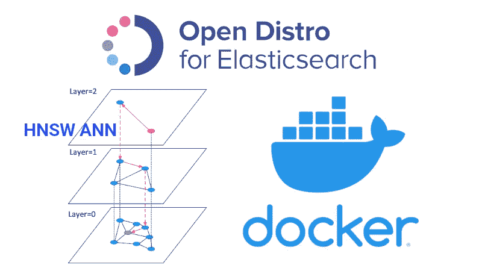
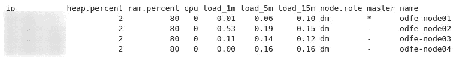
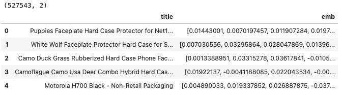
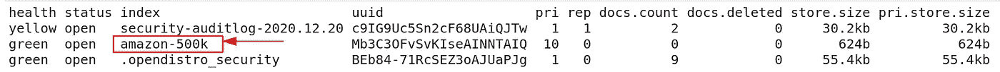
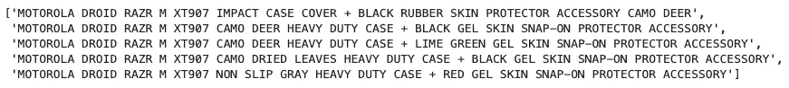
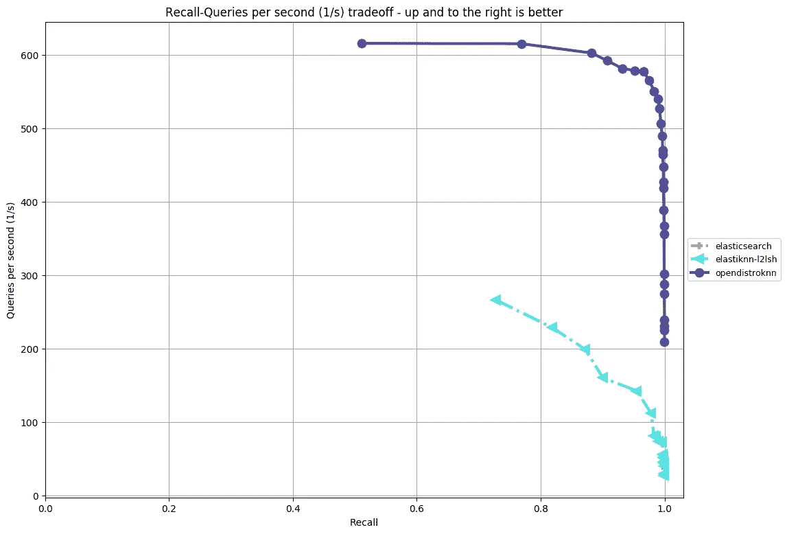

# 基于 Docker 弹性搜索的近似最近邻

> 原文：<https://pub.towardsai.net/approximate-nearest-neighbors-on-elastic-search-with-docker-15342153f22a?source=collection_archive---------1----------------------->

## [数据科学](https://towardsai.net/p/category/data-science)

## 将人工神经网络扩展到“大”数据量

HNSW 人工神经网络在弹性搜索中的应用。图片作者。

Docker 容器对于大规模数据科学至关重要[ [链接](https://blogs.nvidia.com/blog/2020/09/03/what-is-mlops/) ]。“大”数据上的近似最近邻(ann)也是如此！

> 一切都必须在容器中运行

在选择最近邻或相似性搜索算法时，速度和准确性(或召回率)是最重要的两个考虑因素。在我的上一篇文章中， [KNN 死了](https://medium.com/towards-artificial-intelligence/knn-k-nearest-neighbors-is-dead-fc16507eb3e)，我已经证明了人工神经网络在相当的准确性上比 KNN 有巨大的(>300 倍)速度优势。我还讨论了如何在自己的数据集上选择最快、最准确的人工神经网络算法。

然而，有时除了速度和准确性之外，您还需要扩展到大数据量的能力。在这些情况下，跨多台机器分发数据的便利性是第三个要考虑的因素。让我们在这篇文章中用神奇的***【OpenDistro】来解决这三个问题吧，弹性搜索*** [***链接***](https://opendistro.github.io/for-elasticsearch/)**。**

# **为什么选择弹性搜索？**

**对于阅读这篇文章的许多数据科学家来说，ES 可能是一个陌生的概念，所以让我来介绍一下为什么它比您的 it 团队的典型用法更重要。**

**ES 是一个著名的搜索引擎数据库，它为维基百科的海量数据提供了搜索能力。它允许对来自 Hadoop 世界的人进行类似于 Apache Solr 的全文搜索。ES 的分布式特性意味着它可以通过添加更多类似 Hadoop 的服务器/节点来处理大量数据。**

**以下是数据科学家对弹性搜索感兴趣的三个原因。**

1.  *****可扩展 ANN*** : OpenDistro ES 发行版已经将 HNSW ANN 算法实现为插件[ [链接](https://opendistro.github.io/for-elasticsearch/features/knn.html) ]。ES 的分布式特性使其能够将这种高速、高精度的 HNSW 人工神经网络搜索扩展到数百万条记录。**
2.  *****支持*** :大多数现代 IT 和基础设施团队已经熟悉(并且大量使用)ES。作为一名数据科学家，您可能希望 IT 基础架构团队设置和维护服务器硬件，因此使用他们已经熟悉的技术会增加您获得他们支持的机会。这种支持可以决定你的数据科学项目的成败，所以不要低估它！**
3.  *****更简单的堆栈*** : ES 可以作为数据库存储附加字段，然后可以和最近邻一起查询。例如，如果您使用产品名称嵌入搜索最近的邻居，您还可以获得产品价格、类别、添加日期等。只要您将它存储在 ES 中，您就可以在 ANN 搜索期间检索它。这简化了您的应用程序堆栈，因为您可以从一个位置获得您需要的所有信息，而不是从一个位置查询最近的邻居，然后访问另一个数据库来获得所有这些邻居的其他字段。**

# **安装 OpenDistro ES(包括 HNSW)**

**使用 Docker 非常简单。我们将遵循官方文档[ [链接](https://opendistro.github.io/for-elasticsearch-docs/docs/install/docker/) ]中的说明。**

*****重要！*** 这个设置只是为了你在 ES 上实验 HNSW ANN！对于生产设置，请要求您的 IT 基础架构团队设置必要的安全协议。**

## **单机**

1.  **按照 docker 网站[ [链接](https://docs.docker.com/engine/install/) ]上的说明，在您的机器上安装`docker`**
2.  **提取 OpenDistro 的 docker 映像:`sudo docker pull amazon/opendistro-for-elasticsearch:1.12.0`**
3.  **运行 docker 镜像:`sudo docker run --rm -p 9200:9200 -p 9600:9600 -e "discovery.type=single-node" amazon/opendistro-for-elasticsearch:1.12.0`**

**就是这样！现在，您可以与 ES 服务进行交互。**

## **多台机器的集群**

**在您想要在集群中设置的每台机器 中运行以下步骤 ***。 ***再重要！*** 这只是实验性的，没有合适的安全协议不要在生产中使用。*****

1.  *按照 docker 网站[ [链接](https://docs.docker.com/engine/install/) ]的说明，在每台机器上安装`docker`*
2.  *在你的每台机器上提取 OpenDistro 的 docker 镜像:`sudo docker pull amazon/opendistro-for-elasticsearch:1.12.0`*
3.  *按照 docker 网站上的说明安装`docker-compose`*
4.  *创建一个`docker-compose.yml`文件*
5.  *创建一个`elasticsearch.yml`文件*
6.  *启动 ES 服务:`sudo docker-compose up`*

*比如`docker-compose.yml`和`elasticsearch.yml`，看看我的 [Github 库](https://github.com/stephenleo/adventures-with-ann/blob/main/ann_es_docker.ipynb)。*

*如果您遇到任何错误，请尝试按照[ [链接](https://github.com/opendistro-for-elasticsearch/opendistro-build/issues/329):`sudo sysctl -w vm.max_map_count=262144.`更新虚拟机映射计数*

## *检查 ES 状态*

*在每台机器上完成上述步骤后，您可以使用`curl -XGET <ip_address_of_any_node>:9200/_cat/nodes?v -u <username>:<password> —- insecure`来检查集群的状态。您应该会看到集群中的所有节点。*

**

*es 集群中所有节点的示例。图片作者。*

# *将专家系统用于人工神经网络*

## *打开要加载到 ES 中的数据框架。*

*我们将使用在我之前的帖子[中使用的相同的亚马逊 500K 产品数据集，KNN 死了！](https://medium.com/towards-artificial-intelligence/knn-k-nearest-neighbors-is-dead-fc16507eb3e)*

**

*我们将加载到 ES 中的数据帧的头部。[来源](https://github.com/stephenleo/adventures-with-ann/blob/main/ann_es_docker.ipynb)*

## *使用 HNSW 创建 ES 索引*

*一旦你安装了 OpenDistro ES，我们需要创建一个包含我们所有数据的 ES 索引。这可以通过使用 Python 请求库或者使用 Python [ElasticSearch 库](https://elasticsearch-py.readthedocs.io/en/7.10.0/) : `pip install elasticsearch`来完成。在本文中，我将使用 ElasticSearch 库。*

*在这一步，我们需要指定 HNSW 参数`ef_construction and M`作为 ES 索引设置的一部分。我们还需要指出是否使用`l2 (euclidean) or cosinesimil (angular)`距离来寻找邻居。有些设置是[ [Link](https://medium.com/@kumon/how-to-realize-similarity-search-with-elasticsearch-3dd5641b9adb) ]中的最佳实践*

*运行完上面的代码后，我们可以使用`curl -XGET <ip_address_of_any_node>:9200/_cat/indices?v -u <username>:<password> —- insecure`来检查 es 集群上的可用索引*

**

*es 集群中所有索引的示例。图片作者。*

## *上传数据*

*既然已经创建了索引，我们可以通过使用 Python requests 库或使用 Python [ElasticSearch 库](https://elasticsearch-py.readthedocs.io/en/7.10.0/)向它上传数据，如下所示。*

## *查询最近邻居*

*一旦我们将所有数据上传到 ES 索引中，我们就可以查询“K”个最近的邻居，以获得任何新的数据点，如下所示。*

**

*ES 中最近邻搜索的输出。[来源](https://github.com/stephenleo/adventures-with-ann/blob/main/ann_es_docker.ipynb)*

*让我们仔细看看`query_df`中某一排的邻居。它们都是同一部手机的手机壳，表明最近邻搜索有多好！*

**

*所有邻居都是同一个手机的手机壳！[来源](https://github.com/stephenleo/adventures-with-ann/blob/main/ann_es_docker.ipynb)*

## *删除 ES 索引*

*最后，在我们的实验完成之后(或者如果我们犯了一个错误，需要删除所有的东西来从头开始)，我们可以用下面的一行代码删除整个索引。*

# *OpenDistro 的 HNSW 与其他 ES ANNs*

*OpenDistro ES 现在可以在我在[如何选择最佳最近邻算法](https://medium.com/towards-artificial-intelligence/how-to-choose-the-best-nearest-neighbors-algorithm-8d75d42b16ab)中介绍的 [ann-benchmarks](https://github.com/erikbern/ann-benchmarks) 库中获得。OpenDistro 的 HNSW 在可比较的召回率上比其他 ES ANN 算法快大约 3 倍，如下所示。尽管由于 ES 开销的原因，ES 上的 ANN 在单核性能上无法与独立的 ANN 算法竞争，但对海量数据的可伸缩性使得 OpenDistro ES 的 HNSW ANN 插件值得考虑用于大型数据集！*

**

*[Ann-benchmarks](https://github.com/erikbern/ann-benchmarks)open distrok nn(HNSW)与其他弹性搜索 Ann 算法的比较。[来源](https://github.com/stephenleo/adventures-with-ann/blob/main/ann_es_docker.ipynb)*

*感谢您的阅读！这篇文章中的所有代码都可以在我的 [GitHub 库](https://github.com/stephenleo/adventures-with-ann/blob/main/ann_es_docker.ipynb)中找到。*

*编辑 1:更新了 Github gists 的代码片段*