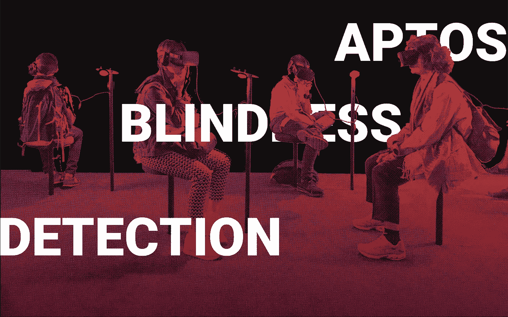
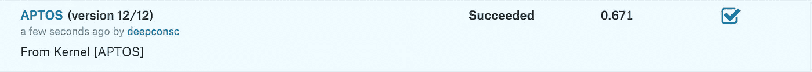
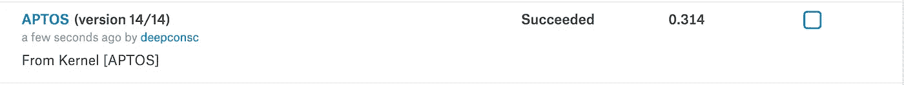

# APTOS 2019 失明检测—使用 ResNeXts 和 Progressive NASNet

> 原文：<https://pub.towardsai.net/aptos-2019-blindness-detection-playing-around-with-resnexts-and-progressive-nasnets-2ab82163daea?source=collection_archive---------1----------------------->

## APTOS 2019 失明检测| [走向 AI](https://towardsai.net)



## 不久前，Kaggle 宣布了挑战:APTOS 2019 失明检测——检测糖尿病视网膜病变，在为时已晚之前停止失明。

竞赛的目的是预测糖尿病视网膜病变的严重程度，等级为 0-4。

```
0 - No DR1 - Mild2 - Moderate3 - Severe4 - Proliferative DR
```

训练集由 3661 个图像和 4 个类别组成。我们应该注意到数据集是不平衡的。嗯，我们将使用一些技巧来最大化可能的结果，包括增加，冻结和解冻层等。

我尝试了几个模型，如 **DenseNet、ResNet50/101、Inception v3/v4** 甚至**ResNeXt-101–32x8d**—具有 **88M** 参数的架构、 **82.2** *top-1* 和 **96.4** *top-5* 错误无法超过 **66.2**

所以，我坐下来分析了数据集和几个模型。我的想法是——不管我把它们调得多好，大模型都过拟合，小模型都过拟合。

再次搜索模型，我得到了:

*   ***ResNeXt 5 32x4d—{***[*参见此处论文*](https://arxiv.org/pdf/1611.05431.pdf) ***}***
*   ***PNASNet 5 大— {*** [*参见此处论文*](https://arxiv.org/pdf/1712.00559.pdf) ***}***

并且，决定尝试两种模式。

我实现了 **TensorboardX** ，执行后生成*‘run’*目录，这样我们就可以可视化训练过程了。

火炬。数据并行？不，我现在是谷歌可乐的受害者。

# ResNeXt50 培训的 PyTorch 代码:

# 对于 PNASNet 5 Large:

我最初使用了 [Cadene 的](https://github.com/Cadene)实现，然后通过加载模型转换成我的代码进行微调。

**训练集**

合并数据集后，每个类的图像总数如下所示:

```
Total - 3661 images

0 - No DR : 1805 images1 - Mild : 370 images2 - Moderate : 999 images3 - Severe : 193 images4 - Proliferative DR : 295 images
```

实际上，这两个阶层之间有着巨大的差异。我们将使用增强，但无论如何——增强图像可以有所帮助，但不是很多。

一个简单的代码可以帮助你在解压后对图片进行分类:

# 数据扩充

数据集没有那么丰富。我们总共有 3661 张图片。因此，我将使用 PyTorch 的数据增强技术，例如:

> *变换。RandomVerticalFlip(p=0.5)，*
> 
> *变换花样。RandomRotation((0，360)，center=None)，*
> 
> *变换花样。随机水平翻转(p=0.5)*

以 0.5 的概率随机垂直翻转图像。
0，359 范围内随机旋转(基本给定了一整圈旋转的能力)
以 0.5 概率随机水平翻转。

PyTorch 数据转换技术完美地工作。到该时期结束时，该模型将在一幅图像上看到另外 3 个不同的放大。

# **数据调整大小**

**ResNeXt** 正在对 *299x299* 调整大小的图像进行训练。但是， **PNASNet** 需要 *331x331* 输入。因此，我将分别修改代码。

## *小 UX:*

如果我们想让这个过程在后台运行，而不是让笔记本电脑整夜开着，我们可以使用 *nohup。*

该命令将是:

```
nohup python3 train.py &
```

我们可以通过以下方式查看标准输出:

```
cat nohup.out
```

或者，通过以下方式跟踪他们:

```
tail -f nohup.out
```

此外，我真的不想惹 ngrok。于是，我用**子进程**函数每隔一段时间下载一次**张量板**输出，刷新一次。

```
from time import sleepimport subprocessfor i in range(10000):subprocess.run('scp user@ip_address:~/APTOS/runs/Aug30_21-58-43/* runs/', shell=True)sleep(20)
```

# 开始训练吧。


计划:

*   **用学习率 1e-3 训练 ResNeXt for 3 和 PNASNet 个历元。**
*   **以学习率 1e-4** 训练 ResNeXt 和 PNASNet 个时期
*   **ResNeXt——冻结除 3，4 层之外的所有层，将 lr 降低到 1e-5，并通过将 lr 降低 10x 来逐步解冻块。**
*   **PNAS net——冻结除 cell_9、10、11 以外的一切，继续 1e-5 lr 上的训练。之后，逐步解冻细胞，并将 lr 退火 10x。**

为什么？

在玩这两个模型时，我注意到它在 lr **1e-3** 的前两个时期产生了有说服力的准确性，但是如果继续使用相同的参数进行训练，它会产生大约相同的准确性和损失。将 lr 降低 10 倍有助于提高精度并继续降低损耗。4 个历元对于整个模型来说已经足够完美，可以了解数据集并研究足够多的特征。

但是，在只留下负责更深层特征的最深层之后，使得模型更加复杂，并且加快了训练过程。换句话说:我给模型一些时间来熟悉数据集并研究它，然后将它集中在数据集最强大的组件上。


# 第一部分

学习率 **1e-3** ，所有层，2 个时期。

***PNASNet 5 大型***

```
Epoch 1/50.. Train loss: 3.503.. Test loss: 5.913.. Test accuracy: 0.011 
Epoch 1/50.. Train loss: 1.449.. Test loss: 1.084.. Test accuracy: 0.697 
Epoch 1/50.. Train loss: 0.806.. Test loss: 0.673.. Test accuracy: 0.745 
Epoch 1/50.. Train loss: 0.630.. Test loss: 0.606.. Test accuracy: 0.776 
Epoch 1/50.. Train loss: 0.681.. Test loss: 0.591.. Test accuracy: 0.773 
Epoch 2/50.. Train loss: 0.610.. Test loss: 0.546.. Test accuracy: 0.796 
Epoch 2/50.. Train loss: 0.711.. Test loss: 0.564.. Test accuracy: 0.792 
Epoch 2/50.. Train loss: 0.474.. Test loss: 0.582.. Test accuracy: 0.790 
Epoch 2/50.. Train loss: 0.484.. Test loss: 0.539.. Test accuracy: 0.807 
Epoch 2/50.. Train loss: 0.555.. Test loss: 0.527.. Test accuracy: 0.811 
Epoch 3/50.. Train loss: 0.559.. Test loss: 0.520.. Test accuracy: 0.814 
Epoch 3/50.. Train loss: 0.455.. Test loss: 0.507.. Test accuracy: 0.821 
Epoch 3/50.. Train loss: 0.572.. Test loss: 0.486.. Test accuracy: 0.822 
Epoch 3/50.. Train loss: 0.408.. Test loss: 0.520.. Test accuracy: 0.831 
Epoch 3/50.. Train loss: 0.546.. Test loss: 0.466.. Test accuracy: 0.829
```

***ResNeXt 50 32x4d***

```
Epoch 1/50.. Train loss: 2.787.. Test loss: 3.990.. Test accuracy: 0.254 
Epoch 1/50.. Train loss: 1.460.. Test loss: 0.893.. Test accuracy: 0.684 
Epoch 1/50.. Train loss: 0.722.. Test loss: 0.654.. Test accuracy: 0.738 
Epoch 2/50.. Train loss: 0.817.. Test loss: 0.640.. Test accuracy: 0.771 
Epoch 2/50.. Train loss: 0.590.. Test loss: 0.533.. Test accuracy: 0.807 
Epoch 2/50.. Train loss: 0.517.. Test loss: 0.496.. Test accuracy: 0.820 
Epoch 3/50.. Train loss: 0.579.. Test loss: 0.559.. Test accuracy: 0.772 
Epoch 3/50.. Train loss: 0.470.. Test loss: 0.493.. Test accuracy: 0.809 
Epoch 3/50.. Train loss: 0.512.. Test loss: 0.477.. Test accuracy: 0.836
```

# 第二部分

所有层

***PNASNet 5 大型***

```
Epoch 1/50.. Train loss: 0.472.. Test loss: 0.402.. Test accuracy: 0.848 
Epoch 1/50.. Train loss: 0.452.. Test loss: 0.370.. Test accuracy: 0.857 
Epoch 1/50.. Train loss: 0.474.. Test loss: 0.383.. Test accuracy: 0.840 
Epoch 1/50.. Train loss: 0.402.. Test loss: 0.383.. Test accuracy: 0.855 
Epoch 2/50.. Train loss: 0.552.. Test loss: 0.398.. Test accuracy: 0.848 
Epoch 2/50.. Train loss: 0.453.. Test loss: 0.378.. Test accuracy: 0.867 
Epoch 2/50.. Train loss: 0.431.. Test loss: 0.391.. Test accuracy: 0.846 
Epoch 2/50.. Train loss: 0.307.. Test loss: 0.379.. Test accuracy: 0.857 
Epoch 3/50.. Train loss: 0.453.. Test loss: 0.378.. Test accuracy: 0.855 
Epoch 3/50.. Train loss: 0.372.. Test loss: 0.376.. Test accuracy: 0.851 
Epoch 3/50.. Train loss: 0.429.. Test loss: 0.380.. Test accuracy: 0.862 
Epoch 3/50.. Train loss: 0.408.. Test loss: 0.385.. Test accuracy: 0.855
```

**ResNeXt 50**

```
Epoch 1/50.. Train loss: 0.230.. Test loss: 0.423.. Test accuracy: 0.837 
Epoch 1/50.. Train loss: 0.454.. Test loss: 0.416.. Test accuracy: 0.846 
Epoch 1/50.. Train loss: 0.462.. Test loss: 0.410.. Test accuracy: 0.841 
Epoch 2/50.. Train loss: 0.458.. Test loss: 0.416.. Test accuracy: 0.837 
Epoch 2/50.. Train loss: 0.437.. Test loss: 0.386.. Test accuracy: 0.854 
Epoch 2/50.. Train loss: 0.407.. Test loss: 0.406.. Test accuracy: 0.846 
Epoch 3/50.. Train loss: 0.425.. Test loss: 0.401.. Test accuracy: 0.845 
Epoch 3/50.. Train loss: 0.424.. Test loss: 0.394.. Test accuracy: 0.836
Epoch 3/50.. Train loss: 0.552.. Test loss: 0.398.. Test accuracy: 0.846
```

# 冻结和解冻图层并调整 lr 后

***PNASNet 5 大型***

```
Epoch 1/50.. Train loss: 0.220.. Test loss: 0.344.. Test accuracy: 0.884 
Epoch 1/50.. Train loss: 0.477.. Test loss: 0.361.. Test accuracy: 0.873 
Epoch 1/50.. Train loss: 0.428.. Test loss: 0.345.. Test accuracy: 0.881 
Epoch 1/50.. Train loss: 0.410.. Test loss: 0.358.. Test accuracy: 0.872 
Epoch 1/50.. Train loss: 0.403.. Test loss: 0.356.. Test accuracy: 0.874 
Epoch 1/50.. Train loss: 0.414.. Test loss: 0.332.. Test accuracy: 0.884 
```

***ResNeXt 50***

```
Epoch 1/50.. Train loss: 0.176.. Test loss: 0.354.. Test accuracy: 0.876 
Epoch 1/50.. Train loss: 0.332.. Test loss: 0.370.. Test accuracy: 0.865 
Epoch 2/50.. Train loss: 0.401.. Test loss: 0.361.. Test accuracy: 0.865 
Epoch 2/50.. Train loss: 0.376.. Test loss: 0.366.. Test accuracy: 0.866 
Epoch 2/50.. Train loss: 0.342.. Test loss: 0.354.. Test accuracy: 0.870 
Epoch 3/50.. Train loss: 0.399.. Test loss: 0.372.. Test accuracy: 0.870 
Epoch 3/50.. Train loss: 0.330.. Test loss: 0.349.. Test accuracy: 0.875
```

# 结果

我们在 **ResNeXt 50** 上的*准确率为 87.5%，在 PNASNet 5 上的 ***准确率为 88.4%。****

*基本上，我已经尝试了 SOTA，平庸，最后，两个顶级架构的图像分类。而且，我们知道，这些模型在现实生活中的工作方式与它们在测试/验证程序中显示的方式并不完全相同。*

*总之，一夜之间调整两个模型很有趣，最后—我将对实际测试(提交)集进行预测，我们将看到结果。*

# *预言；预测；预告*

*我对预测部分的推断。*

*如果我们使用 [Google Colab](https://colab.research.google.com) 进行预测，我们应该注意，有时 **tqdm** 并不是一个很好的选择，只要它为每个输出刷新 stdout，页面就会崩溃。我总是首先尝试使用 tqdm，如果效果不好，就在循环中删除它，并编写我的脚本版本来查看预测过程。我们应该确保删除*。csv 文件，否则它会在其中追加新的预测。*

# *卡格尔*

**

*[https://www.kaggle.com](https://www.kaggle.com/)*

*而试图在预测部分后进行投稿时， [**kaggle**](https://www.kaggle.com/) 让我怒不可遏。基本上，他们在内核中有一个 bug，每次我试图提交预测时都会抛出提交错误。在搜索了一段时间后，我看到了一个卡格勒的评论，它实际上帮助了我。*

*另外，在内核中关闭 GPU 和互联网也很有帮助，除了在 Kaggle 上将 Python docker image 降级到 1-7 版本。*

*我要借用他们的代码提交部分:*

*摘自 https://www.kaggle.com/kinnachen 对[的评论](https://www.kaggle.com/kinnachen)*

# *最终结果:*

****ResNeXt 50****

**

****PNASNet 5****

**

*当我检查 PNASNet 工作如此糟糕的原因时，我注意到许多 0 和 2，几个 1 作为提交的预测数字。并且绝对没有 4 或 3 .
NASNet 在 0 和 2 类上过度拟合，只要他们持有大部分数据，而在其他类上做出很差的预测，或者根本没有做出预测。*

*此外，ResNeXt 50 仅在夜间调谐时表现良好。*

*离挑战结束还有 3 天，我打算一有时间就尝试更多有前途的方法。*

*希望你喜欢它！*

# ***更新:***

*通过裁剪数据集，并训练最后一层更长的时间，我取得了 4.1%的改善。*

**

# *第二次更新*

*平均颜色减法给出了 2.0%的改善。*

**