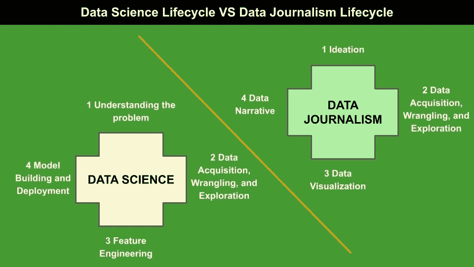

# 数据新闻和数据科学是一回事吗？

> 原文：<https://pub.towardsai.net/are-data-journalism-and-data-science-the-same-thing-77ba7ec794d4?source=collection_archive---------2----------------------->

## [数据科学](https://towardsai.net/p/category/data-science)

## 答案是否定的，我会解释原因

作者图片

几年前，我的老板让我**帮他准备一门关于数据新闻的大学课程**，当时我们正在上另一门关于网页设计的课程。为什么要从网页设计转向数据新闻？

起初，我对这个提议感到困惑，不知道我的老板在打什么主意，但最终，我意识到他是对的。

我开始问谷歌什么是数据新闻，事实上，我没有找到这么多。经过一番搜索，我想到了这个有趣的[网站](https://datajournalism.com/)。我读了一些材料，我确信数据新闻与数据科学非常相似。**但是我错了**。

经过进一步的搜索，我发现数据新闻是另一个世界，它与数据科学有共同之处，但确实是不同的。

至少有四个因素使数据新闻不同于数据科学:

*   目的
*   目标受众
*   生命周期
*   最后结局

# 1 目的

正如你可能知道的，数据科学是一套分析数据并从中提取洞察力的算法、技术和策略。

数据新闻是数据驱动的新闻，它收集、分析和过滤数据，创造有趣的故事。

**数据科学的主要目标是从数据中提取知识，做出一些决策。相反，数据新闻旨在利用数据，创造或丰富新闻。**

无论如何，数据科学和数据新闻有一个共同点，即数据，它们用来实现不同目标的技术可能是相同的。

# 2 目标受众

通常，当您开始一个数据科学项目时，您不会考虑您的受众，即阅读您成果的人或团队。然而，数据科学项目也有受众，通常是您的老板或最终客户。所以，你写了一份最终报告来说服你的老板(或者你的公司或者你的客户)做出一些决定。

相反，在数据新闻项目中，受众是不同的，因为它与广大公众、杂志或期刊的读者一致。你不必说服他们做一些决定。相反，你的新闻应该告知、娱乐或激起你的观众的情绪。

[M 加速器](https://unsplash.com/@m_accelerator?utm_source=medium&utm_medium=referral)在 [Unsplash](https://unsplash.com?utm_source=medium&utm_medium=referral) 上拍照

# 3 生命周期

数据科学项目生命周期包括以下四个阶段:

*   理解问题
*   数据采集、争论和探索
*   特征工程
*   模型构建和部署

数据新闻项目可能包括前面的步骤，但最后两个步骤不是强制性的。数据新闻项目可能只包括某些特定新闻的建模，在这些新闻中，预测可能是有用的。一般来说，典型的数据新闻项目包括以下步骤:

*   思维能力
*   数据采集、争论和探索
*   数据可视化
*   数据叙事(或讲故事)。

此外，在这两种情况下，数据采集是不同的。通常，在数据科学中，数据已经由客户或您的老板提供，尽管它们可能会被其他外部数据丰富。

**在数据新闻业中，最困难的任务之一是数据采集，因为数据还不可用。**此外，在项目生命周期中可能会出现新的数据，这就需要对原有的项目理念进行调整以适应新的数据。

最后，数据可视化和数据叙事在数据新闻中发挥着重要作用，因为所有制作的图表*必须*与新闻故事相结合，以构建吸引人的故事。

# 4 最终结果

最终结果是你的项目应该传达的最终信息。在数据科学中，最终的结果可能是一个软件产品或一组图表，可以用来做出一些决策。

在数据新闻中，最终的结果是一条新闻，发表在期刊或杂志上。

照片由[米卡·鲍梅斯特](https://unsplash.com/@mbaumi?utm_source=medium&utm_medium=referral)在 [Unsplash](https://unsplash.com?utm_source=medium&utm_medium=referral) 上拍摄

# 我们能在数据科学生命周期中使用数据新闻吗？

答案是肯定的，我们可以。又是怎么做到的？

数据新闻可能有助于数据科学家在项目生命周期中改变想法。数据科学家也可以用他们的数据产生一个**吸引人的故事，而不是产生一个简单的报告。**

> 一个数据科学家应该表现得像一个讲故事的人，他有很好的沟通技巧，能将数据转化为智慧。

我读了一本非常有趣的书，书名是《数据可视化简介:讲故事:数据科学家指南》，作者是 Jose Berengueres。这本书准确描述了如何将数据转化为智慧。

数据记者的心态也可以帮助数据科学家超越他们的数据，寻找新的数据，这可能会扩大公司战略，发现新的观点。

# 摘要

恭喜你！您刚刚了解了数据科学家和数据记者之间的区别，以及如何利用数据记者的心态成为更好的数据科学家！

**你认为数据科学家也应该是数据记者还是不重要？**如果你愿意，可以发表评论。

就个人而言，我觉得自己像一个**数据记者**，一半是数据科学家，一半是数据记者。**那你呢？**

如果你已经走了这么远来阅读，对我来说今天已经很多了。谢谢！你可以在[这篇文章](https://alod83.medium.com/which-topics-would-you-like-to-read-c68314dc6813)中读到更多关于我的内容。

# 相关文章

 [## 为什么数据科学家也需要讲故事

### 作为一名数据科学家是一份非常棒的工作:你可以收集数据，通过奇妙的抓取机制或网络…

towardsdatascience.com](https://towardsdatascience.com/why-a-data-scientist-needs-to-also-be-a-storyteller-89b4636cb83)  [## 如何从数据中构建叙事

### 根据设置-冲突-解决范式分析数据的一些技巧

towardsdatascience.com](https://towardsdatascience.com/how-to-build-a-narrative-from-data-85e327940c13)  [## 如何设计一个数据新闻故事

### 如何设计一个数据新闻故事

如何设计一个数据新闻 Storyalod83.medium.com](https://alod83.medium.com/how-to-design-a-data-journalism-story-b2e421673b6e)