# 头条有数字的故事更成功吗？

> 原文：<https://pub.towardsai.net/are-stories-with-numbers-in-headlines-more-successful-b925cae2f6b4?source=collection_archive---------5----------------------->

## [统计数据](https://towardsai.net/p/category/statistics)

## 让我们用统计学来找出答案

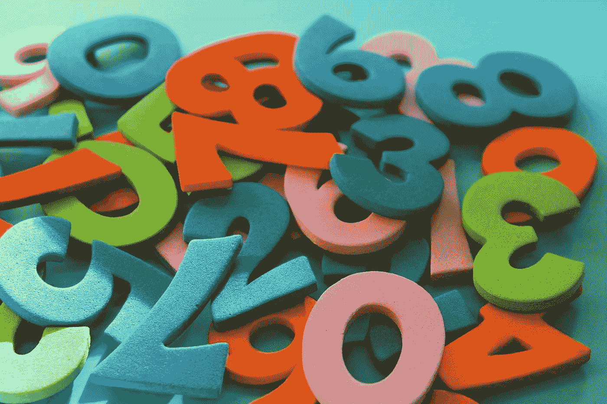

图片由 [_Alicja_](https://pixabay.com/ro/users/_Alicja_-5975425/?utm_source=link-attribution&utm_medium=referral&utm_campaign=image&utm_content=4014181) 在 [Pixabay](https://pixabay.com/ro/?utm_source=link-attribution&utm_medium=referral&utm_campaign=image&utm_content=4014181) 拍摄

我在 Medium 上读过几个关于写建议的故事，其中有一些故事，以及其他一些技巧，表明在你的故事标题中加入数字会增加浏览量，因为人们更容易被这样的标题吸引，因此，更多的人会点击你的故事。

人们会被这样的标题所吸引，这似乎很有趣。但我不喜欢把事情想当然。我想说服自己这个事实其实是真的。

那么，我一直在想什么？我们用统计学来检验一下这个东西其实是不是真的。但是没有数据统计是没有用的。我首先需要获得一些关于媒体文章的数据，并使用这些数据进行假设检验。因此，我使用 Python 和 Beautiful Soup 从 7 个不同的出版物中收集了一组随机的 6K+中型文章的数据。这个数据集可以在 [Kaggle](https://www.kaggle.com/dorianlazar/medium-articles-dataset) 上找到。如果你想知道我是如何收集这些数据的，我这里有一篇文章:

 [## 蟒蛇刮中号&美汤

### 从 7 个不同的出版物中提取 6K+文章的数据

medium.com](https://medium.com/the-innovation/scraping-medium-with-python-beautiful-soup-3314f898bbf5) 

我们现在要做的是将这个数据集分成两组(或样本):一组在标题中有数字，另一组没有数字。然后，我们将对这两组中鼓掌次数的期望值进行假设检验。我们用鼓掌的次数来衡量一个故事“有多成功”,尽管对于我们的场景来说，一个更符合逻辑的变量是浏览量，因为它更直接地受到我们选择的标题的影响。人们通常会因为看到的预览(包括标题和图片)而点击一个故事，然后在阅读完故事后，他们会决定是否鼓掌。但是，因为视图的数量没有在 Medium 上公开显示，所以我们使用鼓掌的数量，因为它应该与视图高度相关(视图越多，有人鼓掌的可能性越大)。

如果你不熟悉假设检验，这里有一篇文章你可以看看:

 [## 假设检验去神秘化

### 如何将数学翻译成简单的英语

towardsdatascience.com](https://towardsdatascience.com/hypothesis-testing-demystified-e434a665e055) 

也就是说，我们将考虑以下模型:

**样本 1:标题中有数字的文章**

我们将这组中的拍手次数建模为 **n** i.i.d .(独立同分布)随机变量:X₁、X₂、…、Xₙ，期望值为₁，方差为σ₁，两者都是有限的。

**样本 2:标题中没有数字的文章**

我们将这个组内的拍手次数建模为 **m** i.i.d .随机变量:Y₁、Y₂、…、Yₘ，期望值为₂，方差为σ₂，两者都是有限的。

我们将原假设表述为“标题中有数字的文章不会比标题中没有数字的文章带来任何改进”，另一个假设是“标题中有数字的文章比标题中没有数字的文章更成功”。

数学上这意味着:

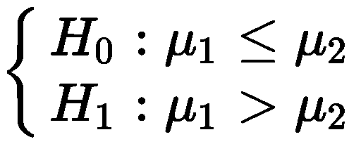

我们将考虑以下测试统计:

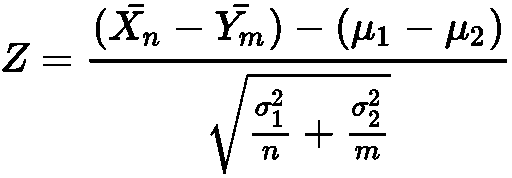

其中 Xn 条和 Ym 条分别是样品 1 和样品 2 的平均值。

因为样本量非常大，并且由于中心极限定理，我们的检验统计量 z 的概率分布可以很好地近似为标准正态分布，并且σ₂σ₁的真实方差应该非常接近我们数据的估计方差。所以，当我们计算检验统计量时，我们可以用σ₂σ₁的估计方差来代替。

但是，₁ - ₂法案呢？假设 H₀为真，则₁ - ₂ ≤ 0。我们选择₁ - ₂ = 0，因为这个值是第一类误差概率的最坏情况(我们不想低估误差)。

现在，让我们运行一些 Python 代码。我们首先导入所需的包并定义一个实用函数:`like(x, pattern)`。此函数用于匹配 pandas 数据框中的正则表达式；`x`是列，`pattern`是正则表达式。我用 SQL 的 LIKE 操作符来命名这个函数，因为它的目的是做一些类似的事情，但是是针对熊猫数据框的。

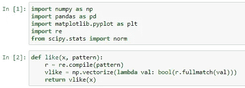

之后，我们将 CSV 文件读入 pandas 数据帧:

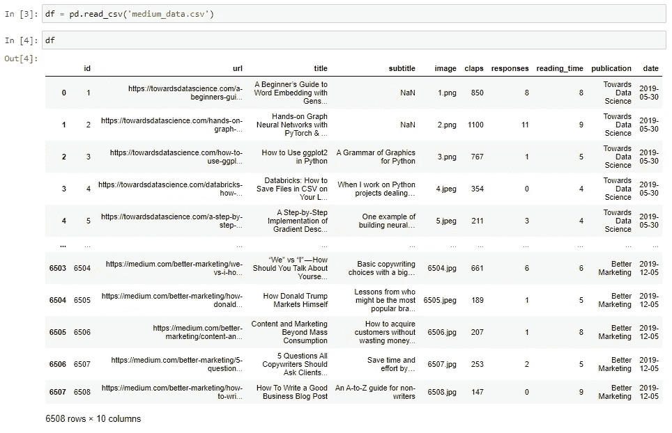

我们确保“标题”或“掌声”列中没有缺失值:

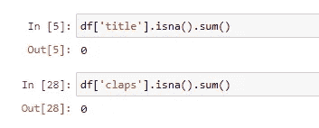

然后，我们使用之前定义的`like()`函数创建 2 个新的数据帧(数字/非数字):

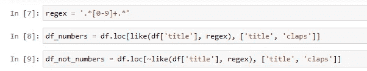

这两个新数据帧如下所示:

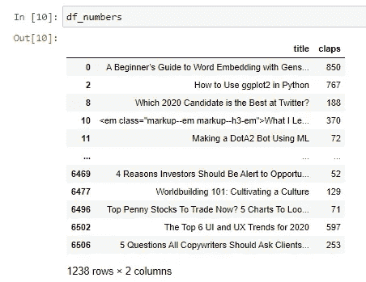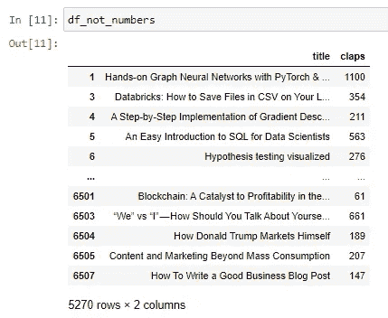

之后，我们计算测试统计所需的数量:

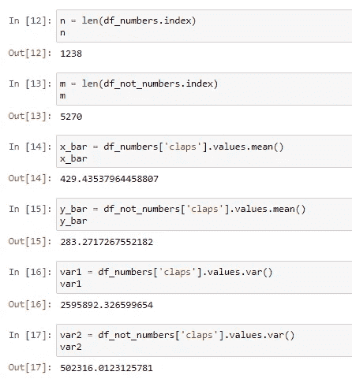

现在，我们计算检验统计量和 p 值。在我们的例子中，因为我们正在进行单侧测试，所以 p 值是标准高斯条件下测试统计右侧的区域:

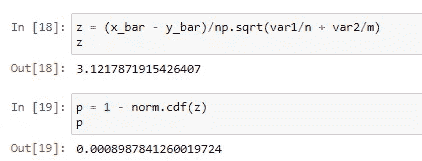

我们得到的 p 值比通常的阈值 0.05 小得多。这是个好消息，我们可以非常自信地拒绝零假设。

对于α = 0.001 的显著性水平，可以得出 p ≈ 0.0009 < α, and therefore we reject the null hypothesis and accept the alternative. In plain English, this means: “**我们有 99.9%的信心，标题中有数字的故事比标题中没有数字的故事有更多的掌声**。

你可以在 [Kaggle](https://www.kaggle.com/dorianlazar/do-stories-with-numbers-in-titles-have-more-claps) 上找到 Jupyter 笔记本。

*我希望你觉得这些信息很有趣，感谢你的阅读！*

这篇文章也贴在我自己的网站[这里](https://www.nablasquared.com/are-stories-with-numbers-in-headlines-more-successful/)。随便看看吧！