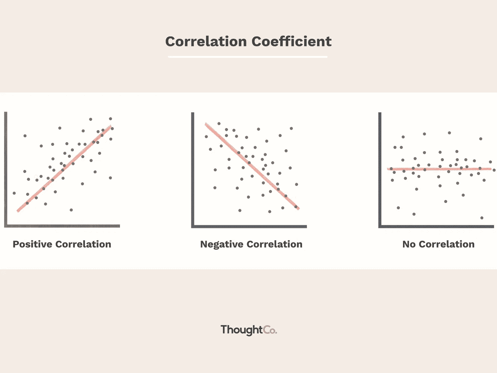
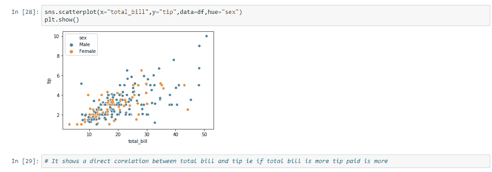
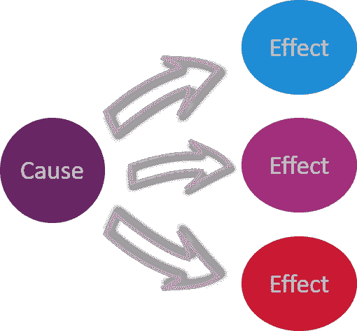

# 你对相关性和因果性感到困惑吗？

> 原文：<https://pub.towardsai.net/are-you-confused-with-correlation-and-causation-bd9bb8a3adee?source=collection_archive---------1----------------------->

## [数据科学](https://towardsai.net/p/category/data-science)

## 相关性和因果性的区别

由[克里斯·利维拉尼](https://unsplash.com/@chrisliverani?utm_source=medium&utm_medium=referral)在 [Unsplash](https://unsplash.com?utm_source=medium&utm_medium=referral) 上拍摄

# 什么是“关联”？

“共同关系”仅仅是一种关系。如果两个变量之间存在相关性，我们可以观察到它们之间的一种模式。

1.  正相关:当 X 增加时，Y 也增加，反之亦然

2.负相关:当 X 增加时，Y 也减少，反之亦然

3.无相关性:当我们看不到两个变量之间的任何清晰模式时。

来源:https://www。 [investopedia](https://www.investopedia.com/ask/answers/032515/what-does-it-mean-if-correlation-coefficient-positive-negative-or-zero.asp) 。com/

相关性是一个数值，表示两个事物/变量之间的关系强度。

相关系数在-1 到 1 之间。系数的值表示关系的强度，符号表示变量之间的关系。(正号表示 2 个变量正相关，负号表示 2 个变量负相关)

示例:在下图中，我们可以看到账单总额和支付的小费之间存在正相关关系。

来源:作者

# 什么是因果关系？

因果关系告诉我们两件事之间的因果关系。这意味着一个值的变化导致另一个值的变化。

来源:[https://scalar.usc.edu/](https://scalar.usc.edu/)

示例:

运动导致卡路里的燃烧。

重力使物体下落。

# 相关性并不意味着因果关系

如果两件事有关联，并不意味着一件事会引起另一件事。

举例:去医院和死亡人数正相关。不代表去医院不会导致你死亡。

# 让我们举一个例子

吸烟导致肺癌

不吸烟的人和不吸烟的人患肺癌的几率一样吗？**否**

肺癌还有其他原因吗？**是**

在这里，我们可以说吸烟导致肺癌，但它不是肺癌的唯一原因。可能还有其他原因，比如污染。

# 在你走之前

*感谢阅读！如果你想与我取得联系，请随时联系我在 jsc1534@gmail.com 或我的* [*LinkedIn 个人资料*](http://www.linkedin.com/in/juhi-sharma-ds) *。*