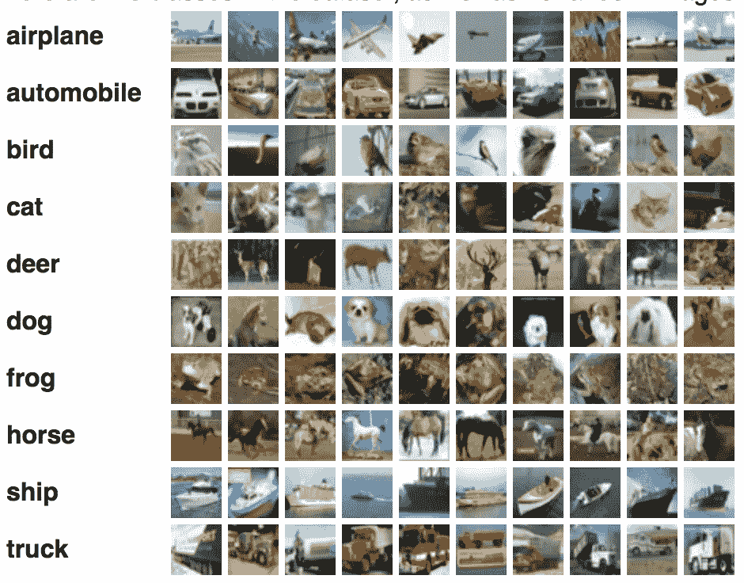
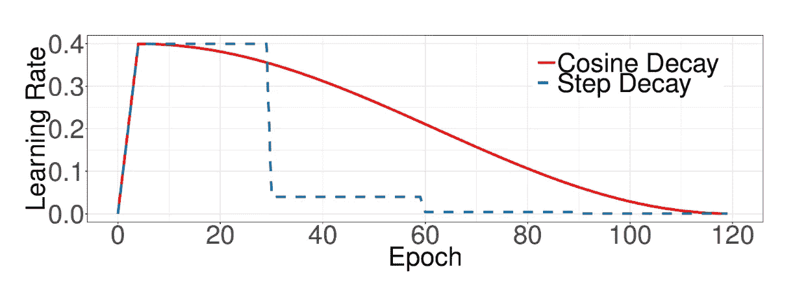
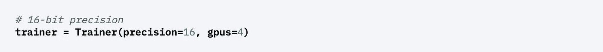

# 你确定你能实现图像分类网络吗？

> 原文：<https://pub.towardsai.net/are-you-sure-that-you-can-implement-image-classification-networks-d5f0bffb242d?source=collection_archive---------0----------------------->

图片来自:[https://machine learning mastery . com/applications-of-deep-learning-for-computer-vision/](https://machinelearningmastery.com/applications-of-deep-learning-for-computer-vision/)

在我最近提交论文之前，我坚信由于 PyTorch 或 Jax 等构造良好的深度学习框架，我可以轻松实现图像分类网络。尽管它们为网络提供了模块，但我意识到有太多的实现细节需要我在实践中考虑。在我的第一个实现中，这个模型在我的玩具数据集中达到了 70%的准确率。为了达到预期的性能，我被迫使用许多 GPU 来扩大有效的批处理大小。但是用很多 GPU 训练花了很长时间。相比之下，在应用了我即将介绍的几种技术之后，该模型显示出比第一个模型**高 14%的准确性，而训练时间和 GPU 数量分别减少了四倍和四倍**。这是一种令人惊叹的体验，因为尽管模型架构是相同的，但总的预期 GPU 时间已经减少到 1/16。

很多讲座，描述深度学习往往会遗漏实际实现的细节。因此，**我将分享我的个人经历，这可能对未来的研究有益**。我参考了一篇著名的论文，名为“用卷积神经网络进行图像分类的锦囊妙计”，它分享了设计训练过程的有用技巧。

 [## 卷积神经网络用于图像分类的技巧包

### 最近在图像分类研究中取得的许多进展可以归功于训练过程的改进…

arxiv.org](https://arxiv.org/abs/1812.01187) 

以下是我在项目中学到的一些东西。

*   考虑将**学习率**预热和**余弦退火**用于学习率。
*   学习率应根据使用的 GPU 的数量**进行不同设置。**
*   应用**标签平滑**以获得更好的训练稳定性。
*   **移除偏置衰减**。
*   从 **PyTorch-lightning** 中获益，便于实施
*   PyTorch 中的几个小选项可以进一步提高和改进您的代码。

# 线性预热+余弦退火

当我使用指数衰减学习率调度器时，我必须使用大批量来快速获得期望的性能。相应地，我应该使用多个 GPU，并稍微修改网络架构以使用 SyncBatchNorm，而不是普通的 BatchNorm 操作。要达到 60%的准确率，我要训练网络 50 个纪元；换句话说，一天。正如论文《卷积神经网络图像分类锦囊》中所推荐的，我改变了学习率调度器。

所提出的学习速率调度器有两个阶段:线性预热和余弦退火。下图显示了日程安排的完整形式。

在预热阶段，学习率从 0 线性增加到目标学习率。使用大的学习率在数值上是不稳定的，因为在训练开始时所有的参数都是随机的。因此，在我的玩具实验中，简单的学习率衰减策略(如步长衰减和指数衰减)无法训练 ResNet34 和 ResNet50，尽管 ResNet18 取得了成功。除此之外，学习速度的连续性甚至提高了训练的稳定性。通常，在许多实验中，线性预热的 5 个时期是足够的。在更改了学习率调度器之后，我可以将有效的批处理大小从 4096 减少到 256，而不会因为提高了训练稳定性而降低性能。

根据一个流行的学术档案，“论文与代码”，这种学习率调度广泛用于各种任务。

 [## 论文与代码线性热身与余弦退火解释

### 带余弦退火的线性预热是一个学习率计划，其中我们线性增加学习率为$n$…

paperswithcode.com](https://paperswithcode.com/method/linear-warmup-with-cosine-annealing) 

# 依赖批量大小的学习速率

在训练阶段控制批量大小不会改变随机梯度下降的期望，但会改变方差。当使用大批量时，我们可以提高学习率，因为它的方差比使用小批量时要小。先前的研究证实**根据经验，随着批量的增加线性增加学习率效果更好**。具体来说，我们应该在使用两倍的大批量时将学习率提高一倍，在有效批量变为一半时将学习率降低一半。

# 标签平滑

大多数有完全监督的分类网络都是用 CELoss 训练的，CELoss 是 CrossEntropyLoss 的缩写。CELoss 的正式定义是:

当我们推导这个训练目标的封闭形式的解时，我们可能会得到负的无穷大值，这在最近的深度学习库上是不处理的。此外，这个极端值鼓励输出分数显著不同，潜在地导致过度拟合。因此，建议使用软版本的 CrossEntropyLoss。

标签平滑不是使用二进制值 0 或 1，而是将目标分数 1 分布到不同的箱中，以实现更平滑的分布。平滑 CrossEntropyLoss 的最优解不再是无穷大或负无穷大值。在我的例子中，我观察到使用标签平滑后性能提高了 2%。有关 CrossEntropyLoss 的更多详细描述，请参考以下链接:

 [## 交叉熵损失函数

### 在大多数分类问题中用于优化机器学习模型的损失函数…

towardsdatascience.com](https://towardsdatascience.com/cross-entropy-loss-function-f38c4ec8643e) 

# 移除偏置衰减

权重衰减是避免过度拟合训练模型的一个很好的正则化技巧。正如论文《混合精度的高可扩展深度学习训练系统:四分钟训练 ImageNet》中指出的那样，**对偏向项应用权重衰减对于更快的训练**来说并不可取。因此，我移除了模型中的偏差衰减。通过消除偏置衰减，我在实验中得到的影响可以忽略不计。相比之下，在下面的论文中的实验中有显著的差异。

 [## 具有混合精度的高度可扩展的深度学习训练系统:在四个…

### 具有数据并行性的同步随机梯度下降(SGD)优化器被广泛应用于训练大规模数据集

arxiv.org](https://arxiv.org/abs/1807.11205) 

# 几个杂项

从现在开始，我将介绍几种工程技巧，它们可以使您的代码变得更简单、更高效。

## 将数据放在本地或 SSD 内存中。不是硬盘！

我花了很多时间处理这个问题。这个问题对我来说很糟糕，因为没有错误，但是代码很慢。分析完可执行文件后，我发现磁盘 I/O 操作是我的代码的瓶颈。由于我的远程服务器有一个大容量的硬盘存储器，我用它来存储我的大规模玩具数据集。然而，当我们使用大量的磁盘 I/O 操作时，这会极大地降低代码速度。如果你不能把所有的数据都放在运行时内存中，**我强烈建议你把数据放在本地内存中，至少放在 SSD 内存中。**(无硬盘广场)

## 使用 PyTorch-Lightning 进行 16 位(半)精确训练

正如 PyTorch-Lightning 官方文档中所建议的，使用 16 位精度可以增加训练时间。最近基于 Volta 和图灵架构的 GPU 设备大大减少了训练时间。根据 NVIDIA 官方文档，在计算最密集的模型架构上观察到高达 3 倍的整体加速，而性能略有下降。 **PyTorch-Lightning 通过添加一个参数**，支持使用半精度训练的便捷选项。另外，多 GPU 训练也是类似的做法。

使用 PyTorch-Lightning 时，您可以通过一个参数简单地更改精度。

 [## 英伟达深度学习框架

### NVIDIA 深度学习框架文档-2022 年 3 月 11 日最后更新-发送反馈-准备使用 Docker…

docs.nvidia.com](https://docs.nvidia.com/deeplearning/performance/mixed-precision-training/index.html) 

在这里，我分享了许多实用的建议，可以帮助您更快、更方便地实现。我很确定许多读者都熟悉分类的原则，因为许多相关的讲座已经彻底地教过他们了。我对自己的实施技能也很有信心。然而，这段经历引发了我的自我反思。我希望这篇文章能帮助您扩展您的实现技能。

> 喜欢我的文章吗？更多文章请访问我的个人页面！
> 作者:Yoonwoo Jeong
> 所属单位:POSTECH，计算机视觉实验室
> 邮箱:jeongyw12382@postech.ac.kr
> 个人页面:【http://github.com/jeongyw12382】T4