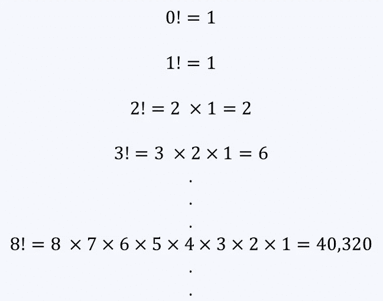
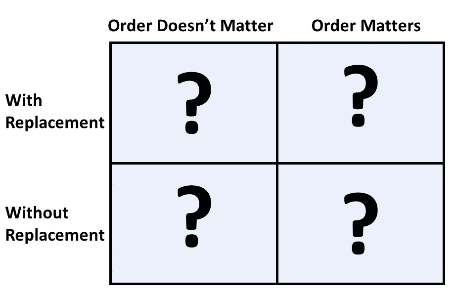
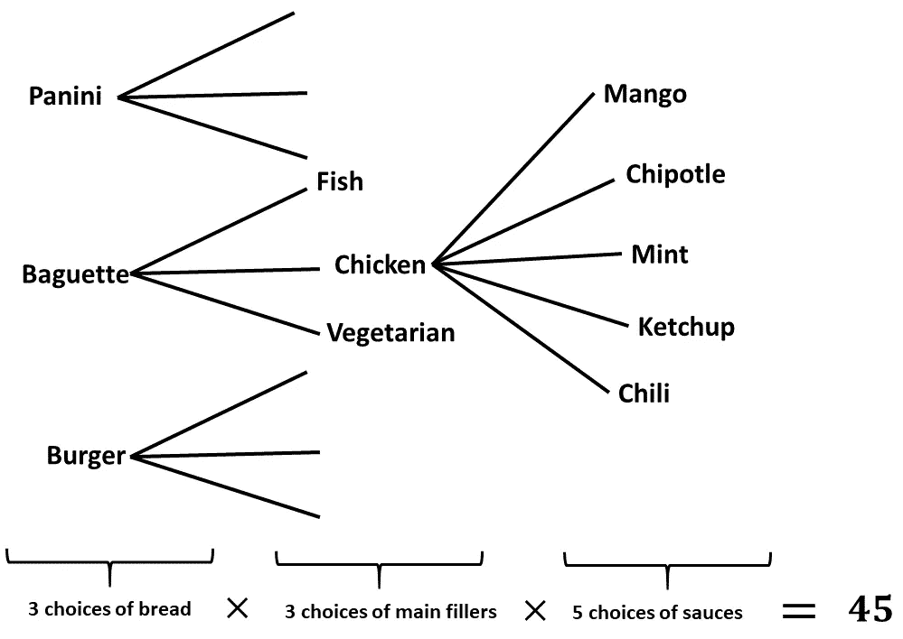
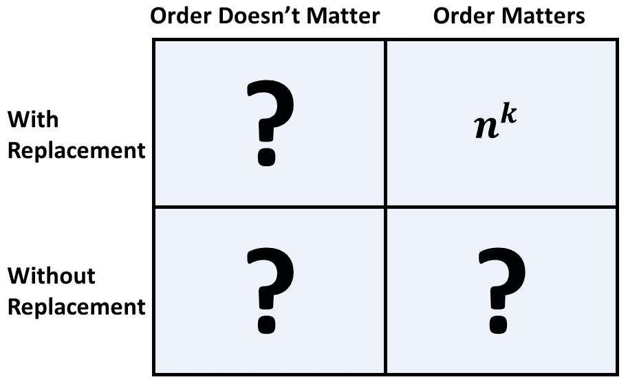
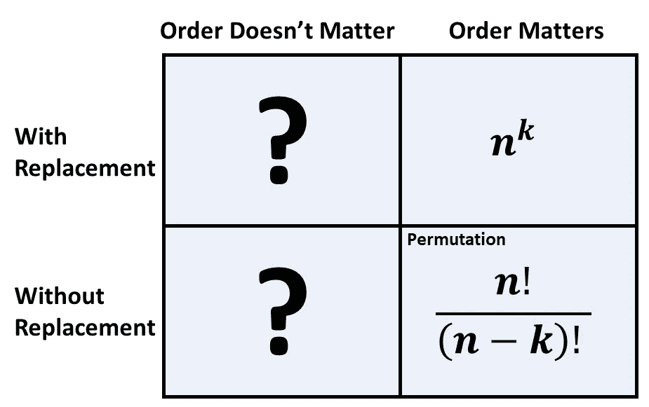
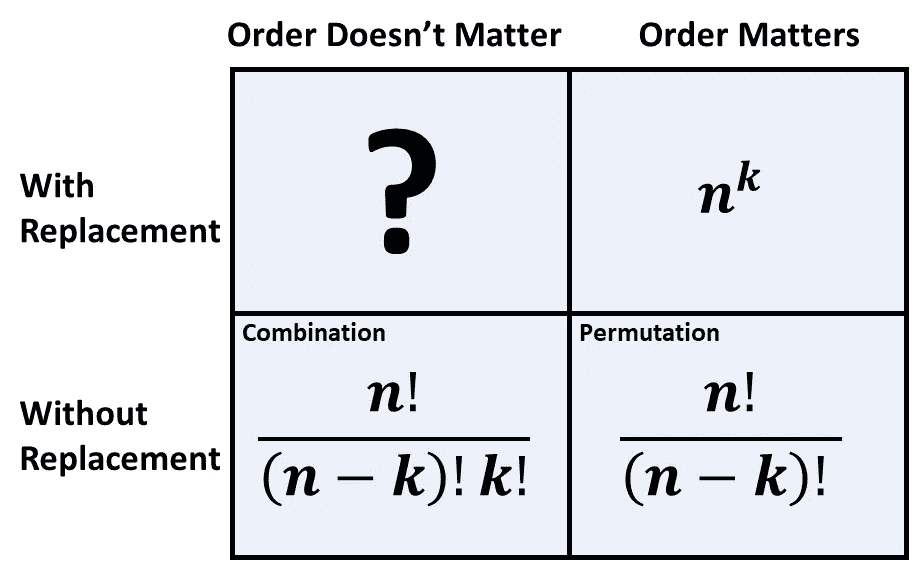
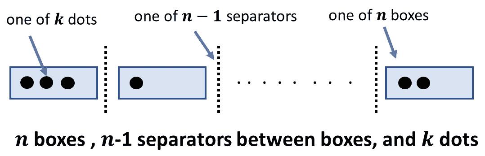
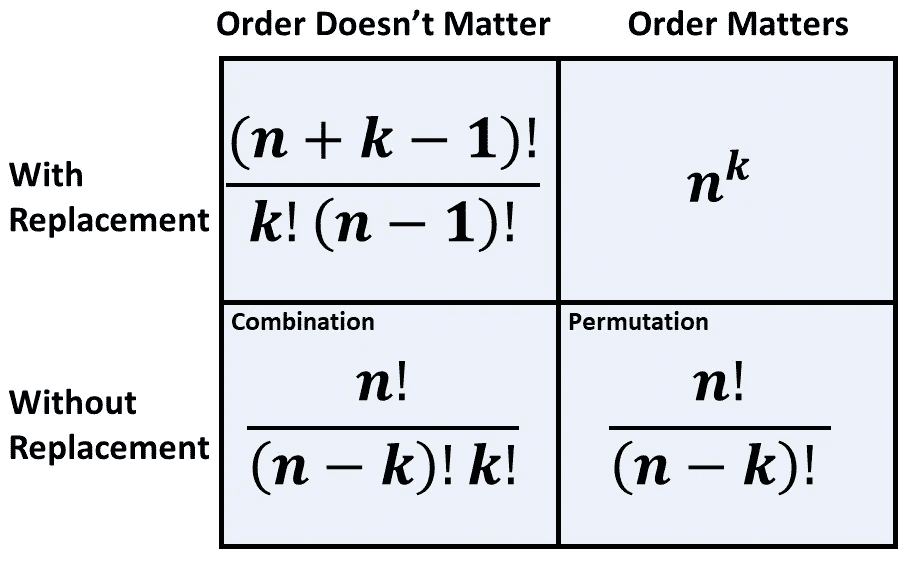
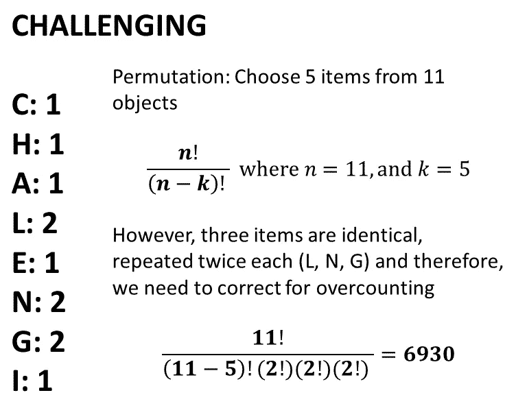

# 你确定你会数数吗？

> 原文：<https://pub.towardsai.net/are-you-sure-you-can-count-a7ab0716711b?source=collection_archive---------1----------------------->

## [概率](https://towardsai.net/p/category/probability)

## 你应该掌握 2x2 网格来提高你的概率技能，不要再混淆排列和组合


由[莎伦·麦卡琴](https://unsplash.com/@sharonmccutcheon?utm_source=unsplash&utm_medium=referral&utm_content=creditCopyText)在 [Unsplash](/s/photos/counting?utm_source=unsplash&utm_medium=referral&utm_content=creditCopyText) 上拍摄的照片

你知道怎么数数吗？你能指望你的手指吗？我这里说的不是大数字。只是一些你可能偶尔会遇到的数字。当然，你一定会数数。毕竟，数数能力是一项基本技能。为什么不做一个快速自测来评价自己呢？请继续阅读！

你能从单词 CHALLENGING 中的字母组成多少个五个字母的单词？答案是 6930。也许这并不有趣，有点书呆子气。让我们继续前进…

想象你和另外 22 个人一起参加生日聚会。在这个聚会中找到两个出生日期相同的人的可能性有多大？….

鉴于一年有 365 天，也许不太可能？实际上…

> 在一个只有 23 人的随机小组中，找到至少一个生日匹配的几率超过 50%。事实上，非常令人惊讶的是，只有 57 个人，有 99%的机会找到至少一个生日匹配。

你觉得这违背直觉吗？(进入你的脸书页面，查看你朋友的生日列表，惊讶于你找到的匹配数量！).我会在文章末尾给你上述结果的直觉。

可能以上问题不是日常情况。当然，这个怎么样:

你饿了，你去了一家咖啡馆，在那里你可以设计自己的三明治。你可以选择三种面包(帕尼尼、汉堡、法棍面包)中的一种，三种主要填充物(鸡肉、鱼肉、素食)中的一种，五种酱料(芒果、辣椒、墨西哥辣椒、烤肉、薄荷)。你在咖啡馆总共能买到多少种三明治？

如果你能毫不费力地回答以上问题，那么你就可以开始了。剩下的文章可能不会增加任何进一步的价值。然而，如果上面的问题让你抓耳挠腮，那么继续读下去。不，你数数一点也不差，你也没什么问题。要想有能力解决上述问题，需要有意识的练习和系统的学习。当你读完这篇文章后，你将会正确地学会如何系统地数数，并且可以很容易地应用到你自己的生活中。

> 如果你对数据科学感兴趣，那么你必须知道概率这门学科是数据科学的基础。计数能力是概率的基础。

在我们开始之前，先了解一些术语。我们经常需要“采样”数据点。

> 从概念上讲，这意味着从一个包含所有项目的大库中挑选出一个项目子集。我们一直在“采样”事物。

例如，我们知道 120 毫米汞柱/80 毫米汞柱的血压是正常的，是因为我们从已知正常的人群中“取样”了许多人，然后测量了他们的血压。然后我们根据获得的“样本”对整个人群做出结论。从概念上讲，这与从装满物品的盒子中挑选物品的子集或者从单词中挑选字母的子集来组成新单词没有什么不同。

你应该理解的另一个概念是阶乘。一个 *n* ！是从 *n* 开始一直到 1 的所有整数的乘法。



阶乘是如何计算的图解(图片由作者提供)

现在你知道了什么是抽样和阶乘，你只需要理解四种可能性。是的，只有四个，一旦你掌握了这些，你就能在你遇到的任何情况下数数了。这些是订单重要还是不重要，以及您是否选择有替换或无替换的项目(即，从项目池中选择样本)的组合。这四种可能性可以方便地用一个 *2* x *2* 网格来表示。



2x2 网格；订单重要/不重要，样品更换/不更换(图片由作者提供)

当您继续阅读时，我们将填写这张表格。您只需要知道一个规则，它将帮助您填写完整的表格。这条规则被称为乘法规则(或乘积规则)。在你的头脑中概念化的方法是把挑选物品的任务想象成一个按顺序采取多个步骤的实验(一个连续的任务)。在每一步，你都有一定数量的选择。随着时间的推移，可能选择的总数会成倍增加。

以三明治为例，你可以认为选择三明治是一个多步骤的实验。对于面包的选择，你有三种选择。一旦你选择了你的面包，你就有了另外三种主要填充物的选择。最后，你有五种酱料可供选择。使用乘法法则，你总共可以点 45 种不同类型的三明治。你也可以用一个树形图来形象化这一点。



三明治问题的解决方案，用树来演示乘法法则，酱料的所有可能性都没有显示出来(图片由作者提供)

**现在让我们开始填充 *2x2* 网格。**

# 订单问题，更换

想象一下，从一个由 *n* 人组成的班级中随机调查出一个由 *k* 人组成的子集，其中同一个人可以被随机选择不止一次，参与者被选择的顺序也很重要。你可以把这看作是一个有 *k* 个步骤的连续实验，在每个步骤中你选择一个人进行调查。第一步，你有 n 个选择。在第二步中，您再次有 *n* 个选择(因为这是带替换的采样)。再往前走，对于你的 *kᵗʰ* 步骤，你仍然有 *n* 种选择。使用乘法法则，你总共有*个 nᵏ* 个选择。



2x2 网格；订单事宜和样品与更换揭示！(图片由作者提供)

# 订单事宜，不更换

想象一下和以前一样的问题，从一类人 *n* 中调查一部分 *k* 人。不过和上次不同的是，不允许你两次选择同一个人。这意味着你将有 *n* 个选择来挑选第一个人，但是有 *(n-1)* 个选择来挑选第二个人。因此，你会有 n(n-1)(n-2)…。(n-k+1)个选择。

你可以在心里算出来:在实验的下一步中，我们少了一个选择，直到我们完成所有的步骤。这意味着在 *kᵗʰ* 步骤中，我们将有 *n-(k+1)* 种选择。利用乘法法则，总和相当于 *n(n-1)(n-2)…(n-k+1)* 。从 *n* 个对象中挑选 *k* 个项目，其中顺序很重要，这也就是通常所说的“排列”(稍后会详细介绍)。



2x2 网格；顺序事项和样本未经置换就透露出来，也叫“排列”！(图片由作者提供)

# 订单无关紧要，无需更换

让我们用和以前一样的例子，但是这一次，假设我们选择人的顺序也不重要。这意味着，假设我们选择了 A，然后 B，然后 C，这与选择 BAC 或 ACB 没有什么不同。如果我们使用排列公式，那么我们将会被 *k* 过度计算！。因此，我们需要通过除以 *k* 来修正这个问题！。如果你想知道为什么我们被 *k* 过度计算！*、*想出 *k* 物体的排列数。他们有多少人？他们是 *k* ！*。*这就解释了为什么我们需要修正系数为 *k* ！。

这个术语也叫做组合。排列和组合通常在介绍性概率课程中讲授。如果你曾经混淆了这两个术语，这里有一个我用来记忆的简单的记忆方法。在排列中，顺序很重要。这是因为它从“P”开始，就像我们的密码从 P 开始一样，顺序很重要(abcd 和 bacd 是不同的密码)。当顺序很重要时，你显然会得到一个更大的数，所以分母只有 *(n-k)* ！。在组合中，顺序无关紧要，因此它是一个较小的数，并且有一个由 *k* 进行的额外除法！。



2x2 网格；订货事项和样品没有交代就透露出来，也叫“组合”！(图片由作者提供)

# 订单不重要，有替换

您不太可能遇到这种场景适用的情况，并且这种情况的推导稍微复杂一些。然而，以下是使用方框和圆点对这种情况的直观解释，这是受哈佛大学 Blitzstein 教授的启发，他在哈佛大学的概率入门课程中讲授了这一点(稍后将详细介绍)。

你有 *n* 个物品，并且你可以每个 *n* 个物品 *k* 次。同样，在每一步，总对象保持不变， *n* 。由于顺序无关紧要，您可以将此问题想象为 *n* 个盒子，其中 *k* 个点分布在这些 *n* 个盒子中(见下图，注意这次 *k* 可以大于 *n* ，因为这是替换)。



方框、点和分隔符框架(图片由作者提供)

看图可以看到有 *n-1* 分隔符和 *k* 点。请注意，图片中显示的圆点只是将圆点分配给盒子的一种方式。我们需要找到分配 *k* 点的剩余方法，这些方法对应于在水平轴上移动 *n-1* 分隔符。这相当于从总共 *k + n-1* 项(总点数+总分隔符)中选择 *k* 项。实际上，这个问题简化为早期的“订单无关紧要，无需更换”的问题，只是现在的总项目是**而不是** *n* **而是** *n+k-1* 。



2x2 网格；订单无关紧要，样品和替换显示！(图片由作者提供)

# 最后的想法

你不需要记住上面的公式，而是专注于每一个公式背后的直觉。有几门概率课程可供选择，但我衷心推荐的最喜欢的课程是哈佛大学的乔·布利茨坦教授开设的课程。如果你想深入了解，那么 Blitzstein 已经在他的前两次讲座和他的书(也可以在网上免费获得)中详细介绍了计数的主题。

如果您想计算 R 中任意数字的阶乘，可以使用下面的代码:

```
factorial(n) # calculate factorial of n
```

此外，如果您需要计算从 *n* 个对象中选择 *k* 个项目的组合，那么您可以在 R 中使用以下内置命令来完成(这也称为二项式系数):

```
choose(n,k) # built-in R command for combination
```

顺便说一下，我们可以从单词 Challenging 形成的 5 个字母单词的数量的早期问题的解决方案如下所示。



有 6930 个可能的 5 个字母的单词可以由单词“挑战”组成。这是对相同对象的重复计数进行校正的排列。(图片由作者提供)。

最后，哈佛大学的布利茨坦教授详细解释了生日问题背后的直觉(视频见下),但简而言之，

> 有 255 对人，只有 23 个人(n =23，k=2 的组合)。这已经是一年中天数的一半以上了，所以这并不奇怪，毕竟，期望找到至少一对生日匹配的。

在视频的前 17 分钟，哈佛大学的布利茨坦教授解释了生日问题，并提供了背后的直觉