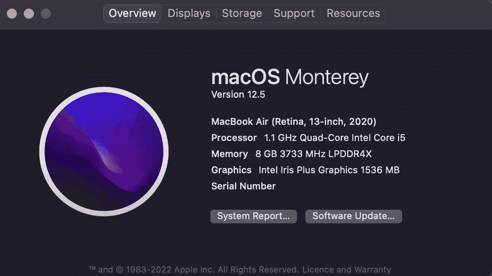
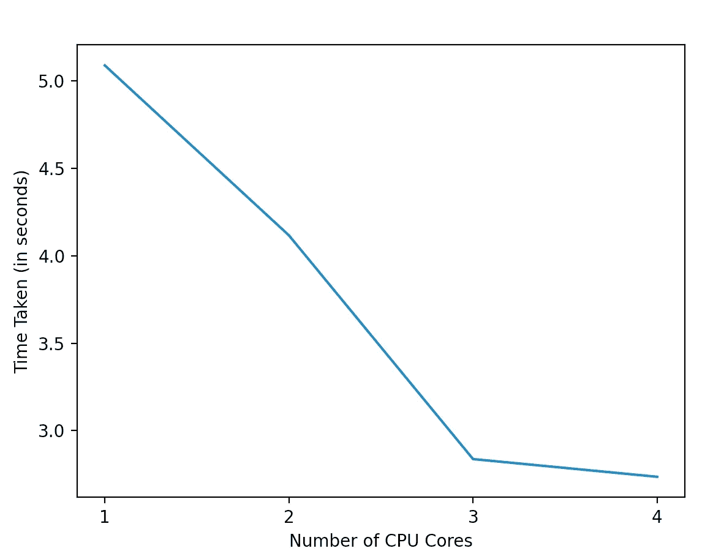

# 你正在使用所有的 CPU 核心吗？

> 原文：<https://pub.towardsai.net/are-you-using-all-cpu-cores-2606b804838e?source=collection_archive---------0----------------------->

## 在机器学习编程中捕捉机器计算能力的未开发潜力


照片由 [Unsplash](https://unsplash.com?utm_source=medium&utm_medium=referral) 上的[尼克·费因斯](https://unsplash.com/@jannerboy62?utm_source=medium&utm_medium=referral)拍摄

现在是 2004 年，我完成工程后开始了我的第一份工作。一直想专注编程，带了第一台台式机学习高级 C++。是的，你没看错——台式机，在那个年代，笔记本电脑超级贵，我买不起。我还记得是单核英特尔赛扬 D 处理器 341。

随着时间和技术的发展，2023 年我使用的是 2020 年版的 Mac book air，搭载了英特尔 i5 四核处理器。



附件 1:我的 MacBook Air 的系统信息

2019 年第四季度，英特尔推出 i9–10980 xe 至尊版处理器，拥有 18 个内核，更高端的英特尔至强 W-3175X 处理器拥有 28 个内核。

对我们大多数人来说，现在可以以可承受的价格获得如此强大的计算能力是件好事。我们应该评估我们的编程风格是否符合计算能力的指数级发展。根据我的观察，许多业余爱好者和半专业的机器学习程序员没有充分发挥当今机器中多核处理的潜力。训练和评估模型需要很长时间，尤其是对于具有大量输入数据集的项目。只要有可能，通过使用多个 CPU 内核并行执行各种机器学习任务，可以大大减少这些时间。

在本文中，我将演示如何通过利用所有的 CPU 核心将模型训练时间减少 75%以上。

我们将使用 fetch_openml 来获取 openml 上可用的 Oil_spill 数据，并使用 RandomForestClassifier 来训练模型。使用 Matplotlib 库绘制了使用不同 CPU 核心配置训练机器学习模型所花费的时间。

```
from sklearn.datasets import fetch_openml
from sklearn.ensemble import RandomForestClassifier
from time import time
from matplotlib import pyplot as plt
```

从 OpenML 中，oil_spill 数据集在 X pandas 数据帧中导入自变量，在 y 数据帧中导入目标值。

```
X,y= fetch_openml(name="oil_spill",
return_X_y=True,as_frame=True)
```

声明一个列表“ *timetaken* ”来存储训练具有不同 CPU 配置的每个模型所用的时间。在这个例子中，我们将使用单核开始机器学习模型训练，并移动到四核。内核的数量在列表" *n_cores"* 中声明，以迭代地执行该任务。

```
timetaken = []
n_cores = [1, 2, 3, 4]
```

在“n_jobs”参数中的 Sklean 随机森林分类器中，我们可以指定在训练模型期间并行运行的并发作业的数量，使用模型进行预测并返回森林中的决策路径。“n_jobs”参数的默认值是单个作业，在初始模型选择和分析阶段，使用单个进程/线程进行调试更早。当从事机器学习工作流中的各种活动时，从数据清理到微调超参数，在模型的实时训练或使用模型进行预测期间，人们可能会错过更改默认的“n_jobs”值以在不同的 CPU 内核中运行并行任务。

在下面的代码中，使用单核/作业到四核/作业在迭代中训练模型，训练所用的时间记录在列表“ *timetaken* ”中。

```
for n in n_cores:
    start = time()
    model = RandomForestClassifier(n_estimators=1500,
                                   random_state=42, n_jobs=n)
    model.fit(X, y)
    end = time()
    elapsedtime = end - start
    timetaken.append(elapsedtime)
```

让我们用 X 轴上的核心数量和 y 轴上的不同核心训练模型所花费的时间来绘制一个图表。

```
plt.locator_params(axis="x", integer=True)
plt.xlabel("Number of CPU Cores")
plt.ylabel("Time Taken (in seconds)")
plt.plot(n_cores, timetaken)
plt.show()
```

我们可以看到，在训练模型时，随着并发作业的数量在多个内核上运行，所用的时间从五秒多一点急剧下降到接近一秒。



图表 2——训练时间与 CPU 内核数量的关系(上述代码的输出)

注意:-我没有用超过四个并行任务训练模型，因为我有一台四核笔记本电脑。如果您的机器有更多内核，我会鼓励您做这个练习，并观察并行触发更多作业的训练时间。

提示—如果我们将“n_jobs”参数设为“-1”，那么机器中所有可用的内核都将用于触发多个并行作业。对于 n_jobs 值“-2”，一个核心保持空闲，所有其他核心用于启动并发作业。