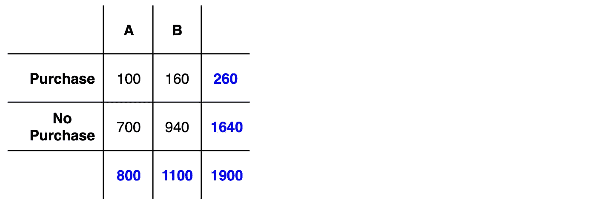
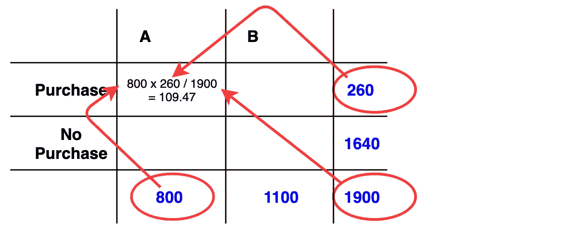
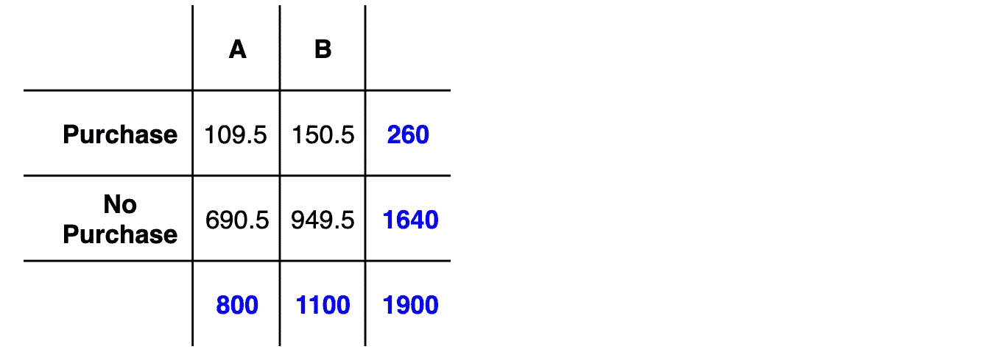
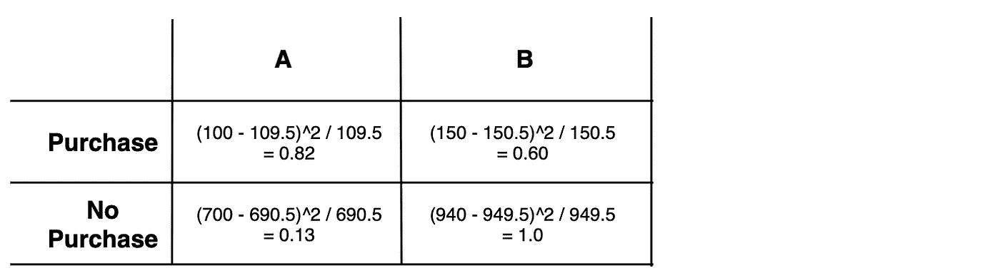
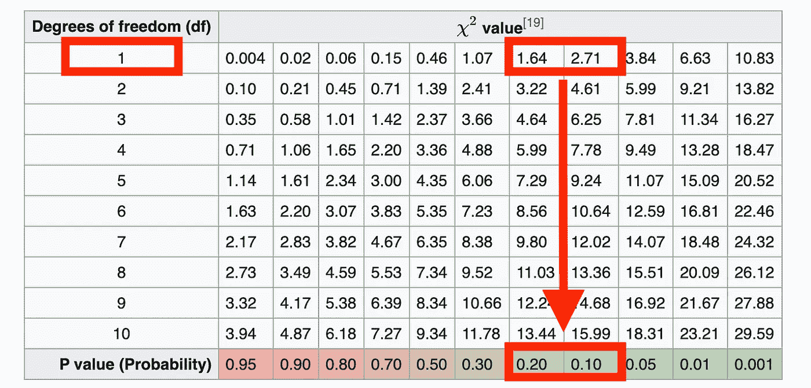

# 你的 A/B 测试结果有统计学意义吗？

> 原文：<https://pub.towardsai.net/are-your-a-b-test-results-statistically-significant-a29aa901c0bd?source=collection_archive---------1----------------------->

## [统计数据](https://towardsai.net/p/category/statistics)

## 在展示 A/B 测试结果之前，你应该知道如何测量统计显著性


来自 [Pexels](https://www.pexels.com/photo/shallow-focus-photography-of-woman-beside-fence-1684915/?utm_content=attributionCopyText&utm_medium=referral&utm_source=pexels) 的 [Daria Obymaha](https://www.pexels.com/@dariaobymaha?utm_content=attributionCopyText&utm_medium=referral&utm_source=pexels) 拍摄的照片

当我在电子商务领域工作时，我们通常 A/B 测试登陆页面。

但是如何知道结果是由于登陆页面的质量，还是由于偶然？

有一个测试。

我们将在 A/B 测试中测量 2 个登录页面结果的统计显著性。

# 统计显著性

## 这是什么？

一个结果不仅仅是由于偶然的可能性。

## 我们要做的测试叫什么？

皮尔逊卡方检验。

## 我们将如何使用测试的结果？

确定结果是偶然的概率。

如果概率(p 值)足够低，我们将拒绝[零假设](https://en.wikipedia.org/wiki/Null_hypothesis)，即两个登录页面之间没有差异。

*通常，实验将 p 值阈值设置为 0.05。这意味着如果结果来自偶然的概率≤ 5%,则数据在统计上是显著的。*

# 1.收集数据

我们随机向每个访问用户显示 2 个登录页面中的 1 个，然后收集每次访问是否导致购买的数据。

我们的**【实际结果】**如下。我们一会儿将它与“预期结果”进行对比。



实际结果

两个登录页面总共有 1900 次访问。

在对“登录页面 A”的 800 次访问中，有 100 次导致了销售。在对“登录页 B”的 1100 次访问中，有 160 次导致了销售。

# 2.计算预期结果

我们使用实际结果来计算预期结果。这一开始是不直观的，但请坚持我的观点。

如果零假设为真(又名。登陆页面是相等的)，那么来自 A 和 B 的结果是从相同的基础分布中采样的。

**“预期结果”**来源于该基本分布。我们计算如下。

**购买，A** =“总 A 访问量”x“总购买量”/“总访问量”
**NoPurchase，A** =“总 A 访问量”x“总无购买量”/“总访问量”
**购买，B** =“总 B 访问量”x“总购买量”/“总访问量”
**NoPurchase，A** =“总 B 访问量”x“总无购买量”/“总访问量”



计算(购买，A)

对 A/B 和 Purchase/NoPurchase 的每个组合重复上述步骤。



预期结果

这为我们提供了预期的结果。

# 3.计算卡方

现在我们执行皮尔逊卡方计算。

这是我们象限中每个部分的`(actual — expected)/expected`之和。我在下面计算了每一个。



现在把这些加在一起。

```
0.82 + 0.60 + 0.13 + 0.10 = 1.65
```

这使我们的卡方值为 1.65。但是我们还没完。

# 4.查阅卡方表

现在你需要在统计学教科书的背面或者维基百科上找到卡方表。

首先我们计算自由度，等于`(columns — 1) x (rows — 1)`。

所以在我们这里，`(2 — 1) x (2 — 1) = 1`。

然后，我们使用`1`和`1.65`来查找卡方值在表上的位置。

它在`1.64`和`2.71`之间，暗示着一个在`0.1`和`0.2`之间的 p 值，但是非常接近`0.2`。



谢谢[维基百科](https://en.wikipedia.org/wiki/Chi-square_distribution#Table_of_%CF%872_values_vs_p-values)

这一切意味着什么？

我们的结果偶然发生的概率接近 20%。高得无法拒绝无效假设。

这意味着我们不能相信我们的结果来证明一个登陆页面比另一个更好。

# 结论

我希望您喜欢这个关于计算统计显著性的简短演示。

在创业领域，我们通常没有足够的数据来确认我们的结果是否有意义，但至少我们可以感觉到它们没有意义的可能性。