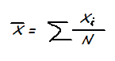
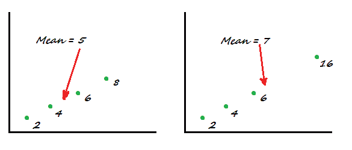

# 算术平均及其在数据分析中的应用

> 原文：<https://pub.towardsai.net/arithmetic-mean-and-its-applications-in-data-analytics-55862378f1cc?source=collection_archive---------0----------------------->

## [数据分析](https://towardsai.net/p/category/data-analytics)，[数据科学](https://towardsai.net/p/category/data-science)，[机器学习](https://towardsai.net/p/category/machine-learning)，[数学](https://towardsai.net/p/category/mathematics)

## 从平均每月支出到机器学习算法——算术平均值的广泛使用案例。

克里斯·蒙哥马利在 [Unsplash](https://unsplash.com?utm_source=medium&utm_medium=referral) 上拍摄的照片

这是一个家喻户晓的名字，我们每天都在使用这个术语。它可以说是所有统计术语中最流行的。

然而，它的属性、变体和多用途的用例对我们许多人来说并不明显。我们倾向于认为它只是一些数字的平均值——这就是我们所需要知道的。

我说的是算术平均值。

本文的目的是阐明算术平均值的鲜为人知的领域，包括它的属性、用例以及局限性。

# 等差中项

平均值——更准确地说是算术平均值——是一些数据点的平均值。这是最简单的集中趋势测量方法，取观察值之和，然后除以观察值的数量。

在数学符号中，算术平均值表示为:

其中 *xi* 是单个观测值，而 *N* 是观测值的数量

在一个更实际的例子中，如果 3 个餐馆雇员的工资是每小时 12 美元、14 美元和 15 美元，那么平均工资是每小时 13.6 美元。就这么简单，但要计算这个平均值，需要做的是:

数据:12、14、15

总和:12+14+15

观察次数:3 次

平均值:(12+14+15)/3

# ***应用***

*   我们在日常生活中做各种各样的平均。我们向朋友询问他们社区的平均房租；在搬到一个新的城市之前，我们计算每月的开支。我们每天都在各种情况下使用算术平均值。
*   企业使用方法来比较一月和二月之间产品的平均日销售额。
*   在数据科学中，平均值是探索性数据分析(EDA)中的一个基本指标，是各种高级建模的输入。Mean 在计算分类或回归算法中的 RMSE(均方根误差)、MAE(平均绝对误差)准确性度量时在幕后工作。

# 类型学

平均值有几个变体。这些不经常使用，但是在特殊的用例中是有用的工具。以下是一些例子:

***加权平均***

一般来说，所有的数据点都被同等对待，所有的数据点都被赋予同等的权重。相比之下，在加权平均法中，根据分析的目的，一些数据被赋予较高(或较低)的权重。

加权平均经常被用于不同领域的综合指数，特别是在环境科学领域。

***几何平均***

与普通平均值不同，几何平均值乘以 *N* 个值，并取乘积的*N*个根。因此，对于两个值 2 & 8，几何平均值将是 4。

几何平均数的一些使用案例包括计算财务回报率、创建指数(如股票指数)等。

***谐音的意思是***

这是另一种平均值，计算方法是取数据点的倒数，然后取它们的平均值，最后取结果的倒数。

它用于平均以比率和比率表示的数据点，如金融中的 P/E 比率。

# ***算术平均值的局限性***

尽管算术平均值是最广为人知的集中趋势的度量，但它不是一个稳健的度量；它对异常值非常敏感。

让我们考虑以下两种情况。在左边，四个值的平均值正好在数据集的中间。然而，在右边，仅仅一个异常值数据(16)改变了“重心”,并使平均值进一步向右移动。为了克服算术平均值的这种局限性，我们有另一种集中趋势的度量方法——中位数。

图:异常值对数据集算术平均值的影响(插图:作者)

## **最后一句话**

在本文中，我重点关注了集中趋势度量的一个重要指标，包括它的一些属性、用例、类型和局限性。当然，关于每一个问题还有很多可以说的，但是这篇文章的目的是在一个非常高的层次上强调它们，以便任何感兴趣的人可以根据需要更深入地挖掘。

我将在以后的文章中讨论集中趋势的其他度量，比如分散和分布。敬请期待！