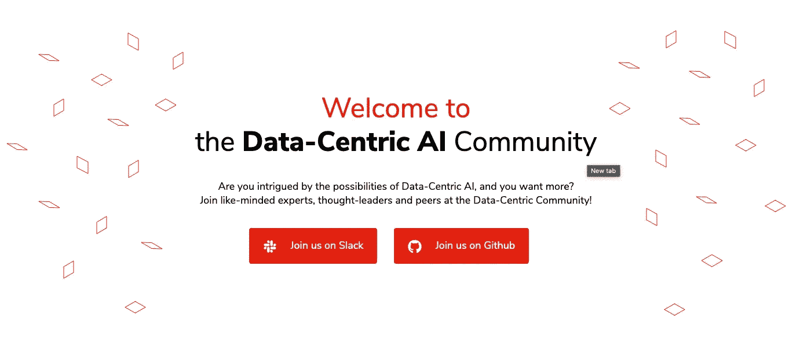

# 为什么我们需要一个以数据为中心的人工智能社区？

> 原文：<https://pub.towardsai.net/artificial-intelligence-2b1bf2ac7736?source=collection_archive---------2----------------------->

## [人工智能](https://towardsai.net/p/category/artificial-intelligence)

## 讨论数据科学的数据质量的地方

由[杜凡](https://unsplash.com/@miinyui?utm_source=unsplash&utm_medium=referral&utm_content=creditCopyText)在 [Unsplash](https://unsplash.com/?utm_source=unsplash&utm_medium=referral&utm_content=creditCopyText) 上拍摄的照片

根据 Alation 的数据文化状态报告[中的](https://venturebeat.com/2021/03/24/employees-attribute-ai-project-failure-to-poor-data-quality/)，87%的员工将糟糕的数据质量归因于为什么大多数组织未能有意义地采用人工智能。根据麦肯锡 2020 年的一项研究，高质量的数据对于推动组织超越竞争对手的数字化转型至关重要。

随着机器学习算法编码框架[的快速发展](https://www.stateof.ai/)，可以说人工智能中最稀缺的资源是大规模的高质量数据。高质量的数据是瓶颈。

尽管有几项关于数据在人工智能行业中的重要性的发现，但人工智能领域超过 90%的研究论文仍然是以模型为中心的。根据吴恩达的说法，这是因为难以创建能够成为公认标准的大型数据集。

事实是，只有通过提高数据的质量和数量才能突破机器学习已经达到的当前阈值。

因此，以数据为中心的运动诞生了。这一变化代表了[最近从关注建模到用于训练和评估模型的底层数据的转变](https://datacentricai.org/)。

**作为运动的下一步，今天我们很高兴地宣布以数据为中心的人工智能社区——一个讨论数据科学的数据质量的地方。**

# 什么是以数据为中心的人工智能，为什么我们应该关注它

照片由[帕帕约安努·科斯塔斯](https://unsplash.com/@papaioannou_kostas?utm_source=unsplash&utm_medium=referral&utm_content=creditCopyText)在 [Unsplash](https://unsplash.com/s/photos/community?utm_source=unsplash&utm_medium=referral&utm_content=creditCopyText) 上拍摄

以数据为中心的人工智能是人工智能开发的方法，它将训练数据集视为解决方案的核心，而不是模型。

让我们退一步，理解一下对以数据为中心的人工智能的炒作。由吴恩达创造的以数据为中心的人工智能强调了关注数据质量而不是算法和模型的重要性。更进一步， [deeplearning.ai](https://www.deeplearning.ai/) 和 [Landing AI](https://landing.ai/) 宣布了有史以来第一次[以数据为中心的比赛](https://worksheets.codalab.org/worksheets/0x7a8721f11e61436e93ac8f76da83f0e6)。它不仅创造了意识，还颠覆了传统的竞争，并要求改进给定固定模型的数据集。

最后，在 2021 年，举办了以数据为中心的人工智能研讨会，以将 DCAI 社区培养成一个充满活力的跨学科领域，解决实际的数据问题。一些公司已经采用了这种方法并取得了成效。根据 [Landing AI](https://landing.ai/data-centric-ai/) 的说法，采用以数据为中心的方法带来的一些改进包括:

*   构建计算机视觉应用的速度提高了 10 倍
*   部署应用程序的时间缩短了 65%
*   产量和精确度提高高达 40%

凭借业内所有已证实的优势，推出 DCAI 社区旨在完成以数据为中心的人工智能运动中缺失的一块。

## 以数据为中心的人工智能社区的三大支柱

虽然以数据为中心的方法仍在不断发展，并且可以跨越机器学习生命周期的各个阶段，但我们已经确定了数据科学家中最重要的痛点，并旨在关注 DCAI 社区中的那些痛点。

我们称之为 DCAI 社区的三大支柱:

*   **数据分析:**理解现有数据是改进数据的第一步。用几行代码分析您的数据。试试看[熊猫侧写](https://github.com/pandas-profiling/pandas-profiling)！
*   **合成数据:**它是人工创建的，保留了原始数据的属性，在保证其商业价值的同时，又符合隐私要求。试试 [ydata-synthetic](https://github.com/ydataai/ydata-synthetic) ！
*   **数据标签:**这难道不是你在数据质量方面最大的痛点之一吗？DCAI 社区在我们的 [slack workspace](https://slack.ydata.ai/) 中围绕这个话题和其他话题开展有意义的讨论！

此外，在[Awesome-Data-Centric-AI GitHub 仓库，我们已经(并将继续)整理所有有用的开源工具和 3 大支柱的资源。](https://github.com/ydataai/awesome-data-centric-ai)

# 无限可能在一起

[以数据为中心的社区](https://datacentricai.community/) —作者图片

*“我能期待什么？”我听到你问了。*

在以数据为中心的人工智能社区，我们相信团结一致，我们可以积极地改变范式，实现更好的数据。我们希望聚集业内专家，促进有意义的对话。

期待定期的活动和内容创建日历，这将帮助你更好地理解这种方法，并让你成为以数据为中心的人工智能传播者。当我们与业内专家合作时，您将直接从那些已经做了您计划要做的事情的人那里获得急需的指导。

用改进的数据加速人工智能是我们工作的核心，这个[开源社区](https://www.datacentricai.community/)是我们迈向有意义旅程的又一步。我们[邀请](http://slack.ydata.ai/)你成为它的一部分——共同创造无限可能。

[*法比亚娜*](https://www.linkedin.com/in/fabiana-clemente/) *是 CDO*[*y data*](https://ydata.ai/?utm_source=medium&utm_medium=signature&utm_campaign=blog)*。*

**用改进的数据加速 AI。**

[*YData 为数据科学团队提供第一个数据开发平台。*](https://ydata.ai/?utm_source=medium&utm_medium=signature&utm_campaign=blog)