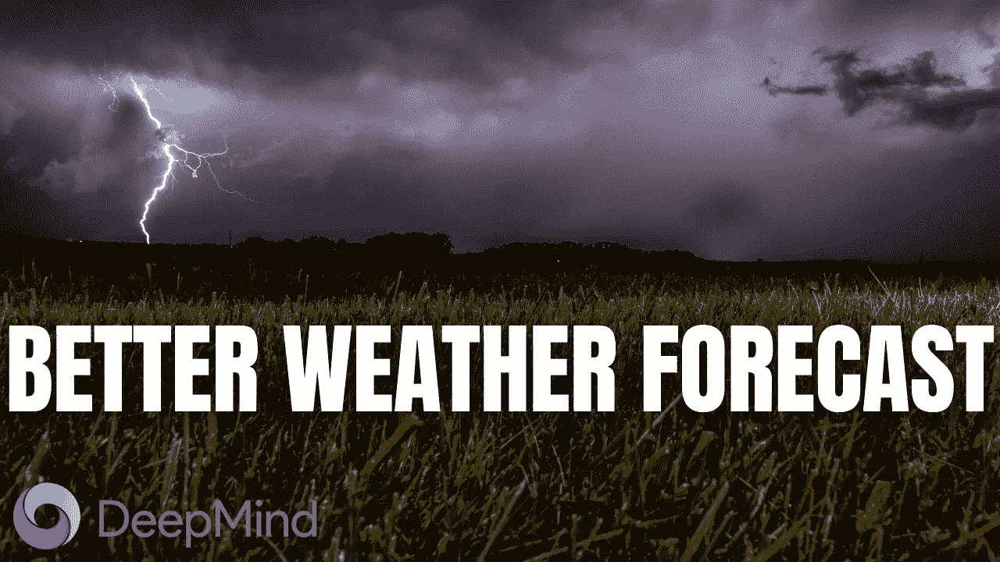
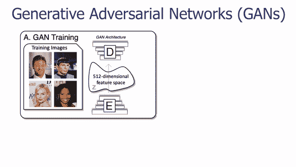
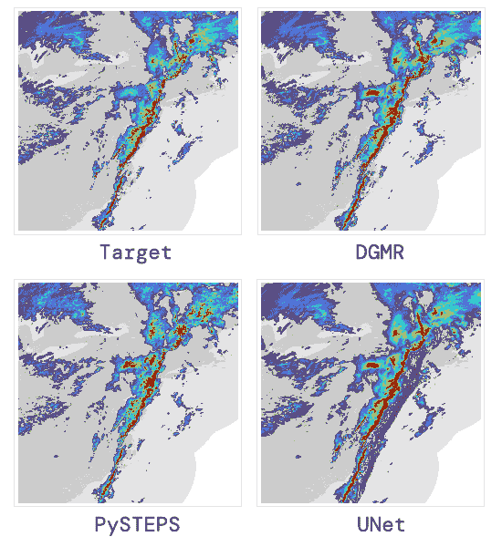
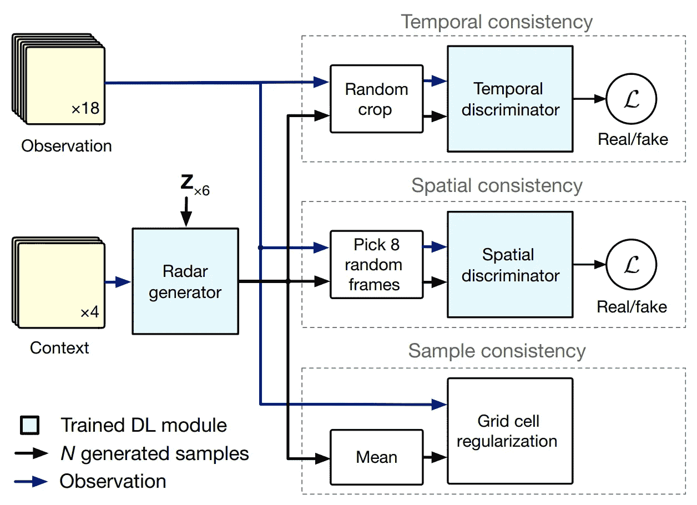
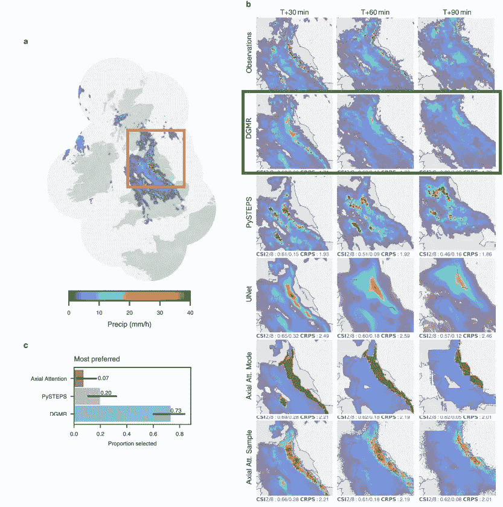

# DeepMind 使用人工智能来预测更准确的天气预报

> 原文：<https://pub.towardsai.net/artificial-intelligence-4d7b12727ac4?source=collection_archive---------2----------------------->

## [人工智能](https://towardsai.net/p/category/artificial-intelligence)

## 50 多名专家气象学家评估了 DeepMind 的新模型，在 89%的情况下，它击败了当前的临近预报方法，证明了它的准确性和实用性

> 原载于 [louisbouchard.ai](https://www.louisbouchard.ai/deepmind-rain-nowcasting/) ，前两天在[我的博客](https://www.louisbouchard.ai/deepmind-rain-nowcasting/)上看到的！

## 观看视频

你肯定计划了一天的海滩之旅，在去之前查看了天气，天气说是晴天，而就在你到达的时候，天开始下雨了。这种或类似的情况发生在我们所有人身上。我们总是谈论天气。有两大原因:它对我们的生活和活动有很大的影响，我们有时没有更好的话题可谈。一个普遍的共识是，未来几个小时的天气预报似乎完全是随机的。尤其是在降雨预报方面。

这是有原因的。实际上非常复杂。这些短期天气预报被称为降水临近预报，使用各种方法预测未来两小时内将发生什么。这些方法由强大的数值天气预测系统驱动，通过求解物理方程来预测天气。对于长期预测来说，它们非常强大，但在一天中的特定时间，却很难找到你头顶上方的精细预测。就像统计学一样。预测一个普通人在某种情况下会做什么是很容易的，但是预测一个特定的人会做什么是很难的。如果你想更深入地了解这些数学模型，我已经在我的视频[中更详细地解释了它们如何使用深度学习进行全球天气预测](https://youtu.be/C7dNU298A0A)。即使我们有大量的雷达数据来预测将会发生什么，数学和基于概率的方法也不精确。你可以看到这是怎么回事。有数据就有 AI。

“2019 年 4 月英国上空的一次挑战性事件(目标是观测雷达)。我们的生成方法(DGMR)比平流方法(PySTEPS)更好地捕捉了环流、强度和结构，并更准确地预测了东北部的降雨和运动。与确定性深度学习方法(UNet)不同，DGMR 还可以生成敏锐的预测。图片来自 [DeepMind 的博文](https://deepmind.com/blog/article/nowcasting)。

事实上，这种缺乏精确性的情况在未来可能会改变，部分原因是 DeepMind。DeepMind 刚刚发布了一个生成模型，该模型在 89%的情况下能够胜过广泛使用的临近预报方法，其准确性和实用性由 50 多位专家气象学家评估！他们的模型侧重于预测未来 2 小时的降水量，并取得了令人惊讶的好成绩。正如我们刚刚看到的，它是一个生成模型，这意味着它将生成预测，而不是简单地预测它们。它基本上利用过去的雷达数据来创建未来的雷达数据。因此，利用过去的时间和空间成分，他们可以生成它在不久的将来的样子。

您可以看到这与 Snapchat 滤镜一样，获取您的面部，并生成一个带有修改的新面部。为了训练这样一个生成模型，你需要来自人脸和你想要生成的人脸类型的大量数据。然后，使用经过许多小时训练的非常相似的模型，你将拥有一个强大的生成模型。这种模型通常使用 GANs 架构进行训练，然后独立使用生成器模型。如果你不熟悉生成模型或 GANs，我邀请你观看我制作的许多视频中的一个，比如这个关于动画的视频。

GAN 网络生成器的体系结构。

实现图像生成的最基本架构之一称为 UNet。它基本上获取一幅图像，或过去的雷达数据，在这种情况下，使用经过训练的参数对其进行编码，并利用该编码信息生成同一图像的新版本，在我们的情况下，这将是接下来几分钟的同一雷达数据。

“过去 20 分钟的观测雷达被用来提供未来 90 分钟的概率预测，使用深度生成模式的雨(DGMR)。”图片来自 [DeepMind 的博文](https://deepmind.com/blog/article/nowcasting)。

以下是向典型的 UNet 提供预测数据时，与它应该看起来的样子(目标)相比的样子。

2019 年 4 月美国东部上空的一次强降水事件(目标是观测雷达)。与平流方法(PySTEPS)相比，生成方法 DGMR 平衡了降水的强度和范围，平流方法的强度通常太高，并且不会像确定性深度学习方法(UNet)那样模糊。图片来自 [DeepMind 的博文](https://deepmind.com/blog/article/nowcasting)。

你可以看到它相对较好，但是不够精确，肯定不足以在我们的日常生活中使用。这里有一个与目前使用的数值天气预报方法如 PySTEPS 的比较。稍微好一点，但是你可以看到它也不是完美的。我们真的不能使用数学方程进一步改进概率方法，所以尝试不同的方法变得有趣。此外，我们有大量雷达数据来训练我们的模型的事实对于深度学习方法来说是非常令人鼓舞的。

这就是为什么 DeepMind 成功地创建了一个类似 GAN 的架构，专门用于这项任务。这是结果。你可以看到更多的细节是多么的接近现实。真的印象深刻！他们通过使用过去雷达数据的时间和空间成分来生成雷达数据在不久的将来的样子。

顺便说一句，如果你觉得这很有趣，我邀请你通过将这篇文章发送给一个朋友来分享知识。我相信他们会喜欢的，他们会因为你而感激学到新的东西！如果你没有，不要担心，谢谢你的阅读！

## DeepMind 模型

DeepMind 的发电机训练架构。图片来自[拉武里等人，(2021)，DeepMind](https://www.nature.com/articles/s41586-021-03854-z) 。

因此，更准确地说，之前 20 分钟的雷达观测结果被发送到模型，以生成 90 分钟的未来可能预测。它的训练就像任何 GAN 架构一样，通过惩罚生成的雷达预测和真实预测之间的差异来指导学习过程，这是我们在训练数据集中拥有的。正如你在这里看到的，有两个损失和一个正则项，这是在训练期间将导致我们的模型的惩罚。第一个是暂时的损失。这种时间损失将通过将它们与特定时间量(或帧)内的真实数据进行比较来迫使模型在多个帧内的生成保持一致，以使其暂时真实。这将消除在现实世界中不可能发生的怪异跳跃或时间不一致性。第二个损失是同样的事情，但空间的目的。它通过比较实际雷达数据与我们在特定帧生成的预测来确保空间一致性。简而言之，它将迫使模型变得“空间智能”，并产生自信的预测，而不是像我们在 UNet 中看到的那样，产生大量模糊的预测。最后一项也是最重要的一项是正则项。它将惩罚实际雷达序列和我们的预测之间的网格单元分辨率的差异，每次使用许多例子，而不是像两个损失那样逐个比较预测。这将提高性能并产生更精确的位置预测。

因此，您将发送一些观察结果，获得它们的预测，将它们与我们刚刚讨论的这三个测量结果的真实雷达数据进行比较，并根据差异更新您的模型。然后，对所有的训练数据重复这个过程无数次，最终得到一个强大的模型，它可以学习天气如何变化，并可以在理想情况下准确地将这种行为推广到它随后将接收的大多数新数据。

不同型号的结果示例。图片来自[拉武里等人，(2021)，DeepMind](https://www.nature.com/articles/s41586-021-03854-z) 。

你可以在上面的例子中看到结果是多么准确，UNet 是准确但模糊的，并且数值方法随着时间的推移高估了降雨强度。正如他们所说，没有一种方法是没有局限性的，他们的方法与长期预测斗争，就像大多数深度学习应用程序一样，他们也与不经常出现在训练数据集中的罕见事件斗争，他们将努力改进这些事件。

当然，这只是这篇新论文的一个概述，它攻击了降水临近预报这个超级有趣和有用的任务。

我邀请您阅读他们的优秀论文，了解更多关于其实施、培训数据、评估指标和专家气象学家研究的技术细节。他们还做了一个 Colab 笔记本，你可以玩着它进行预测。两者都在下面的参考文献中链接。非常感谢那些还在这里的人阅读，我们下周再见！

如果你喜欢我的工作，并想与人工智能保持同步，你绝对应该关注我的其他社交媒体账户( [LinkedIn](https://www.linkedin.com/in/whats-ai/) 、 [Twitter](https://twitter.com/Whats_AI) )，并订阅我的每周人工智能 [**简讯**](http://eepurl.com/huGLT5) ！

## 支持我:

*   支持我的最好方式是成为这个网站的会员，或者如果你喜欢视频格式，在[**YouTube**](https://www.youtube.com/channel/UCUzGQrN-lyyc0BWTYoJM_Sg)**上订阅我的频道。**
*   **在经济上支持我在 T21 的工作**
*   **跟我来这里上 [**中**](https://whats-ai.medium.com/)**
*   **想进入 AI 或者提升技能，[看这个](https://www.louisbouchard.ai/learnai/)！**

## **参考**

*   **拉武里、伦茨、k .、王绍博、m .、坎金、d .、拉姆、米罗斯基、p .、菲茨西蒙斯、m .、阿萨纳夏杜、m .、卡舍姆、马奇和普鲁登，2021 年。使用雷达的深度生成模式的巧妙降水临近预报，[https://www.nature.com/articles/s41586-021-03854-z](https://www.nature.com/articles/s41586-021-03854-z)**
*   **Colab 笔记本:[https://github . com/deep mind/deep mind-research/tree/master/now casting](https://github.com/deepmind/deepmind-research/tree/master/nowcasting)**