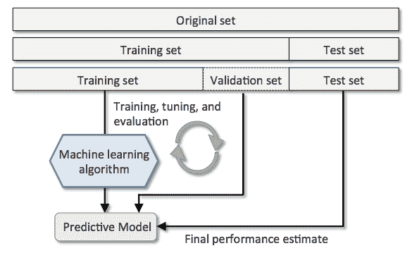
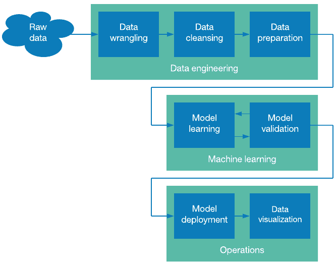

# 人工智能数据收集如何与机器学习模型相关联？

> 原文：<https://pub.towardsai.net/artificial-intelligence-94565e8d9926?source=collection_archive---------1----------------------->

## [人工智能](https://towardsai.net/p/category/artificial-intelligence)

> 你计划将人工智能引入现有的组织模式吗？或者你只是想准备一个智能和自主的设置来迎合特定的用户群？不管你在人工智能实现方面的目标是什么，除非你有相关的数据可以依赖，否则它是无法成型的。

**人工智能数据收集的重要性**

[数据收集](https://www.shaip.com/offerings/data-collection/)作为一个话题是无止境的。但是，对于外行来说，它可以简单地理解为获取特定于模型的信息以更好地训练 AI 算法的过程，以便它们可以自主地做出主动决策。

很简单，对！嗯，还有更多。想象你未来的人工智能模型还是个孩子，不知道主体是如何工作的。为了教孩子打电话和完成任务，你必须让他先学习概念。这就是人工智能中的数据集努力实现的目标，即作为模型学习的基础。

**与人工智能项目相关的数据集类型**

将大量数据整理成相关的数据集是好的，但每个数据集都是为了训练模型吗？不完全是，因为在收集相关见解之前，需要了解三个更广泛的数据集类别。

作者图片

1.  **训练数据集**

人工智能数据集主要用于训练算法，最终用于模型本身。训练数据集占收集的总数据的 60%，与机器学习和关于神经网络、自学等的教学模型相关。

2.**测试数据集**

测试数据对于了解模型对概念的掌握程度非常重要。然而，由于 ML 模型已经被输入了大量的[训练数据](https://www.iotforall.com/effective-tips-to-build-a-training-data-strategy-for-machine-learning)，算法预计将在测试阶段识别这些数据，因此测试数据集应该完全不同，并且与预期结果不同步。

3.**验证集**

在训练模型时，您需要添加验证集，以确保最终产品变得完美并符合预期。

## **AI 数据收集要遵循哪些策略？**

既然你已经知道了数据集的类型，设计一个精心设计的计划来使人工智能数据收集成功是很重要的。

*   **策略一:发现大道**

没有比不知道为预测模型收集数据的起点更大的问题了。一旦 R&D 团队提出了一个视觉原型，规划一个超越数据收集的策略是很重要的。

首先，依赖开放数据集是明智的，特别是由可信服务提供商提供的数据集。此外，您的重点应该是只向模型提供相关数据，并将复杂性保持在最低限度，尤其是在开始时。

*   **策略 2:阐明、建立和检查**

一旦你知道从哪里获得数据，你必须事先阐明模型的预测方面。这就是数据探索出现的地方，此时您必须分配可能与您的系统相关的算法。您可以在聚类、回归、分类和排序算法之间进行选择。

接下来，您应该建立数据收集机制，可能的选项是数据湖、数据仓库和 ETL。最后，更好的数据收集还需要您通过确定充分性、平衡或缺乏以及技术错误(如果有的话)来检查质量。

*   **策略三:格式化并缩减**

很明显，您希望通过从不同的来源收集数据来训练、测试和验证您的模型。因此，为了一致性和确定工作范围，在开始时对它们进行格式化是很重要的。

接下来，您必须减少数据集，以使它们具有足够的功能。但是等等，无尽的数据储备对于开发智能模型来说不是明智的吗？是的，但是如果你计划在独占任务上工作，通过属性采样减少数据是一条可行的道路。

您可以通过数据清理来进一步减少数据，使用记录采样等工具从数据库中删除错误和缺失的记录。

*   **策略 4:特色创作**

如果您正在处理图像数据收集或语音数据收集等具体问题，这种策略是有意义的。虽然添加大量干净和简化的数据很重要，因为您不希望向模型提供不完整和模糊的图像，但您必须尝试并确保以定制的方式创建某些特殊功能，以使模型在时间上更加直观。

*   **策略 5:重新缩放和离散化**

当你在这一点上的时候，你应该已经收集了所有有意义的相关数据。但是，您仍然需要对其进行重新缩放以提高集合的质量，然后对其进行离散化以使预测更加清晰和相关。

作者图片

**总结**

数据收集不是一个简单的过程。这需要丰富的经验，通常还需要一个由经验丰富、技术娴熟的数据工程师和科学家组成的团队。无论是准备具有视频和图像数据收集的计算机视觉模型，还是具有语音和文本数据收集的 NLP 系统，公司都必须立即专注于与知名服务提供商建立联系，以外包数据收集。

**参考文献**

1.  【https://www.shaip.com/offerings/data-collection/ 
2.  [https://www . iotforall . com/effective-tips-to-build-a-training-data-strategy-for-machine-learning](https://www.iotforall.com/effective-tips-to-build-a-training-data-strategy-for-machine-learning)

**感谢您的阅读！祝您愉快！！:)**