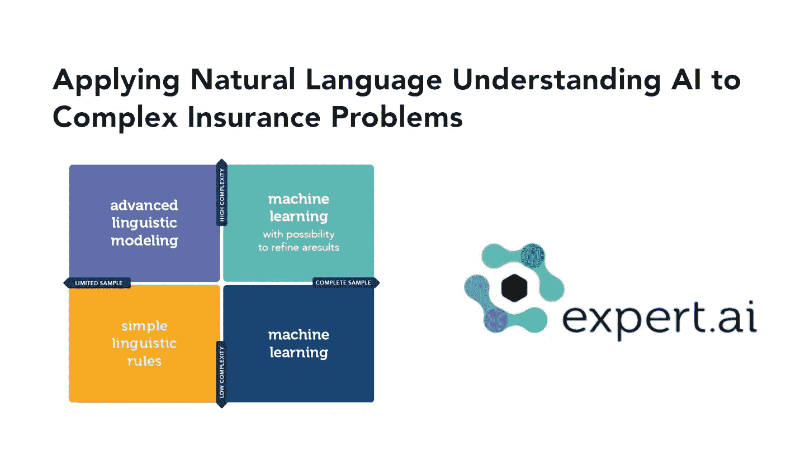

# 人工智能(AI)时事通讯《走向 AI #14》

> 原文：<https://pub.towardsai.net/artificial-intelligence-ai-newsletter-by-towards-ai-14-2879015e2083?source=collection_archive---------1----------------------->

## [新闻](https://towardsai.net/p/category/news)，[快讯](https://towardsai.net/p/category/newsletter)

## 《走向人工智能》的人工智能时事通讯

***如果你阅读这封邮件有困难，请在*** [***网络浏览器***](http://ws.towardsai.net/s21) ***上查看。***

各位，我希望你们都好。在这一期，我们深入探讨机器学习的权威指南，自动化端到端的人工智能管道有多现实，Codex 真的会取代程序员吗， *modelitis 怎么样，*会结束吗，最后但同样重要的是，为什么人工智能永远不会取代经理。

感谢 **expert.ai** 为您带来这一期:

学习如何将自然语言应用于最具挑战性和现实世界的问题之一。查看 expert.ai 的免费白皮书 ，了解自然语言理解对于需要大量数据的过程是多么重要。限时免费访问， [**立即下载**](http://ws.towardsai.net/erx) ，紧跟自然语言理解的最新趋势。

你可能已经注意到我们已经稍微改变了时事通讯的格式。我们希望获得您对是否喜欢这种新形式的反馈，以及您的任何反馈。所以无论如何，请随时给我们留言。我们希望收到您的来信。

机器学习指南:如果你刚开始学习机器，技术细节、数学和其他细微差别可能会让人不知所措。请知道，这是正常的感觉。几年前，当我开始读到它时，我也有过完全相同的感受。如果你在起点船上，我们推荐你查看由我们的社区负责人 Louis Bouchard 撰写的这份 [**广泛指南**](https://github.com/louisfb01/start-machine-learning) ，深入了解如何在 2021 年开始你的机器学习之旅。已经分享遍了，包括 [**我们麻省理工的朋友**](https://twitter.com/MIT_CSAIL/status/1433822594608812033) 。

**自动化和端到端 AI 管道:**我们能自动化一个完整的管道吗？还没有，但是结果很有希望。“理想的解决方案是注入领域专业知识，然后自动化这个管道的不同部分，同时确保人类知识和领域专业知识仍然以某种方式注入到您的系统中。”~ Paroma Varma 博士了解更多关于 [**应用弱监管研究**](https://mktg.best/4ixp3) 自动化管道的对话。

**Codex 真的要取代程序员了吗？**简而言之，不要长篇大论，请看这篇由 Thomas Smith 撰写的 [**见解深刻的文章**](https://medium.com/p/i-beta-tested-openais-codex-and-the-results-are-spooky-good-e282a1874c79) ，其中一些令人毛骨悚然的结果展示了 Codex 计划如何通过使程序员更熟练、更有活力和更健壮来赋予他们权力。

**是不是 *modelitis* 要结束了？**每个人都在谈论以数据为中心的人工智能，从世界知名的 [**专家如吴恩达**](https://www.deeplearning.ai/wp-content/uploads/2021/06/MLOps-From-Model-centric-to-Data-centric-AI.pdf) ，到 [**行业巨鲸**](https://mktg.best/tfmgj) ，到 [**久负盛名的研究实验室**](https://github.com/HazyResearch/data-centric-ai#the-end-of-modelitis) 。研究者和实践者已经认识到两件事，1。通过真正理解数据可以获得更好的结果；2 .定制模型在生产中的开发和维护都具有挑战性，对于过大的模型更是如此。

**AI 会取代管理者吗？**不会，不会。长回答，决策者有一个独特的技能叫做**重构**，它提出了在解决复杂问题之前推断它们的能力——这是管理角色中最复杂和最耗时的部分之一。想要更详细的答案，请看《哈佛商业评论》的 [**这篇文章**](https://hbr.org/2021/09/why-ai-will-never-replace-managers) 进一步讨论了这个问题。

> [**加入 24000 名订户**](https://towardsai.net/subscribe) 登上《走向 AI》简讯。这是免费的，我们不发垃圾邮件，我们也不会分享你的电子邮件地址。及时了解人工智能领域的最新工作。从研究到项目和想法。如果您正在开发人工智能相关的产品或服务，我们邀请您考虑成为我们未来新闻简报的 [**赞助商**](https://sponsors.towardsai.net) 。

喜欢时事通讯吗？ [**订阅**](https://towardsai.net/subscribe) 支持我们或者**与你的朋友和同事分享**。

谢谢大家！直到下一次，

[**罗伯托**](https://www.linkedin.com/in/robiriondo/) 和 [**小队冲着艾**](https://pub.towardsai.net/about)

 [## 赞助商|了解如何成为《走向人工智能》的赞助商

### 无论你是想以一种吸引读者的方式突出你的产品，吸引高度相关的利基受众，还是…

sponsors.towardsai.net](https://sponsors.towardsai.net/)  [## 店铺↓ |走向 AI

### 发布最好的技术、科学和工程|社论→https://towardsai.net/p/editorial |订阅→…

ws.towardsai.net](https://ws.towardsai.net/shop)  [## 加入我们吧↓ |面向人工智能成员|数据驱动的社区

### 向着 AI 加入。通过成为会员，你不仅将支持人工智能，但你将有机会…

members.towardsai.net](https://members.towardsai.net/) 

*关注我们的地方:*

*[***脸书***](https://www.facebook.com/towardsAl/)***】|***[***推特***](https://twitter.com/towards_ai?lang=en)***]|***[***insta gram***](https://www.instagram.com/towards_ai/)***]|***[***LinkedIn***](https://www.linkedin.com/company/towards-artificial-intelligence)*