# 人工智能与技术发展

> 原文：<https://pub.towardsai.net/artificial-intelligence-and-technological-development-addc7638b374?source=collection_archive---------4----------------------->

## [人工智能](https://towardsai.net/p/category/artificial-intelligence)

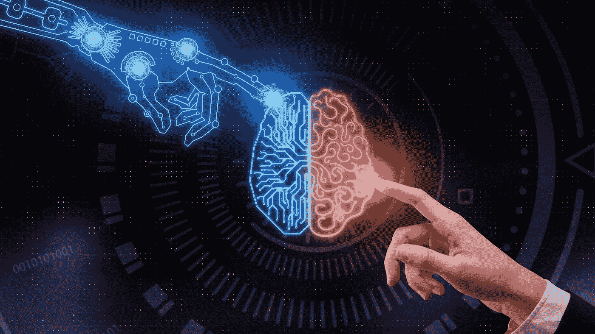

[http://enterprise talk . ondot . media/tech-trends/ai/human-intelligence-can-fix-ai-missions/](http://enterprisetalk.ondot.media/tech-trends/ai/human-intelligence-can-fix-ai-shortcomings/)

# 概述

*   人工智能的定义
*   人工智能简史
*   人工智能的子部分
*   当今人工智能领域的领先公司
*   主要行业人工智能正在转变
*   存在于我们日常生活中的人工智能
*   人工智能的未来

# 1.什么是人工智能？

[https://www . Forbes . com/sites/Bernard marr/2019/11/11/13-mind-blowing-things-artificial-intelligence-can-already-do-today/](https://www.forbes.com/sites/bernardmarr/2019/11/11/13-mind-blowing-things-artificial-intelligence-can-already-do-today/)

**人工智能** (AI)是计算机科学的一个子领域，涉及使用计算机来做传统上需要人类**智能或干预的事情，如决策、解决问题和学习**。

这意味着创建算法来分类、分析和从数据中得出预测。它还包括根据数据采取行动，从新数据中学习，并随着时间的推移不断改进。有了人工智能，计算机可以学习完成一项任务，而无需被明确编程。

# 2.人工智能简史。

Giammarco Boscaro 在 [Unsplash](https://unsplash.com/s/photos/history?utm_source=unsplash&utm_medium=referral&utm_content=creditCopyText) 上拍摄的照片

> 我们是怎么走到这一步的，为什么 AI 在 90 年代不流行？

*   **1950 —** 艾伦·图灵(Alan Turing)引入了**图灵测试**来确定机器是否能像人类一样毫无区别地思考问题并做出逻辑反应。
*   **1956 年—** 人工智能一词是约翰·麦卡锡在达特茅斯会议上创造的。
*   **1960 年—** 心理学家 Frank Rosenblatt 在感知方面的工作导致了被认为是第一台通过试错法学习技能的计算机 **Mark 1 感知的发展。**
*   **1978/1979——SCARA 机械臂**在日本诞生，改变了自动化装配。
*   **20 世纪 70 年代末—80 年代初** —被称为**【艾的冬天】**。资金和对人工智能的兴趣减少的时间
*   **1988 年**——英国科学家罗洛·卡彭特创造了 **Jabberwacky。一个聊天机器人，旨在与用户进行对话，并发起人类互动。**
*   1997 年，IBM 的深蓝电脑在一场国际象棋比赛中击败了世界象棋冠军加里·卡斯帕罗夫。
*   **20 世纪 90 年代末**——麻省理工学院设计系的辛西娅·布莱泽尔博士 **KISMET** 。能够识别和复制人类情感的机器人。
*   2000 年代后期**——IBM 推出**沃森。**能够回答用自然语言提出的问题的问答计算机系统。**
*   2011 年——苹果发布 **Siri** 。智能私人助理。
*   **2017** —谷歌 AI **阿尔法围棋**在围棋比赛中击败世界卫冕冠军、一代宗师柯洁。
*   其他智能系统正在全球涌现。

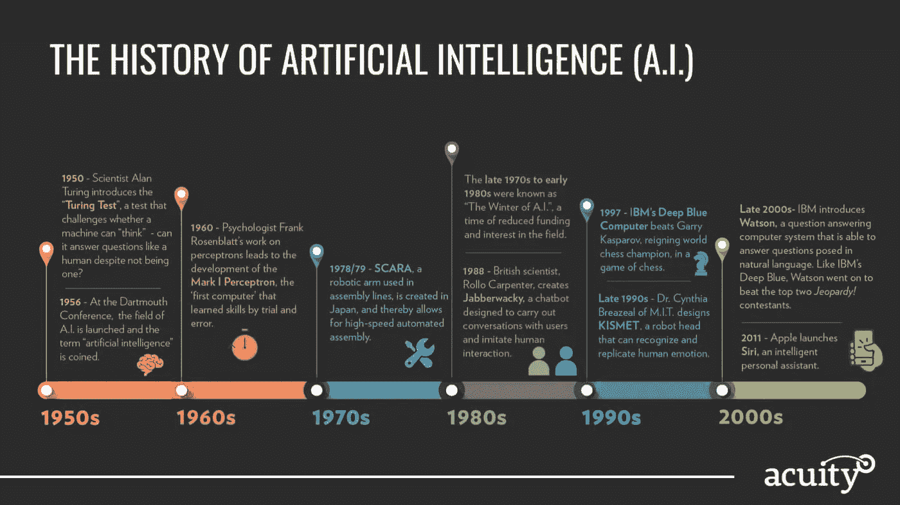

[https://www . acuity ads . com/blog/2019/02/25/ai-advances-for-2019/](https://www.acuityads.com/blog/2019/02/25/ai-advancements-for-2019/)

# 3.AI 的子部分

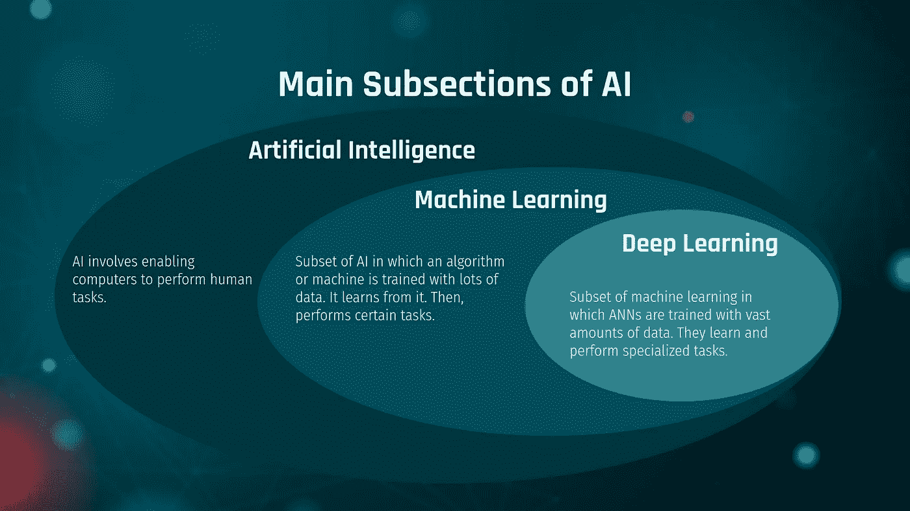

我的演示文稿截图

## 机器学习——实现人工智能的途径

[机器学习](http://www.nvidia.com/object/machine-learning.html)最基本的是使用算法来解析数据，从中学习，然后对世界上的一些事情做出决定或预测。

因此，机器不是用一组特定的指令手工编写软件例程来完成特定的任务，而是使用大量的数据和算法来“训练”机器，使其具有学习如何执行任务的能力。

计算机视觉仍然是机器学习的最佳应用之一，但无法超越人类的表现。这还不够好。因此，科学家必须做得更好。深度学习诞生了。

## 深度学习——一种实现机器学习的技术

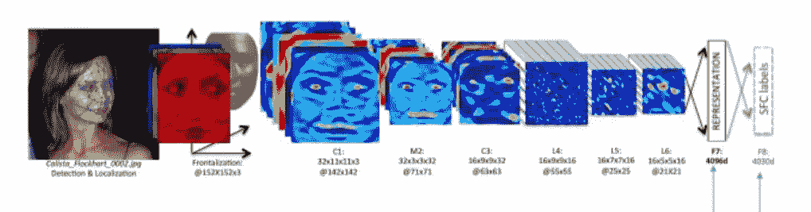

[https://techweez . com/2014/03/19/face books-deep-learning-face-verification-ai-performs-good-humans/Facebook-deep-learning-face-verification/](https://techweez.com/2014/03/19/facebooks-deep-learning-face-verification-ai-performs-good-humans/facebook-deep-learning-face-verification/)

深度学习是基于人工神经网络的机器学习的子集。人工神经网络的灵感来自人脑的生物学，其中每个人工神经元都试图模仿大脑神经元的功能。

人工神经网络被组织成由固定数量的神经元组成的离散层。这些层从输入层到输出层相互连接。想象一下一个接一个的块，在每个块中，你必须执行一个计算，然后将信息解析到下一个块，以此类推，直到你到达最终输出的最后一个块。

在深度学习中，与机器学习相比，模型需要大量的数据。

GPU 的出现和遵循摩尔定律的如此多数据的可用性，使深度学习成为 AI 小镇的新女孩。

# 4.当今人工智能领域的领先公司。

根据福布斯杂志。这是为人工智能的未来铺平道路的 9 家科技巨头:

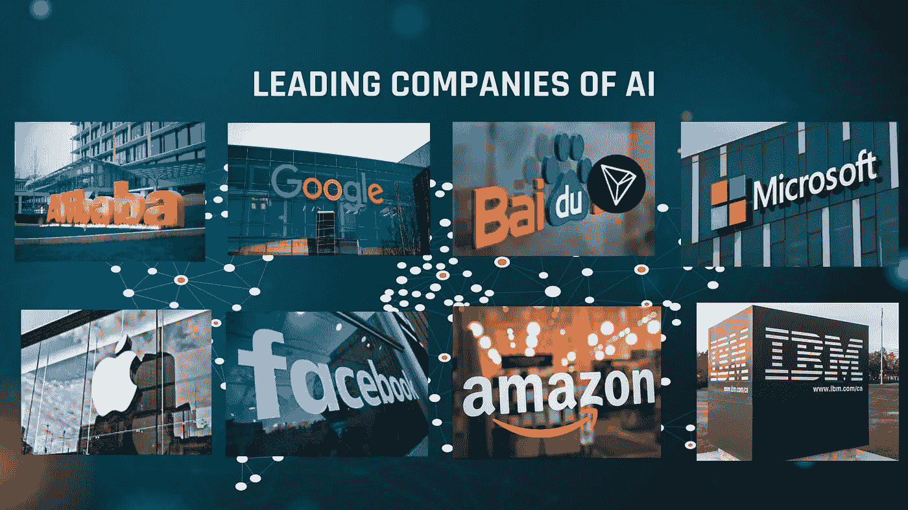

我的演示幻灯片截图

# 5.今天，人工智能正在改变主要行业。

## a)保健(医药)

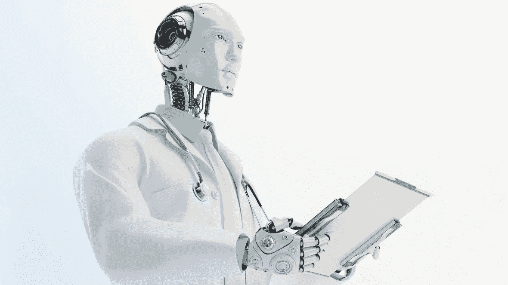

*   机器人医生:这些是为特定任务设计的复杂智能机器，例如，2017 年，[中国的一个机器人](https://futurism.com/first-time-robot-passed-medical-licensing-exam)仅使用其人工智能大脑就通过了医疗执照考试。
*   **临床诊断:** AI 算法诊断疾病比医生更快更准。例如，在 2018 年，[谷歌的 DeepMind](https://www.theverge.com/2018/8/13/17670156/deepmind-ai-eye-disease-doctor-moorfields) 训练了一个神经网络，通过简单地分析 3D 直肠扫描，准确地检测出 50 多种眼疾。此外，人工智能算法可以使用 MRI 扫描比医生更快地高精度分析和检测某些癌症
*   **药物发现:**这个想法是利用深度学习和人工智能建立一个药物发现程序，它可能需要几天时间，而不是过去通过试错格式的正常几个月甚至几年。

## 运输

通过开发自动驾驶汽车或自动驾驶汽车，人工智能和机器学习已经在交通运输行业产生了重大创新。通过使用摄像头、激光雷达和传感器，这些汽车能够在街道上导航并避免碰撞。例如，2018 年，东京启动了首批自动驾驶出租车的试验。

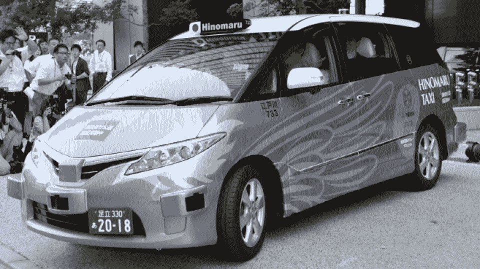

[https://English . kyodonews . net/news/2018/08/9739 c81b 3760-自主-出租车-试乘-载客-开始-在东京. html](https://english.kyodonews.net/news/2018/08/9739c81b3760-autonomous-taxi-trial-carrying-passengers-begins-in-tokyo.html)

## 教育

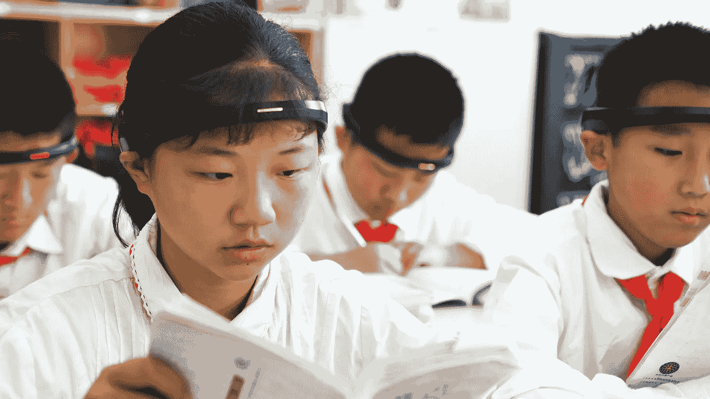

在某些国家，人工智能融入教育的程度令人震惊。比如说；中国一些小学的孩子们现在戴着头带，这种头带可以跟踪他们的认知水平，确定他们何时注意力集中、分心、打哈欠。将此信息发送给教师，并与家长聊天组共享。结果是疯狂的。孩子们有激光聚焦，成绩大大提高。

## d.农业

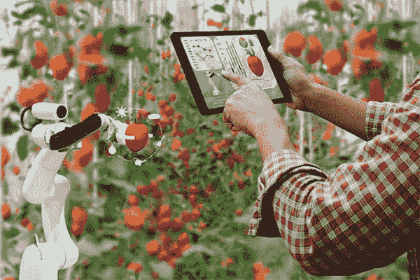

[https://www . aitrends . com/ai-in-agriculture/the-environmental-impacts-of-ai-and-IOT-in-agriculture/](https://www.aitrends.com/ai-in-agriculture/the-environmental-impacts-of-ai-and-iot-in-agriculture/)

据估计，在未来 80 年内，需要粮食的人口将增加 36 亿。为了满足人口的急剧增长，产量需要提高到超过今天的水平。

人工可以帮助建筑增加生产力以规避人口的增加。

# 6.人工智能存在于我们的日常生活中。

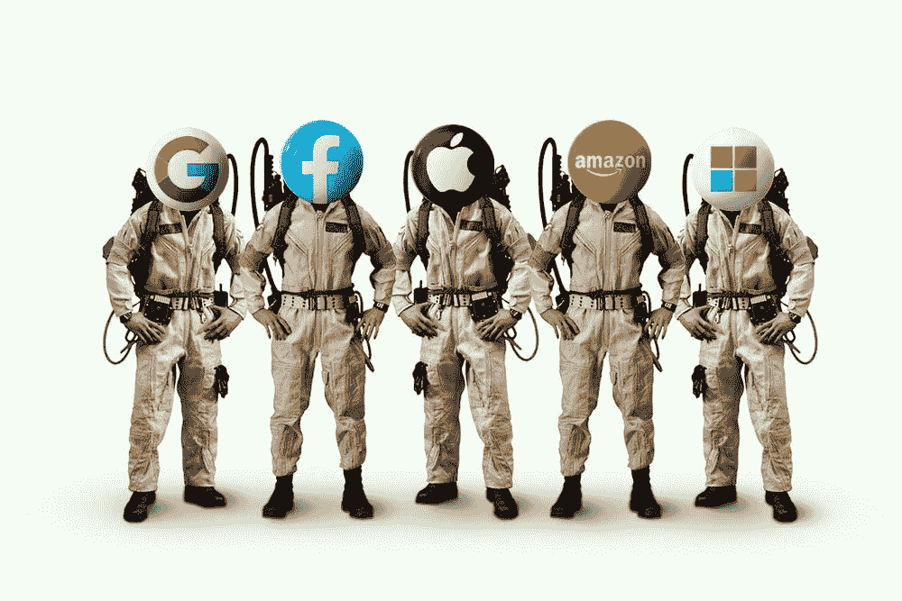

照片由[晨酿](https://unsplash.com/@morningbrew?utm_source=unsplash&utm_medium=referral&utm_content=creditCopyText)在 [Unsplash](https://unsplash.com/s/photos/person-on-facebook?utm_source=unsplash&utm_medium=referral&utm_content=creditCopyText) 拍摄

我相信我们大多数人都不知道我们的日常生活是如何受到人工智能和机器学习应用程序的影响的

*   脸书人脸识别
*   谷歌使用的垃圾邮件过滤
*   网飞电影推荐
*   Google Translate:使用 NLP 技术自动将文本从一种语言翻译成另一种语言。

# 8.一瞥人工智能的未来

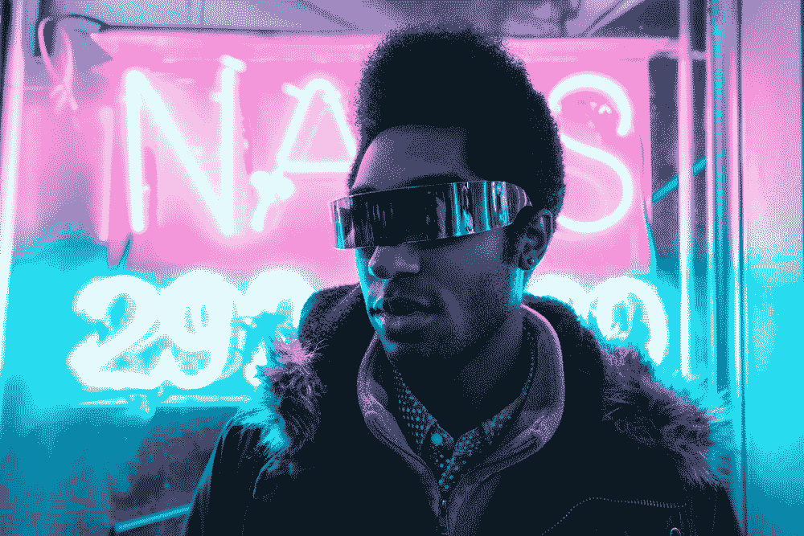

Alex Iby 在 [Unsplash](https://unsplash.com/s/photos/future?utm_source=unsplash&utm_medium=referral&utm_content=creditCopyText) 上拍摄的照片

> “我们将回顾 2019 年，并想知道，没有人工智能，他们是如何做到的？”——Alex shart sis， [Perfect Price](https://t.sidekickopen05.com/s1t/c/5/f18dQhb0S7lC8dDMPbW2n0x6l2B9nMJW7t5XZs63BqbbN4WJbsqfmSZMW4WYnDM56dvvVf93KmzC02?t=http%3A%2F%2Fwww.perfectprice.com%2F&si=5501814600368128&pi=212de43c-d610-4157-e382-f9f4fe5bfe6d) 的创始人兼首席执行官。

没有人真正知道人工智能在未来 50 年将走向何方。像比尔·盖茨、埃隆·马斯克、蒂姆·库克、桑德尔·皮帅和其他科技领袖所说的都是预言。这是因为人工智能似乎不受约束地奔向未来。这是一把双刃剑。我希望我们发现自己站在直言不讳的一边。无论如何，人们对人工智能可能在几乎每个行业打开的大门感到非常兴奋。基于人工智能领先公司的一些领导者的愿景，这里是对未来的偷偷窥视:

## **a)运输。**

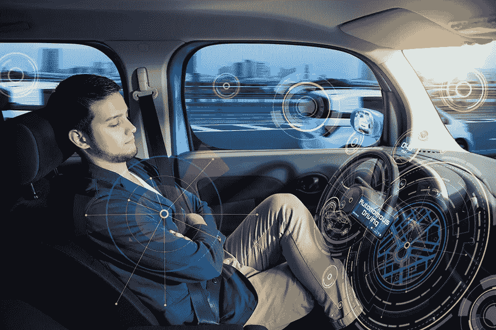

[https://www . techradar . com/news/everything-ces-2020-teached-us-about-the-excited-future-of-automatic-cars](https://www.techradar.com/news/everything-ces-2020-taught-us-about-the-exciting-future-of-autonomous-cars)

人工智能在交通领域的未来是自动驾驶汽车，高效的交通管理系统。自动驾驶汽车将有助于减少交通流量，提高安全性。车辆将能够相互通信，与行人通信，并与 5G 带来的智能城市基础设施通信。

我们将拥有预测维修需求的车辆，使用人工智能驱动的机械来修理它。在许多情况下，目标是提高安全性，降低运输货物和人员的成本。

## **b)教育**

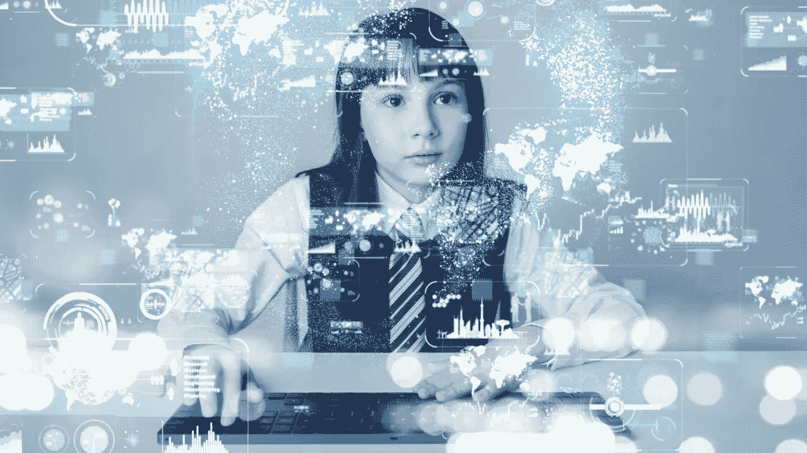

[https://www . four goods . co/is-the-future-of-education-ai-led-learning-platforms/](https://www.fourgoods.co/is-the-future-of-education-ai-led-learning-platforms/)

一些专家说，人工智能将扮演教学助理的角色(TA 注意，你的工作有危险)。人工智能将根据学生学习特定科目的能力来改进个性化教育。给你一些复杂数学问题的提示。教室将完全被虚拟教室取代。评分和评估等重复性任务将委托给人工智能，教师可以将更多的时间集中在教学上。

## c)能源

人工智能将有助于控制电网。这将大大有助于家居节能。例如，在由人工智能驱动的智能家居中，我们将能够识别主机的能源消耗模式，并适应自动调节它。

# 结论

人工智能、机器学习和深度学习是工具，它们要么可以用来创造如此重要的东西，如拯救生命、消除贫困、消除饥饿，从而提高生活水平，要么可以被用作灭绝人类的武器。

# 感谢阅读！

如果你觉得这篇文章有帮助，请随时联系我…

1.  可以在**中**这里关注我。
2.  在 **LinkedIn** [这里](https://www.linkedin.com/in/beltus/)关注我。
3.  关注我的[**推特**](https://twitter.com/beltusnkwawir)

# 参考

 [## 人工智能、机器学习和深度学习的区别。

### 人工智能是未来。人工智能是科幻小说。人工智能已经是…

www.sginnovate.com](https://www.sginnovate.com/blog/difference-between-artificial-intelligence-machine-learning-and-deep-learning)  [## 人工智能(AI)档案-破坏者日报

### 无论是颠覆性的新人工智能创业公司，还是人工智能颠覆另一个行业的新闻，你都会发现…

www.disruptordaily.com](https://www.disruptordaily.com/category/technologies/artificial-intelligence/)  [## 人工智能的历史-新闻中的科学

### 机器能思考吗？20 世纪上半叶，科幻小说让世界家喻户晓…

sitn.hms.harvard.edu](http://sitn.hms.harvard.edu/flash/2017/history-artificial-intelligence/)  [## AI、机器学习、NLP、深度学习有什么区别？

### AI、机器学习、NLP、深度学习有什么区别？最初出现在 Quora: the…

www.forbes.com](https://www.forbes.com/sites/quora/2016/09/23/what-are-the-differences-between-ai-machine-learning-nlp-and-deep-learning/#3f11da62274f)  [## 人工智能和控制论的未来

### 多年来，科幻小说一直在展望一个未来，在这个未来里，机器人是智能的，电子人是司空见惯的…

www.technologyreview.com](https://www.technologyreview.com/2016/11/10/156141/the-future-of-artificial-intelligence-and-cybernetics/)  [## AI、机器学习、深度学习的区别？NVIDIA 博客

### 这是由长期技术记者解释深度学习基础的多部分系列的第一部分…

blogs.nvidia.com](https://blogs.nvidia.com/blog/2016/07/29/whats-difference-artificial-intelligence-machine-learning-deep-learning-ai/)  [## 议会邮报:人工智能如何革新医疗保健

### 到 2021 年，人工智能在医疗保健行业的市场价值预计将达到 66 亿美元。人工智能…

www.forbes.com](https://www.forbes.com/sites/forbestechcouncil/2020/01/15/how-ai-is-revolutionizing-health-care/#1d5277db403c)