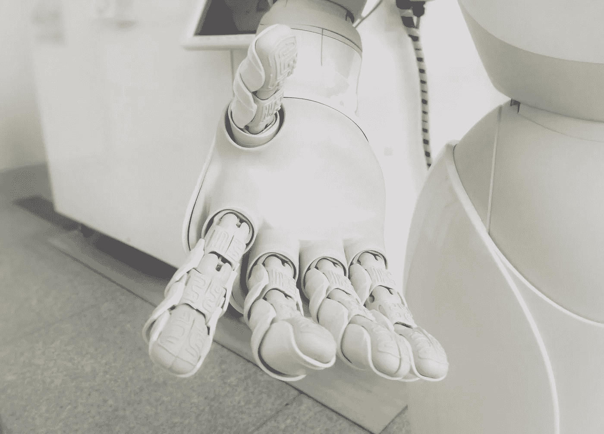
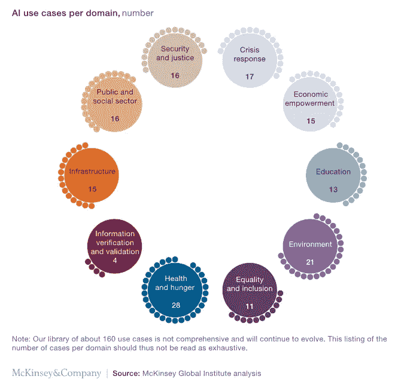

# 人工智能可以帮助人类

> 原文：<https://pub.towardsai.net/artificial-intelligence-can-help-humanity-574f17684923?source=collection_archive---------0----------------------->

## 人工智能如何帮助人类？| [走向 AI](https://towardsai.net)

信用:[法兰克五世](https://unsplash.com/@franckinjapan)。

由人工智能驱动的技术正被应用于一些世界上最复杂的人类发展问题。人工智能有相当大的潜力来帮助人类。

今天，我们最常听到的是人工智能如何增强工业自动化，执行密集的人工劳动，增加零售商的收入，提供更好的客户体验……但如今围绕人工智能的兴奋不仅反映了人工智能应用如何改变商业和经济，也反映了它们可以解决疾病和气候变化等文明挑战的希望。人工智能可能彻底改变人类福祉的想法显然令人兴奋。

在最近的一项研究中，麦肯锡全球研究所[研究了](https://www.mckinsey.com/featured-insights/artificial-intelligence/applying-artificial-intelligence-for-social-good)150 多个人工智能正在或可能被应用于社会公益的场景。人工智能肯定会对解决许多类型的社会挑战产生强大的影响。

学分:[麦肯锡全球研究院](https://www.mckinsey.com/featured-insights/artificial-intelligence/applying-artificial-intelligence-for-social-good)

人工智能已经在改变我们应对人类发展挑战的方式。

*   麻省理工学院的研究人员在一项实验中使用深度学习技术来预测一个人是否患有**精神疾病**。聊天机器人问一个人各种各样的问题，给出 85%的准确预测。
*   [Corti](https://corti.ai/) 监听**紧急呼叫**并实时分析对话。利用机器学习，Corti 可以帮助调度员诊断疾病，并为有效的行动提供提示。
*   最近几年，我们已经看到人工智能及其技术在**天气和气候预测**中的应用。“气候信息学”领域正在不断发展，因为它激发了数据科学家和气候科学家之间富有成果的合作。
*   波士顿附近的麻省理工学院媒体实验室，研究人员在涉及胶质母细胞瘤患者的模拟临床试验中使用了[强化学习](http://news.mit.edu/2018/artificial-intelligence-model-learns-patient-data-cancer-treatment-less-toxic-0810)，以减少化疗剂量，胶质母细胞瘤是最具攻击性的**脑癌**的一种形式。正如我们所知，人工智能的崛起将重塑卫生部门，从后台办公室到医生办公室。
*   **贩卖人口**在印度是一大挑战。在过去的 5 年里，有 25 万儿童被称为失踪。印度项目[追踪儿童](https://trackthemissingchild.gov.in/trackchild/index.php)使用最新的人脸识别技术来比较失踪儿童和孤儿院儿童的照片。
*   野生动物保护包括清点动物，这是一项艰巨的任务。运动敏感相机可以自动拍摄野生动物，提供大量数据。在[快照中，塞伦盖蒂项目](https://www.pnas.org/content/115/25/E5716)科学家使用深度学习来分析这些图像。该系统可以节省 99.3%的人工劳动(17，000 小时)，同时具有与人类志愿者相同的 96.6%的准确性水平。

这些例子显示了人工智能已经在不同领域得到应用。此外，这只是可能的一小部分。

# 释放潜力

## 数据可访问性

数据可访问性是最重要的问题之一。在许多情况下，具有社会应用价值的敏感或商业上可行的数据为私人所有，非政府组织无法获取。在其他情况下，官僚主义的惰性使得有用的数据被锁起来。

私营和公共部门必须共同努力解决这些问题。提高数据的可用性。

## 数据科学家的缺乏

实施挑战是另一个常见问题。即使在数据可用且技术成熟的情况下，数据科学家的缺乏也可能使人工智能解决方案难以在当地应用。

## 监管呢

当然有风险。政府监管对于防止伤害是必要的。即使应用于人工智能等快速发展的领域，错位的监管也有可能扼杀创新，破坏人工智能在车辆安全、提高生产率等方面带来的巨大潜在好处。但人工智能的应用可能会被有意或无意地误用。

监管人工智能的困难并不能免除我们控制人工智能应用的责任。这带来了人工智能监管中最棘手的问题之一:这不仅仅是一个技术问题，一个技术问题，而是一个社会学问题，需要伦理学家和其他人发挥他们的专业知识。

# 底线

人工智能正迅速成为人类发展工具箱中的无价之宝。人工智能的潜力必须得到充分发挥，社会必须更加关注阻碍其发展的障碍。很明显人工智能要来了。我们的社会需要做好准备。

**很多东西都是可以改进的！**🙂