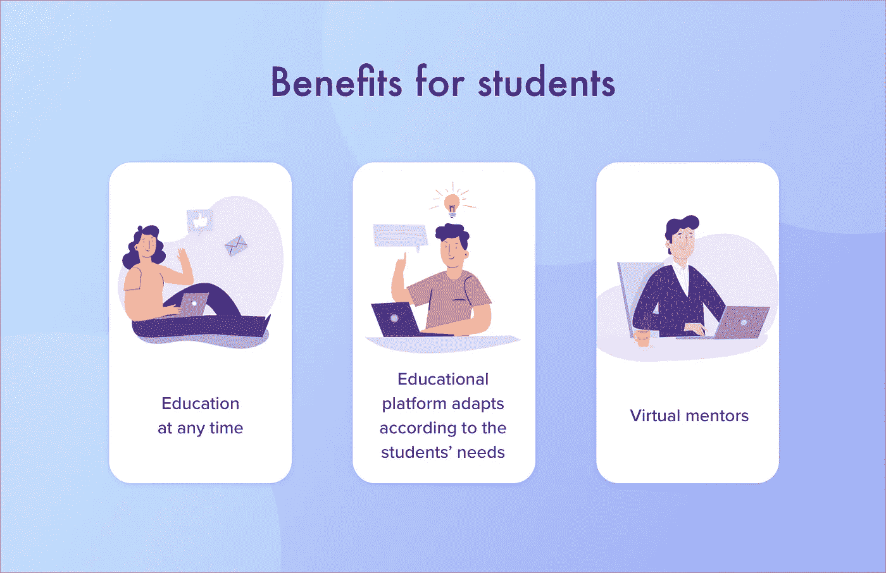
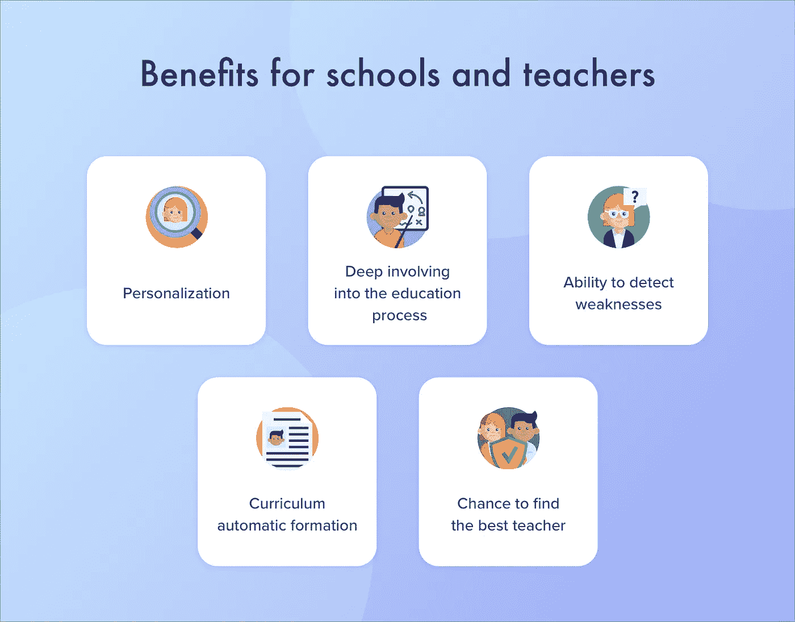
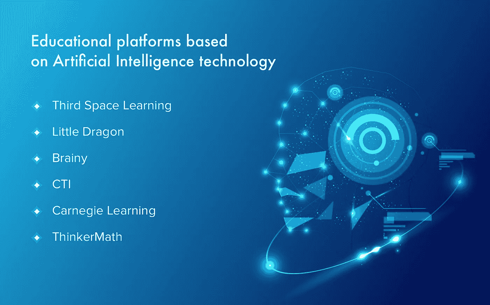

# 教育中的人工智能:优势、挑战和用例

> 原文：<https://pub.towardsai.net/artificial-intelligence-in-education-benefits-challenges-and-use-cases-db52d8921f7a?source=collection_archive---------0----------------------->

## 关于教育中的人工智能，你只需要知道

人工智能技术给各个领域带来了很多好处，包括教育。许多研究人员声称，人工智能和机器学习可以提高教育水平。

最新的创新允许开发者教会计算机完成复杂的任务。它带来了改进学习过程的机会。然而，导师或教授是不可能被取代的。人工智能为学生和老师提供了许多好处。

在本指南中，我们将讨论人工智能在教育中的优势和劣势，市场上现有的解决方案，以及如何创建您的人工智能平台。

# 人工智能给教育带来的好处

教育应用可以被两类用户使用——学生和教师。当然，这样的解决方案给他们带来的好处是不一样的。

## 人工智能在学生教育中的优势

*   **随时教育**。年轻人花很多时间在路上。他们更喜欢用智能手机或平板电脑处理日常事务。基于人工智能的应用程序提供了一个在空闲时间学习的机会，花费 10 或 15 分钟。此外，学生可以从导师那里获得实时反馈。
*   **根据学生的需求提供多种选择**。基于人工智能的解决方案可以根据学生的知识水平、有趣的主题等进行调整。这个体系倾向于帮助学生克服他们的弱点。它根据他们的弱点提供学习材料。例如，学生在开始使用应用程序之前进行测试；该应用程序对其进行分析，并提供合适的任务和课程。
*   **虚拟导师**。基于人工智能的平台提供虚拟导师来跟踪学生的进步。当然，只有人类教师才能更好地了解学者的需求，但从虚拟导师那里获得即时反馈也很好。

## 人工智能在教师和学校教育中的优势

*   **看到弱点的机会**。不同的培训课程可以看出学生知识的差距。例如， [Coursera](https://www.coursera.org/) 平台可以通知老师，如果许多学生选择了某个特定问题的错误答案。结果，导师有机会关注所要求的主题。
*   **更好的啮合**。像虚拟现实和游戏化这样的现代技术有助于学生参与到教育过程中，使其更具互动性。
    个性化。各种人工智能算法可以分析用户的知识和兴趣，并提供更个性化的建议和训练计划。
*   **课程自动生成**。教师从人工智能发展中受益匪浅。如今，他们不需要从头开始创建课程。因此，教师花在寻找必要的教育材料上的时间更少了。
*   **找到好老师的机会**。教育平台有很多老师，所以学生有机会与其他国家的专家交流。人工智能教育平台根据教学经验和软技能提供适当的导师。

# 如何在教育中使用人工智能

人工智能的形式之一是机器学习。ML 倾向于分析信息，得出结论，并做出决定或建议。这意味着基于 ML 的平台可以使用大量数据进行教学。之后，它可以完成各种任务。

人工智能在教育领域有几个用例。让我们更精确地讨论它们。

## 个性化学习

人工智能允许关注学生的个人需求。许多像卡内基学习这样的大型教育平台投资 AI，以提供更多个性化的课程。如今，可以创建单独的指令、测试和反馈。因此，学习者使用他们准备好的材料，填补他们知识中的空白。

随着人工智能变得更加智能，扫描和分析学生的面部表情可能成为可能。如果材料太复杂，平台可以根据他们的需要更改课程。

## 语音助手

亚马逊 Alexa、苹果 Siri、谷歌 Home 等语音助手允许在不与老师交流的情况下与各种学习材料进行互动。因此，随时随地使用教育平台是可能的。

例如，亚利桑那州立大学使用 Alexa 来满足日常校园需求。该助理可以回答常见问题或跟随学生的时间表。
此外，使用这样的助手对学习者来说非常有趣和令人兴奋，因此他们更多地参与到教育过程中。

## 智能内容

智能内容代表各种学习材料，从数字化教科书到定制界面。

让我们考虑两个例子。

*   **内容技术公司**。是一家与人工智能合作的开发公司。它的主要目标是自动化业务流程和改善用户体验。该公司已经为教育领域创造了解决方案。例如，Cram101 可以将教科书的内容分成几个部分。它们可以包括章节摘要、测试等等。
*   **Netex Learning** 是又一家专注于创建智能内容平台的公司。该解决方案充满了基于人工智能的功能——例如，实时反馈和数字课程。Netex 平台还提供个性化的云平台，包括虚拟培训、会议等。

## 全球学习

人工智能带来了很多在全世界分享知识的机会。使用人工智能解决方案，学生可以学习各种课程和培训计划。有很多平台都有最好的导师提供的互动学习材料。

人工智能还为讲不同语言或有视觉或听觉问题的学生提供机会。例如，Presentation Translator 是一种基于人工智能的解决方案，可以实时创建字幕。使用人工智能语音识别，学生可以听到或读到他们的母语。

## 教育领域现有的基于人工智能的解决方案

教育行业有很多技术驱动的解决方案。人工智能的例子有 DreamBox，Khan Academy，Achieve3000 和许多其他的。

这些平台可以分析知识水平，提供反向交流，提供改进计划，等等。

*   **第三空间学习**。这个系统是在伦敦大学学院的学者的帮助下创建的，并积极利用人工智能的机会。该系统可以推荐改进教学技巧的方法。例如，如果老师说得太快或太慢，系统会发出通知。
*   **小龙**。这是一家利用人工智能创建智能应用的初创公司。这种应用程序可以分析用户的情绪，并根据情绪调整用户界面。该公司还为孩子们制作教育游戏。
*   **CTI** 。这家公司还利用人工智能开发技术驱动的教育解决方案。主要目标是创建智能内容。例如，Cram101 可以分析教科书或其他学习材料，并选择关键信息来创建文本。
*   **聪明地**。这是一个学生合作的社交网络。例如，学习者可以讨论与他们的作业相关的问题，或者从其他学生那里获得新知识。该公司利用机器学习来提供更好的用户体验。ML 协助选择垃圾邮件和不适当的内容。此外，人工智能还被用来提供更个性化的材料。
*   **卡内基学习**。该系统倾向于提供更多定制的教育材料，使学习过程更加舒适。该解决方案为学校学生提供实时教育。卡内基学习分析用户的击键，并允许导师看到学生的进步。
*   **ThinkerMath** 。这种人工智能解决方案有助于小孩子学习数学。有各种游戏和奖励来实现更好的参与效果。该应用程序还根据孩子的知识提供个性化的学习计划。

有很多基于人工智能的解决方案改善了教育领域。这个行业非常有前途，因为它有着不可思议的发展机会。

# 如何开发基于人工智能的教育平台

考虑到我们已经讨论过的信息，你可能想知道[如何建立一个电子学习网站](https://www.cleveroad.com/blog/e-learning-website-development)并集成人工智能。你需要遵循六个主要步骤。

*   第一步。研究竞争对手的解决方案。
*   第二步。考虑互动有趣的内容。
*   第三步。设定您的项目需求，并与开发人员进行讨论。
*   第四步。正确测试你的应用程序以避免错误。
*   第五步。发布应用并获得用户反馈。
*   第六步。定期更新您的解决方案。

## 第一步。研究竞争对手

在创建您的解决方案之前，您需要仔细分析竞争对手。如今，用户被宠坏了，所以你需要给他们提供一些新功能。

此外，了解现有的平台，您可以为您的项目产生更多有趣的概念。你可以研究技术堆栈或设计理念。

## 第二步。考虑互动和有用的内容

创建教育解决方案时，您需要为用户提供有用的内容。

例如，你可以选择几个领域或主题，如数学、文学等。之后可以和大学或者学院的导师合作。

此外，您可以从各种来源收集学习材料，如培训计划、课程等。

## 第三步。设定您的项目要求

在开始开发之前，您需要明确您的项目需求和业务目标。

您应该考虑所需功能的数量。例如，您可以为您的平台创建一个 MVP 版本，并提供一些基本功能。它允许你从用户那里得到一些反馈。

之后，您可以定期更新系统，添加高级功能。顺便说一下，研究用户想要什么样的功能是很好的。

要开始开发，你需要与有经验的软件开发人员合作。他们需要有人工智能方面的经验。

有两种可能的方式与软件构建者合作——创建一个内部团队或与外包公司合作。每个选项都有利弊。例如，供应商倾向于提供更实惠的时薪。然而，与内部开发团队交流更容易。

## 第四步。正确测试平台以避免错误

要获得更多的忠实用户，你需要提供优秀的用户体验。当然，用户不希望和一个充满 bug 的平台互动。

为了在启动项目之前找到并修复 bug，你需要与合格的质量保证工程师合作。

## 第五步。发布您的解决方案并获得用户反馈

我们已经提到最好创建一个 MVP 版本的解决方案来获得反馈。

用户的意见可以帮助你了解你需要改进系统的哪些部分。此外，学生和老师可以告诉你他们对你的申请的期望和要求。

## 第六步。定期更新系统

定期改进你的平台，为用户提供新的机会和令人兴奋的特性是至关重要的。

要想在市场上具有竞争力，你就应该跟上时代的步伐。不如和各种导师合作，提供新的培训项目。

如你所见，教育领域提供了大量集成和使用人工智能的机会。市场已经为成人、儿童、教师甚至学校提供了一些很好的解决方案。基于人工智能的应用程序可以分析大量信息，为用户提供更多个性化的学习材料。

**作者简介**

Vitaly Kuprenko 是 Cleveroad 的技术作家。这是乌克兰的一家网络和应用程序开发公司。他喜欢讲述技术创新和推动商业发展的数字化方式。