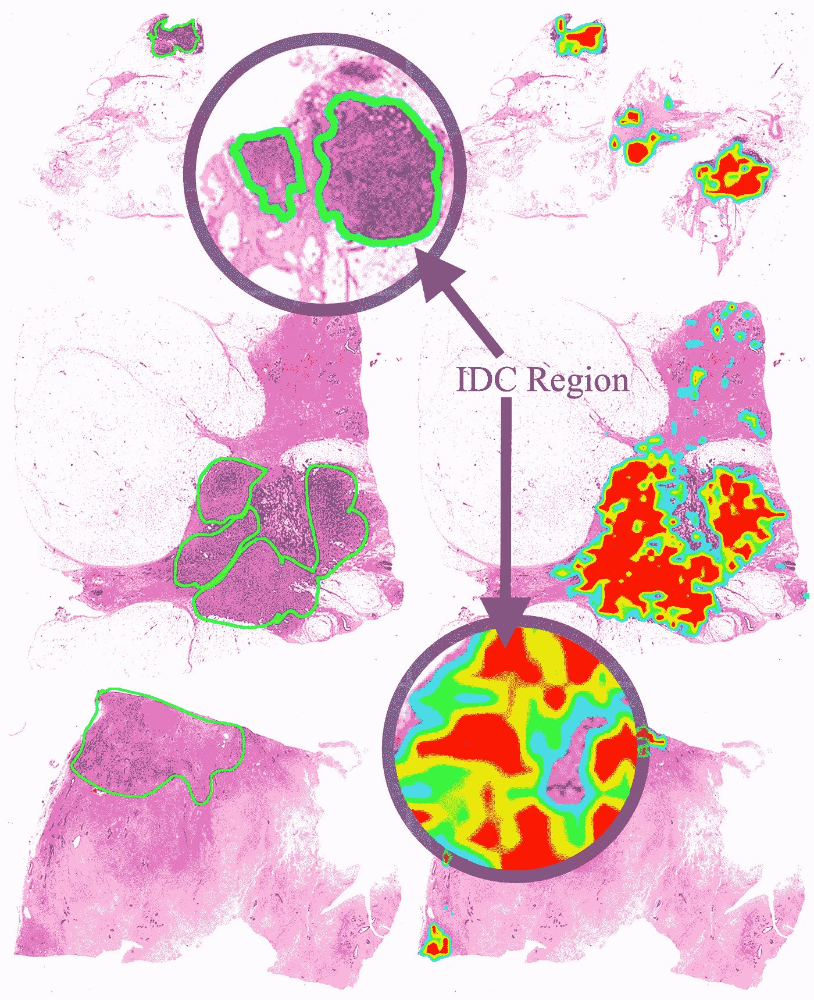
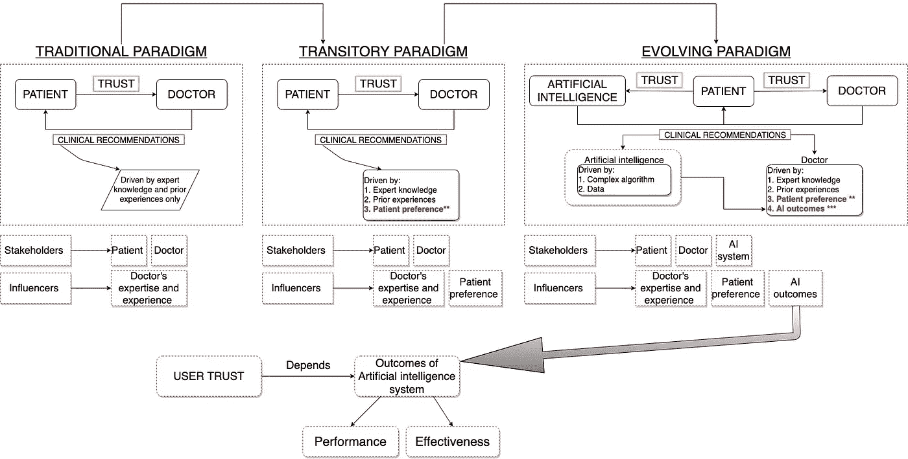
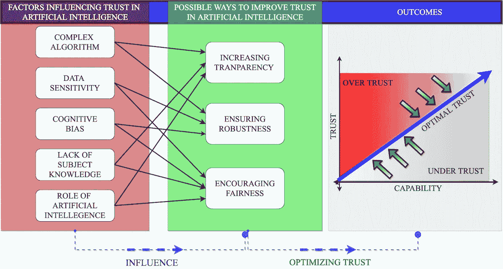

# 提高医疗保健中人工智能的 3 个步骤

> 原文：<https://pub.towardsai.net/artificial-intelligence-in-health-care-what-else-is-needed-afa213c75eb6?source=collection_archive---------1----------------------->

## [人工智能](https://towardsai.net/p/category/artificial-intelligence)，[研究](https://towardsai.net/p/category/research)

## 最佳信任、数据治理和人工智能标准可以解决医疗保健中的许多人工智能问题。

照片由[欧文比尔德](https://unsplash.com/@owenbeard?utm_source=medium&utm_medium=referral)在 [Unsplash](https://unsplash.com?utm_source=medium&utm_medium=referral) 上拍摄

> 准确度、精确度、召回率和其他衡量人工智能功效的指标至关重要，但还不够。

W 你会*使用、* *信任、*或*基于一项基于“不良数据”的技术做出临床决策*，而该技术既未经过“临床验证”，也未获得“FDA 批准”？

从虚拟助手到 Apple Watch 和 IBM Watson 等技术，人工智能(AI)的一些应用已经建立起来，以增强医疗保健系统，改善患者护理，并协助护理提供者。谷歌、苹果和 IBM 等科技巨头越来越多地涉足医疗保健技术，这进一步增强了更好地了解人工智能对医疗保健行业的影响的需求。许多医疗保健组织正在采用人工智能技术来创造行业的新价值。2020 年 7 月 7 日，领先的变革和转型咨询公司 North Highland 宣布与理解人类交流和行为的人工智能解决方案的全球领导者[数字推理](https://digitalreasoning.com/blog/north-highland-and-digital-reasoning-announce-strategic-partnership-to-deliver-solutions-that-identify-cancer-diagnoses-sooner-and-help-hospitals-recover-faster/)建立战略合作伙伴关系。战略合作将帮助医疗保健提供者诊断癌症。

人工智能被认为是医疗保健行业的主要影响者之一。一些研究人员已经投资展示人工智能的分析能力，以及它如何在放射学、皮肤科、重症监护和外科手术等专业领域的诊断中超越医生。

> 尽管人工智能具有值得关注的潜力，但为什么世界各地的医疗保健行业对将这一令人难以置信的技术融入日常临床工作犹豫不决？

作者照片(来源:[https://content . IOs press . com/articles/technology-and-health-care/thc 202226](https://content.iospress.com/articles/technology-and-health-care/thc202226))

人工智能系统的设计和实施应满足健康结果和政策优先事项，包括但不限于:

1.  提高质量、安全性和效率
2.  缩小健康差距
3.  改善诊断结果
4.  让患者和家人关注他们的健康
5.  改善护理协调
6.  改善人口和公共健康
7.  确保个人健康信息的安全
8.  最大限度减少临床医生的工作量

然而，单靠分析性能并不能满足我们对人工智能的所有期望。

以下三个步骤可以提高医疗保健中人工智能的接受度和质量

法比安·吉斯克在 [Unsplash](https://unsplash.com?utm_source=medium&utm_medium=referral) 上的照片

# **第一步。确保对人工智能的最佳信任**

对人工智能技术的信任是一个需要立即关注的重要因素。在用户和人工智能之间不断发展的(动态)关系中，**信任**是塑造临床医生使用和采用人工智能的一种机制。病人也是一样。患者对人工智能的信任取决于他们之前对医疗保健技术的经验和关于人工智能的技术知识。媒体在引导人们对人工智能的信任方面也发挥着重要作用。

> "信任是一种处理已知和未知之间不确定性的心理机制."

C 目前，缺乏对人工智能的**信任**是在医疗保健中采用这项技术的重大缺陷之一。医疗保健中的人工智能影响用户和人工智能系统之间的**信任，以及不同用户**(护理者和护理接受者)**。**信任**的动态行为**让人难以理解。像任何其他技术一样，人工智能中的**信任**会受到人类因素的影响，不仅限于用户体验、用户偏见和对技术的感知**。**

作者照片

用户对人工智能的信任也可能随着其即时、中期和长期表现(结果/影响)而变化。

> 例如，在观察到 99%的肿瘤检测准确率后，临床医生对 AI 系统的信任可能会增加。然而，同一临床医生可能在意识到该系统只对特定肤色的患者起作用时不再信任该系统。

> 对人工智能的信任会解决所有问题吗？

最近在[JMIR](http://www.jmir.org/2020/6/e15154/)[【1】](http://www.jmir.org/2020/6/e15154/)的研究强调了 ***最优信任*** 的重要性以及与最大信任相关的风险。该研究声称*最大化用户的信任*并不一定会从人类与人工智能的合作中产生最佳决策。当信任度达到最大时，用户接受或相信 AI 系统生成的所有建议和结果。

> 对人工智能不必要的高度信任可能会带来灾难性的后果，尤其是在生命攸关的应用中。

然而，在 ***最优信任中，*** 人类和人工智能都对对方的决定有某种程度的怀疑，这鼓励他们仔细检查彼此的功能和建议。然而，量化**信任**是具有挑战性的。虽然存在使用验证问题来测量(估计)信任的人为因素技术，但是它不能捕捉信任随时间的动态行为。

作者照片(图片来源:[https://www.jmir.org/2020/6/e15154](https://www.jmir.org/2020/6/e15154))

弗兰基·查马基在 [Unsplash](https://unsplash.com?utm_source=medium&utm_medium=referral) 上拍摄的照片

# 第二步。发展和加强数据治理

JAMIA Open [2]上接受的一篇评论显示了数据治理的必要性，这也得到了英国皇家学会的认可。数据治理的目标包括法律和道德行为规范，以及管理数据的*收集*、*存储*、*使用、*和*传输*的惯例和实践。

机器学习算法高度依赖数据。他们的属性，如*可靠性、可解释性*和*责任*，依赖于他们接受培训的数据的质量。机器学习和医疗保健领域的大多数研究经常使用来自在线数据库(存储完整和标准化的数据以用于研究目的)和观察性研究的数据。从这些来源获得的数据容易产生偏差。在这种数据上训练的模型在数据是非结构化的、不完整的和有噪声的临床环境中可能不能有效地工作。电子健康记录是医院的主要数据来源之一，由于特定患者群体的代表性不足或过多，也容易出现偏差。此外，不同的研究机构记录患者数据的方式也不同。

> “在一个机构训练的机器学习模型在另一个机构实施以分析数据时可能会导致错误”

电子健康记录包含不同的数据结构(*通常与其他系统不兼容*)，这给模型部署带来了巨大的挑战。最近，由国家卫生信息技术协调员办公室(ONC)领导的[卫生与公众服务部](https://www.aana.com/docs/default-source/fga-aana-com-web-documents-(all)/2020-2025federalhealthit-strategicplan_0.pdf?sfvrsn=2084981f_2)发布了[*2020–2025 联邦卫生 IT 战略计划*](https://www.aana.com/docs/default-source/fga-aana-com-web-documents-(all)/2020-2025federalhealthit-strategicplan_0.pdf?sfvrsn=2084981f_2) 草案，旨在增强卫生 IT 基础设施，更新电子医疗记录的有意义使用标准，以包括互操作性标准。

机器学习对**历史数据的依赖**是另一个潜在阻碍其在医疗保健中有效性的因素。从医疗实践中检索到的历史数据包含了在为弱势群体提供比其他群体更差的医疗服务方面的医疗服务差异。在美国，历史医疗保健数据反映了一种奖励使用潜在不必要的护理和服务的支付系统，可能会遗漏未保险患者的数据。与**静态数据集**不同，患者健康随着时间而发展，使用历史数据可能会阻止人工智能模型从患者不断发展的健康状况中学习。由于医疗保健数据受 **HIPPA 法规**的保护，在人口数据上训练模型是不可行的(目前)。因此，避免有偏见的数据的风险是具有挑战性的(不可避免的)。

照片由[普里西拉·杜·普里兹](https://unsplash.com/@priscilladupreez?utm_source=medium&utm_medium=referral)在 [Unsplash](https://unsplash.com?utm_source=medium&utm_medium=referral) 上拍摄

一个可行的解决方案是开发一个供本地使用的人工智能模型。换句话说，在特定的地理位置，为特定的患者群体(肺栓塞和深静脉血栓)训练特定目的(二分类识别肺栓塞和深静脉血栓)的 AI 模型。这种模型可以在数据集上训练，该数据集是给定地区所有患者类型的良好代表。虽然这一过程将把偏见(对特定患者类型有效，对新患者类型无效)嵌入到 AI 模型中，但它可以由具有可管理数量的客户(患有慢性疾病的常规患者)的小型专科门诊诊所(血液学家)来实施。

多少数据足以训练一个算法？—在机器学习领域一直没有答案。对样本大小的关注包括数据点的数量(观察值—数据表中的行)和预测值的数量(健康因素—数据表中的列)。数据科学中有一些方法可以处理数据维度问题，特征选择技术通常可以提高 AI 性能。然而，特征(预测因子)的消除阻碍了数据集的临床解释能力。尽管算法性能，特别是在深度学习中，随着信息的增加而提高，但是存在平台，其中新信息对模型性能增加很少(取决于激活函数)。随着信息(数据)的增加，一些模型的准确性会受到*阻碍*，这通常是因为额外的变量为一组过于具体的信息(上下文)定制(过度拟合)了模型。这种模型可能在新数据上表现不佳，这个问题长期以来被认为是预测偏差或过度拟合或最小最优问题。因此，我们必须了解 **(a)** 算法的性能随着数据的增加而增加的速率，以及 **(b)** 模型在不过度拟合的情况下可达到的最大精度。

照片由[弗雷德里克·杜比蒙特](https://unsplash.com/@callmefred?utm_source=medium&utm_medium=referral)在 [Unsplash](https://unsplash.com?utm_source=medium&utm_medium=referral) 上拍摄

# **第三步。开发人工智能标准**

答虽然人工智能有潜力帮助临床医生做出更好的诊断，但其分析性能并不一定表明临床疗效。随着人工智能在医疗保健领域的部署，在个人层面(如意识、教育、信任)、宏观层面(如监管和政策、人工智能错误导致的伤害风险)和技术层面(如可用性、性能、数据隐私和安全)可能会出现一些风险和挑战。

> 一个广泛使用的人工智能中的系统错误可能会导致大量的患者受伤，相比之下，由于提供者的错误导致的患者受伤数量有限。

由于人工智能的广泛有效性，理解人工智能的实际影响(消极或积极)至关重要，只有当人工智能被集成到临床环境中或被护理提供者解释和使用时，才能意识到这一点。

[国家癌症研究所](https://unsplash.com/@nci?utm_source=medium&utm_medium=referral)在 [Unsplash](https://unsplash.com?utm_source=medium&utm_medium=referral) 上拍摄的照片

> 经过训练的人工智能模型的建议是否改善了患者的健康状况？

不同研究中的大多数人工智能模型在真实的临床环境中是不可执行的。这是由于两个主要原因:

1.  研究文献中报告的人工智能模型不会根据数据和工作环境重新设计自己。此外，外部影响不仅限于政治和经济因素以及医疗实践规范，商业利益主导着医疗服务的提供方式。
2.  世界上大多数医疗保健组织都没有收集和训练人工智能算法所需的数据基础设施，临床医生也没有足够的培训来使用和解释复杂的人工智能系统

M ost 临床人工智能模型非常复杂，它们的集成和干预要求各个组件达成共识，而不仅限于医疗保健系统本身、管理协议、用户和工作环境。因此，标准化的方法是必要的。《JMIR 医学信息学》[中的一篇综述](http://medinform.jmir.org/2020/7/e18599/)[【3】](http://medinform.jmir.org/2020/7/e18599/)和《英国医疗保健管理杂志》[【4】](https://www.magonlinelibrary.com/doi/abs/10.12968/bjhc.2019.0066)中的一篇展望性论文倡导人工智能标准化的必要性。

> 依赖没有根据符合临床要求的标准基准进行评估的人工智能结果可能会产生误导。

2008 年进行的一项 [研究](http://europepmc.org/article/MED/18573856)[【5】](http://europepmc.org/article/MED/18573856)开发并验证了 QRISK 心血管疾病风险算法(QRISK2)的高级版本。该研究报告了 QRISK2 与其早期版本相比性能的提高。然而，QRISK2 没有与任何临床金标准进行比较。八年后的 2016 年，药品&保健品监管机构在 QRISK 2 计算器中发现了一个错误；QRISK2 低估或高估了心血管疾病的潜在风险。监管机构报告称，英国三分之一的全科医生手术可能因 QRISK2 的错误而受到影响。

在标准化人工智能研究和开发方面已经做了很多工作。2019 年 2 月 11 日，(美国)总统发布行政命令(EO 13859)，指示联邦机构制定计划，确保 AI/ML 标准[【6】](https://www.federalregister.gov/documents/2019/02/14/2019-02544/maintaining-american-leadership-in-artificial-intelligence)。几个月后，2019 年 6 月 17 日，中国战略部。截至 2020 年 2 月，还有大量关于俄罗斯人工智能政策的信息*一代人工智能:发展负责任的人工智能。【2019 年 10 月，俄罗斯联邦总统办公室发布了一份国家人工智能，发表在经合组织人工智能政策观察站。*

由[凯利·西克玛](https://unsplash.com/@kellysikkema?utm_source=medium&utm_medium=referral)在 [Unsplash](https://unsplash.com?utm_source=medium&utm_medium=referral) 上拍摄的照片

# 结论

人类与人工智能合作的有效性是信任的函数。一种整体方法，将医疗保健视为一个动态的社会技术系统，在其中理解人-人工智能合作中的信任关系是必要的。到目前为止，人工智能/人工智能标准化的努力集中在为所有人工智能应用和人工智能算法开发一个公共(国家)标准。由于围绕机器学习算法的许多问题，特别是在医疗保健领域，都是特定于上下文的，医疗保健需要针对其目标定制的标准(治理)。未来的研究应该致力于建立一个衡量人工智能表现的黄金标准。

# **参考文献**

[1] O .阿桑、e .巴伊拉克和 a .乔杜里，[医疗保健中的人工智能和人类信任:聚焦临床医生](https://www.jmir.org/2020/6/e15154/) (2020)，JMIR

[2] A. Choudhury，E. Renjilian 和 O. Asan，在慢性病老年临床护理中使用机器学习:系统文献综述(2020)，JAMIA Open[正在出版]

[3] A. Choudhury 和 O. Asan，人工智能在患者安全结果中的作用:系统文献综述(2020)，JMIR 医学信息学[正在出版]

[4] A. Choudhury，[医疗保健中保护人工智能系统的框架](https://www.magonlinelibrary.com/doi/full/10.12968/bjhc.2019.0066) (2019)，英国医疗保健管理杂志

[5] J. Hippisley-Cox，C. Coupland，Y. Vinogradova 等人，[预测英格兰和威尔士的心血管风险:QRISK2](http://Hippisley-Cox J, Coupland C, Vinogradova Y, et al. Predicting cardiovascular risk in England and Wales: prospective derivation and validation of QRISK2\. BMJ (Clinical Research ed.). 2008 Jun;336(7659):1475-1482\. DOI: 10.1136/bmj.39609.449676.25.) 的前瞻性推导和验证(2008)，BMJ

[6]第 13859 号行政命令，[保持美国在人工智能领域的领导地位](https://www.federalregister.gov/documents/2019/02/14/2019-02544/maintaining-american-leadership-in-artificial-intelligence) (2019)，《联邦公报》