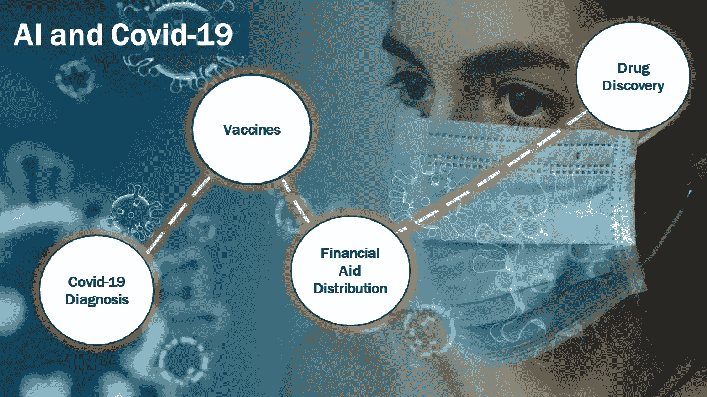
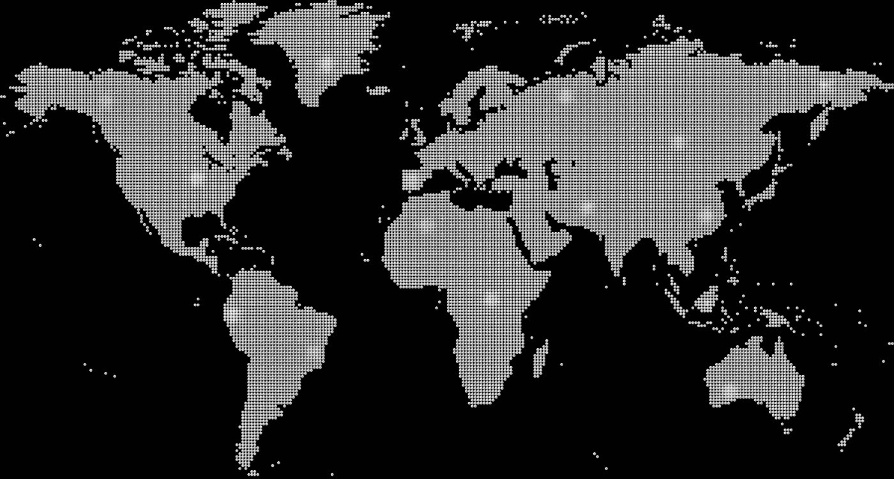

# 新冠肺炎之后的医疗保健中的人工智能

> 原文：<https://pub.towardsai.net/artificial-intelligence-in-healthcare-after-covid-19-dbbdaffb48d7?source=collection_archive---------2----------------------->

## [人工智能](https://towardsai.net/p/category/artificial-intelligence)、[未来](https://towardsai.net/p/category/future)、[观点](https://towardsai.net/p/category/opinion)

## 艾在新冠肺炎战斗的第一线。它可以在以后的医疗保健中发挥更大的作用。

照片由[国家癌症研究所](https://unsplash.com/@nci?utm_source=unsplash&utm_medium=referral&utm_content=creditCopyText)在 [Unsplash](https://unsplash.com/s/photos/woman-doctor?utm_source=unsplash&utm_medium=referral&utm_content=creditCopyText) 上拍摄

新冠肺炎疫情让世界大部分地区暂停了一年。尽管如此，还是有乐观的理由。

到 2020 年圣诞节，多种候选疫苗[被批准使用或处于 3 期试验。自疫情早期以来，我们检测和治疗病毒的能力有了显著提高。](https://www.idsociety.org/covid-19-real-time-learning-network/vaccines/vaccines/)

人工智能(AI)在抗击疫情中发挥了重要作用。虽然人工智能不是银弹，但研究人员已经使用人工智能从医疗数据中提取更好、更快的见解。这导致了更快的疫苗开发和更好的未来治疗的前景。

疫情之后，人工智能和医疗保健的下一步是什么？我们将快速迈向**更好的疾病预测、药物研发、远程诊断、临床数据洞察和医院管理。**

疫情已经证明，人工智能在应用于医疗和临床数据时非常强大。现在的问题是，哪些国家和医疗系统将利用这些工具来提高生活质量，防止下一个疫情。

# 艾在抗击新冠肺炎

艾对抗战的贡献。作者图解。来自 [Pixabay](https://pixabay.com/?utm_source=link-attribution&utm_medium=referral&utm_campaign=image&utm_content=4914026) 的 [Tumisu](https://pixabay.com/users/tumisu-148124/?utm_source=link-attribution&utm_medium=referral&utm_campaign=image&utm_content=4914026) 背景图。

疫情每天产生数百万千兆字节的数据。患者数据、胸透、CT 扫描、血液结果、基因数据等等。人类研究人员几乎不能触及这些数据的表面。幸运的是，人工智能算法可以大规模处理这些数据，挖掘模式和见解，以加快诊断、疫苗开发和治疗。

## 用人工智能诊断新冠肺炎

麻省理工学院的研究人员开发了一种机器学习模型，可以从一个人咳嗽的[声](https://news.mit.edu/2020/covid-19-cough-cellphone-detection-1029)中诊断出新冠肺炎，即使是在无症状的个体中。由于无症状人群可能是病毒传播的载体，这种模式，也许以应用程序的形式，可能有助于减缓传播。

从亚洲到北美的医疗专业人员也使用机器学习和计算机视觉技术，通过胸部 x 光和 CT 扫描来诊断新冠肺炎。[西北大学](https://news.northwestern.edu/stories/2020/11/a-i-detects-covid-19-on-chest-x-rays-with-accuracy-and-speed/)的研究人员开发了一种机器学习模型，通过胸部 x 光诊断新冠肺炎，速度比人类放射科医生快 10 倍，准确率高达 6%。DeepCOVID-XR 模型经过 17002 次胸部 X 射线训练，可以快速筛选因新冠肺炎以外的原因入院的患者。

## 疫苗开发

Moderna 的 mRNA 疫苗于 2020 年 12 月获得批准，它使用机器学习[优化 mRNA 序列](https://www.businesswire.com/news/home/20200805005965/en/AWS-Powers-Moderna%E2%80%99s-Digital-Biotechnology-Platform-to-Develop-New-Class-of-Vaccines-and-Therapeutics)，以转换成用于测试的分子。

据报道，在使用他们的药物设计工作室设计 mRNA 序列后，Moderna 使用机器学习来优化这些序列。这些优化的序列成为高质量的候选测试序列，并可能缩短疫苗开发时间。

机器学习也强调了疫苗需要改进的地方。麻省理工学院的一项初步研究发现，类似于辉瑞和 Moderna 的疫苗对亚裔人可能效果较差。虽然还需要更多的研究，但使用机器学习来尽早标记潜在问题让我们有时间做出反应。

## 分发财政援助

发展中国家正在使用人工智能将新冠肺炎救济基金分配给最需要的公民。

Togo 训练了一个机器学习模型来分析卫星图像和手机数据，以确定相对贫困的地区。多哥领导人优先考虑向这些地区提供财政援助。

## 开发治疗新冠肺炎的药物

世界上四分之一的人可能要到 2022 年才能获得疫苗[。与此同时，人工智能可能在开发治疗新冠肺炎的药物方面发挥重要作用。](https://www.reuters.com/article/health-coronavirus-vaccines/one-in-four-people-globally-may-not-get-covid-19-vaccines-until-2022-idINL4N2IV3LD)

非营利 [Covid Moonshot](https://covid.postera.ai/covid) 项目使用半监督深度学习[模型](https://blog.deeplearning.ai/blog/the-batch-new-coronavirus-treatments-reimagining-robotaxis-opening-historical-archives-streamlining-simulations)筛选了 14000 种抗病毒药物候选物。从这些化合物中，已经有四种化合物进入了动物试验。

# 疫情之后:用人工智能改变医疗保健

新疾病的早期预警系统只是人工智能的一个应用。图片来自 [Pixabay](https://pixabay.com/?utm_source=link-attribution&utm_medium=referral&utm_campaign=image&utm_content=4799734) 的 [Elchinator](https://pixabay.com/users/elchinator-10722855/?utm_source=link-attribution&utm_medium=referral&utm_campaign=image&utm_content=4799734)

## 新出现疾病的预警系统

及早发现下一次重大疾病爆发是每个国家的优先事项。可以在传统和替代数据源中找到模式的机器学习模型可能会给我们这种早期警告。

新冠肺炎没有让每个人都措手不及。[人工智能健康监测平台 BlueDot](https://bluedot.global/)[于 2019 年 12 月 31 日通知其客户](https://www.wired.com/story/ai-epidemiologist-wuhan-public-health-warnings/)武汉爆发传染病疫情，比世界卫生组织通知公众整整早了 9 天。

蓝点将机器学习和自然语言处理应用于 65 种语言的新闻报道、动植物疾病数据和官方发布，以标记潜在的疫情。蓝点甚至利用航空票务数据正确预测了从武汉到曼谷、首尔、台北和东京的初始传播。

期待在未来看到更多这些人工智能驱动的风险检测平台。公司、投资者和政府都愿意付钱。看到像谷歌或彭博这样的公司提供类似的服务并不奇怪。

## 远程诊断

疫情的医院资源已经紧张到接近崩溃的边缘。医院和诊所完全有理由采用人工智能远程诊断工具，以减轻医生的压力。从本质上讲，医院将依靠计算机从核磁共振成像、x 光、CT 扫描甚至手机照片中诊断医疗状况。

麻省理工学院开发的深度学习模型[通过分析乳房 x 光片来预测乳腺癌风险](https://healthitanalytics.com/news/deep-learning-predicts-womens-future-risk-of-breast-cancer)。更重要的是，该模型比传统的筛查方法具有更高的成功率，并在 90，000 张乳房 x 光照片上进行训练和测试。

远程诊断适用于大多数可以通过医学图像诊断的疾病。更重要的是，远程诊断工具可以增加农村和低收入地区获得高质量诊断的机会。小型农村检测中心可以提供更快、更便宜的诊断，并在新出现的疾病淹没小城镇和村庄之前收集数据。

## 来自临床数据的见解

美国医疗保健系统每年产生大约[12 亿](https://www.healthcaredive.com/news/more-than-meets-the-eye-unstructured-datas-untapped-potential/435352/)份临床文件。其中大部分是非结构化文档(例如手写的医生笔记、图像)，其余为半结构化文档(例如实验室结果、程序、患者生命体征)。

医生和护士需要整理的数据太多了，即使是电子格式的。初级保健医生每天最多可以花 6 个小时与电子健康记录互动。IBM Watson 团队的研究发现，医生[可能会遗漏每个患者记录中的一个重要问题。](https://researcher.watson.ibm.com/researcher/view_group.php?id=7664)

AI 可以帮助医生和护士提取关键的患者数据和未来对患者的医疗风险。与光学字符识别配对的深度学习模型可以数字化并标记手写的医生笔记和医学图像，以便于搜索和检索。自然语言处理和机器学习工具可以生成患者摘要，突出患者问题，并预测未来的医疗风险，如糖尿病或肾病。

这并不容易。诊所和医院需要为 AI 工具提供现成可靠的数据，以提供临床决策支持。不幸的是，临床数据可能是无组织的、孤立的或不完整的。在人工智能工具影响医疗决策之前，数据整合、清理和预处理将是必要的。

## 加速药物发现

机器学习通过帮助设计具有目标特性的化合物来降低药物研发成本和上市时间。

设计一种新药既不容易也不便宜。一种药物可能需要 10 亿美元或更多的投资，而只有 15%的机会获得批准。药物发现通常从分析多达 [10，000 种化合物](https://discover.hubpages.com/education/How-are-drugs-developed-and-approved-The-drug-development-process)开始。整个过程可以超过 10 年。

人工智能，特别是神经网络，可以缩短药物开发时间并降低成本。一种特殊类型的神经网络，即生成对抗网络(GAN)，可用于[设计具有新药所需特性的化合物](http://sciencedirect.com/science/article/pii/S2001037019303988)。

谷歌的 DeepMind 开发了一个名为 [AlphaFold](https://deepmind.com/blog/article/alphafold-a-solution-to-a-50-year-old-grand-challenge-in-biology) 的深度学习程序来确定蛋白质的 3D 形状。预测蛋白质的结构有助于深入了解特定的疾病。例如，研究人员可以了解蛋白质如何相互作用。这可以通过向研究人员展示药物化合物应该具有的特性来加速药物开发。

使用人工智能加速药物发现对拯救生命和增加企业利润具有重大意义。尽管如此，这些技术中有许多是新的，必须进一步发展。我们不会很快看到实验室关闭和科学家失业。

## 改善医院运营

疫情的一个令人清醒的教训是，我们的医院可能会不堪重负。在疫情的最初几个月，各大城市的医院都用完了个人防护装备；外科口罩、手术服)、呼吸机，甚至病床。

如果这是可以避免的呢？人工智能趋势分析和预测工具可以标记新出现的疾病爆发，提醒医院需要床位。上面的蓝点例子探索了这一点。使用远程诊断进行更快的疾病检测可以提醒医院储备 PPE 和员工。库存预测模型可以使用医疗用品使用数据来订购用品，防止短缺。

即使在疫情之后，使用人工智能改善医院运营也将节省资金，减轻管理负担，并改善患者护理。一个用例是[使用机器学习优化医院床位分配](https://www.ibm.com/blogs/client-voices/improving-hospital-bed-management-ai/)。医院可以通过预测当前患者何时出院来简化床位分配。这有助于确保床位容量，使医院能够更加确定地安排手术，并减少不确定性和患者的等待时间。

用人工智能改善医院运营对每个人来说都是明显的胜利。医院资源得到了更好的利用，有足够的工作人员，因缺少床位而取消的手术也更少了。这改善了患者体验和医院收入。

# 人类和人工智能

人工智能有可能极大地改善病人护理、药物发现、医院运营和疾病跟踪。采用人工智能工具的制药公司、医院和医疗保健技术提供商将提高利润和市场份额。

然而，这些技术中有许多是新的。仍然需要努力确保可行性和安全性。领养也需要时间。医院、诊所和制药公司应该确保足够的数据质量和可用性，以使用人工智能工具。

当人工智能工具变得普及时，医疗保健提供商和科学家仍将受到需求。人工智能工具可能会根据医学图像进行诊断，但医生仍然必须治疗病人并让他们放心。深度学习程序可能会加快药物发现，但科学家仍然需要仔细检查结果。犯错的代价很高。

最终，人工智能将加快处理速度并产生洞察力，但这必须与人类的判断相结合，以改善患者的结果。医疗保健的未来是人类加上人工智能，而不仅仅是人工智能。