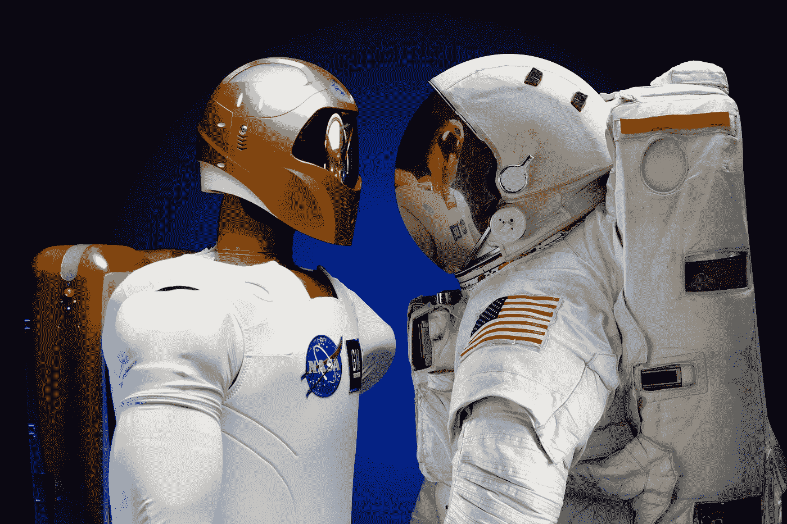

# 人工智能研究人员与现实脱节——这让我感到害怕

> 原文：<https://pub.towardsai.net/artificial-intelligence-researchers-are-out-of-touch-with-reality-that-scares-me-833f9a2b0730?source=collection_archive---------3----------------------->

## [人工智能](https://towardsai.net/p/category/artificial-intelligence)，[观点](https://towardsai.net/p/category/opinion)

## 我们如何引导人工智能走向一个更加乌托邦的未来

照片由 [Pixabay](https://www.pexels.com/@pixabay?utm_content=attributionCopyText&utm_medium=referral&utm_source=pexels) 从[像素](https://www.pexels.com/photo/flight-technology-tools-astronaut-39644/?utm_content=attributionCopyText&utm_medium=referral&utm_source=pexels)拍摄

毫无疑问，人工智能将重新定义人类的未来。

唯一的问题是怎么做。

当《麻省理工科技评论》最近的一篇文章声称人工智能研究人员对应用人工智能兴趣不大时，我感到一阵担忧。

虽然这看起来没什么大不了的，但其二级后果[是巨大的。](https://fs.blog/2016/04/second-order-thinking/)

以下是我对学术界与人工智能应用的分歧、其影响以及一些可能的解决方案的想法。

# **学术界喜欢标准化数据集。当前数据集有偏差**

一些学术数据集在人工智能研究中反复出现。MNIST，ImageNet，CIFAR…

这使得算法之间的基准测试变得很容易。

但这也带来了问题。

> 流行的人脸数据集，如美国电话电报公司人脸数据库，主要包含浅肤色男性受试者，这导致系统难以识别深肤色和女性人脸。
> **-** [**麻省理工科技评论**](https://www.technologyreview.com/2020/08/18/1007196/ai-research-machine-learning-applications-problems-opinion/)

理论上，“生产”该技术的公司会疯狂地测试它，以防止负面副作用。但是我们知道由于[广为人知的失败](https://www.washingtonpost.com/technology/2019/12/19/federal-study-confirms-racial-bias-many-facial-recognition-systems-casts-doubt-their-expanding-use/)，这并没有发生。

有趣的是，我也知道在评估一个模型时，很容易获得很好的结果，却在生产中失败。

**默认情况下，算法是有偏差的。只有通过极端的主动性才能消除偏见。这可能需要创建一个新的不带偏见的标准化数据集。**

在 ML 中，偏见是选择退出，而不是选择加入。

# **脱离接触的研究人员可能会制造出脱离接触的人工智能**

假设一个未来的 AI 将军将是仁慈和富有同情心的，这是一个巨大的信仰飞跃。

就我个人而言，我属于[埃隆马斯克阵营](https://www.vanityfair.com/news/2017/03/elon-musk-billion-dollar-crusade-to-stop-ai-space-x)——我们必须尽一切努力确保人工智能对人类友好。

如果今天的“简单”人工智能脱离了真实的人类问题，那么没有理由相信未来的“先进”人工智能会有所不同。

**一个好的开始可能是对人工智能对人类和社会的影响进行更多的跨学科研究，**同时我们继续推进可能性的边界。

# **人工智能研究帮助的人比它能帮助的人少**

解决工业问题的深度神经网络来自学术界。所以我们知道学术研究有价值。

但是我们可以做得更好。

> 虽然研究人员试图在人为的基准上超越他人，但世界上每九个人中就有一个人在挨饿。地球正在变暖，海平面正在以惊人的速度上升。
> **-** [**麻省理工科技评论**](https://www.technologyreview.com/2020/08/18/1007196/ai-research-machine-learning-applications-problems-opinion/)

此外，我们有一个社会隔离日益加剧的世界，以及由此带来的负面健康影响。

自从发现我奶奶喜欢亚马逊 Alexa，我就想知道我们是否可以使用人工智能来帮助打击老年人的社会孤立。

完美的语音转文本模型是不够的。我们需要研究这种技术会产生的社会和心理影响。

我们能否将人工智能研究经费的一部分用于改善人们生活的人工智能？

# **用人工智能解决实际问题比研究人员想象的要困难**

Auto-ML 理论上很棒。

但是有趣的是，用例是有限的。

> 应用研究被最小化的一个原因可能是机器学习领域的其他人认为这项工作只是简单地应用已经存在的方法。
> **-** [**麻省理工科技评论**](https://www.technologyreview.com/2020/08/18/1007196/ai-research-machine-learning-applications-problems-opinion/)

但事实并非如此。

在实践中应用人工智能是 ML、软件开发、领域知识和基础设施的微妙平衡。

如果研究人员认为突破很容易应用于实际问题，他们可能正在开发过于狭隘的技术，认为它仍然对社会有益。

虽然在真空中开发新算法是可能的，但解决现实世界的问题是不可能的。

研究和工业之间交叉授粉的增加可能有助于纠正这一点。

# 那么我们能做什么呢？

问题源于学术界和工业界的脱节。

我们能缩小这个差距，继续有趣的研究，同时帮助工业吗？

只要人工智能研究由政府资助，研究人员的一部分时间就可以分配给当地创业公司。

这种情况确实会发生——我之前的初创公司临时收到了一家著名人工智能研究机构的咨询。

也就是说，这可能是常态，而不是例外。

除了帮助学术研究人员看清现实，这也可能是支持创业公司的一项重大经济举措。

# 结论

AI 正走在一条不可阻挡的道路上。对社会会有正面和负面的影响。毫无疑问。

但是作为一个每天都在应用 ML 的人，我经常会问自己，怎样才能做得更好？我们如何帮助更多的人？

普遍认同人工智能应该直接改善人们的生活将是一个伟大的第一步。

将研究和工业更紧密地结合起来将是一个很好的选择。