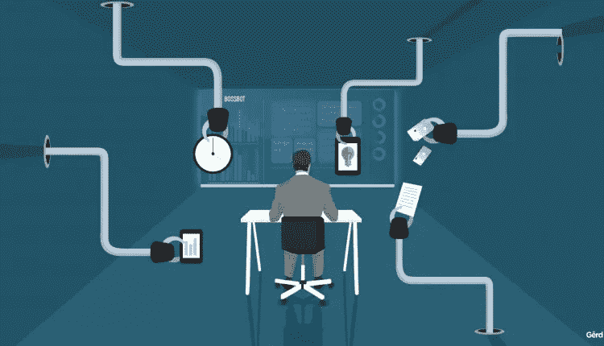

# 没有乌托邦承诺的人工智能——土地和反乌托邦的大决战

> 原文：<https://pub.towardsai.net/artificial-intelligence-without-the-utopian-promise-land-and-dystopian-armageddon-91e2c945d16e?source=collection_archive---------0----------------------->

## AI 的未来| [走向 AI](https://towardsai.net)

在你开始阅读之前，想想人工智能(AI)未来的 3 种可能场景。

如果我让你为人工智能的未来想出 3 种可能的场景，我猜你会首先想到不好的:接管场景——终结者式的。计算机和机器人主宰了人类物种，接管了我们的星球，并最终将我们从地球上抹去。或者，人工智能的力量将被一小撮暴君掌握和使用，他们的唯一目的是奴役我们其余的人。你可能还会想到一种混合场景，在这种场景中，我们失去了一些人性，却获得了更强大的计算和物理能力。最后，你可能会想到更美好的日子，机器人为人类工作，人类现在享受他们的普遍基本收入(UBI)，跟随他们的“激情”或他们的“无用”创造性努力，生活在这个世界上没有一点担忧。

尽管这些是最常谈论的场景，我认为我们在“无聊的人工智能结果”部分遗漏了最有可能的场景。首先，人工智能作为一个话题被炒作，吸引了人们的注意力，而注意力通常不会通过分析历史和政治哲学并在此基础上得出一个可能的结果来保持。注意力是由恐惧或对美好明天的希望(即快乐)维持的。这就是为什么这些“常见场景”不仅是写得最多的，也是阅读最多的。如果你还没有拿起它，你会读到一个“无聊的人工智能结果”。

围绕 AI 的二分法末日 vs 乌托邦话语让我们相信结局是非此即彼。但是，最有可能的是，就像迄今为止的每一项技术一样，人工智能是(或将是)一份礼物和一个诅咒。人类作为一个集体，经常认为他们那个时代的技术进步比他们实际上更与历史相关。当罗伯特·奥本海默目睹第一次原子弹试验时，他说:“现在我成了死亡，世界的毁灭者”。而且两颗炸弹投下后，大家好像都觉得原子弹会是我们的末日。然而，幸运的是，由于原子弹，世界变得比以往更加和平。事实上，彻底毁灭的威胁阻止了世界上有史以来最具潜在破坏性的战争之一(我指的是冷战)。

几乎每一项突破性技术都有这样的宣传——无线电被认为是让我们与外星人接触的工具。让我们不要忘记 90 年代围绕互联网的乌托邦思想，正是*这个工具，*将为人民带来力量和一个真正平等的社会。不幸的是，大公司为了自身的发展迅速垄断了这项技术(例如脸书)。现在我们有了互联网，围绕新技术的炒作被放大了，它接触到了更广泛的受众。因此，与它的前辈相比，人工智能可能看起来更像是一项具有历史影响力的发明。不要误会我的意思，所有这些技术(如互联网、飞机、无线电、原子弹等。)对历史以及人类生活和相互交往的方式产生了巨大的影响。但是它们都没有，也不会(在不久的将来)彻底改变人类的总体历史，或者终结它。我这么说的意思是，这些技术，包括人工智能，都不会改变人类社会的基本结构。

我希望你对以上所有这些持怀疑态度(你应该这样)。但愿，理解我所指的这个“人类社会的基本结构”，以及理解我们今天的社会，能有助于驱散一些迷雾。

## **永恒的等级制度**

自然要么是，要么我们认为它是有等级的。从最简单的生态系统到最复杂的生态系统，一般都有处于顶端的(捕食者)和处于底端的(猎物)。当然，这有点复杂，但这是生物课的内容。总之，在这些生态系统中，几乎每个子组织都有某种等级。阿尔法雌蜂、阿尔法雄蜂、蜂王……嗯，就像自然界一样，人类历史也是分等级的。

人类似乎在日常生活中经历并成为众多等级制度的一部分:从儿童游乐场到父亲是“一家之主”的传统家庭环境。通常，年轻让我们叛逆，认为等级制度是不好的，或者是要被推翻的。但是我看不出有什么方法可以推翻一个等级制度，而不随之建立一个新的等级制度。所以，不管是好是坏，等级制度似乎是不可避免的，它们的本质没有好坏之分。他们和组成他们的个人一样优秀(尤其是和那些高层一样优秀)。如果在传统的家庭环境中，父亲是一个酒鬼和虐待狂，那么传统的家庭等级制度就不好了。然而，如果父亲是仁慈的，慷慨的，有爱心的，家庭等级制度就会变好。

尽管我们被所有的等级制度所统治，我们是这些等级制度的统治者，但是有一个等级制度似乎是自从人类开始以部落的形式聚集在一起以来就一直不变的。这种等级制度在乔治·奥威尔的《*寡头集体主义的理论与实践》*(这是一本书，在一本书的里面——*1984*)[【1】](#_ftn1)中得到了很好的解释。*的第一章“寡头集体主义的理论和实践”*把它简单地概括为:

> “……世界上有三种人，上流人、中层人和下层人。”

当然，这些团体的名称在历史上有所不同，但有一点是永恒不变的，这个不可回避的事实让我们所有人都感到畏惧:我们是一个自我维持、永无止境的等级体系的一部分，在这个体系中，我们只能扮演自己的小角色。说到这里，层级中的每个群体在层级中都有一个“内在的”目标。这三个群体的目标总是彼此不一致，它们似乎是每个群体的本能。高层的目标(和其他层级一样)是保持在顶端。中层总是旨在推翻高层，建立他们自己的“更好的”等级制度。奥威尔说，低下阶层通常没有目标或目的。通常，他们被枯燥的体力劳动搞得心烦意乱，无法意识到日常生活之外的任何事情。然而，当他们有一个目标时，那就是创造一个人人平等的社会(所有人都被降低到他们的水平。).本能地，上层和中层会尽其所能让下层不要达到这种觉悟。

历史认为，奥威尔是不断的、永无止境的斗争，周而复始。高高在上的人长期牢牢地掌握着权力，然后他们要么失去了统治的能力或动力，要么被中间派推翻。通常，为了让中产阶级推翻上层阶级，他们需要下层阶级。中产阶级把他们的斗争伪装成争取自由、正义、平等和其他下层阶级珍视的价值观，从而得到下层阶级的支持。一旦他们到达顶部，旧的中间现在变得很高，本能地把低的推回到无意识和苦差事的位置。过了一段时间，一个新的中间集团产生了，斗争又开始了。如果我们把“平等”作为下层社会的目标，那么，可以肯定地说，下层社会从未成功地达到过这一目标。在你继续阅读之前，我想让你试着想想一段没有这种等级制度或斗争的历史。此外，想想什么时候最接近他们的目标？

## **当今的等级制度**

正如我之前说过的，等级制度的不同组成部分以及它们在历史上如何相互作用一直是相当多变的，但等级制度的性质和本质总是保持不变。有人可能会说，随着时间的推移，等级制度“得到了改善”。这意味着平均而言，随着权力在高级和中级之间的每次“转换”,等级制度变得更加稳定。通常，在历史上的大部分时间里，高层代表的是一小群人，他们被视为精英。每个“精英群体”都有不同的方式来确保他们在等级制度中的地位(例如，宗教、天命、蛮力、血统)。但一旦“革命时期”开始，这些精英集团很容易被推翻，因为他们是集中的，人数少。国王、寡头、独裁者之类的人很容易被替换。教会是第一个认为你可以通过自下而上的自我施加的社会控制来确保你在高层的地位的人。他们通过操纵思想，为普通人无法回答的问题提供答案，并以相信教会的神圣为代价承诺来世的救赎。教会之所以成功，是因为在很长一段时间里，他们让中下阶层相信，只要相信教会的“崇高”，就能让他们在来世过得幸福。

自从教会揭露了这种策略，等级结构中每一个复杂的顶端的目标都是一种自下而上的社会控制形式。在教会之前，社会控制和社会秩序通常是自上而下进行的，通过对暴力和苦难的恐惧(并不是说教会不使用那些方法)。教会的革命策略是利用快乐和宽恕的承诺作为社会控制的工具。这样，控制的主要执行者将是被控制者自己，单独地。几千年后，至高者想出了一个让低贱者站在他们一边的方法，声称“在神的眼中，所有人都是平等的，如果你能控制自己，成为我们的下属，你将在来世(天堂)获得无限的快乐。然而，由于这些承诺难以置信，资本主义在 19 世纪和 20 世纪成了焦点。资本主义出现了，它向下层阶级承诺，如果他们足够努力，如果他们做出足够好的决定，他们可以一路上升到顶端。这是一种更可信、更容易获得的快乐形式，被下层阶级广泛接受。

资本主义制度(现已演变为“社团主义”)的惊人之处在于，为了让等级制度发挥作用，没有必要让“高级”阶层以人类个体的形式存在。那些我们认为的“高层”(像杰夫·贝索斯、埃隆·马斯克、比尔·盖茨等等。)仅仅是中产阶级，因为他们不是最终的压迫者，事实上，他们自己也受到压迫。然而，有人可能会说，中产阶级目前的目标已经完全改变，从旨在取代上流社会，到试图保护它。同样，下层和中层阶级都受到“上层”的压迫，但是现在，上层不是一群强大的个人，而是我们未来“成功”自我的想法。因为在顶端没有人类个体，等级现在变得更加自我可持续。现在，高层没有人可以取而代之。没有凯撒会被布鲁图斯从背后捅刀子。现在，我们的任务不是摧毁一个由人类组成的强大网络来取代等级制度，而是摧毁一个深入挖掘人类对快乐和成功的渴望的思想体系。

因为压迫者(上层)是被压迫者(下层和中层)的内在组成部分，所以反对压迫的斗争是在每个人的内心进行的。目前，我们正在输掉这场战斗。*注意*和*对快乐的渴望，*是上层用来继续实施压迫的终极武器。

## **技术等级体系中的**

纵观历史，人类的进步和对技术和创新的追求可以追溯到一个动机:社会控制。社会控制是控制社会资源和冲突的艺术。如果一个人能控制资源和冲突，那么他也能控制人。当“高层”在他们控制的层级中失去对资源的控制时，有两种“骰子”可能会掉落:资源丰富或缺乏。此外，当一个社会资源丰富时，等级“游戏”有两种玩法:

1.人类变得懒惰，沉迷于短暂的快乐，使个人和社会都变得脆弱。因此，“高”将不再有能力保持顶端，最终等级将下降到革命。

2.社会中足够多的个人利用他们丰富的资源(时间和信息)来教育自己，并获得必要的知识能力来实现自己的压迫并反对压迫。再次导致了一场革命。

资源的缺乏导致了一场革命，也导致了“强者”的陨落。一个缺乏资源的社会将会产生一个软弱的上层阶级，和一个愤怒的中下层阶级。这使得中产阶级更容易意识到并向下层证明上层的无能，并执行他们的议程以达到上层。在这种情况下，一旦足够多的社会成员意识到资本主义的承诺是不可实现的(由于缺乏资源，或者通过智力意识到这一点)，今天的等级制度就会陷入革命

因此，为了避免革命并保持在等级制度的顶端，高层必须时刻控制资源。你是怎么做到的？你通过增加产量和保持经济(工业)活力来控制资源，但是避免世界上*真实财富*[【2】](#_ftn2)的增加。“真正的财富”是时间、注意力和自由等“抽象”资源。时间可能是最有价值的资源，即使他们拥有时间，却不去利用。那是由于 High 对注意力和自由的控制。我们已经有数不清的算法在关注令人麻木的、不重要的信息。正如在众多研究中已经看到的那样，最能吸引和保持注意力的是冲突。所以为了保持低资源，并控制低的眼睛和思想，高必须创造和控制冲突。如果我们以互联网为例，它为我们做了很多事情。事实上，这是我们遇到的最平等的技术。使用互联网，大众可以通过获得无限的信息进行自我教育，并以很低的成本交流他们所学到的东西。然而，我们看到的互联网使用最多的是什么？制造冲突。冲突并不一定意味着战争(即使它可能发生)，冲突可以是纯粹的政治分歧(特朗普就是一个完美的例子)，也可以是我们与自然的斗争(气候变化)。互联网的大部分被用来传播关于政治反对派、环境问题等令人沮丧的信息，或分发无关紧要的吸引眼球的信息和媒体。总而言之，它是用来让低层的注意力远离意识到等级制度的本质，并团结起来反对高层的。

总而言之，为了维持自身，等级制度需要社会控制。而当物质资源低到足以限制世界上的“真正财富”(像时间和自由)又高到足以满足大众的基本需求并允许某种等级流动时，社会控制就有了保障。为了控制物质和世界上“真正的财富”资源，等级制度使用了冲突。冲突让资源被浪费掉，却没有意识到它们实际上被浪费了。例如:对许多美国人来说，在海外战争中花费的注意力和资源并不是浪费。此外，出于同样的原因，将政治、移民和环境危机作为一种持续的威胁符合中国政府的利益，因为这种危机永远不会得到解决，但也永远不会导致灾难。对高层来说，这场危机只不过是一种消耗资源和控制注意力的方式。

## 未来就是现在:人工智能和未来技术的契合点在哪里？

现在，回到 3000 字前，让我们开始这篇文章中的第一个任务，提出人工智能可能带我们去哪里的可能场景。假设上面解释的世界动态是真实的，并考虑到世界的当前状态，预测人工智能更多的是注意到一种模式并跟随一种趋势，而不是讲述令人生畏或充满希望的故事。除了所描述的世界等级制度的历史模式之外，还有两个趋势(或模式)需要指出:技术向低阶层的分布，以及互联网上的注意力经济。

20 世纪末和 21 世纪值得他们称赞的一件事是科技领域的进步。这一巨大的进步使得技术迅速渗透到下层阶级。然而，技术真正分配给“大众”的结果是，而不是知识。下层阶级，得到最终形式的产品，准备瞄准射击，不问任何问题。与史前智人相比，今天的普通人对数码相机了解多少？如果我们有一台时间旅行机器，回到过去，给一个穴居人一台数码相机，在一些简单的用户指导下，他会和大多数人一样了解相机。你点击顶部的大按钮，它就能画出你所指的任何东西。就是这样。我们大多数人不知道相机的内部工作原理，我们只是指向并拍摄。而这一切之所以没有发生，是因为高尼兹对我们隐瞒了这些信息，这些信息只是被谷歌搜索掉了。但是，由于高层控制着宝贵的资源，如时间和注意力，了解新技术及其工作原理对低层来说是不可能的。只要我们的注意力集中在“冲突”上，我们的时间被 8-9 个小时可怕而单调的工作占据，我们的意志以及学习和教育自己的能力将不复存在。哦，别让我从教育系统说起。因此，低收入者将继续接受技术，而不是知识。人工智能的情况也是如此，只有少数人知道人工智能(机器学习)在这一点上如何工作。事实上，我很好奇有多少人知道机器学习作为一个概念是什么，更不用说从整体上理解它(这可能没有人知道)。然而，结果是人工智能已经被分配到大众中。想到 Alexa，Siri 等。这表明，人们在未来不会对人工智能有太多的发言权(尤其是它的伦理)。人工智能的未来形式将作为包装精美的结果(产品)黑盒分发到底层。我看到的一个可怕的趋势是这些“产品”的监视能力，以及我们对它的缓慢脱敏。

如果现实世界的真正货币是时间，那么互联网的货币就是注意力。科技巨人和大卫都在争夺谁能支配注意力。他们选择的武器是:算法。可以肯定地说，AI 的“v1.0”目前正被用于控制互联网上的注意力。

# **预测**

即使我把预测分成两部分，也要把这两部分作为一个整体来阅读。这两种预测相互作用，形成了完整的图景。

**1。** **未来的冲突**

这里有一个大胆的说法:AI 会导致更多的冲突。

即使我们离一般的人工智能还很远，但我们已经非常接近人工智能自动化，并将我们从许多工作中“解放”出来(尤其是通常由低收入人群占据的工作)。随着自动驾驶汽车、虚拟个人助理和谷歌的人工智能联络中心的出现，我们正在寻求自动化工作，从出租车和卡车司机到接待员，再到呼叫中心工作人员。最终，我们将自动化所有需要有限创造力的单调工作。这将包括为我们提供大部分基本资源的工作——农业、太阳能系统维护、供水中心等。由此，有两种可能的结果:

-不再需要工作，全民基本收入(UBI)已经到位，所以人们有大量的空闲时间。

或者

-人们从事创造性的工作和职业，没有压力，激发思考和个性。

换句话说，世界的*真实财富*会增加。因此，将会出现更多冲突的需要。冲突的产生主要是为了浪费三种资源:时间、注意力和人类劳动(所有这些都相互影响。例如，有人可能会认为人类劳动=时间，而时间=花费的注意力)。所以本质上这是一种资源，我称之为*自由。*21 世纪的自由是能够控制自己的时间、劳动和注意力。为了“浪费”低等人的自由，高人们需要冲突。

当我们想到未来的战争时(尤其是考虑到 AI)，我们会想到人类与机器人(终结者)，或者机器人与机器人史诗般地互相射击到功能障碍(变形金刚)。不管是什么情况，我们都忘记了战争是转移人们对重要事情的注意力，浪费劳动力(和生命)从而浪费时间的好方法。在资源匮乏的时候，战争是为了积累更多的资源，增加生存的机会。现在，有丰富的资源，积累更多，并不适合等级制度。不管你喜不喜欢，战争会导致资源的增加。高对此有什么回答？我们将发动“价值”战争。“价值观”战争是基于意识形态(或价值观)发动的战争。宗教和共产主义这张牌已经不起作用了，所以现在，恐怖主义被用作发动战争的*和*理由。因为“价值”战争不会给世界带来任何物质上的改善，它们是完美的“资源浪费者”。

战争，作为一种冲突，在道德上变得模糊和血腥。等级制度需要下层阶级想要参与的冲突。因此，冲突以环境或政治危机的形式出现。为了正义的政治事业而参与和平冲突是有益的。拯救地球更有道德。这将是世界冲突的未来。

人工智能将进一步分化政治讨论。我们已经可以看到这种情况正在发生。互联网应该向我们展示所有这些不同的想法。但是，它完全相反。由于社交网络算法，我们要么接触到让我们开心的内容，要么感到愤怒。一个保守主义者会看到保守主义景观中绝对最好的一面，而自由主义景观中绝对最差的一面，反之亦然。如果你把互联网排除在外，世界上的白人至上主义者和激进的社会正义战士会少得多。社交网络算法让个人处于一种环境中，在这种环境中，他们的世界观得到加强，而所有其他人都受到质疑。当你对自己的信仰获得信心时，你就会对他人的信仰失去同理心。当缺乏同理心时，讨论往往会失败。当讨论不成功时，政治气氛变得激烈和两极分化，导致更多的冲突。这个层级将使用人工智能来增强注意力控制算法，以控制冲突。人工智能算法可能会利用我们最深层的进化偏见，在需要时将我们的注意力引向政治冲突和动荡。

附:这已经发生了。

21 世纪最受关注的问题之一是气候变化。我们都害怕大自然给我们打开开关，但又希望通过技术和创新度过难关。

技术和人工智能解决不了气候危机。他们也不会把它加速成世界末日。这种等级制度会尽可能地维持危机。我们没有战争可打，政治冲突会成为我们社会生活的负担。所以，等级制度需要一种冲突，这种冲突在道德上是合理的，在社会上是不可压缩的。尽管气候危机是集体行动的结果，但我们对它的反应是个体的。不是大公司因为不道德的生产而受到指责和惩罚，而是个人消费者因为购买“肮脏”的廉价产品而受到指责。在个人层面上，“清洁生活”的趋势是显而易见的，然而，我们看不到这在公共政策和企业实践中的反映(有一些明显的例外)。当个人(主要是低层)花费他们的时间、注意力和资源试图“拯救地球”时，高层通过浪费这些资源而处于等级的顶端。无论哪种方式，技术进步(如人工智能)加上人类的创造力和意志，最终将解决我们的许多环境问题。然而，High 将继续寻找方法使环境保持在灾难的边缘。或者他们会想办法尽可能长久地维持这种叙事。人工智能和技术进步肯定会帮助我们解决很多问题，但我们会在创造新问题方面走多远？

当我们质疑某项技术的道德时，我们没有检查我们自己的、集体的、人类道德的失败。

2.**监控的未来**

低的是抵制监视，因为他们的社会接受和隐私的进化需要。但是，邱，不要用监视来侵犯个人的隐私。侵犯隐私只是高层追求社会控制的附带损害。高层对你的个人生活不感兴趣，他们感兴趣的是控制你的时间和注意力。我们的个人生活、习惯、兴趣和关系只是一种手段，用来达到社会控制的目的。一旦高层掌握了个人习惯、个人观点、兴趣等相关信息，他们现在就可以行使控制权。互联网让收集相关信息并成功存储的过程变得可扩展，也更容易垄断。由于等级制度通过痛苦或快乐来行使社会控制，他们的目标是了解你最大的恐惧和欲望。一旦 High 知道了他们实验对象的所有恐惧和欲望，他们就破解了注意力和智力控制的密码。在现代之前，等级制度通常依靠恐惧来控制。仅仅是因为满足个人欲望更加困难。现在，随着新技术的兴起，现代“西方”等级制度可以将两者结合起来。事实上，高目前正押注于这两者。

无论如何，就像互联网一样，人工智能将使高层更容易收集信息(如 Siri、Alexa、E-cars)，并根据收集的信息分发控制注意力的内容(社交网络、搜索引擎等)。).

**AI 会把低的留在底层，把高的留在顶层。所以何必呢？**

上面的文字可能会给你一个想法，我们习惯于无限的控制和压迫。甚至，等级制度本质上是不好的，而且可悲的是，是不可避免的。那么，如果最终高的将留在顶部，低的将留在底部，为什么要费心讨论人工智能等新兴技术的伦理，反抗不公正的决定并大声疾呼呢？

正如我上面提到的，等级制度的好坏取决于作为其中一部分的个人。作为个人，我们有责任不断改进我们所在的层级，无论我们属于哪个“阶层”或处于什么位置。

我们如何改善我们的等级制度？

等级制度及其内部的关系极其复杂。没有简单的三步指南来修正层级结构。它包括奉献、自我反省、同理心，当然还有很多理由。我接下来的文章将讨论这个话题。所以我们会试着在一周左右的时间内弄清楚。也许一个月，取决于我有多懒，以及有多少人真的想要它。

— — — — — —

**正文注释:**

我知道文本太长了。我很快会做一个 TLDR 版的。只会用要点来说明。

激发我写作的书籍:乔治·奥威尔的《1984》(尤其是第九章)；阿尔多斯·赫胥黎的《美丽新世界》;保罗·弗莱雷的《被压迫者教育学》；尤瓦尔·诺亚·哈拉里的《智人，人类简史》；

**脚注:**

[【1】](#_ftnref1)正因为第九章中的这个小部分，1984 年才会有一个永无止境的关联。它的精彩之处在于，它不仅是理解现代历史不可或缺的工具，也是了解未来的一种方式。

[【2】](#_ftnref2)我对“真正财富”的定义是爱麦虞埃尔·果尔德施坦因 1984 年在《寡头集体主义的理论与实践》中所写内容的延伸。