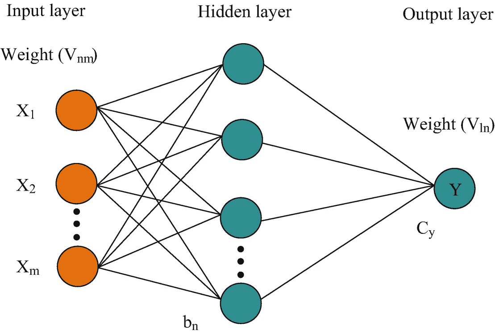
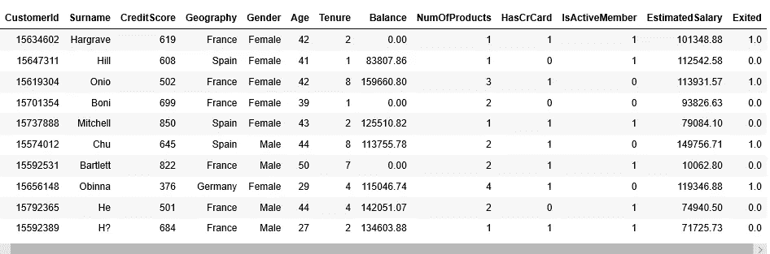
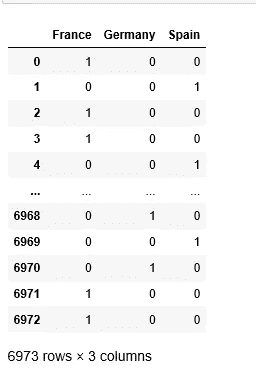
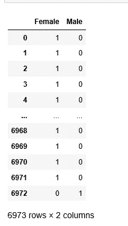
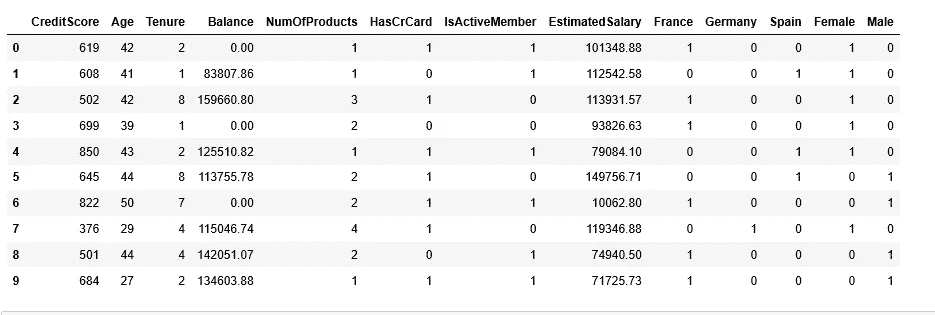
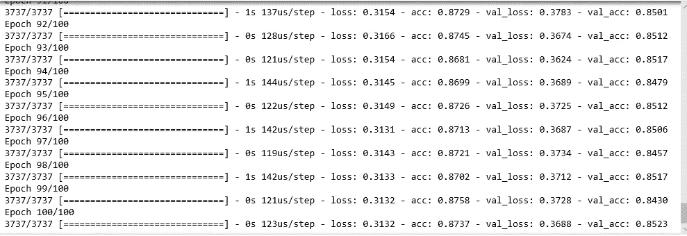
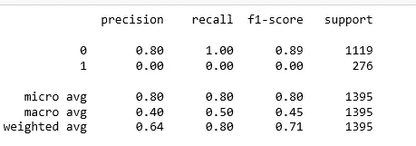
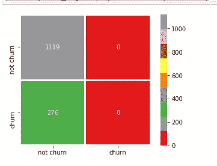
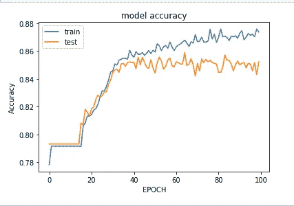
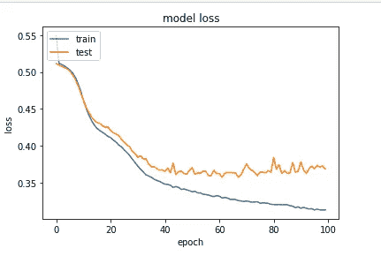

# 人工神经网络银行客户流失预测模型

> 原文：<https://pub.towardsai.net/artificial-neural-network-bank-customer-churn-prediction-model-4cc3ee57b811?source=collection_archive---------1----------------------->

## 机器学习

这篇博客的目的是设计一个神经网络模型来预测银行客户流失。因为该模型的目标是预测客户是否会继续留在银行，或者他们是否会选择退出银行服务。这个模型的本质将是分类。



神经网络体系结构

输入数据集包含 14 列，其中 13 列用作独立要素，最后一列是从属要素。以下是数据集的链接:

> [https://gist . github . com/VIV 07/b 39116817460 a 394210 C5 a0b 01088221](https://gist.github.com/viv07/b39116817460a394210c5a0b01088221)

1.  **进口先决条件:**

```
import pandas as pd
import seaborn as sn
import numpy as np
from sklearn.model_selection import train_test_split
from sklearn.preprocessing import StandardScaler
import keras
from keras.models import Sequential
from keras.layers import Dense
import matplotlib.pyplot as plt
from sklearn.metrics import accuracy_score
from sklearn.metrics import confusion_matrix
from sklearn.metrics import classification_report
```

> keras 库用于设计和训练神经网络。

2.**数据争吵/争论**

```
df=pd.read_csv(r’D:\python_coding\NeuralNetworks\customer_churn.csv')
df.columns#columns
Index(['RowNumber', 'CustomerId', 'Surname', 'CreditScore', 'Geography',        'Gender', 'Age', 'Tenure', 'Balance', 'NumOfProducts', 'HasCrCard',        'IsActiveMember', 'EstimatedSalary', 'Exited'],       dtype='object')df.head(10)
```



资料组

**填充数据集中存在的空值:**特性**估计值**和**退出**中的一些值为 NaN 或空值。所以我们将使用 pandas **ffill()** 方法来填充这些列的值。

```
df[‘Exited’].isnull()
df[‘EstimatedSalary’].isnull()
df=df.fillna(method=’ffill’,limit=1)
```

**数据集准备:**

```
#segregate input and output variables
x = df.iloc[:, 3:13]
y = df.iloc[:,13]
```

**一个热编码:**数据集包含两个分类变量'**性别'**和'**地理'**分类值属于字符串数据类型，并且是模型训练中的一个基本特征，因此使用一次性编码值将被转换为数值。

```
geography=pd.get_dummies(x[“Geography”])
geography
```



地理类别值

```
gender=pd.get_dummies(x[‘Gender’])
gender
```



性别分类值

**数据合并:**合并用主数据集创建的分类集

```
x=pd.concat([x,geography,gender],axis=1)
x=x.drop(['Geography','Gender'],axis=1)
x
```



合并数据

**训练和测试数据集拆分:**

```
x_train, x_test, y_train, y_test = train_test_split(x, y, test_size = 0.2, random_state = 0)
print(x_train.shape, x_test.shape, y_train.shape, y_test.shape)#output:
(5578, 13) (1395, 13) (5578,) (1395,)
```

**3。特征缩放:这是一种标准化独立输入特征的技术。进行特征缩放是为了避免一个特征优于另一个特征，并且有助于避免预测结果。**

```
from sklearn.preprocessing import StandardScaler
sc = StandardScaler()
x_train = sc.fit_transform(x_train)
x_test = sc.transform(x_test)
```

x_train 和 x_test 现在已缩放，将用于训练和测试模型。

**4。神经网络建立和模型训练:**

```
#create an object of sequential model
nn_classifier = Sequential()# Add the first hidden layer
nn_classifier.add(Dense(output_dim = 16 ,activation=’relu’,input_dim = 13))# Adding the second hidden layer
nn_classifier.add(Dense(output_dim = 16,activation=’relu’))# Adding the output layer
nn_classifier.add(Dense(output_dim = 1, activation = ‘sigmoid’))
```

**input_dim** 指输入/独立特征的数量。

**activation_function** :激活函数通过计算加权和并进一步加上偏置来决定是否激活一个神经元。激活功能的目的是**将非线性**引入神经元的输出。

两种类型的激活函数: **RELU** 和 **SIGMOID** 用于建立模型。

```
nn_classifier.compile(optimizer = ‘sgd’, loss = ‘binary_crossentropy’, metrics = [‘accuracy’])#model is trained over 100 epochs
model=nn_classifier.fit(x_train, y_train ,validation_split=0.33, batch_size = 10, nb_epoch = 100)
```

一个**时期**是向前和向后传播的组合，并且对于每一步，在优化器和学习率变量的帮助下调整权重，以最小化损失函数。



模特培训

正如我们所看到的，在第 100 个**纪元**时，损耗被最小化，而精确度提高了。

**5。分类报告和混淆矩阵绘制:**

**分类报告**用于衡量分类算法的预测质量。有多少预测是真的，有多少是假的。更具体地说，真阳性、假阳性、真阴性和假阴性。

```
from sklearn.metrics import classification_report
print(classification_report(y_test.astype(‘int’), y_pred.astype(‘int’)))
```



分类报告

**混淆矩阵和绘图:**混淆矩阵是一个二维数组，用于比较**预测的**类别标签和**真实的**标签。对于二元分类，这些是*真阳性、真阴性、假阳性、*和*假阴性*类别。

```
conf_matrix = confusion_matrix(y_test.astype(‘int’), y_pred.astype(‘int’))
sn.heatmap(conf_matrix,annot=True,fmt = “d”,square = True,
 xticklabels=[“not churn”,”churn”],
 yticklabels=[“not churn”,”churn”],
 linewidths = 2,linecolor = “w”,cmap = “Set1”)
plt.subplots_adjust(wspace = .3,hspace = .3)
```



混淆矩阵绘图

**6。可视化损失和准确性**

```
**#Accuracy vs Value Accuracy**
model.history.keys()
# summarize history for accuracy
plt.plot(model.history[‘acc’])
plt.plot(model.history[‘val_acc’])
plt.title(‘model accuracy’)
plt.ylabel(‘Accuracy’)
plt.xlabel(‘EPOCH’)
plt.legend([‘train’, ‘test’], loc=’upper left’)
plt.show()
```



精度与值精度的关系

```
**#loss vs value loss**
plt.plot(model.history[‘loss’])
plt.plot(model.history[‘val_loss’])
plt.title(‘model loss’)
plt.ylabel(‘loss’)
plt.xlabel(‘epoch’)
plt.legend([‘train’, ‘test’], loc=’upper left’)
plt.show()
```



损失与价值损失

7。预测和模型得分/准确性

```
#prediction variable
y_pred = nn_classifier.predict(x_test)#Model score calculation
from sklearn.metrics import accuracy_score
score=accuracy_score(y_pred.astype(‘int’),y_test.astype(‘int’))
print(score)#output: 0.8021505376344086
```

准确率约为 80%。因此，我们的模式确实很好，但的确，总有改进的余地。

# 总结:

人工神经网络体系结构

Keras 库实现人工神经网络

数据争论

一种处理分类变量的热编码

神经网络层构建

激活功能

向前和向后传播，损失函数

分类报告和混淆矩阵

模型精度

感谢所有人阅读我的文章，如果你喜欢我的内容和解释，请在 Medium 上关注我并分享你的反馈，这将永远帮助我们所有人提高我们的知识。

谢谢

Vivek Chaudhary