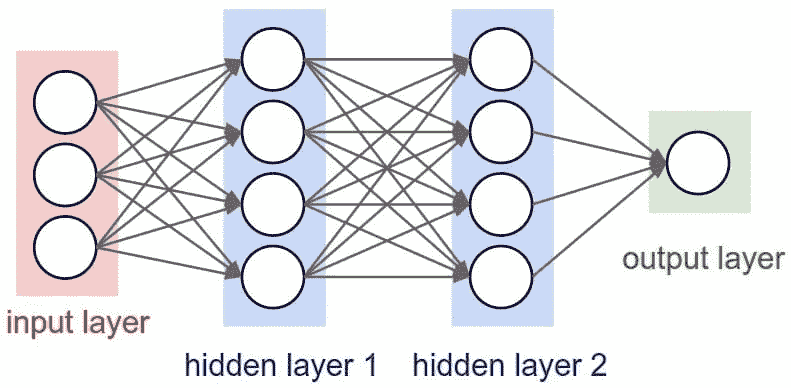
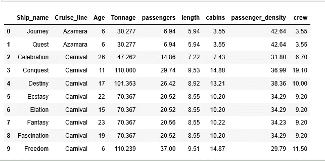
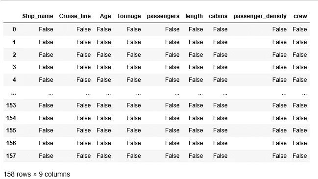
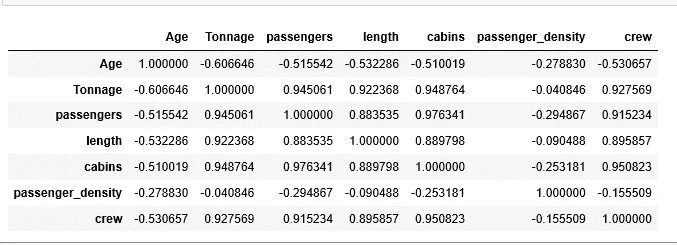
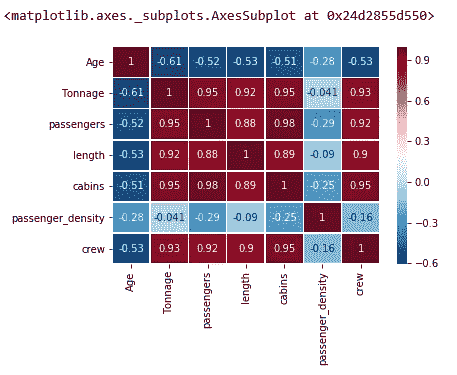
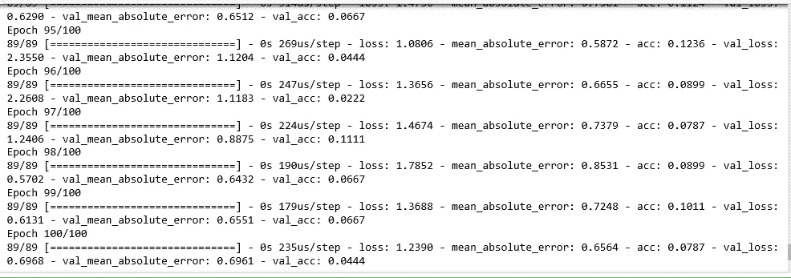
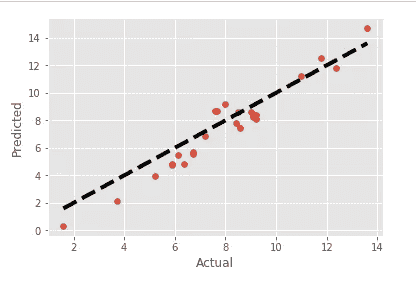

# 人工神经网络船舶船员人数预测模型

> 原文：<https://pub.towardsai.net/artificial-neural-network-ship-crew-size-prediction-model-c04017c7b6fa?source=collection_archive---------1----------------------->

## 机器学习

## 本文的目的是设计一个神经网络模型来预测船舶船员人数。这个模型的本质将是一种回归。



人工神经网络架构

输入数据集包含 9 列，其中 8 列用作独立要素，最后一列是从属要素。你可以在 [**Github**](https://gist.github.com/viv07/6994bf1f07f3b0c4816c6e57d879bf71) 上找到数据集。

# 1.导入先决条件:

```
import pandas as pd
from sklearn.model_selection import train_test_split
import matplotlib.pyplot as plt
from sklearn.preprocessing import StandardScaler#import Neural network libraries
import keras
from keras.models import Sequential
from keras.layers import Dense
from keras.layers import LeakyReLU,PReLU,ELUfrom sklearn.metrics import mean_squared_error ,mean_absolute_error,r2_score
import numpy as np
```

> Keras 库用于设计和训练神经网络。

# 2.数据管理/争论

```
ship_df=pd.read_csv(‘D:\python_coding\pyspark_tutorial\Linear regression\cruise_ship_info.csv’)ship_df.columns
#Index(['Ship_name', 'Cruise_line', 'Age', 'Tonnage', 'passengers', 'length',        'cabins', 'passenger_density', 'crew'],       dtype='object')ship_df.head(10)
```



资料组

## 检查数据集中的空值:

```
ship_df.isna()
#data doesn't have any NULL
```



零检查

# 3.检查相关性

相关性是对两个特征之间的关联性或依赖性的度量，即 **Y** 会随着 **X** 的变化而变化多少。我们将使用的相关方法是**皮尔逊相关**。

**皮尔逊相关系数**是衡量相关性最流行的方法；值的范围从-1 到 1 不等。

```
corr=ship_df.corr(method=’pearson’)
corr
```



相互关系

## 将相关性可视化

```
import seaborn as sb
sb.heatmap(corr, xticklabels=corr.columns, yticklabels=corr.columns,
 cmap=’RdBu_r’, annot=True, linewidth=0.5)
```



相关热图

深栗色显示高度相关的特征。

# 4.数据集准备

```
df=ship_df[[‘Age’, ‘Tonnage’, ‘passengers’, ‘length’,
 ‘cabins’, ‘passenger_density’, ‘crew’]]X = df.iloc[:,df.columns !=’crew’]
Y = df.iloc[:, 6]X_train, X_test, Y_train, Y_test = train_test_split(X, Y, test_size=0.15, random_state= 0)print(X_train.shape, X_test.shape, Y_train.shape, Y_test.shape)
#Output: (134, 6) (24, 6) (134,) (24,)
```

# 5.特征缩放

这是一种标准化独立输入特征的技术。进行特征缩放是为了避免一个特征优于另一个特征，并且有助于防止预测结果。

```
from sklearn.preprocessing import StandardScaler
sc = StandardScaler()
X_train = sc.fit_transform(X_train)
X_test = sc.fit_transform(X_test)
```

# 6.神经网络构建和模型训练:

```
#create linear regression model object
lr_model=Sequential()# Add the first hidden layer
lr_model.add(Dense(output_dim=16, activation='relu',input_dim=6))# Adding the second hidden layer
lr_model.add(Dense(output_dim=16, activation='relu'))# Adding the output layer
lr_model.add(Dense(output_dim=1, activation='relu'))
```

**input_dim** 指输入/独立特征的数量。

**activation_function** :激活函数通过计算加权和并进一步加上偏置来决定是否激活一个神经元。激活功能的目的是**将非线性**引入神经元的输出。

```
lr_model.compile(loss=’mean_squared_error’, optimizer=’sgd’, metrics = [‘mae’,’accuracy’])#Model Training#Model is trained over 100 Epochs
lrmodel_hist=lr_model.fit(X_train, Y_train ,validation_split=0.33, batch_size = 10, nb_epoch = 100)
```

一个**时期**是前向和后向传播的组合，对于每一步，在优化器和学习率变量的帮助下调整权重，以最小化损失函数。



模特培训

正如我们所看到的，在第 100 个**纪元**时，损耗被最小化了，精确度也提高了。

```
#evaluate model
lr_model.evaluate(X_test,Y_test)[1]#output: 0.9130942225456238#making predictions from trained model
y_pred = lr_model.predict(X_test)
```

## 绘制实际值与预测值:

```
fig, ax = plt.subplots()
ax.scatter(Y_test, y_pred)
plt.style.use(‘ggplot’)
ax.plot([Y_test.min(), Y_test.max()], [Y_test.min(), Y_test.max()], ‘k — ‘, lw=4)
ax.set_xlabel(‘Actual’)
ax.set_ylabel(‘Predicted’)
plt.show()
```



实际与预测

## RMSE(均方根误差)

均方根误差是残差的标准偏差，它衡量数据点与回归的距离。或者简单地说，数据点在最佳拟合线周围的集中程度。

```
import numpy as np
print('Root Mean Squared Error:', np.sqrt(mean_squared_error(Y_test, y_pred)))#output: Root Mean Squared Error: 0.9909468213027769
```

**R2 或 r 平方误差**

r2 或 R2 分数在 0 到 100%之间变化。

**R2 得分的数学公式:(y_test[i] — y_pred[i]) **2**

```
print(‘R2: ‘, r2_score(Y_test, y_pred))
#output R2:  0.8577843971939547
```

我们的模型看起来很棒，有着惊人的统计数据。

# 总结:

人工神经网络架构。

Keras 库实现人工神经网络。

数据争论/管理

神经网络层构建

激活功能

向前和向后传播，损失函数

RMSE 和 R2 误差

模型精度

感谢大家阅读我的文章。如果您喜欢我的内容和解释，请在 Medium 上关注我并分享您的反馈，这将始终帮助我们所有人提高我们的知识。

谢谢

Vivek Chaudhary