# Ashrae 大能量预测挑战

> 原文：<https://pub.towardsai.net/ashrae-great-energy-prediction-challenge-cefab05e4f2?source=collection_archive---------1----------------------->

## [深度学习](https://towardsai.net/p/category/machine-learning/deep-learning)


照片由 [**丹尼尔·萨卡特科**](https://unsplash.com/@danielzacatenco) 在 **Unsplash**

Linkedin [简介](http://linkedin.com/in/gundluru-chandrasekhar-499129196)简介& Github [简介](https://github.com/Chandugundluru?tab=repositories)

## **目录:**

1.  问题陈述
2.  数据集
3.  将现实世界的问题映射到 ML 问题
4.  探索性数据分析
5.  特征工程
6.  极端值
7.  特征选择
8.  模型和超参数调整
9.  深度学习模型
10.  堆积回归
11.  参考

## 1。 **问题陈述**

正在进行大量投资来提高建筑效率，以降低成本和排放。问题是，这些改进奏效了吗？这就是我们的切入点。在按绩效付费的融资方式下，建筑业主根据其实际能耗与未进行任何改造时的能耗之间的差异进行支付。后面的值必须来自一个模型。目前的评估方法是零散的，不能很好地扩展。有些采用特定的仪表类型，或者不适用于不同的建筑类型。

在本次竞赛中，我们将在以下领域开发计量建筑能源使用的精确模型:冷水、电、热水和蒸汽仪表。这些数据来自超过 1000 栋建筑，历时三年。随着对这些节能投资的更好估计，大规模投资者和金融机构将更倾向于在这一领域投资，以促进建筑效率的提高。

**来源:【https://www.kaggle.com/c/ashrae-energy-prediction】[](https://www.kaggle.com/c/ashrae-energy-prediction/data)**

## ****2。数据****

**第一个观察结果是训练和测试数据分布在 5 个不同的 CSV 文件中。train、test、weather_train 和 weather_test 是时间序列数据，每小时测量一次。Building_metadata 包含建筑物的特征，例如建筑物的站点 id、主要用途、平方英尺、建造年份。在天气数据集中，有与风、云、温度和压力相关的要素。**

**从 2016 年 1 月 1 日到 2017 年 1 月 1 日测量的天气 _ 列车数据集。Weather_test 数据集跨度为 2017 年 1 月 1 日至 2019 年 1 月 1 日。**

**来源:https://www.kaggle.com/c/ashrae-energy-prediction/data**

## **3。 **映射到现实世界的问题****

**我们有一个回归问题。因此，使用 1 年的数据，我们将预测建筑物未来 2 年的能耗**

****评估指标****

*   **本次竞赛的评估标准是均方根对数误差。**

**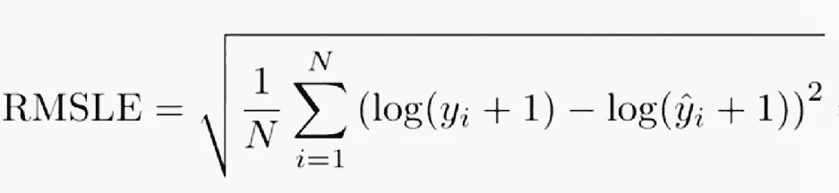**

**其中:**

**n 是(公共/私人)数据集中的观察总数
yi^你预测的目标
y 是 ii 的实际目标。
log(x)是 x 的自然对数**

**来源:[https://www . ka ggle . com/c/ASHRAE-energy-prediction/overview/evaluation](https://www.kaggle.com/c/ashrae-energy-prediction/overview/evaluation)**

## ****4。探索性数据分析****

**我使用熊猫轮廓对建筑和天气数据集进行数据分析。**

****让我们探索构建数据集****

```
import pandas_profiling as pppp.ProfileReport(building_df)
```

****

**建筑数据概述建筑数据中缺少值**

*   **Building_id 是该数据集的主键。来自 1449 栋建筑的观察。**
*   **floor_count 和 year _ built 列中超过 50%的值缺失。**
*   **除了 primary_use 之外，所有列都是数字特征。**
*   **primary_use 列是分类的，大多数值是教育、办公和公共集会。**

**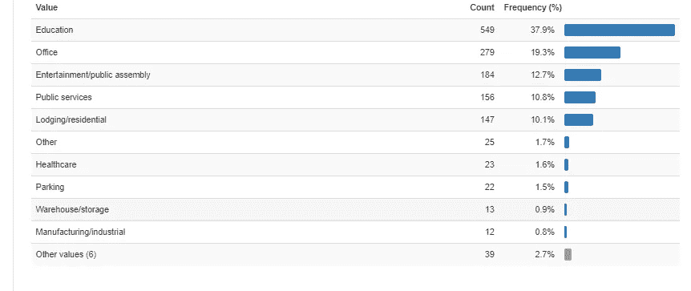****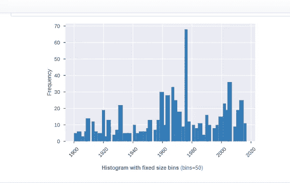**

****天气数据分析:****

**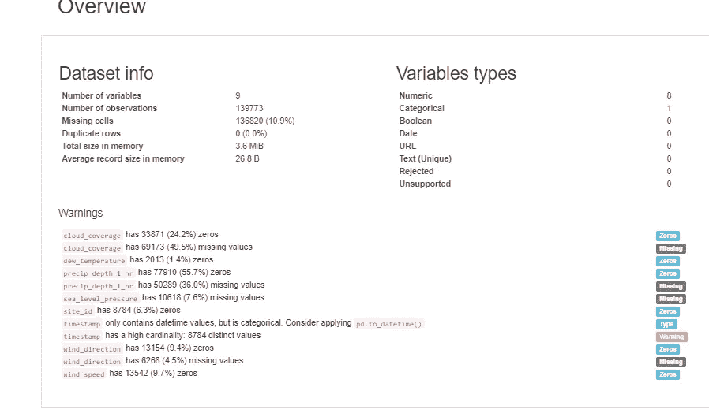**

**天气数据概述天气数据中缺少值**

*   **除时间戳外，所有特征都是数字，并采用以下单位和范围:**
*   **cloud_coverage、precip_depth_1_hr、sea_level_pressure 和 wind_direction 的缺失值非常高。**

**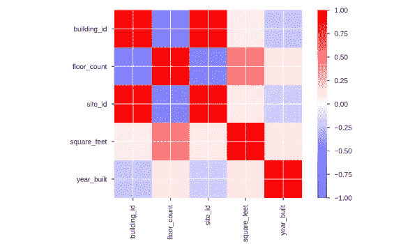****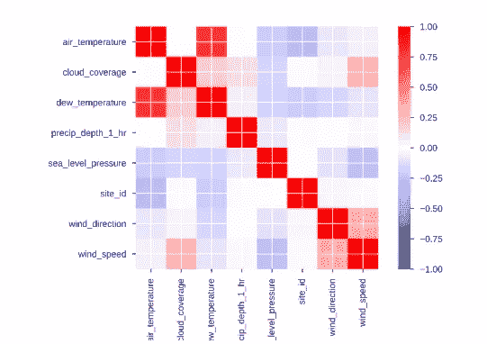**

****列车 _ 数据分析:****

*   **列车数据包含仪表读数(目标值)。让我们来探讨阅读资料的分布**
*   **这是训练数据集中最大的数据集。几乎有 2000 万行，所以很难适应熊猫轮廓**

**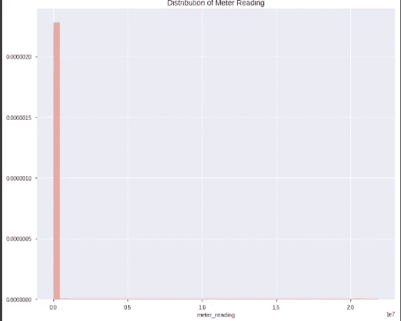**

*   **由于它严重右偏，我将 log 应用于仪表读数…现在让我们检查分布情况……**

**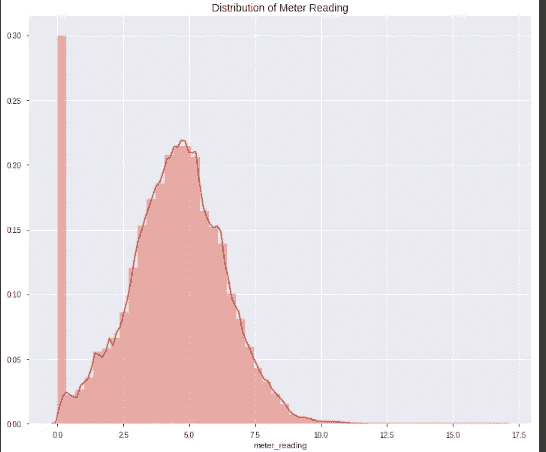****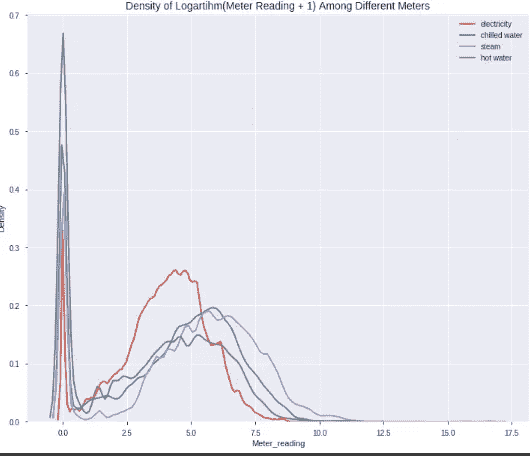**

**仪表读数日志和单个仪表**

*   **很明显，在仪表读数中，大多数值为零**
*   **一个显而易见的事实是。大量的观察值 0 来自热水、冷水和蒸汽消耗，这意味着我们在用电量方面的缺失值和观察值 0 更少。**
*   **这张图显示了抄表值在每个电表类别中的不同分布，尤其是用电量与其他不同。因此，仪表是确定仪表读数的重要变量**
*   **现在，通过添加 time_stamp 中的月和周功能来深入分析数据，以便对仪表读数进行月和日分析**

```
def time_features(df):
# Sort by timestamp
df.sort_values("timestamp")
df.reset_index(drop=True)
df["timestamp"] = pd.to_datetime(df["timestamp"],format="%Y-%m-%d %H:%M:%S")
df["hour"] = df["timestamp"].dt.hour
df["dayofweek"] = df["timestamp"].dt.weekday
df['month'] = df['timestamp'].dt.month
return df
train_df  = time_features(train_df)
```

**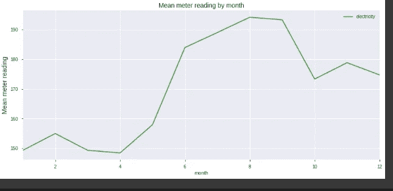****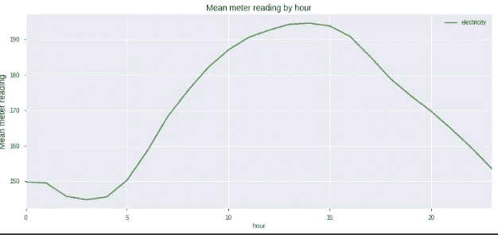**

**电力读数的小时和月平均值**

*   **电量观测值在 0 到 220 千瓦时之间。**
*   **电表读数在 5 月份之前都很低**
*   **上半年，耗电量不超过 160 千瓦时。**
*   **下半年，耗电量增加，在 160 至 220 千瓦时之间。总的来说，2016 年用电量呈增长趋势。**
*   **每天的用电高峰出现在下午，平均约为 190 千瓦时**

**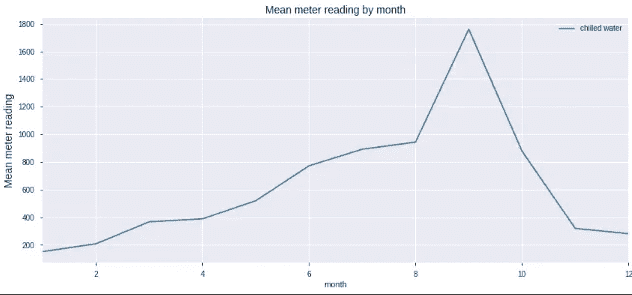****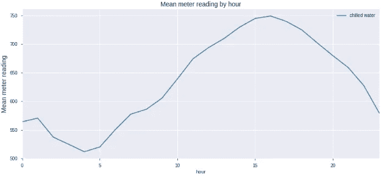**

**冷水读数的小时和月平均值**

*   **冷水消耗量在 130-1800 千瓦时之间。**
*   **它显示了直到 2016 年 9 月高达 1000 千瓦时的稳定增长。在 9 月和 10 月之间，用电量出现峰值，导致范围上升到 1800 千瓦时。**
*   **从 11 月开始，它呈现下降趋势。**
*   **冷水水表不出所料是下午的一个高峰**

**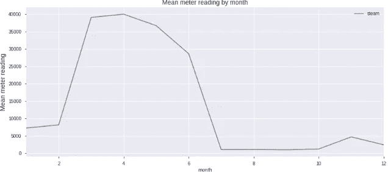****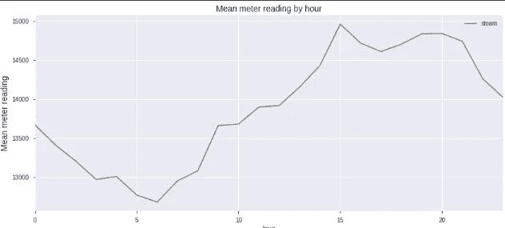**

**蒸汽读数的小时和月平均值**

*   **蒸汽消耗量范围:0-40 千瓦时。**
*   **蒸汽消耗没有明显的趋势，蒸汽仅在上半年使用。**
*   **在今年剩下的时间里，消费量急剧下降**
*   **2016 年 11 月 9 日有一个有趣的峰值。**
*   **下午 3 点蒸汽表峰值**

**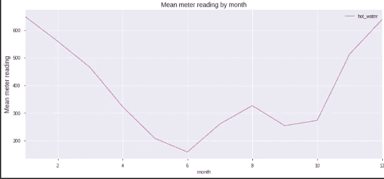******

**热水读数的小时和月平均值**

*   **热水表量程 0-500 热水消耗量在冬季较高，在五月和七月之间显示最低结果。**
*   **夏季消费的减少对我们的 ML 模型来说是一个有用的趋势。**
*   **热水表在早上达到峰值**

****合并建筑和列车数据以供进一步探索****

```
trainbld_df = (train_df.merge(building_df,on='building_id',how='left'))
```

**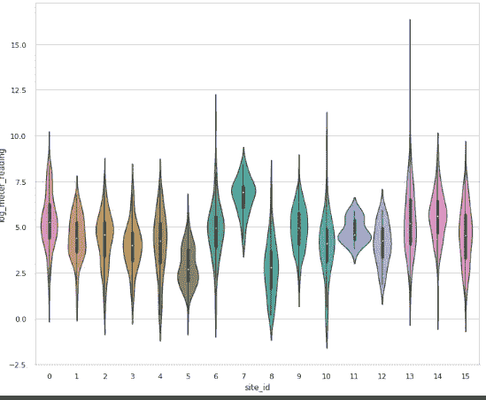****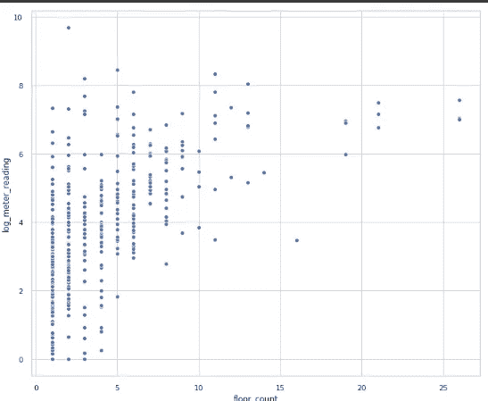**

**仪表读数与站点 id 和楼层计数**

*   **站点 0、1、2、3、4、5、8、9、14 和 15 具有相似的仪表读数分布**
*   **站点 6 和 10 的抄表值共享几乎相同的分布和汇总统计。**
*   **站点 id 13 具有超出 log_meter_reading_value 10 的最宽仪表读数范围。**
*   **站点 id 11 的仪表读数范围最窄，集中在 5 左右。**
*   **站点 id 13 显示了最广泛的抄表分布。**
*   **由于 floor_count 中的数据点较少，很难从图表中提取一些有意义的结论。**

## ****5。特征工程****

****a)填充缺失值**:**

```
sea_level_filler = weather_df.groupby(['site_id','day','month'])['sea_level_pressure'].mean()sea_level_fillerpd.DataFrame(sea_level_filler.fillna(method='ffill'),columns=['sea_level_pressure'])weather_df.update(sea_level_filler,overwrite=False)
```

*   **由于 cloud_coverage、precip_depth_1_hr、sea_level_pressure 和 wind_direction 的缺失值非常高，需要对其进行填充**
*   **添加日、周和月功能该数据集包含每小时的天气信息。因此，我们将根据以下新的日期特征来填充缺失的值。**
*   **用一个月中某一天的平均温度填充缺少的气温。每个月都是一个季节，一个季节里气温变化很大。所以用年平均值填充不是一个好主意。**
*   **大部分时间甚至连续多天都有数据丢失。因此，首先，计算平均云覆盖率、降水深度 1 小时、海平面气压和风向，然后用最后一次有效观测值填充其余缺失值。(用 method='ffill '选项填充。“ffill”代表“向前填充”,并将向前传播最后一次有效观察)**

****b)向数据添加特征:****

*   ****气象 _ 特征:****

**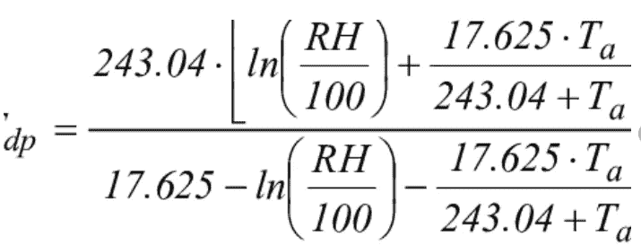**

**在哪里**

*   **dp =露点温度**
*   **RH =相对湿度**
*   **Ta =气温**

**我们的数据集有空气温度和露水温度，我正在计算相对湿度，并将其作为一个新特征添加进来**

## **RH:= 100(EXP((17.625 TD)/(243.04+TD))/EXP((17.625 * T)/(243.04+T)))**

```
df['relative_humidity'] = 100 * (np.exp((17.625 * df['dew_temperature']) / (243.04 + df['dew_temperature'])) / np.exp((17.625 * df['air_temperature'])/(243.04 + df['air_temperature'])))
```

****手感 _ 喜欢特征:****

*   **我们通过气温、相对湿度和风力来计算感觉温度**
*   **我们通过使用 meteocalc 库(https://pypi.org/project/meteocalc/)来得到它**

```
from meteocalc import feels_like, Tempflike_final = []
flike = []
for i in range(len(df)):
    at = df['air_temperature'][i]
    rh = df['relative_humidity'][i]
    ws = df['wind_speed'][i]
    flike.append(feels_like(Temp(at, unit = 'C'), rh, ws))for i in range(len(flike)):
    flike_final.append(flike[i].f)
    df['feels_like'] = flike_final
```

****假日 _ 特色:****

*   **通过在构建假日库(包含大多数国家的假日)中使用 python，向数据集添加了 is_holiday 要素**
*   **然后对分类特征进行编码**

## ****6。离群值:****

*   **列车数据中有一些极端的仪表读数。**

**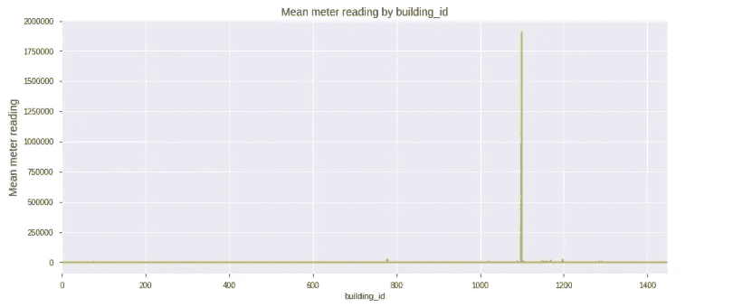****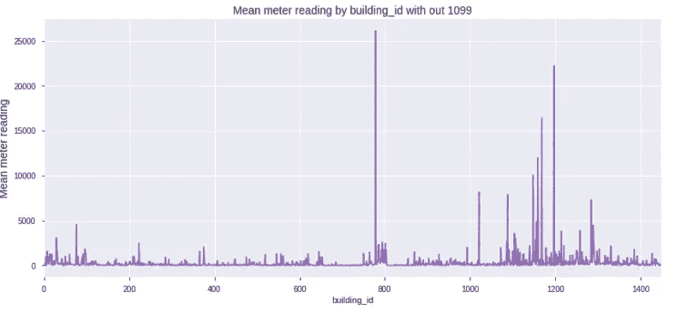**

*   **因为我们发现 EDA 建筑 1099 是一个离群值，所以我们删除了它**
*   **没有理由保持零电气读数，因为它不可能为零。因此这些行也被排除在数据集之外**
*   **floor_coont 要素被移除，因为它包含超过 76%的缺失值**

## ****7。特征 _ 选择:****

**合并建筑物后，天气和火车在新数据集中有 17 个特征。让我们找出每个特性的特性重要性**

****LOFO 重要性(忽略一个特征)****

*   **LOFO(忽略一个要素)重要性基于选择的度量计算一组要素对于选择的模型的重要性，通过迭代地从集合中移除每个要素，并基于选择的度量使用选择的验证方案来评估模型的性能。**
*   **LOFO 首先评估包含所有输入特征的模型的性能，然后迭代地一次移除一个特征，重新训练模型，并在验证集上评估其性能。然后报告每个特征的重要性的平均值和标准偏差(跨折叠)**

```
import lightgbm as lgbcat_cols = ['building_id', 'meter', 'site_id', 'primary_use','dayofweek_x','is_holiday','group_x']
model = lgb.LGBMRegressor(boosting_type='gbdt', n_estimators=500,objective='regression',n_jobs=-1)
from sklearn.model_selection import KFoldfrom lofo import LOFOImportance, Dataset, plot_importancecv = KFold(n_splits=3, shuffle=False, random_state=0)features = ['square_feet', 'air_temperature', 'cloud_coverage', 'dew_temperature','precip_depth_1_hr', 'sea_level_pressure', 'wind_direction', 'wind_speed','relative_humidity','feels_like'] + cat_colsdataset = Dataset(df=train_df, target="meter_reading", features=features)lofo_imp = LOFOImportance(dataset, model=model, cv=cv, scoring="mean_squared_error", fit_params={"categorical_feature": cat_cols})
importance_df = lofo_imp.get_importance()
plot_importance(importance_df, figsize=(12, 12))
```

**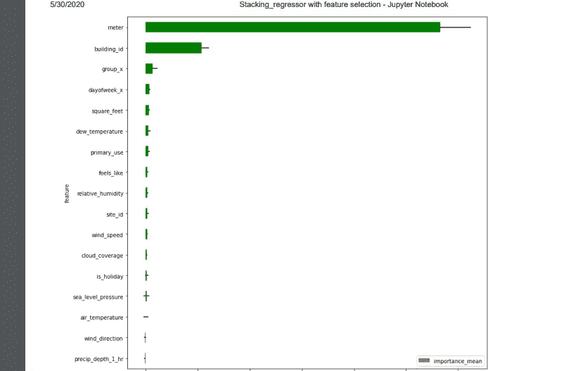**

*   **仪表类型非常重要**
*   **precip_depth_1_hr 和风向伤害模型**
*   **气温和海平面气压的影响最小**
*   **所以从数据中删除这些特征**

## ****8。模型和超参数调整:****

**因此，将对回归问题和竞赛结果进行均方根对数误差评估。**

**我已经对目标应用了 log1p 变换，因此在整个项目中，我将使用 RMSE(均方根误差)作为单一评估指标，即:**

```
def rmse(y_true, y_pred):
    return np.sqrt(np.mean(np.square(y_true - y_pred))))
```

**因为模型的目标是预测仪表读数。我决定从最简单直接的方法开始，将标签的平均值作为数据的随机模型**

```
baseline_guess = np.median(y_train)print('The baseline guess is a score of %0.2f' % baseline_guess)print("Baseline Performance on the valid set: RMSE = %0.4f" % rmse(y_test, baseline_guess))
```

**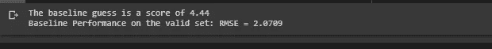**

**所以对于随机模型，我们的度量是 2.0709**

****SGDRegressor****

```
alpha = [10 ** x for x in range(-4, 1)]
eta0=[0.001,0.01,0.1]
learning_rate=['invscaling','adaptive']
for i in alpha:
    for k in eta0:
        for j in learning_rate:
            linR=linear_model.SGDRegressor(loss='squared_loss',     penalty='l2', learning_rate=j, eta0=k,alpha=i,early_stopping=True)
            linR.fit(X_train,y_train)
            predict_y =  linR.predict(X_test)

            print ('rmse for alpha = ',i,'eta=',k,'and  learning_rate=',j,'is',sqrt(mean_squared_error(y_test, predict_y)))
```

**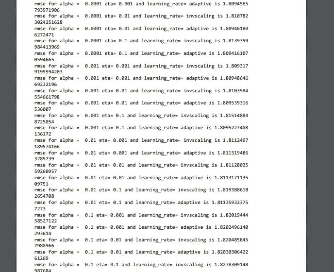**

****决策树 _ 回归器:****

```
max_depth = [3,5,10,50,100]
cv_log_error_array=[]
for i in tqdm(max_depth):
    regressor = DecisionTreeRegressor(max_depth=i)
    regressor.fit(train,y_train)
    predict_y =  regressor.predict(test)
cv_log_error_array.append(sqrt(mean_squared_error(y_test, predict_y)))
for i in range(len(cv_log_error_array)):
    print ('rmse for max_depth and min_sample_split = ',max_depth[i],'is',cv_log_error_array[i])
```

**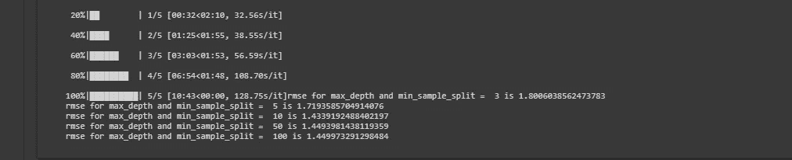**

****随机森林回归量:****

```
estimators = [16,32,64,128]
cv_log_error_array=[]
for i in tqdm(max_depth):
    regressor=RandomForestRegressor(n_estimators=i,  n_jobs=-1,verbose=1)
    regressor.fit(train,y_train)
    predict_y =  regressor.predict(test)
    cv_log_error_array.append(sqrt(mean_squared_error(y_test, predict_y)))
```

**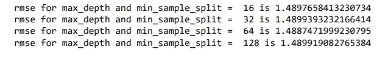**

****xgb 回归量:****

```
estimators = [50,100,500,1500]
cv_log_error_array=[]
for i in tqdm(estimators):
    regressor=XGBRegressor(n_estimators=i,nthread=-1)
    regressor.fit(train,y_train)
    predict_y =  regressor.predict(test)
    cv_log_error_array.append(sqrt(mean_squared_error(y_test, predict_y))
```

**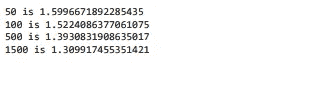**

****lightgbm:****

```
import lightgbm as lgb
alpha=[25,50,150,500,1000]
cv_log_error_array=[]
for i in tqdm(alpha):
    lgbr=lgb.LGBMRegressor(boosting_type='gbdt', n_estimators=i, objective='regression', n_jobs=-1)
    model=lgbr.fit(train,y_train)
    predict_y =  model.predict(test)
    cv_log_error_array.append(sqrt(mean_squared_error(y_test, predict_y)))
for i in range(len(cv_log_error_array)):
    print ('rmse for estimators = ',alpha[i],'is',cv_log_error_array[i])
```

**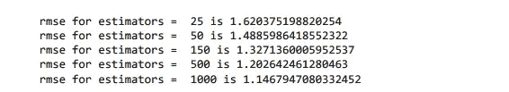**

## ****9。深度学习模型:****

****简单 _MLP:****

```
input_dim = train.shape[1]
alpha=[64,256,512]
for i in tqdm(alpha):
    model = Sequential()
    model.add(Dense(i, activation='relu', input_shape=(input_dim,)))
    model.add(Dense(i, activation='relu')) 
    model.add(Dense(i, activation='relu')) 
    model.add(Dense(1  ,activation='linear'))def root_mean_squared_error(y_true, y_pred):
return K.sqrt(K.mean(K.square(y_pred - y_true)))
    model.compile(optimizer = 'adam', loss = root_mean_squared_error)

   model.fit(train,y_train,epochs=8,batch_size=2048,validation_data=[test,y_test])
```

**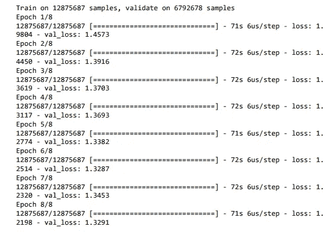**

****CNN+LSTM 深度神经网络:****

**由于我们的数据包含分类和数值特征，我决定将分类特征赋予 Conv1d，将数值特征赋予 Lstm。**

**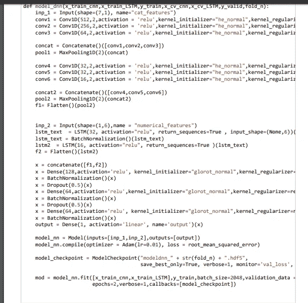**

****模型架构:****

**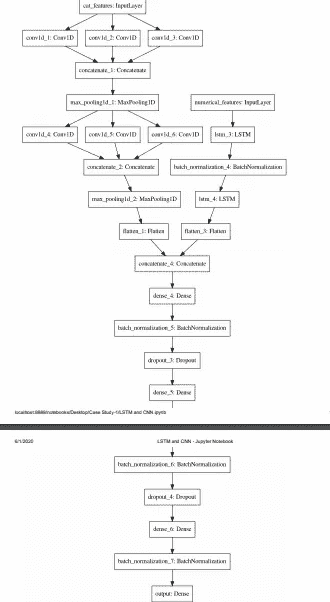**

**虽然没有得到好的结果，但是尝试总是一种好的学习习惯**

**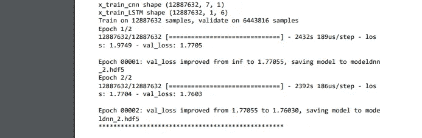**

## **结论 _ 根据以上模型:**

**我们发现，LGBRegressor 模型为测试数据集提供了 1.146 rmse 的最佳结果。我的大部分实验都不太成功，现在让我们建立一些先进的模型，希望能得到更好的结果…**

## ****10。堆叠 _ 回归量:****

*   **将列车数据分为两部分(df1)和(df2)**
*   **使用 df1 进行基础学习者训练，然后使用这些基础学习者预测 df2 读数(df2_pred)和测试读数(test_pred)**
*   **然后用 df2_pred 和 y_df2 训练元回归器**
*   **然后从(test_pred)预测最终的测试标签**

**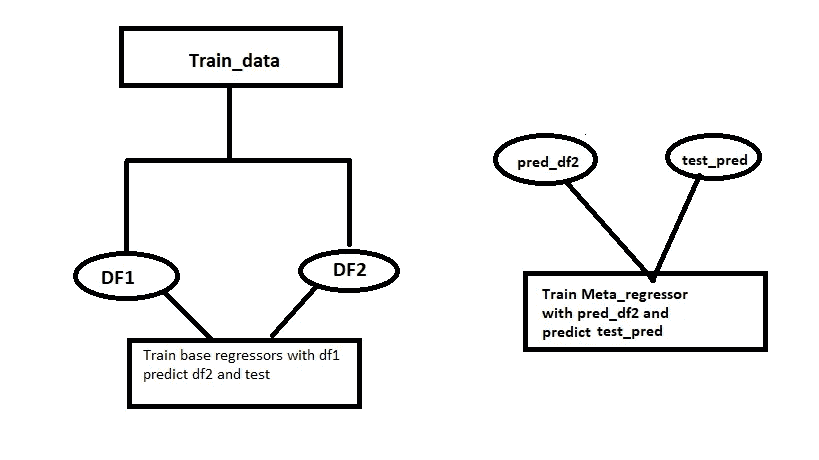**

****创建 60 个基数 _ 回归量:****

**我从上面选择了最好的模型作为基础和元回归变量**

```
import lightgbm as lgbdf2_pred=[]
test_pred=[]
for i in tqdm(range(0,60)):
    df=df1.sample(n=200000,replace = True)
    y_train_sam=df['meter_reading']
    train_sam=df.drop(['meter_reading'], axis=1)
    regressor=lgb.LGBMRegressor(boosting_type='gbdt', n_estimators=200,ma x_depth=50,objective='regression',n_jobs=-1)      regressor.fit(train_sam,y_train_sam)
    predict_df2 =  regressor.predict(x_df2)
    predict_test =  regressor.predict(test_df)
    k=sqrt(mean_squared_error(y_df2, predict_df2))
    print(k)
    df2_pred.append(predict_df2)
    test_pred.append(predict_test)
    del train_sam,regressor, k ,df,y_train_sam,predict_df2
```

**这里我使用 60 lightgbm 作为基础学习者。**

**对于 df1，我们使用替换进行采样，制作 k 个不同的样本(行采样)，然后将每个样本传递给 k 个不同的 bae 模型，然后创建一个堆叠模型。**

****元回归量:****

```
regressor_meta=lgb.LGBMRegressor(boosting_type='gbdt', n_estimators=350,max_depth=50,objective='regression',n_jobs=-1)
regressor_meta.fit(df2_pre,y_df2)
predict_y =  regressor_meta.predict(test_pre)
```

**预测 y 的 kaggle 分数:**

****

## **11。参考文献**

**[https://www.appliedaicourse.com](https://www.appliedaicourse.com/)**

**[https://www.kaggle.com/yamsam/ashrae-leak-data-station](https://www.kaggle.com/yamsam/ashrae-leak-data-station)**

**[https://www . ka ggle . com/cereniyim/save-the-energy-for-the-future-1-detailed-EDA](https://www.kaggle.com/cereniyim/save-the-energy-for-the-future-1-detailed-eda)**

**[https://towards data science . com/estimating-counter factual-energy-usage-of-buildings-with-machine-learning-8ca 91 EC 66 c 08](https://towardsdatascience.com/estimating-counterfactual-energy-usage-of-buildings-with-machine-learning-8ca91ec66c08)**

**[https://www . ka ggle . com/data dugong/locate-better-cities-by-weather-temp-fill-nans](https://www.kaggle.com/datadugong/locate-better-cities-by-weather-temp-fill-nans)**

**罗曼，卡格尔笔记本，“埃达为 ASHRAE。”从[https://www.kaggle.com/nroman/eda-for-ashrae#meter](https://www.kaggle.com/nroman/eda-for-ashrae#meter)检索到 2020 年 1 月**