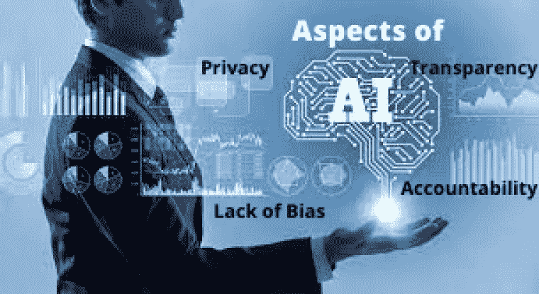

# 能让人工智能可靠可信的方面。

> 原文：<https://pub.towardsai.net/aspects-that-can-make-artificial-intelligence-reliable-and-trustworthy-8db0ccf8e614?source=collection_archive---------3----------------------->

## [人工智能](https://towardsai.net/p/category/artificial-intelligence)

人工智能是一个巨大的领域，它拥有极大的力量，可以被用来对社会产生负面影响。为了负责任地开发和使用人工智能系统，人工智能开发者必须考虑关于**道德、偏见和信任**问题的担忧。他们必须思考人工智能固有的伦理问题。他们必须对自己的算法和程序有一个现实的看法，并意识到在他们的系统中可能存在偏差的不同形式。有了这种正确的心态，开发人员可以最小化或几乎避免无意中创建对我们的社区有负面影响而不是正面影响的 AI 系统。

世界上最优秀的物理学家之一斯蒂芬·霍金这样表达了他对人工智能的担忧。

强大的人工智能的崛起对人类来说可能是最好的，也可能是最坏的，我们还不知道是哪一件————**斯蒂芬·霍金**

企业家兼商业巨头埃隆·马斯克(Elon Musk)曾经在谈到人工智能时走得更远。

人工智能比核武器更危险。— — **埃隆·马斯克**

**信任**是开发**有影响力、有帮助、成功的**人工智能系统的关键要素。对于开发者社区来说，在开发人工智能系统时，他们必须考虑人工智能的四个方面，以便人们可以认为它是**可信的**和**可靠的**:

**1)透明性**——当人们与人工智能系统交互时，他们应该意识到，并理解他们对交互的期望应该是什么。虽然冗长的、**详细的**政策不可能对所有消费者都有帮助，但这将是迈向人工智能透明化的关键一步。人们应该知道他们在和谁说话，是机器人还是人，以及这在他们的谈话中有什么关系？

所有基于人工智能的公司都应该用更新的政策取代当前的政策，这些政策将明确规定未来如何获取、存储和使用数据。这样人们在使用这些系统时就会放松，减少困惑。

2)责任 —开发者应该创建具有算法责任的人工智能系统，以便任何意外的结果都可以被**追踪**和**撤销**。人工智能开发人员应该从第一天起就让开发团队清楚地了解公司政策，这样就不会有人对责任问题感到困惑。

通过这样做，可以避免**的弊端**，这样人们就会相信人工智能，它会影响到越来越多的人。

**3)隐私**——个人信息应该始终受到保护。开发人员应该始终注意隐私政策。消费者必须确信他们的**个人信息**不会被**出售**或**与任何其他公司共享**。必须向他们保证，他们的公司一定会遵守隐私政策。

由于这些隐私问题，**欧盟**制定了关于隐私政策的规则。如果任何组织被判有罪，他们必须支付 2200 万美元或其全球年营业额的 4%作为罚款。

**4)缺乏偏见** —开发者为了避免数据偏见，应该使用与任何**人**或**身份**及其**肤色**、**性别**或**长相不相关的训练数据。定期审计对于发现任何进入系统的偏差是必不可少的。**

由于训练数据使用不当，一些人工智能系统识别出显示**厨房**、**洗衣房**、**商店**与**女性**的场景，以及显示**体育教练**和**射击**与**男性**的场景。这些问题会对用户的心态和体验产生巨大的影响。在构建人工智能系统之前，这一点应该一直被考虑。