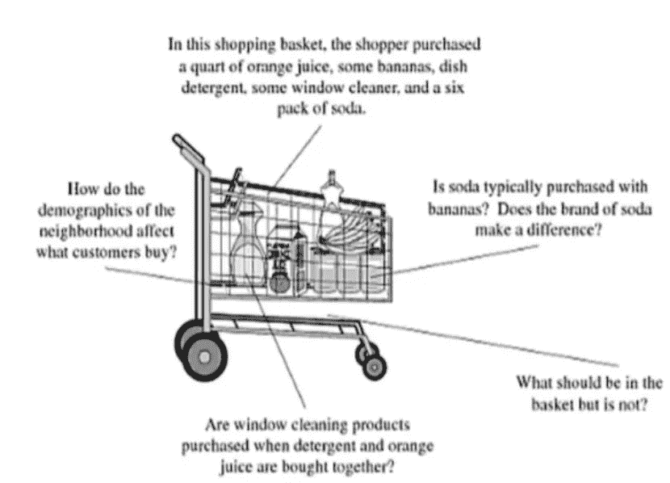
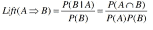
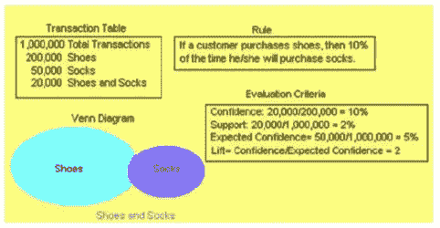
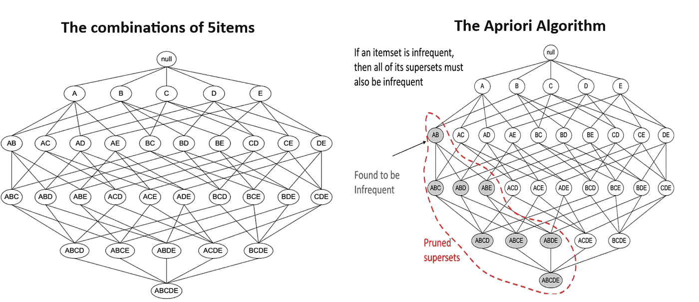
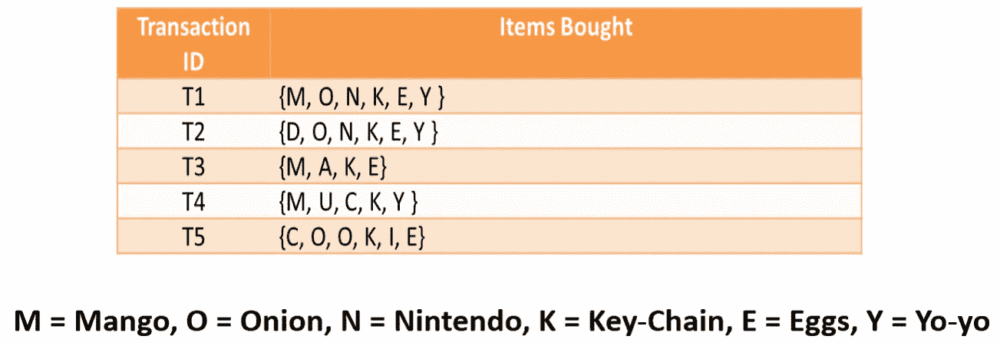
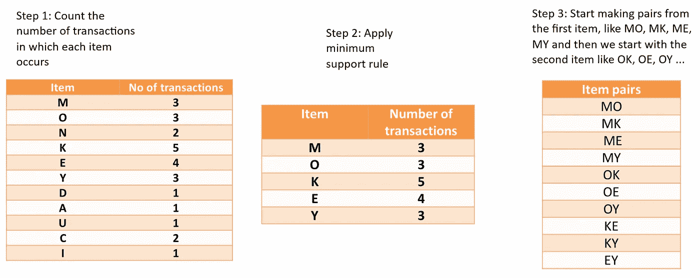
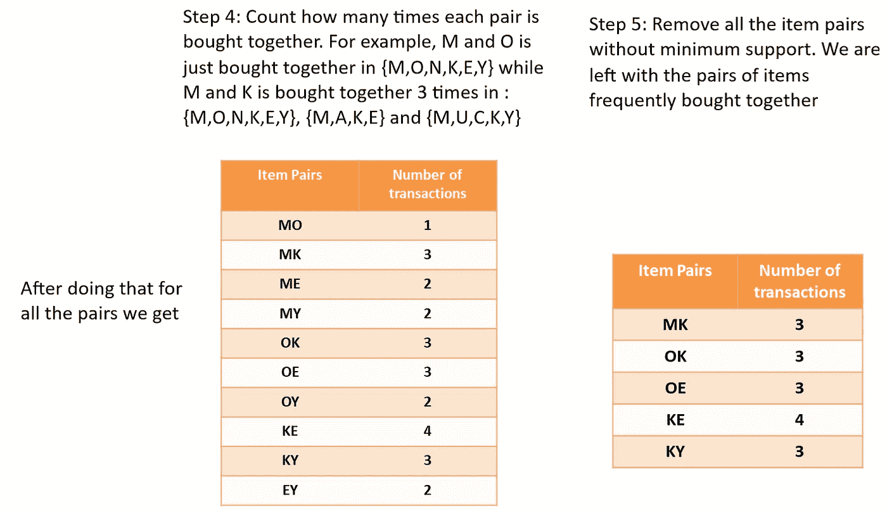
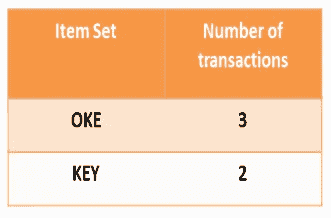

# 关联发现 Apriori 算法

> 原文：<https://pub.towardsai.net/association-discovery-the-apriori-algorithm-28c1e71e0f04?source=collection_archive---------0----------------------->

## 数据科学中的购物篮分析| [走向人工智能](https://towardsai.net)

关联发现俗称***【MBA】***。MBA 被杂货店、银行和电信等行业广泛使用。其结果用于优化商店布局、设计产品包、计划优惠券、选择合适的特价商品以及选择直销中的附加邮件。MBA 有助于我们了解哪些物品可能会一起购买。联机事务处理系统通常为关联发现提供数据源。

# 什么是购物篮分析？

买牙膏的人也倾向于买牙刷，对吗？零售店的营销团队应瞄准购买牙膏和牙刷的顾客，并向他们提供报价，以便顾客购买第三种产品，例如漱口水。如果顾客购买牙膏和牙刷，看到漱口水打折，他们会被鼓励多花钱买漱口水，这就是市场分析的全部内容。这有助于我们了解哪些商品可能会一起购买。联机事务处理系统通常为关联发现提供数据源。

资料来源:MBA——Berry 和 Linoff 的购物车类比(2004)

通常，交易是单个客户购买，项目是购买的东西。关联发现是对在给定事件或记录中一起出现的项目的识别。关联规则强调事务数据库中项目或对象集合之间频繁的关联模式或因果结构。关联发现规则基于项目在数据库中单独和组合出现的频率计数。它们被表达为“如果物品 A 是事件的一部分，那么物品 B 也是事件的一部分，X %的时间。”因此，关联规则是以下形式的语句(项目集 A)项目集 B)。

例如:顾客购买牙膏(商品 A ),然后牙刷(商品 b)在同一交易 ID 下被顾客挑选的机会。这里需要明白一件事，这不是一个偶然事件，而是一个共现模式。

上面的牙膏是一个婴儿的例子。如果我们拿真正的零售店来说，他们有超过数千种商品。想象一下，通过正确放置物品，他们可以使用这种算法获得多少收入。MBA 是一种帮助企业盈利的流行算法。上述 A 和 B 规则是为两个项目创建的。很难为超过 1000 个项目创建规则，这就是关联发现和 apriori 算法的用武之地。我们来看看这个算法是怎么实现的？

# 关联发现的基本概念

关联规则被写成 A => B，其中 A 是*前因*，B 是*后果*。关联规则的两端可以包含多个项目。关联发现中使用的技术是从概率和统计中借用的。 ***支持度、置信度和提升度*** 是关联发现的三个重要评价标准。

## 支持

支持级别是组合在市场篮(数据库)中出现的频率。支持是包含关联的 A 和 B 的篮子(或交易)的百分比，即规则为真的篮子的百分比

> **支持度(A = > B) = P(A ∩ B)**

## 预期信心

这是后果独立于前因的概率。因此，期望置信度是包含 B 的事件的百分比

> **预期置信度(A = > B) = P(B)**

## 信心

关联的强度由其置信因子来定义，置信因子是给定先行事件发生的情况下，结果出现的情况的百分比。置信度是包含 A 但也包含 B 的篮子的百分比，即包含 B 的篮子占包含 A 的篮子的百分比。注:置信度(A => B) ≠置信度(B => A)。

> **置信度(A = > B) = P(B | A)**

## 电梯

Lift 等于置信度因子除以预期置信度。提升是一个因素，在给定前因的情况下，通过这个因素，后果的可能性增加。预期置信度等于后续交易的数量除以交易的总数。提升是在已知包含 A 的篮子中找到 B 的可能性与在任何随机篮子中找到 B 的可能性之比。

**举例:鞋子和袜子**

如果顾客买鞋，那么 10%的时间他也会买袜子。

这个示例规则有一个左侧(前提)和一个右侧(结果)。鞋子是先行项，袜子是后继项。

# Apriori 算法

Apriori 算法是挖掘频繁项集和关联规则的经典算法。通常，该算法适用于包含大量事务的数据库。

## 术语

***k-itemset:*** 一组 *k* 项。

例如{啤酒，尿布，果汁}是 3 项集；{cheese}是 1 项集；{亲爱的，冰淇淋}是一个 2 项集

***支持*** :如果数据库中有 10%的记录包含那些项，那么一个项集就有 10%的支持。

***最小支持度***:Apriori 算法启动一个指定的最小支持度级别，重点关注至少具有该级别的项集。

# Apriori 算法，示例

考虑一个仅包含 5 种产品的所有可能组合的格:

**A** =苹果， **B** =啤酒， **C** =苹果酒， **D** =尿布&E=耳塞

Apriori 算法旨在对包含事务的数据库进行操作，它首先扫描并确定单个项目的频率(即项目集大小，k = 1)。例如，如果项目集{A，B}不是频繁的，那么我们可以排除所有包含{A，B}的项目集组合(见上文)。

# 先验的完整运行

**第 6 步:**要创建三个项目的集合，我们还需要一个规则(它被称为*自连接*)。简单地说，从上表中的项目对中，我们找到两个首字母相同的项目对，因此我们得到 **OK** 和 **OE** ，这给出了 **OKE、KE** 和 **KY** ，这给出了 **KEY**

假设你有 3 件物品。例如:

**ABC、ABD、ACD、ACE、BCD** 我们想要生成 4 个项目的项目集。然后，寻找第一个**和第二个**字母相同的两组字母。

**ABC** 和**ABD**->ABCD、ACD 和**ACE**->ACDE 等等..

一般来说，我们只寻找最后一个字母/项目不同的集合。

## MBA 的优势

1.  容易理解

2.支持非定向数据挖掘

3.处理可变长度的数据记录和简单的计算

## 弱点

随着项目数量的增加，计算量呈指数增长( *Apriori 算法*)

如果你有任何反馈，请在评论中告诉我。